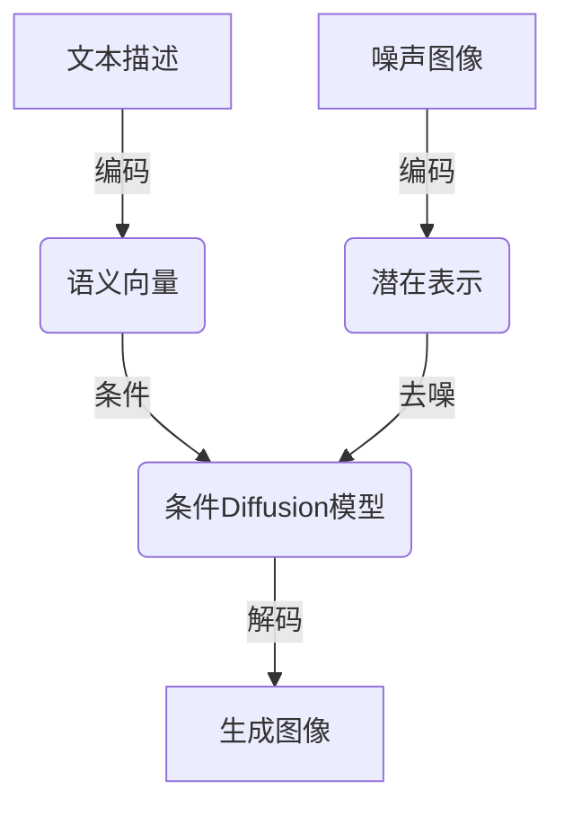

# Stable Diffusion原理与代码实例讲解

## 1.背景介绍

### 1.1 什么是Stable Diffusion?

Stable Diffusion是一种基于深度学习的文本到图像生成模型,由Stability AI公司开发和发布。它能够根据给定的文本描述生成高质量、细节丰富的图像。Stable Diffusion的出现标志着生成式人工智能技术的又一重大突破,为图像生成领域带来了新的里程碑。

### 1.2 Stable Diffusion的重要意义

Stable Diffusion的出现极大地降低了图像生成的门槛,使得普通用户无需专业的绘画技能也能够创作出精美的图像。这不仅为艺术创作和设计领域带来了全新的可能性,而且在教育、娱乐、广告等诸多领域也有着广阔的应用前景。

### 1.3 Stable Diffusion的发展历程

生成式对抗网络(Generative Adversarial Networks, GANs)是图像生成领域的一项里程碑式突破,为后续的工作奠定了基础。2021年,OpenAI发布了DALL-E模型,展示了基于文本描述生成图像的强大能力。紧接着,Google发布了Parti等模型,进一步推动了该领域的发展。

2022年8月,Stability AI公司发布了Stable Diffusion,这是一个基于Latent Diffusion模型的文本到图像生成系统。Stable Diffusion在生成质量、训练稳定性和运行效率等方面都有了突破性的提升,迅速引起了业界的广泛关注。

## 2.核心概念与联系

### 2.1 Diffusion模型

Diffusion模型是一种新兴的生成模型,其基本思想是通过学习从噪声数据到真实数据的反向过程,从而实现数据的生成。这一过程可以形象地看作是将噪声图像"去噪"得到真实图像的过程。

Diffusion模型的优势在于它可以通过迭代方式生成高质量的数据,并且生成过程具有很好的稳定性和可控性。相比于GAN等其他生成模型,Diffusion模型在训练时不太容易出现模式崩溃(mode collapse)等问题。

### 2.2 Latent Diffusion模型

Latent Diffusion模型是Diffusion模型的一种变体,它在潜在空间(Latent Space)中进行Diffusion过程。具体来说,它首先将输入数据(如图像)编码到潜在空间,然后在潜在空间中进行Diffusion操作,最后将生成的潜在表示解码为输出数据。

相比于直接在像素空间进行Diffusion,Latent Diffusion模型能够更好地捕捉数据的语义信息,从而生成更高质量的输出。同时,由于潜在空间的维度通常远小于像素空间,因此Latent Diffusion模型的计算效率也更高。

### 2.3 文本到图像生成

文本到图像生成(Text-to-Image Generation)是指根据给定的文本描述生成相应的图像。这是一项极具挑战的任务,需要模型能够理解文本的语义信息,并将其映射到视觉特征上。

Stable Diffusion采用了条件Diffusion模型的思路,将文本描述作为条件引入到Diffusion过程中。具体地,它首先将文本编码为语义向量,然后将该语义向量与图像的潜在表示相结合,再在潜在空间中进行条件Diffusion过程。通过这种方式,Stable Diffusion能够生成与给定文本描述相符的图像。

### 2.4 Mermaid流程图

以下是Stable Diffusion的核心概念和工作流程的Mermaid流程图:



## 3.核心算法原理具体操作步骤

Stable Diffusion的核心算法原理可以概括为以下几个主要步骤:

### 3.1 文本编码

首先,将给定的文本描述输入到一个预训练的文本编码器(如CLIP的文本编码器)中,得到对应的语义向量表示。

### 3.2 图像编码

同时,将一个随机噪声图像输入到一个预训练的图像编码器(如U-Net)中,得到对应的潜在空间表示。

### 3.3 条件Diffusion过程

将文本的语义向量和图像的潜在表示作为条件,输入到一个条件Diffusion模型中。该模型将通过迭代的方式,逐步"去噪"潜在表示,使其逐渐接近真实图像的潜在分布。

在每一步的迭代中,条件Diffusion模型会根据当前的潜在表示、噪声水平以及文本条件,预测出一个去噪方向,并将潜在表示向该方向调整一个步长。这个过程会重复多次迭代,直到达到所需的噪声水平。

### 3.4 图像解码

最后,将经过条件Diffusion过程得到的最终潜在表示,输入到一个解码器(如U-Net的解码部分)中,得到最终的生成图像。

以下是Stable Diffusion算法的伪代码:

```python
import torch

def stable_diffusion(text, num_steps, guidance_scale):
    # 1. 文本编码
    text_emb = text_encoder(text)
    
    # 2. 图像编码
    noise = torch.randn(...)  # 随机噪声
    latent = encoder(noise)
    
    # 3. 条件Diffusion过程
    for i in range(num_steps):
        noise_level = ...  # 计算当前噪声水平
        noise_pred = diffusion_model(latent, noise_level, text_emb)
        latent = latent - guidance_scale * noise_pred
    
    # 4. 图像解码
    image = decoder(latent)
    return image
```

其中,`text_encoder`是文本编码器,`encoder`和`decoder`分别是图像编码器和解码器,`diffusion_model`是条件Diffusion模型。`guidance_scale`是一个超参数,用于控制文本条件对生成图像的影响程度。

## 4.数学模型和公式详细讲解举例说明

### 4.1 Diffusion过程

Diffusion模型的核心思想是学习从噪声数据到真实数据的反向过程。具体来说,给定一个真实数据$\mathbf{x}_0$,我们首先通过一个正向过程(Forward Process)将其逐步加入噪声,得到一系列噪声数据$\{\mathbf{x}_1, \mathbf{x}_2, \ldots, \mathbf{x}_T\}$,其中$\mathbf{x}_T$是纯噪声。

正向过程可以表示为:

$$
q(\mathbf{x}_1, \ldots, \mathbf{x}_T | \mathbf{x}_0) = \prod_{t=1}^T q(\mathbf{x}_t | \mathbf{x}_{t-1})
$$

其中,每一步的转移概率$q(\mathbf{x}_t | \mathbf{x}_{t-1})$通常选择为高斯噪声:

$$
q(\mathbf{x}_t | \mathbf{x}_{t-1}) = \mathcal{N}(\mathbf{x}_t; \sqrt{1 - \beta_t}\mathbf{x}_{t-1}, \beta_t\mathbf{I})
$$

这里,$\beta_1, \ldots, \beta_T$是一个预定义的噪声schedule,控制了每一步加入噪声的强度。

在训练过程中,我们学习一个反向过程(Reverse Process),即从噪声数据$\mathbf{x}_T$出发,逐步"去噪"得到真实数据$\mathbf{x}_0$。反向过程可以表示为:

$$
p_\theta(\mathbf{x}_{0:T}) = p(\mathbf{x}_T) \prod_{t=1}^T p_\theta(\mathbf{x}_{t-1} | \mathbf{x}_t)
$$

其中,$p_\theta(\mathbf{x}_{t-1} | \mathbf{x}_t)$是一个由神经网络$\theta$参数化的模型,用于预测从$\mathbf{x}_t$到$\mathbf{x}_{t-1}$的去噪方向。

通过最大化$p_\theta(\mathbf{x}_{0:T})$的对数似然,我们可以训练出一个高质量的Diffusion模型,从而实现数据的生成。

### 4.2 条件Diffusion

在Stable Diffusion中,我们希望生成的图像不仅要逼真,而且要与给定的文本描述相符。为此,我们需要将文本条件引入到Diffusion过程中。

具体来说,我们将文本描述$y$编码为一个语义向量$\mathbf{c}$,然后修改反向过程的概率分布为:

$$
p_\theta(\mathbf{x}_{0:T} | \mathbf{c}) = p(\mathbf{x}_T | \mathbf{c}) \prod_{t=1}^T p_\theta(\mathbf{x}_{t-1} | \mathbf{x}_t, \mathbf{c})
$$

其中,$p_\theta(\mathbf{x}_{t-1} | \mathbf{x}_t, \mathbf{c})$是一个条件模型,它不仅依赖于当前的噪声数据$\mathbf{x}_t$,还依赖于文本条件$\mathbf{c}$。

在实际操作中,我们通常采用一种近似方法,即在每一步的迭代中,根据当前的噪声数据$\mathbf{x}_t$、噪声水平$\beta_t$以及文本条件$\mathbf{c}$,预测出一个去噪方向$\epsilon_\theta(\mathbf{x}_t, \beta_t, \mathbf{c})$,然后将$\mathbf{x}_t$沿着该方向调整一个步长,得到$\mathbf{x}_{t-1}$。具体地:

$$
\mathbf{x}_{t-1} = \mathbf{x}_t - \epsilon_\theta(\mathbf{x}_t, \beta_t, \mathbf{c})
$$

这个过程会重复多次迭代,直到达到所需的噪声水平。

### 4.3 示例说明

为了更好地理解Diffusion过程,我们来看一个简单的例子。假设我们要生成一个$4 \times 4$的灰度图像,那么真实数据$\mathbf{x}_0$就是一个$16$维的向量,每个元素的值在$[0, 1]$之间。

我们首先通过正向过程,将$\mathbf{x}_0$逐步加入噪声,得到一系列噪声数据$\{\mathbf{x}_1, \mathbf{x}_2, \ldots, \mathbf{x}_T\}$,其中$\mathbf{x}_T$是一个纯噪声向量。

接下来,我们学习一个反向过程,从$\mathbf{x}_T$出发,逐步"去噪"得到$\mathbf{x}_0$。具体地,在每一步的迭代中,我们根据当前的噪声数据$\mathbf{x}_t$、噪声水平$\beta_t$以及文本条件$\mathbf{c}$,预测出一个去噪方向$\epsilon_\theta(\mathbf{x}_t, \beta_t, \mathbf{c})$,然后将$\mathbf{x}_t$沿着该方向调整一个步长,得到$\mathbf{x}_{t-1}$:

$$
\mathbf{x}_{t-1} = \mathbf{x}_t - \epsilon_\theta(\mathbf{x}_t, \beta_t, \mathbf{c})
$$

这个过程会重复多次迭代,直到达到所需的噪声水平。最终,我们得到的$\mathbf{x}_0$就是生成的图像。

通过这种方式,Stable Diffusion能够生成与给定文本描述相符的高质量图像。

## 4.项目实践:代码实例和详细解释说明

在这一部分,我们将通过一个简单的代码示例,演示如何使用Stable Diffusion生成图像。

### 4.1 环境配置

首先,我们需要安装必要的Python库,包括PyTorch、Diffusers等。可以使用以下命令进行安装:

```bash
pip install torch diffusers transformers accelerate
```

### 4.2 加载模型

接下来,我们需要加载预训练的Stable Diffusion模型和tokenizer:

```python
from diffusers import StableDiffusionPipeline

# 加载模型和tokenizer
pipe = StableDiffusionPipeline.from_pretrained("runwayml/stable-diffusion-v1-5", torch_dtype=torch.float16)
pipe = pipe.to("cuda")
```

这里我们使用了`runwayml/stable-diffusion-v1-5`