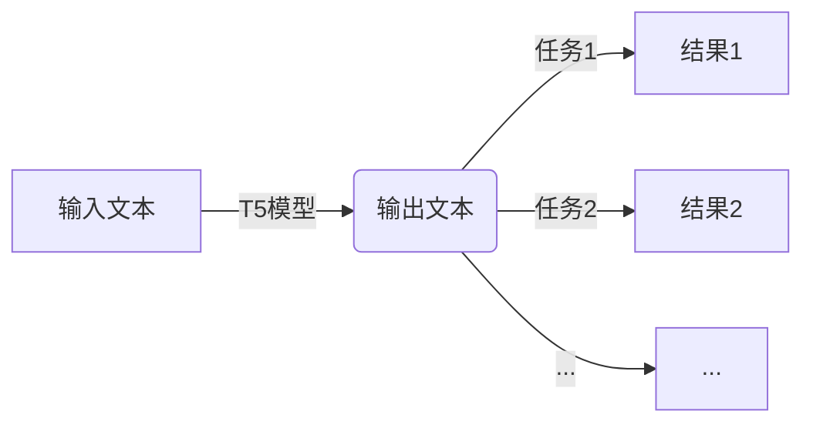
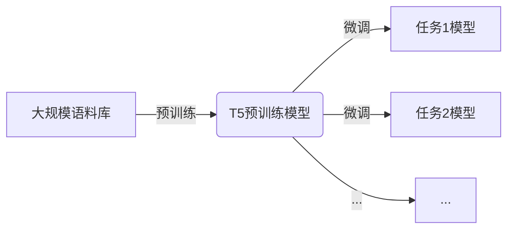

# T5模型全面解析:原理、架构与应用

## 1.背景介绍

### 1.1 自然语言处理的重要性

在当今时代,自然语言处理(NLP)已经成为人工智能领域中最重要和最具挑战性的研究方向之一。随着大数据时代的到来,海量的非结构化文本数据不断涌现,对于高效地处理和理解这些数据变得至关重要。自然语言处理技术在各个领域都有广泛的应用,例如机器翻译、问答系统、文本摘要、情感分析等。

### 1.2 Transformer模型的革命性突破

2017年,Transformer模型的提出彻底改变了NLP领域。相较于传统的序列模型(如RNN、LSTM等),Transformer完全基于注意力机制,摒弃了递归结构,大大提高了并行计算能力。自从Transformer模型问世以来,NLP领域取得了突飞猛进的发展,各种基于Transformer的预训练语言模型层出不穷,例如BERT、GPT、XLNet等。

### 1.3 T5模型的重要意义

作为谷歌大脑推出的最新预训练语言模型,T5(Text-to-Text Transfer Transformer)在NLP领域掀起了新的风潮。T5模型将所有NLP任务统一成了"文本到文本"的形式,实现了真正的多任务学习,大大提升了模型的泛化能力。同时,T5模型在多项公开基准测试中取得了最佳成绩,展现出了其卓越的性能。本文将全面解析T5模型的原理、架构以及应用,为读者提供深入的理解。

## 2.核心概念与联系

### 2.1 Encoder-Decoder架构

T5模型采用了经典的Encoder-Decoder架构,其中Encoder用于编码输入序列,Decoder用于解码生成输出序列。与传统的Seq2Seq模型不同,T5模型的Encoder和Decoder都是基于Transformer的结构。


### 2.2 自回归语言模型

T5是一种自回归(Auto-Regressive)语言模型,即在生成输出序列时,模型会基于已生成的部分序列和输入序列,预测下一个token。这种方式确保了输出序列的连贯性和一致性。


### 2.3 多任务学习范式

T5模型的核心创新之处在于将所有NLP任务统一成"文本到文本"的形式,实现了真正意义上的多任务学习。无论是文本生成、分类、回归还是其他任务,都可以转化为输入一段文本,输出另一段文本的形式。这种统一的形式大大提高了模型的泛化能力和效率。



### 2.4 预训练与微调

与BERT等模型类似,T5模型也采用了两阶段的训练方式:预训练和微调。在预训练阶段,T5模型在大规模的语料库上进行自监督学习,获得通用的语言表示能力。在微调阶段,T5模型在特定任务的数据集上进行进一步的训练,使模型适应具体的任务需求。



## 3.核心算法原理具体操作步骤

### 3.1 输入输出格式化

为了将各种NLP任务统一成"文本到文本"的形式,T5模型采用了一种特殊的输入输出格式化方式。具体来说,输入由三部分组成:

1. **Task Prefix**:表示任务类型的前缀,如"翻译:"、"总结:"等。
2. **Input Text**:原始输入文本。
3. **Task Delimiter**:任务分隔符,通常为 `</s>`。

输出则是期望的目标文本。以机器翻译任务为例,输入格式为`"翻译: <Input Text> </s>"`输出为目标语言的译文。

### 3.2 Transformer Encoder

T5模型的Encoder部分与原始Transformer的Encoder结构基本相同,由多层Encoder Block组成。每个Encoder Block包含了多头自注意力(Multi-Head Attention)和前馈神经网络(Feed-Forward Neural Network)两个子层,并使用了残差连接(Residual Connection)和层归一化(Layer Normalization)。

$$
\begin{aligned}
\text{MultiHead}(Q, K, V) &= \text{Concat}(head_1, \ldots, head_h)W^O\\
\text{where } head_i &= \text{Attention}(QW_i^Q, KW_i^K, VW_i^V)
\end{aligned}
$$

其中,多头自注意力机制用于捕获输入序列中的长程依赖关系,前馈神经网络则用于对每个位置的表示进行非线性变换。

### 3.3 Transformer Decoder

T5模型的Decoder部分也是基于Transformer的结构,由多层Decoder Block组成。每个Decoder Block包含了三个子层:

1. **Masked Multi-Head Attention**:用于捕获已生成序列中的依赖关系,并应用掩码机制以忽略未来的token。
2. **Multi-Head Attention over Encoder Output**:用于将Decoder的表示与Encoder的输出进行关联。
3. **Feed-Forward Neural Network**:与Encoder中的前馈网络类似,用于非线性变换。

同样,Decoder Block中也使用了残差连接和层归一化。

### 3.4 输出生成

在生成输出序列时,T5模型采用了自回归(Auto-Regressive)的方式。具体来说,模型会基于已生成的部分序列和Encoder的输出,预测下一个token。这个过程会重复进行,直到生成了完整的输出序列或达到了最大长度限制。

$$
P(y) = \prod_{t=1}^{T} P(y_t | y_{<t}, x)
$$

其中,$ P(y_t | y_{<t}, x) $表示基于已生成的序列$y_{<t}$和输入$x$,预测下一个token $y_t$的条件概率。

### 3.5 Beam Search解码

为了提高输出质量,T5模型在生成过程中采用了Beam Search解码策略。Beam Search会维护一个候选序列的集合(beam),在每一步都会保留概率最高的k个候选序列,并扩展这些候选序列以生成新的候选集合。通过这种方式,Beam Search可以有效避免局部最优解,从而获得更好的输出结果。

## 4.数学模型和公式详细讲解举例说明

### 4.1 Scaled Dot-Product Attention

T5模型中的自注意力机制是基于Scaled Dot-Product Attention实现的。给定查询(Query)向量q、键(Key)向量集合K和值(Value)向量集合V,注意力机制的计算过程如下:

$$
\begin{aligned}
\text{Attention}(Q, K, V) &= \text{softmax}(\frac{QK^T}{\sqrt{d_k}})V\\
\end{aligned}
$$

其中,$ d_k $是缩放因子,用于防止点积过大导致的梯度消失问题。

以机器翻译任务为例,Query向量对应于解码器的当前时间步,Key和Value向量对应于编码器的输出。通过计算Query与每个Key向量的相似性得分,并对这些得分进行softmax归一化,我们就可以获得一个注意力分布,用于对Value向量进行加权求和,得到最终的注意力表示。

### 4.2 Multi-Head Attention

为了捕获不同位置和不同表示子空间之间的关系,T5模型采用了Multi-Head Attention机制。具体来说,将Query、Key和Value分别线性投影到 $h$ 个不同的表示子空间,对每个子空间分别计算Scaled Dot-Product Attention,然后将这些注意力表示拼接起来。

$$
\begin{aligned}
\text{MultiHead}(Q, K, V) &= \text{Concat}(head_1, \ldots, head_h)W^O\\
\text{where } head_i &= \text{Attention}(QW_i^Q, KW_i^K, VW_i^V)
\end{aligned}
$$

其中,$ W_i^Q $、$ W_i^K $和$ W_i^V $分别是Query、Key和Value的线性投影矩阵,$ W^O $是最终的线性变换矩阵。

通过Multi-Head Attention机制,模型可以同时关注不同位置的信息,并从多个表示子空间中捕获不同类型的依赖关系,从而提高了模型的表示能力。

### 4.3 位置编码

由于Transformer模型完全基于注意力机制,因此需要一种方法来引入序列的位置信息。T5模型采用了与原始Transformer相同的位置编码方式,即为每个位置添加一个位置嵌入向量。

对于序列中的第i个位置,其位置嵌入向量$ PE_{(pos, 2i)} $和$ PE_{(pos, 2i+1)} $分别计算如下:

$$
\begin{aligned}
PE_{(pos, 2i)} &= \sin(pos / 10000^{2i / d_{model}})\\
PE_{(pos, 2i+1)} &= \cos(pos / 10000^{2i / d_{model}})
\end{aligned}
$$

其中,$ pos $是位置索引,$ d_{model} $是模型的隐藏层大小。

通过将位置嵌入向量与token嵌入向量相加,模型就可以获得包含位置信息的表示。

### 4.4 前馈神经网络

T5模型中的前馈神经网络(FFN)是一个简单的两层全连接网络,用于对每个位置的表示进行非线性变换。具体计算过程如下:

$$
\begin{aligned}
\text{FFN}(x) &= \max(0, xW_1 + b_1)W_2 + b_2\\
\end{aligned}
$$

其中,$ W_1 $和$ W_2 $分别是两层全连接网络的权重矩阵,$ b_1 $和$ b_2 $是对应的偏置向量。激活函数使用了ReLU。

前馈神经网络可以有效地捕获输入表示中的高阶特征,并引入非线性变换,从而提高了模型的表示能力。

## 4.项目实践:代码实例和详细解释说明

在这一部分,我们将提供一个使用T5模型进行文本生成的代码示例,并对关键步骤进行详细解释。我们将使用Hugging Face的Transformers库,这是目前最流行的NLP库之一。

### 4.1 导入必要的库

```python
from transformers import T5Tokenizer, T5ForConditionalGeneration
```

我们首先导入T5Tokenizer和T5ForConditionalGeneration类,分别用于文本tokenization和模型推理。

### 4.2 加载预训练模型和tokenizer

```python
model_name = "t5-base"
tokenizer = T5Tokenizer.from_pretrained(model_name)
model = T5ForConditionalGeneration.from_pretrained(model_name)
```

我们加载了T5的基础版本预训练模型和对应的tokenizer。您也可以选择加载其他版本的T5模型,如"t5-large"或"t5-small"。

### 4.3 文本预处理

```python
text = "summarize: The Tower of London is a historic castle located on the north bank of the River Thames in central London. It was founded towards the end of 1066 as part of the Norman Conquest of England. The White Tower, which gives the entire castle its name, was built by William the Conqueror in 1078."

input_ids = tokenizer.encode(text, return_tensors="pt")
```

我们定义了一个输入文本,并使用tokenizer将其转换为模型可接受的输入格式。注意,输入文本的格式为"summarize: <Text to summarize>"。

### 4.4 模型推理

```python
output_ids = model.generate(input_ids, max_length=100, num_beams=4, early_stopping=True)
summary = tokenizer.decode(output_ids[0], skip_special_tokens=True)
print(summary)
```

我们调用模型的generate()方法进行推理,并设置了一些参数:

- `max_length=100`: 限制生成文本的最大长度为100个token。
- `num_beams=4`: 使用beam search解码策略,beam宽度为4。
- `early_stopping=True`: 如果所有