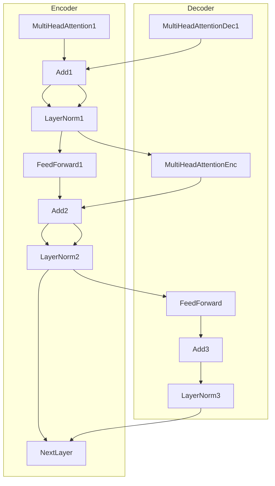
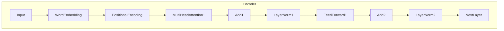

# Transformer大模型实战 预训练策略

## 1.背景介绍

### 1.1 自然语言处理的挑战

自然语言处理(NLP)是人工智能领域中一个极具挑战性的任务。人类语言的复杂性和多样性使得计算机很难真正理解和生成自然语言。传统的NLP方法通常依赖于手工设计的特征和规则,这种方法存在一些固有的局限性,难以很好地捕捉语言的语义和上下文信息。

### 1.2 深度学习在NLP中的突破

近年来,深度学习技术在NLP领域取得了巨大的突破。其中,Transformer模型是一种全新的基于注意力机制的神经网络架构,它能够有效地捕捉长距离依赖关系,并在机器翻译、文本生成等任务中取得了卓越的表现。

### 1.3 大模型预训练的兴起

随着计算能力和数据量的不断增长,NLP领域出现了一种新的范式:大模型预训练。这种方法首先在大量无监督文本数据上训练一个大型的语言模型,然后将这个预训练的模型进行微调,应用到各种下游NLP任务中。这种预训练+微调的范式大大提高了模型的性能,并成为NLP领域的主流方法。

## 2.核心概念与联系  

### 2.1 Transformer模型

Transformer是一种全新的基于注意力机制的序列到序列(Seq2Seq)模型,它完全摒弃了传统的RNN和CNN结构。Transformer的核心组件是多头注意力机制和位置编码,它能够有效地捕捉输入序列中任意距离的依赖关系。

#### 2.1.1 注意力机制(Attention Mechanism)

注意力机制是Transformer模型的核心,它允许模型在编码输入序列时,对不同位置的输入词赋予不同的权重,从而捕捉长距离依赖关系。具体来说,注意力机制通过计算查询(Query)向量与键(Key)向量的相似性,得到一个注意力分数向量,然后将注意力分数与值(Value)向量相乘,得到注意力加权后的表示。

$$\mathrm{Attention}(Q, K, V) = \mathrm{softmax}(\frac{QK^T}{\sqrt{d_k}})V$$

其中$Q$、$K$、$V$分别表示查询、键和值向量。$d_k$是缩放因子,用于防止内积过大导致梯度消失。

#### 2.1.2 多头注意力(Multi-Head Attention)

多头注意力机制是将注意力机制运用到不同的子空间上,然后将这些子空间的结果进行拼接,从而提高模型对不同位置信息的建模能力。具体来说,将查询、键和值向量先分别线性投影到不同的子空间,然后在每个子空间上分别计算注意力,最后将所有子空间的注意力结果拼接起来。

$$\begin{aligned}
\mathrm{MultiHead}(Q, K, V) &= \mathrm{Concat}(\mathrm{head}_1, \ldots, \mathrm{head}_h)W^O\\
\mathrm{where\ head}_i &= \mathrm{Attention}(QW_i^Q, KW_i^K, VW_i^V)
\end{aligned}$$

其中$W_i^Q$、$W_i^K$、$W_i^V$和$W^O$是可学习的线性投影矩阵。

#### 2.1.3 位置编码(Positional Encoding)

由于Transformer模型没有循环或卷积结构,因此需要一种方式来注入序列的位置信息。位置编码就是将序列的位置信息编码成一个向量,并将其加到输入的嵌入向量中。常用的位置编码方式是使用正弦和余弦函数,它们可以很好地编码序列的位置信息。

$$\begin{aligned}
\mathrm{PE}_{(pos, 2i)} &= \sin(pos / 10000^{2i / d_{\mathrm{model}}})\\
\mathrm{PE}_{(pos, 2i+1)} &= \cos(pos / 10000^{2i / d_{\mathrm{model}}})
\end{aligned}$$

其中$pos$是词在序列中的位置,$i$是维度的索引,$d_{\mathrm{model}}$是模型的维度。

#### 2.1.4 Transformer编码器(Encoder)和解码器(Decoder)

Transformer模型由编码器和解码器两部分组成。编码器是用来处理输入序列的,它由多个相同的层组成,每一层包含一个多头注意力子层和一个前馈全连接子层。解码器也是由多个相同的层组成,不同的是它还包含一个额外的注意力子层,用于关注输入序列中的不同位置。



### 2.2 大模型预训练

大模型预训练是指在大量无监督文本数据上训练一个大型的语言模型,然后将这个预训练的模型进行微调,应用到各种下游NLP任务中。这种预训练+微调的范式大大提高了模型的性能,并成为NLP领域的主流方法。

常见的预训练目标包括:

1. **蒙版语言模型(Masked Language Modeling, MLM)**: 随机掩蔽输入序列中的一些词,然后让模型预测被掩蔽的词。
2. **下一句预测(Next Sentence Prediction, NSP)**: 判断两个句子是否为连续的句子。
3. **自回归语言模型(Autoregressive Language Modeling)**: 给定前缀,预测下一个词。
4. **替换词语言模型(Replaced Token Detection)**: 随机替换输入序列中的一些词,然后让模型预测被替换的词。

预训练后的模型参数将作为下游任务模型的初始化参数,通过在特定任务上进行进一步的微调,可以获得极佳的性能。

## 3.核心算法原理具体操作步骤

### 3.1 Transformer模型训练

Transformer模型的训练过程可以分为两个阶段:预训练和微调。

#### 3.1.1 预训练

预训练阶段的目标是在大量无监督文本数据上训练一个通用的语言模型,捕捉语言的一般规律。常用的预训练目标包括蒙版语言模型(MLM)和下一句预测(NSP)。

1. **数据预处理**:将原始文本数据转换为模型可以接受的格式,包括词tokenization、添加特殊标记等。
2. **构建数据批次**:将预处理后的数据按批次组织,以便模型并行训练。
3. **定义预训练目标**:根据选择的预训练目标(如MLM、NSP等),构建相应的损失函数。
4. **模型初始化**:初始化Transformer模型的参数。
5. **模型训练**:使用优化算法(如Adam)在训练数据上迭代训练模型,最小化预训练目标的损失函数。
6. **模型保存**:将训练好的模型参数保存,以便后续微调和推理。

#### 3.1.2 微调

微调阶段的目标是在特定的下游NLP任务上,针对性地调整预训练模型的参数,使其适应该任务。

1. **任务数据准备**:收集并预处理特定任务的训练数据。
2. **加载预训练模型**:加载预训练好的Transformer模型参数。
3. **构建任务特定模型**:在预训练模型的基础上,添加任务特定的输出层等模块。
4. **定义任务损失函数**:根据任务目标定义损失函数,如分类交叉熵损失等。
5. **模型微调**:使用任务数据和损失函数,在预训练模型的基础上进行进一步的微调训练。
6. **模型评估**:在任务的验证集或测试集上评估微调后模型的性能。
7. **模型部署**:将微调好的模型部署到生产环境中,用于实际推理和应用。

### 3.2 注意力机制计算流程

注意力机制是Transformer模型的核心组件,它的计算流程如下:

1. **线性投影**:将查询(Query)、键(Key)和值(Value)向量分别通过线性投影,投影到不同的子空间。

   $$\begin{aligned}
   Q' &= QW^Q\\
   K' &= KW^K\\
   V' &= VW^V
   \end{aligned}$$

   其中$W^Q$、$W^K$、$W^V$是可学习的线性投影矩阵。

2. **计算注意力分数**:通过查询向量与键向量的点积,计算注意力分数。为了避免内积过大导致梯度消失,引入了缩放因子$\sqrt{d_k}$。

   $$\mathrm{score}(Q', K') = \frac{Q'K'^T}{\sqrt{d_k}}$$

3. **softmax归一化**:对注意力分数进行softmax归一化,得到注意力权重向量。

   $$\mathrm{Attention}(Q', K', V') = \mathrm{softmax}(\mathrm{score}(Q', K'))V'$$

4. **加权求和**:将注意力权重向量与值向量相乘,得到加权求和后的注意力表示。

对于多头注意力机制,上述过程在多个子空间上独立进行,然后将所有子空间的注意力表示拼接起来。

$$\begin{aligned}
\mathrm{head}_i &= \mathrm{Attention}(Q'W_i^Q, K'W_i^K, V'W_i^V)\\
\mathrm{MultiHead}(Q', K', V') &= \mathrm{Concat}(\mathrm{head}_1, \ldots, \mathrm{head}_h)W^O
\end{aligned}$$

其中$W_i^Q$、$W_i^K$、$W_i^V$和$W^O$是可学习的线性投影矩阵。

### 3.3 Transformer编码器和解码器计算流程

Transformer编码器和解码器的计算流程如下:

#### 3.3.1 编码器计算流程

1. **词嵌入和位置编码**:将输入序列的词映射到词嵌入向量,然后添加位置编码。

   $$X = \mathrm{WordEmbedding}(x_1, \ldots, x_n) + \mathrm{PositionEncoding}(1, \ldots, n)$$

2. **子层计算**:编码器由多个相同的层组成,每一层包含两个子层:多头注意力子层和前馈全连接子层。

   - 多头注意力子层:对输入进行自注意力计算,捕捉输入序列中的依赖关系。
   - 前馈全连接子层:对注意力输出进行全连接变换,为模型引入非线性。

   每个子层的输出都会经过残差连接和层归一化。

3. **层堆叠**:将多个编码器层堆叠,形成深层编码器模型。



#### 3.3.2 解码器计算流程

1. **词嵌入和位置编码**:将输出序列的词映射到词嵌入向量,然后添加位置编码。

   $$Y = \mathrm{WordEmbedding}(y_1, \ldots, y_m) + \mathrm{PositionEncoding}(1, \ldots, m)$$

2. **子层计算**:解码器也由多个相同的层组成,每一层包含三个子层:

   - 掩蔽多头自注意力子层:对输出序列进行自注意力计算,但被掩蔽的位置不能看到后续位置的信息。
   - 多头注意力子层:对编码器输出进行注意力计算,获取输入序列的信息。
   - 前馈全连接子层:对注意力输出进行全连接变换,引入非线性。

   每个子层的输出都会经过残差连接和层归一化。

3. **层堆叠**:将多个解码器层堆叠,形成深层解码器模型。
4. **输出层**:解码器的最终输出通过一个线性层和softmax层,生成下一个词的概率分布。

```mermaid
graph TD
    subgraph Decoder 
        Input --> WordEmbedding --> PositionalEncoding --> MaskedMulti