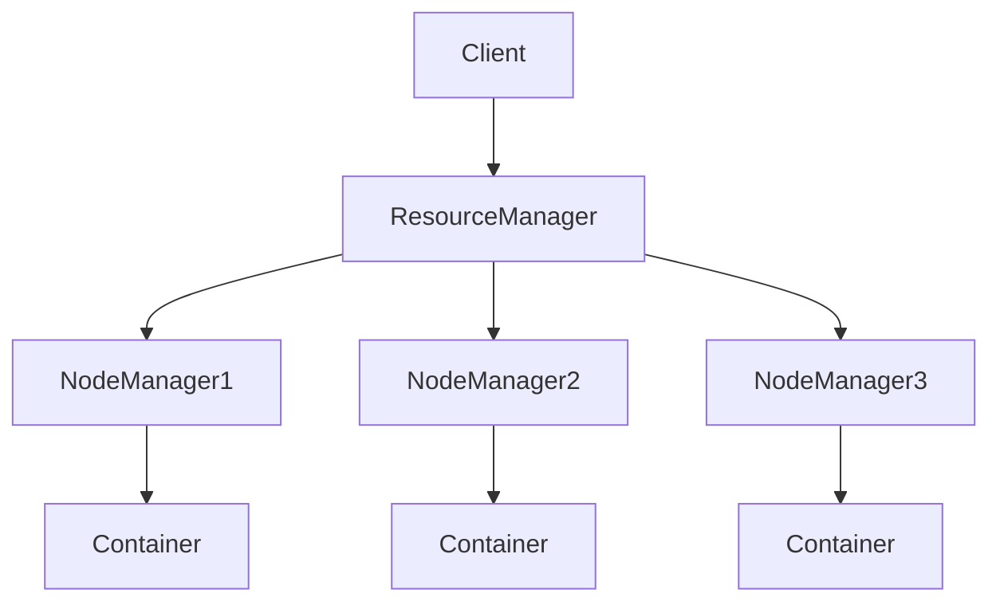

# Yarn 原理与代码实例讲解

作者：禅与计算机程序设计艺术

## 1. 背景介绍

### 1.1 Yarn 的诞生

在大数据时代,数据处理和分析的需求不断增长。Apache Hadoop 作为一个开源的分布式计算框架,为大规模数据处理提供了可靠的解决方案。然而,随着 Hadoop 生态系统的不断发展,原有的 MapReduce 计算框架暴露出一些局限性,如资源利用率低、可扩展性差等问题。为了解决这些问题,Yarn (Yet Another Resource Negotiator) 应运而生。

### 1.2 Yarn 的定位

Yarn 是 Hadoop 生态系统中的资源管理和任务调度框架。它将资源管理和任务调度从 MapReduce 中剥离出来,形成了一个通用的资源管理平台。Yarn 不仅支持 MapReduce,还支持 Spark、Flink 等多种计算框架,大大提高了 Hadoop 集群的资源利用率和可扩展性。

### 1.3 Yarn 的优势

与传统的 MapReduce 相比,Yarn 具有以下优势:

1. 资源利用率高:Yarn 将资源管理和任务调度分离,可以更加灵活地分配和调度资源,提高集群的资源利用率。
2. 可扩展性强:Yarn 支持多种计算框架,可以根据实际需求选择合适的计算框架,具有很强的可扩展性。
3. 容错性好:Yarn 采用了主从架构,Master 节点负责资源管理和任务调度,Slave 节点负责任务执行。当某个节点出现故障时,Yarn 可以自动将任务转移到其他节点上执行,保证了任务的可靠性。

## 2. 核心概念与联系

### 2.1 ResourceManager

ResourceManager 是 Yarn 的核心组件之一,负责整个集群的资源管理和调度。它接收来自客户端的应用程序提交请求,并根据集群的资源情况和应用程序的需求,将资源分配给应用程序。

### 2.2 NodeManager

NodeManager 是 Yarn 的另一个核心组件,运行在集群的每个节点上,负责管理该节点的资源和任务执行。它定期向 ResourceManager 汇报节点的资源使用情况,并接收来自 ResourceManager 的任务调度请求。

### 2.3 ApplicationMaster

ApplicationMaster 是每个应用程序的管理者,负责与 ResourceManager 协商资源,并管理应用程序的任务执行。它根据应用程序的需求,向 ResourceManager 申请资源,并将资源分配给具体的任务。

### 2.4 Container

Container 是 Yarn 中资源的基本单位,由一定数量的 CPU 和内存组成。ResourceManager 将 Container 分配给 ApplicationMaster,ApplicationMaster 再将 Container 分配给具体的任务。

### 2.5 核心概念之间的联系

下图展示了 Yarn 中几个核心概念之间的联系:



Client 向 ResourceManager 提交应用程序,ResourceManager 根据集群的资源情况和应用程序的需求,将资源分配给 ApplicationMaster。ApplicationMaster 与 NodeManager 通信,将任务分配到具体的 Container 中执行。

## 3. 核心算法原理具体操作步骤

### 3.1 资源调度算法

Yarn 采用了基于资源的调度算法,主要包括以下几个步骤:

1. 资源请求:ApplicationMaster 向 ResourceManager 提交资源请求,包括所需的 CPU、内存等资源。
2. 资源分配:ResourceManager 根据集群的资源情况和调度策略,将资源分配给 ApplicationMaster。
3. 任务调度:ApplicationMaster 将资源进一步分配给具体的任务,并将任务分配到 NodeManager 上执行。
4. 资源释放:任务执行完毕后,ApplicationMaster 将资源释放给 ResourceManager,供其他应用程序使用。

### 3.2 任务调度算法

Yarn 支持多种任务调度算法,包括 FIFO、Capacity Scheduler、Fair Scheduler 等。以 Capacity Scheduler 为例,其主要步骤如下:

1. 队列划分:将集群的资源划分为多个队列,每个队列可以配置一定的资源量。
2. 资源分配:根据队列的资源量和应用程序的需求,将资源分配给应用程序。
3. 任务调度:在每个队列内部,根据优先级和提交时间等因素,对任务进行调度。
4. 资源回收:当队列内的资源不足时,可以从其他队列借用资源;当队列内的资源空闲时,也可以将资源借给其他队列。

## 4. 数学模型和公式详细讲解举例说明

### 4.1 资源调度模型

Yarn 的资源调度模型可以用以下数学公式表示:

$$
\begin{aligned}
\text{minimize} \quad & \sum_{i=1}^{n} \sum_{j=1}^{m} x_{ij} \cdot c_{ij} \\
\text{subject to} \quad & \sum_{i=1}^{n} x_{ij} \leq 1, \forall j \in [1,m] \\
& \sum_{j=1}^{m} x_{ij} \cdot r_{ij} \leq R_i, \forall i \in [1,n] \\
& x_{ij} \in \{0,1\}, \forall i \in [1,n], j \in [1,m]
\end{aligned}
$$

其中:
- $n$ 表示集群中的节点数
- $m$ 表示待调度的任务数
- $x_{ij}$ 表示任务 $j$ 是否分配到节点 $i$ 上执行
- $c_{ij}$ 表示任务 $j$ 在节点 $i$ 上执行的成本
- $r_{ij}$ 表示任务 $j$ 在节点 $i$ 上执行所需的资源量
- $R_i$ 表示节点 $i$ 的可用资源量

目标函数是最小化任务执行的总成本。约束条件包括:
1. 每个任务只能分配到一个节点上执行
2. 每个节点上执行的任务所需资源总量不超过该节点的可用资源量
3. 决策变量 $x_{ij}$ 取值为 0 或 1

### 4.2 任务调度模型

以 Capacity Scheduler 为例,其任务调度模型可以用以下数学公式表示:

$$
\begin{aligned}
\text{maximize} \quad & \sum_{i=1}^{n} \sum_{j=1}^{m} x_{ij} \cdot p_{ij} \\
\text{subject to} \quad & \sum_{i=1}^{n} x_{ij} \leq 1, \forall j \in [1,m] \\
& \sum_{j=1}^{m} x_{ij} \cdot r_{ij} \leq R_i, \forall i \in [1,n] \\
& \sum_{j=1}^{m} x_{ij} \cdot r_{ij} \leq C_i, \forall i \in [1,n] \\
& x_{ij} \in \{0,1\}, \forall i \in [1,n], j \in [1,m]
\end{aligned}
$$

其中:
- $n$ 表示集群中的节点数
- $m$ 表示待调度的任务数
- $x_{ij}$ 表示任务 $j$ 是否分配到节点 $i$ 上执行
- $p_{ij}$ 表示任务 $j$ 在节点 $i$ 上执行的优先级
- $r_{ij}$ 表示任务 $j$ 在节点 $i$ 上执行所需的资源量
- $R_i$ 表示节点 $i$ 的可用资源量
- $C_i$ 表示节点 $i$ 所在队列的可用资源量

目标函数是最大化任务执行的总优先级。约束条件包括:
1. 每个任务只能分配到一个节点上执行
2. 每个节点上执行的任务所需资源总量不超过该节点的可用资源量
3. 每个节点上执行的任务所需资源总量不超过该节点所在队列的可用资源量
4. 决策变量 $x_{ij}$ 取值为 0 或 1

## 5. 项目实践：代码实例和详细解释说明

下面是一个使用 Yarn 进行单词计数的示例代码:

```java
public class WordCount {
    public static void main(String[] args) throws Exception {
        Configuration conf = new Configuration();
        String[] otherArgs = new GenericOptionsParser(conf, args).getRemainingArgs();
        if (otherArgs.length < 2) {
            System.err.println("Usage: wordcount <in> [<in>...] <out>");
            System.exit(2);
        }
        Job job = Job.getInstance(conf, "word count");
        job.setJarByClass(WordCount.class);
        job.setMapperClass(TokenizerMapper.class);
        job.setCombinerClass(IntSumReducer.class);
        job.setReducerClass(IntSumReducer.class);
        job.setOutputKeyClass(Text.class);
        job.setOutputValueClass(IntWritable.class);
        for (int i = 0; i < otherArgs.length - 1; ++i) {
            FileInputFormat.addInputPath(job, new Path(otherArgs[i]));
        }
        FileOutputFormat.setOutputPath(job,
                new Path(otherArgs[otherArgs.length - 1]));
        System.exit(job.waitForCompletion(true) ? 0 : 1);
    }

    public static class TokenizerMapper
            extends Mapper<Object, Text, Text, IntWritable> {
        private final static IntWritable one = new IntWritable(1);
        private Text word = new Text();

        public void map(Object key, Text value, Context context) throws IOException, InterruptedException {
            StringTokenizer itr = new StringTokenizer(value.toString());
            while (itr.hasMoreTokens()) {
                word.set(itr.nextToken());
                context.write(word, one);
            }
        }
    }

    public static class IntSumReducer
            extends Reducer<Text, IntWritable, Text, IntWritable> {
        private IntWritable result = new IntWritable();

        public void reduce(Text key, Iterable<IntWritable> values, Context context) throws IOException, InterruptedException {
            int sum = 0;
            for (IntWritable val : values) {
                sum += val.get();
            }
            result.set(sum);
            context.write(key, result);
        }
    }
}
```

代码解释:
1. 首先,通过 `Configuration` 对象获取配置信息,并解析命令行参数。
2. 然后,创建一个 `Job` 对象,设置作业的各种属性,如 Mapper、Combiner、Reducer 等。
3. 接着,通过 `FileInputFormat` 和 `FileOutputFormat` 设置输入输出路径。
4. 最后,提交作业并等待作业完成。

其中,`TokenizerMapper` 类继承自 `Mapper` 类,实现了 map 方法。它将输入的文本按照空格分割成单词,并输出 <单词,1> 的键值对。

`IntSumReducer` 类继承自 `Reducer` 类,实现了 reduce 方法。它将相同单词的计数值相加,并输出 <单词,计数值> 的键值对。

在实际运行时,Yarn 会将 map 和 reduce 任务分配到集群的各个节点上执行,并自动处理任务的并行化和容错。

## 6. 实际应用场景

Yarn 作为一个通用的资源管理和任务调度框架,可以应用于多种场景,包括:

1. 大数据处理:Yarn 可以与 Hadoop、Spark、Flink 等大数据处理框架集成,提供高效的资源管理和任务调度。
2. 机器学习:Yarn 可以与 TensorFlow、PyTorch 等机器学习框架集成,实现分布式训练和推理。
3. 流式计算:Yarn 可以与 Storm、Samza 等流式计算框架集成,实现实时数据处理和分析。
4. 科学计算:Yarn 可以与 MPI、OpenMP 等科学计算框架集成,实现高性能计算。

## 7. 工具和资源推荐

以下是一些学习和使用 Yarn 的工具和资源:

1. Apache Hadoop:Yarn 是 Hadoop 生态系统的重要组成部分,建议先学习 Hadoop 的基本概念和使用方法。
2. Apache Spark:Spark 是一个基于 Yarn 的快速通用计算引擎,支持多种计算模型,如批处理、流式计算、机器学习等。
3. Apache Flink:Flink 是一个基于 Yarn 的分布式流式计算框架,支持高吞吐、低延迟的实时计算。
4. Hortonworks Data Platform (HDP):HDP 是一个基于 Yarn 的大数据平台,提供了多种大数据组件和工具,如 Hadoop、Spark、Hive 