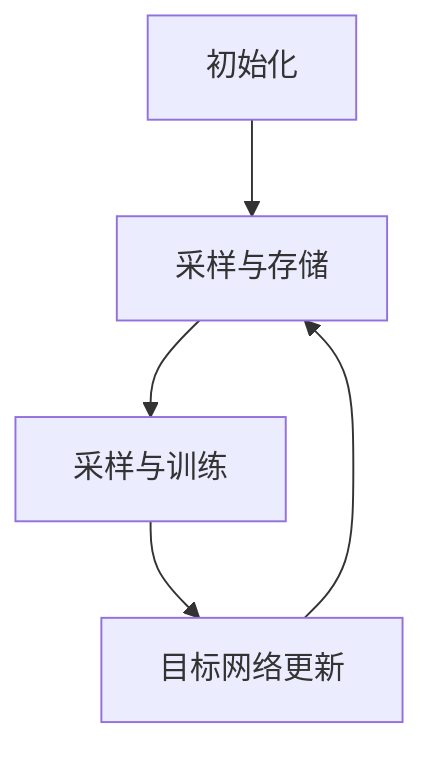

# 一切皆是映射：DQN中的非线性函数逼近：深度学习的融合点

## 1. 背景介绍

### 1.1 强化学习与Q学习

强化学习是机器学习的一个重要分支,它关注智能体与环境的交互,旨在通过经验学习获取最优策略。Q学习是强化学习中的一种重要算法,它通过估计状态-行为对的长期回报值(Q值)来进行决策。传统的Q学习使用表格来存储Q值,但是在状态和行为空间很大的情况下,这种方法就变得低效和不实用。

### 1.2 深度Q网络(DQN)的兴起

为了解决Q学习在高维状态空间中的局限性,DeepMind在2013年提出了深度Q网络(Deep Q-Network, DQN)。DQN利用深度神经网络来近似Q函数,从而能够处理高维、连续的状态空间。这种将深度学习与强化学习相结合的方法,开启了深度强化学习的新时代。

### 1.3 深度学习与函数逼近

深度学习的本质是通过多层非线性变换来逼近复杂的函数映射关系。在DQN中,神经网络被用于逼近Q函数,将状态映射到对应的Q值。这种非线性函数逼近能力是DQN取得巨大成功的关键所在。

## 2. 核心概念与联系

### 2.1 Q函数与贝尔曼方程

Q函数是强化学习中的一个核心概念,它表示在给定状态下采取某个行为的长期期望回报。Q函数满足贝尔曼方程:

$$Q^{\pi}(s,a) = \mathbb{E}_{\pi}\left[r_t + \gamma \max_{a'}Q^{\pi}(s_{t+1}, a') | s_t=s, a_t=a\right]$$

其中$\pi$是策略函数,$r_t$是即时奖励,$\gamma$是折现因子。贝尔曼方程描述了Q值的递推关系,为求解Q函数提供了理论基础。

### 2.2 深度神经网络与函数逼近

深度神经网络是一种强大的函数逼近器,它能够通过多层非线性变换来拟合任意连续函数。对于给定的输入$x$和目标输出$y$,神经网络学习一个映射函数$f(x;\theta) \approx y$,其中$\theta$是网络参数。

在DQN中,神经网络被用于近似Q函数:

$$Q(s,a;\theta) \approx Q^*(s,a)$$

其中$Q^*(s,a)$是最优Q函数。通过训练神经网络参数$\theta$,DQN能够逼近最优Q函数,从而获得最优策略。

### 2.3 损失函数与目标网络

为了训练神经网络逼近Q函数,DQN定义了一个损失函数:

$$L(\theta) = \mathbb{E}_{(s,a,r,s')\sim U(D)}\left[\left(Q(s,a;\theta) - y\right)^2\right]$$

其中$y = r + \gamma \max_{a'}Q(s',a';\theta^-)$是目标Q值,$\theta^-$是目标网络的参数。目标网络是一个延迟更新的Q网络,用于提高训练稳定性。

通过最小化损失函数,神经网络可以逐步逼近最优Q函数。这种基于经验重播的off-policy训练方式,使DQN能够高效地利用样本数据。

## 3. 核心算法原理具体操作步骤

DQN算法的核心步骤如下:

1. **初始化**:初始化评估网络$Q(s,a;\theta)$和目标网络$Q(s,a;\theta^-)$,其中$\theta^- = \theta$。创建经验重播池$D$用于存储转换样本$(s,a,r,s')$。

2. **采样与存储**:智能体与环境交互,根据$\epsilon$-贪婪策略选择行为$a=\arg\max_aQ(s,a;\theta)$,观测到即时奖励$r$和下一状态$s'$,将$(s,a,r,s')$存入经验重播池$D$。

3. **采样与训练**:从经验重播池$D$中随机采样一个批次的转换样本$(s,a,r,s')$,计算目标Q值$y = r + \gamma \max_{a'}Q(s',a';\theta^-)$,并最小化损失函数$L(\theta) = \mathbb{E}_{(s,a,r,s')\sim U(D)}\left[\left(Q(s,a;\theta) - y\right)^2\right]$,更新评估网络参数$\theta$。

4. **目标网络更新**:每隔一定步数,将评估网络的参数$\theta$复制到目标网络$\theta^-$。

5. **重复步骤2-4**:持续与环境交互,采样存储转换样本,训练评估网络,更新目标网络,直到收敛。

这种基于经验重播的off-policy训练方式,使DQN能够高效地利用样本数据,并通过目标网络提高训练稳定性。

### 3.1 算法流程图



## 4. 数学模型和公式详细讲解举例说明

### 4.1 Q函数与贝尔曼方程

Q函数$Q^{\pi}(s,a)$表示在状态$s$下采取行为$a$,之后按策略$\pi$行动所能获得的长期期望回报。它满足贝尔曼方程:

$$Q^{\pi}(s,a) = \mathbb{E}_{\pi}\left[r_t + \gamma \max_{a'}Q^{\pi}(s_{t+1}, a') | s_t=s, a_t=a\right]$$

其中:

- $\pi$是策略函数,决定了在每个状态下选择行为的概率分布。
- $r_t$是在时刻$t$获得的即时奖励。
- $\gamma \in [0,1]$是折现因子,用于权衡即时奖励和长期回报的重要性。
- $\max_{a'}Q^{\pi}(s_{t+1}, a')$是在下一状态$s_{t+1}$下按策略$\pi$选择的最优行为对应的Q值。

贝尔曼方程描述了Q值的递推关系,即当前Q值等于即时奖励加上折现的下一状态的最优Q值的期望。这为求解Q函数提供了理论基础。

**示例**:

假设有一个简单的格子世界环境,智能体的目标是从起点到达终点。在每个状态下,智能体可以选择上下左右四个行为。当到达终点时获得+1的奖励,其他情况下奖励为0。设$\gamma=0.9$,某一状态$s$下采取行为$a$的Q值计算如下:

$$Q^{\pi}(s,a) = 0 + 0.9 \times \max_{a'}\left\{Q^{\pi}(s',a')\right\}$$

其中$s'$是执行行为$a$后到达的下一状态。可以看出,Q值由当前状态的即时奖励(0)和下一状态的最优Q值的折现和($0.9 \times \max_{a'}Q^{\pi}(s',a')$)组成。通过不断更新Q值,最终可以得到最优策略对应的Q函数。

### 4.2 深度神经网络与函数逼近

深度神经网络是一种强大的函数逼近器,它能够通过多层非线性变换来拟合任意连续函数。对于给定的输入$x$和目标输出$y$,神经网络学习一个映射函数$f(x;\theta) \approx y$,其中$\theta$是网络参数。

神经网络的基本结构由多层神经元组成,每层神经元执行加权求和和非线性激活的操作:

$$h_l = \phi(W_lh_{l-1} + b_l)$$

其中$h_l$是第$l$层的输出,$\phi$是非线性激活函数(如ReLU),$(W_l,b_l)$是该层的权重和偏置参数。通过堆叠多层这种变换,神经网络能够逼近任意复杂的非线性映射。

**示例**:

假设我们要用一个简单的全连接神经网络来拟合函数$y=x^2$,输入$x \in [-1,1]$,输出$y \in [0,1]$。网络结构为:输入层(1个神经元)$\rightarrow$隐藏层(5个神经元,ReLU激活)$\rightarrow$输出层(1个神经元,无激活)。

对于输入$x=0.5$,神经网络的前向计算过程如下:

1. 输入层:$h_0 = 0.5$
2. 隐藏层:$h_1 = \text{ReLU}(W_1h_0 + b_1)$,假设$W_1=[-0.2,0.3,-0.1,0.4,0.1]^T,b_1=[0.1,0.2,0.3,0.4,0.5]^T$,则$h_1=[0.4,0.45,0.55,0.6,0.55]^T$
3. 输出层:$\hat{y} = W_2h_1 + b_2$,假设$W_2=[0.2,0.3,0.1,-0.1,0.4]^T,b_2=0.1$,则$\hat{y}=0.25$

通过训练网络参数$\theta=\{W_1,b_1,W_2,b_2\}$,使$\hat{y}$逼近$y=x^2=0.25$,神经网络就能够逼近这个二次函数。

在DQN中,神经网络被用于近似Q函数:

$$Q(s,a;\theta) \approx Q^*(s,a)$$

其中$Q^*(s,a)$是最优Q函数。通过训练神经网络参数$\theta$,DQN能够逼近最优Q函数,从而获得最优策略。

## 4. 项目实践:代码实例和详细解释说明

以下是一个使用PyTorch实现的简单DQN代码示例,用于解决经典的CartPole-v1环境:

```python
import torch
import torch.nn as nn
import torch.optim as optim
import gym
import random
from collections import deque

# 定义DQN网络
class DQN(nn.Module):
    def __init__(self, state_dim, action_dim):
        super(DQN, self).__init__()
        self.fc1 = nn.Linear(state_dim, 64)
        self.fc2 = nn.Linear(64, action_dim)

    def forward(self, x):
        x = torch.relu(self.fc1(x))
        return self.fc2(x)

# 定义DQN算法
class DQNAgent:
    def __init__(self, state_dim, action_dim):
        self.device = torch.device("cuda" if torch.cuda.is_available() else "cpu")
        self.q_net = DQN(state_dim, action_dim).to(self.device)
        self.target_q_net = DQN(state_dim, action_dim).to(self.device)
        self.optimizer = optim.Adam(self.q_net.parameters(), lr=1e-3)
        self.loss_fn = nn.MSELoss()
        self.memory = deque(maxlen=10000)
        self.gamma = 0.99
        self.epsilon = 1.0
        self.epsilon_decay = 0.995
        self.epsilon_min = 0.01

    def get_action(self, state):
        if random.random() < self.epsilon:
            return random.randint(0, 1)  # 探索
        else:
            state = torch.tensor(state, dtype=torch.float32).unsqueeze(0).to(self.device)
            q_values = self.q_net(state)
            return q_values.max(1)[1].item()  # 利用

    def update(self, transition):
        state, action, next_state, reward, done = transition
        state = torch.tensor(state, dtype=torch.float32).unsqueeze(0).to(self.device)
        next_state = torch.tensor(next_state, dtype=torch.float32).unsqueeze(0).to(self.device)
        action = torch.tensor([action], dtype=torch.int64).to(self.device)
        reward = torch.tensor([reward], dtype=torch.float32).to(self.device)
        done = torch.tensor([done], dtype=torch.float32).to(self.device)

        q_values = self.q_net(state)
        next_q_values = self.target_q_net(next_state)
        q_value = q_values.gather(1, action.unsqueeze(1)).squeeze(1)
        next_q_value = next_q_values.max(1)[0]
        expected_q_value = reward + self.gamma * next_q_value * (1 - done)

        loss = self.loss_fn(q_value, expected_q_value)
        self.optimizer.zero_grad()
        loss.backward()
        self.optimizer.step()

        if self.epsilon > self.epsilon_min:
            self.epsilon *= self.epsilon_decay

    def train(self, env, num_episodes):
        for episode in range(num_episodes):
            state = env.reset()
            done = False
            total