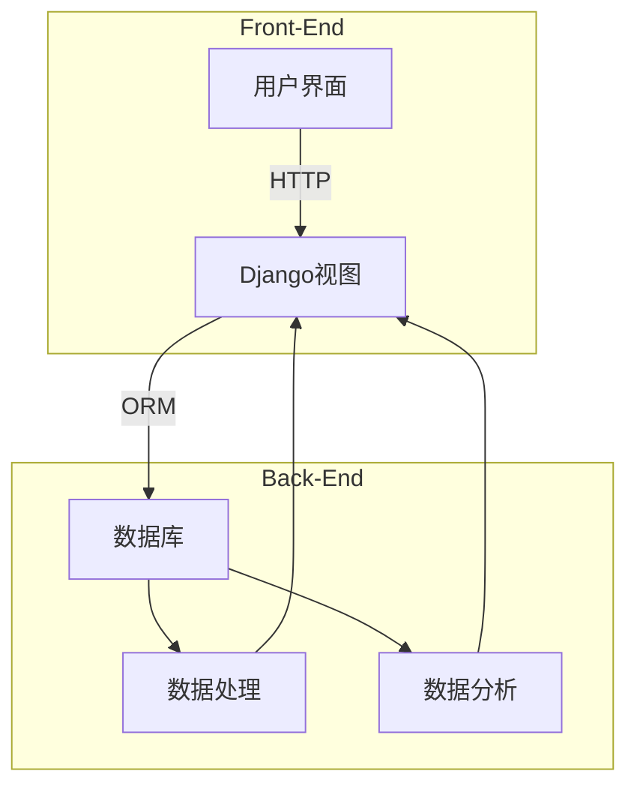

# 个人理财系统详细设计与具体代码实现

## 1. 背景介绍

### 1.1 个人理财的重要性

在当今社会,个人理财已经成为一个不可忽视的重要课题。随着生活水平的提高和经济环境的复杂化,合理分配和管理个人财务资产对于实现财务自由和保障未来生活质量至关重要。良好的个人理财习惯不仅能够帮助个人控制支出、规避财务风险,还能促进资产增值,实现财务目标。

### 1.2 传统理财方式的缺陷

然而,传统的理财方式存在诸多缺陷,例如:

- 缺乏系统化管理,难以全面掌握财务状况
- 手工记账耗时耗力,易出现计算错误
- 缺乏专业分析和决策支持,盲目投资风险较大
- 理财知识有限,难以制定合理的理财策略

### 1.3 个人理财系统的需求

为了解决上述问题,我们需要一个智能化、一体化的个人理财系统,具有以下功能:

- 自动记录收支情况,汇总财务数据
- 提供直观的数据可视化,掌握财务动态
- 基于用户情况给出专业的理财分析和建议
- 设置理财目标,制定合理的理财策略
- 支持多种理财工具的综合应用

## 2. 核心概念与联系  

### 2.1 个人理财系统的核心概念

个人理财系统的核心概念包括:

- **账户**:用于记录用户的各种收支情况,包括现金账户、银行卡账户、投资账户等
- **交易记录**:指用户的每一笔收入和支出,记录了交易时间、类型、金额等详细信息
- **类别**:用于对交易记录进行分类,如工资收入、房租支出、投资收益等
- **预算**:根据用户的收入和支出情况,设置合理的消费预算
- **理财规划**:根据用户的财务状况和目标,制定个性化的理财策略
- **投资组合**:包含用户持有的各种投资产品,如股票、基金、债券等
- **风险评估**:评估用户的风险偏好,为投资决策提供参考

### 2.2 核心概念之间的关系

这些核心概念之间存在着紧密的联系,构成了个人理财系统的逻辑框架:

1. 用户的**账户**记录了所有**交易记录**,交易记录根据**类别**进行归类
2. 系统根据交易记录计算出用户的**收支情况**,并与设置的**预算**进行对比
3. 用户的**投资组合**包含了各类投资产品,每一笔投资都会产生相应的交易记录
4. 系统会对用户的**风险偏好**进行评估,并结合财务状况给出**理财规划**建议
5. **理财规划**将指导用户的消费行为、投资决策和财务管理

所有这些概念和逻辑相互关联、环环相扣,共同构建了一个完整的个人理财管理体系。

## 3. 核心算法原理具体操作步骤

### 3.1 数据采集与存储

个人理财系统的第一步是采集和存储用户的财务数据。主要步骤包括:

1. **账户同步**:系统需要与用户的银行账户、投资账户等进行连接,自动采集账户交易数据。这可以通过金融机构提供的开放API或者网页爬虫技术实现。

2. **手动记账**:除了自动采集,系统还需要提供手动记账的功能,允许用户输入现金收支、转账等记录。

3. **交易分类**:对采集到的交易记录进行智能分类,将其归入工资收入、房租支出等不同的类别,方便后续的数据分析。这可以通过机器学习算法实现,如朴素贝叶斯、决策树等。

4. **数据存储**:将处理后的账户信息、交易记录、分类等数据存储到数据库中,为后续的数据分析和决策提供支持。

### 3.2 数据分析与可视化

在获取了充足的财务数据后,系统需要对这些数据进行深入的分析和可视化展示,帮助用户全面掌握财务状况。主要步骤包括:

1. **收支统计**:统计用户的总收入、总支出,计算收支差额,分析收支结构。

2. **预算管理**:根据用户的收入水平和消费习惯,设置合理的消费预算,对超支行为进行预警。

3. **趋势分析**:绘制收支趋势图,分析收支变化趋势,预测未来的财务状况。

4. **数据可视化**:使用图表、报告等直观的方式展示分析结果,如饼图、柱状图、折线图等,帮助用户快速掌握财务要点。

5. **异常检测**:对用户的财务数据进行异常值检测,发现可能的错误记录或欺诈行为。

这些分析和可视化功能可以让用户更好地理解自身的财务状况,从而做出明智的理财决策。

### 3.3 投资管理

除了记账和分析功能,个人理财系统还需要提供投资管理功能,帮助用户实现资产的保值增值。主要步骤包括:

1. **风险评估**:通过问卷调查等方式评估用户的风险偏好,了解其可承受的风险水平。

2. **投资组合优化**:根据用户的风险偏好、投资目标和现有资产状况,运用现代投资组合理论(如马科维茨模型)构建最优投资组合。

3. **投资决策**:分析各类投资产品(股票、基金、债券等)的风险收益特征,给出投资建议。

4. **投资跟踪**:持续跟踪投资组合的表现,对亏损投资进行止损,对盈利投资进行获利等策略。

5. **投资教育**:为用户提供投资理财知识科普,介绍不同投资工具的特点、风险等,提高用户的投资素养。

良好的投资管理不仅能帮助用户规避风险,还能实现资产的长期增值,是个人理财系统的重要组成部分。

### 3.4 目标规划与跟踪

个人理财的最终目标是实现财务自由,为此我们需要设置明确的理财目标,并持续跟踪目标的完成进度。主要步骤包括:

1. **目标设置**:允许用户设置多种类型的理财目标,如购房、教育基金、旅游基金、退休基金等。

2. **资金分配**:根据目标的时间期限和所需资金,对用户的收入进行合理分配,平衡当前消费需求和未来理财目标。

3. **进度跟踪**:实时计算每个理财目标的完成进度,当进度落后时发出预警,提醒用户调整理财策略。

4. **情景模拟**:模拟不同的投资回报率、通胀水平等情况下,目标完成所需的资金量,帮助用户评估风险。

5. **定期复核**:定期复核用户的财务状况和理财目标,根据实际情况对目标进行动态调整。

通过明确的目标规划和持续的跟踪,用户可以将理财行为系统化,更好地实现财务自由。

## 4. 数学模型和公式详细讲解举例说明

在个人理财系统中,数学模型和公式扮演着重要角色,为投资决策、风险评估和目标规划等提供了理论基础和量化支撑。下面我们介绍几个常用的数学模型:

### 4.1 复利计算模型

复利模型用于计算投资的终值,公式如下:

$$FV = PV \times (1 + r)^n$$

其中:
- $FV$表示投资的终值(Future Value)
- $PV$表示投资的本金(Present Value)
- $r$表示年化利率
- $n$表示投资期限(年)

例如,假设我们投资本金10000元,年化利率为5%,投资期限为10年,那么投资的终值为:

$$FV = 10000 \times (1 + 0.05)^{10} = 16288.95$$

复利模型体现了"钱生钱"的投资理念,可用于计算各类投资工具(如定期存款、债券等)的收益情况。

### 4.2 现值计算模型

现值模型用于计算未来现金流的当前价值,公式如下:

$$PV = \sum_{t=1}^{n} \frac{CF_t}{(1+r)^t}$$

其中:
- $PV$表示现金流的现值
- $CF_t$表示第$t$期的现金流量
- $r$表示折现率
- $n$表示现金流持续的期数

例如,假设一个投资项目在未来5年内每年产生现金流1000元,折现率为6%,那么该投资项目的现值为:

$$PV = \frac{1000}{1.06^1} + \frac{1000}{1.06^2} + \frac{1000}{1.06^3} + \frac{1000}{1.06^4} + \frac{1000}{1.06^5} = 4212.37$$

现值计算模型常用于评估投资项目的价值,以及估算未来年金等现金流的现值。

### 4.3 马科维茨投资组合理论

马科维茨投资组合理论是现代投资组合管理的基石,用于构建最优投资组合。其核心思想是通过资产分散投资来降低风险,并在给定的风险水平下追求最大收益。

根据马科维茨理论,投资组合的预期收益率为:

$$E(r_p) = \sum_{i=1}^{n}w_iE(r_i)$$

投资组合的风险(标准差)为:

$$\sigma_p = \sqrt{\sum_{i=1}^{n}\sum_{j=1}^{n}w_iw_j\sigma_{ij}}$$

其中:
- $E(r_p)$表示投资组合的预期收益率
- $E(r_i)$表示第$i$种资产的预期收益率
- $w_i$表示第$i$种资产在投资组合中的权重
- $\sigma_p$表示投资组合的标准差(风险)
- $\sigma_{ij}$表示第$i$种资产与第$j$种资产之间的协方差

通过优化算法(如均值-方差模型),我们可以在给定的风险水平下,求解出能够获得最大收益的投资组合权重分配。

马科维茨理论为现代投资组合管理奠定了坚实的理论基础,是个人理财系统中不可或缺的核心模型。

## 4. 项目实践:代码实例和详细解释说明  

为了更好地理解个人理财系统的实现细节,我们将通过一个基于Python的项目实例进行说明。该项目使用流行的Web框架Django和数据分析库Pandas实现,并采用SQLite作为后端数据库。

### 4.1 系统架构

我们首先来看一下系统的整体架构:



系统分为前端和后端两部分:

- **前端**:提供用户界面,允许用户查看财务数据、进行交易记录、设置理财目标等。前端使用Django的模板系统实现,并通过HTTP与后端进行交互。

- **后端**:负责数据处理、数据分析和与数据库的交互。后端使用Django的模型和视图组件,通过ORM与SQLite数据库进行通信。数据处理模块负责采集和清洗数据,数据分析模块则执行各种分析算法,如收支统计、投资组合优化等。

### 4.2 数据模型

我们使用Django的模型来定义系统中的核心数据结构,主要包括:

```python
# models.py
from django.db import models

class Account(models.Model):
    name = models.CharField(max_length=100)
    balance = models.DecimalField(max_digits=12, decimal_places=2)
    # 其他字段...

class Transaction(models.Model):
    account = models.ForeignKey(Account, on_delete=models.CASCADE)
    date = models.DateField()
    amount = models.DecimalField(max_digits=12, decimal_places=2)
    category = models.ForeignKey('