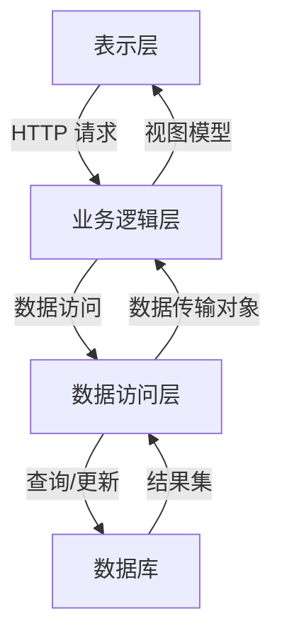

# 中学学生学籍管理系统详细设计与具体代码实现

## 1. 背景介绍

### 1.1 学籍管理系统的重要性

在当今教育体系中,学生学籍管理系统扮演着至关重要的角色。它是一个集中式的数据库应用程序,旨在高效地管理和维护学生的个人信息、课程记录、成绩、出勤情况等相关数据。有效的学籍管理系统不仅能够简化学校的日常运营,还能提高教学质量,为教师和学生提供更好的服务。

### 1.2 传统管理方式的缺陷

在过去,学校通常采用手工操作和纸质文件的方式来管理学生学籍信息。这种传统方法存在诸多弊端,例如:

- 数据冗余和不一致
- 信息查询和统计困难
- 数据安全性和隐私保护困难
- 工作效率低下,容易出错

### 1.3 现代化学籍管理系统的优势

通过引入现代化的学籍管理系统,可以有效解决上述问题,带来诸多优势:

- 集中式数据存储,消除数据冗余
- 快速查询和生成报表
- 提高数据安全性和可靠性
- 自动化流程,减少人工操作
- 提高工作效率,降低出错率

## 2. 核心概念与联系

### 2.1 系统架构概览

中学学生学籍管理系统通常采用三层架构(Three-Tier Architecture),包括:

1. **表示层(Presentation Tier)**: 提供用户界面,允许用户与系统交互。
2. **业务逻辑层(Business Logic Tier)**: 处理系统的核心功能,如数据验证、业务规则执行等。
3. **数据访问层(Data Access Tier)**: 负责与数据库进行交互,执行数据持久化操作。



### 2.2 核心实体及关系

学籍管理系统的核心实体包括:

- **学生(Student)**: 存储学生的基本信息,如姓名、出生日期、联系方式等。
- **课程(Course)**: 表示学校开设的课程,包括课程名称、学分、任课教师等信息。
- **成绩(Grade)**: 记录学生在特定课程中的成绩。
- **班级(Class)**: 表示学生所属的班级,方便进行集中管理。
- **教师(Teacher)**: 存储任课教师的基本信息。

这些实体之间存在着多对多、一对多等关系,需要通过关系数据模型进行建模。

```mermaid
erDiagram
    STUDENT ||--o{ GRADE : has
    COURSE ||--o{ GRADE : has
    STUDENT }|--|| CLASS : belongs_to
    CLASS ||--o{ STUDENT : has
    COURSE ||--o{ TEACHER : teaches
```

## 3. 核心算法原理具体操作步骤

### 3.1 数据库设计

#### 3.1.1 概念数据模型

基于上述核心实体及其关系,我们可以构建概念数据模型:

```mermaid
erDiagram
    STUDENT ||--o{ GRADE : has
    STUDENT {
        int student_id PK
        varchar name
        date birth_date
        varchar contact
        ...
    }
    COURSE ||--o{ GRADE : has
    COURSE {
        int course_id PK
        varchar name
        int credits
        ...
    }
    GRADE {
        int student_id PK
        int course_id PK
        decimal grade
        ...
    }
    STUDENT }|--|| CLASS : belongs_to
    CLASS {
        int class_id PK
        varchar name
        int grade_level
        ...
    }
    CLASS ||--o{ STUDENT : has
    COURSE ||--o{ TEACHER : teaches
    TEACHER {
        int teacher_id PK
        varchar name
        varchar department
        ...
    }
```

#### 3.1.2 逻辑数据模型

根据概念数据模型,我们可以进一步设计逻辑数据模型,确定表结构、数据类型和约束:

```sql
CREATE TABLE Student (
    student_id INT PRIMARY KEY,
    name VARCHAR(50) NOT NULL,
    birth_date DATE NOT NULL,
    contact VARCHAR(20),
    class_id INT FOREIGN KEY REFERENCES Class(class_id)
);

CREATE TABLE Class (
    class_id INT PRIMARY KEY,
    name VARCHAR(50) NOT NULL,
    grade_level INT NOT NULL
);

CREATE TABLE Course (
    course_id INT PRIMARY KEY,
    name VARCHAR(50) NOT NULL,
    credits INT NOT NULL,
    teacher_id INT FOREIGN KEY REFERENCES Teacher(teacher_id)
);

CREATE TABLE Teacher (
    teacher_id INT PRIMARY KEY,
    name VARCHAR(50) NOT NULL,
    department VARCHAR(50) NOT NULL
);

CREATE TABLE Grade (
    student_id INT FOREIGN KEY REFERENCES Student(student_id),
    course_id INT FOREIGN KEY REFERENCES Course(course_id),
    grade DECIMAL(5,2) NOT NULL,
    PRIMARY KEY (student_id, course_id)
);
```

### 3.2 数据访问层

数据访问层负责与数据库进行交互,提供对实体的持久化操作。以下是一些常见的数据访问模式:

#### 3.2.1 原始 JDBC

使用 JDBC (Java Database Connectivity) API 直接与数据库进行交互。这种方式灵活性强,但代码冗长且容易出错。

```java
Connection conn = DriverManager.getConnection(url, user, password);
String sql = "SELECT * FROM Student WHERE student_id = ?";
PreparedStatement stmt = conn.prepareStatement(sql);
stmt.setInt(1, studentId);
ResultSet rs = stmt.executeQuery();
// 处理结果集
```

#### 3.2.2 对象关系映射 (ORM)

ORM (Object-Relational Mapping) 框架如 Hibernate 可以将对象与关系数据库中的表建立映射关系,大大简化了数据访问代码。

```java
Session session = sessionFactory.openSession();
Transaction tx = session.beginTransaction();
Student student = (Student) session.get(Student.class, studentId);
// 操作 student 对象
tx.commit();
session.close();
```

#### 3.2.3 数据访问对象 (DAO)

DAO (Data Access Object) 模式将数据访问逻辑封装在一个单独的对象中,提高代码的可维护性和可重用性。

```java
public interface StudentDAO {
    Student getStudentById(int studentId);
    List<Student> getAllStudents();
    void updateStudent(Student student);
    // 其他方法...
}
```

### 3.3 业务逻辑层

业务逻辑层负责实现系统的核心功能,如学生信息管理、课程管理、成绩管理等。它通常由一系列服务组成,每个服务封装了特定的业务逻辑。

#### 3.3.1 学生信息管理

```java
public class StudentService {
    private StudentDAO studentDAO;

    public Student getStudentById(int studentId) {
        // 执行业务规则和数据验证
        return studentDAO.getStudentById(studentId);
    }

    public List<Student> getAllStudents() {
        // 执行业务规则和数据验证
        return studentDAO.getAllStudents();
    }

    public void updateStudent(Student student) {
        // 执行业务规则和数据验证
        studentDAO.updateStudent(student);
    }

    // 其他方法...
}
```

#### 3.3.2 课程管理

```java
public class CourseService {
    private CourseDAO courseDAO;

    public Course getCourseById(int courseId) {
        // 执行业务规则和数据验证
        return courseDAO.getCourseById(courseId);
    }

    public List<Course> getAllCourses() {
        // 执行业务规则和数据验证
        return courseDAO.getAllCourses();
    }

    public void addCourse(Course course) {
        // 执行业务规则和数据验证
        courseDAO.addCourse(course);
    }

    // 其他方法...
}
```

#### 3.3.3 成绩管理

```java
public class GradeService {
    private GradeDAO gradeDAO;

    public Grade getGradeByStudentAndCourse(int studentId, int courseId) {
        // 执行业务规则和数据验证
        return gradeDAO.getGradeByStudentAndCourse(studentId, courseId);
    }

    public List<Grade> getGradesByStudent(int studentId) {
        // 执行业务规则和数据验证
        return gradeDAO.getGradesByStudent(studentId);
    }

    public void updateGrade(Grade grade) {
        // 执行业务规则和数据验证
        gradeDAO.updateGrade(grade);
    }

    // 其他方法...
}
```

### 3.4 表示层

表示层提供用户界面,允许用户与系统进行交互。在 Web 应用程序中,表示层通常由 JSP、Servlet 或现代前端框架(如 React、Angular)实现。

#### 3.4.1 学生信息管理界面

```html
<!-- 学生列表 -->
<table>
    <thead>
        <tr>
            <th>学生ID</th>
            <th>姓名</th>
            <th>出生日期</th>
            <th>联系方式</th>
            <th>班级</th>
            <th>操作</th>
        </tr>
    </thead>
    <tbody>
        <c:forEach items="${students}" var="student">
            <tr>
                <td>${student.id}</td>
                <td>${student.name}</td>
                <td>${student.birthDate}</td>
                <td>${student.contact}</td>
                <td>${student.class.name}</td>
                <td>
                    <a href="editStudent.jsp?id=${student.id}">编辑</a>
                    <a href="deleteStudent.jsp?id=${student.id}">删除</a>
                </td>
            </tr>
        </c:forEach>
    </tbody>
</table>

<!-- 添加学生表单 -->
<form action="addStudent" method="post">
    <label for="name">姓名:</label>
    <input type="text" id="name" name="name" required>
    <!-- 其他表单字段 -->
    <button type="submit">添加学生</button>
</form>
```

#### 3.4.2 课程管理界面

```html
<!-- 课程列表 -->
<table>
    <thead>
        <tr>
            <th>课程ID</th>
            <th>课程名称</th>
            <th>学分</th>
            <th>任课教师</th>
            <th>操作</th>
        </tr>
    </thead>
    <tbody>
        <c:forEach items="${courses}" var="course">
            <tr>
                <td>${course.id}</td>
                <td>${course.name}</td>
                <td>${course.credits}</td>
                <td>${course.teacher.name}</td>
                <td>
                    <a href="editCourse.jsp?id=${course.id}">编辑</a>
                    <a href="deleteCourse.jsp?id=${course.id}">删除</a>
                </td>
            </tr>
        </c:forEach>
    </tbody>
</table>

<!-- 添加课程表单 -->
<form action="addCourse" method="post">
    <label for="name">课程名称:</label>
    <input type="text" id="name" name="name" required>
    <!-- 其他表单字段 -->
    <button type="submit">添加课程</button>
</form>
```

#### 3.4.3 成绩管理界面

```html
<!-- 成绩列表 -->
<table>
    <thead>
        <tr>
            <th>学生ID</th>
            <th>学生姓名</th>
            <th>课程ID</th>
            <th>课程名称</th>
            <th>成绩</th>
            <th>操作</th>
        </tr>
    </thead>
    <tbody>
        <c:forEach items="${grades}" var="grade">
            <tr>
                <td>${grade.student.id}</td>
                <td>${grade.student.name}</td>
                <td>${grade.course.id}</td>
                <td>${grade.course.name}</td>
                <td>${grade.grade}</td>
                <td>
                    <a href="editGrade.jsp?studentId=${grade.student.id}&courseId=${grade.course.id}">编辑</a>
                </td>
            </tr>
        </c:forEach>
    </tbody>
</table>

<!-- 添加成绩表单 -->
<form action="addGrade" method="post">
    <label for="studentId">学生ID:</label>
    <input type="text" id="studentId" name="studentId" required>
    <label for="courseId">课程ID:</label>
    <input type="text" id="courseId" name="courseId" required>
    <label for="grade">成绩:</label>
    <input type="number" id="grade" name="grade" required>
    <button type="submit">添加成绩</button>
</form>
```

## 4. 数学模型和公式详细讲解举例说明

在学生学籍管理系统中,我们可能需要进行一些数学计算和统计分析,例如计算学生的平均成绩、排名等。以下是一些常见的数学模型和公式:

### 4.1 平均分计算

计算学生在某门课程或所有课程的平均分,可以使用以下公式:

$$\overline{x} = \frac{\sum_{i=1}^{n}x_i}{n}$$

其中:
- $\overline{x}$ 表示平均分
- $x_