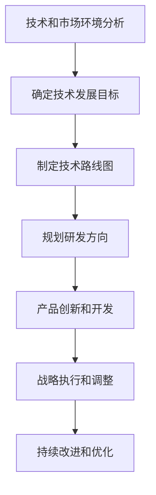

# 主导和把握公司的技术发展方向，研究制订公司的科技战略规划，包括技术路线、研发方向、产品创新等

## 1. 背景介绍

### 1.1 技术发展的重要性
在当今快节奏的商业环境中，技术是推动公司发展的关键驱动力。技术的进步不仅能够提高效率、降低成本,还能创造新的商业机会和收入来源。因此,主导和把握公司的技术发展方向,研究制订科技战略规划,对于任何企业的长期发展和竞争力都至关重要。

### 1.2 技术战略规划的挑战
制定技术战略规划并非一蹴而就,需要综合考虑多方面因素,包括市场趋势、客户需求、现有技术基础、人才储备等。此外,技术发展日新月异,企业还需保持对新兴技术的敏锐嗅觉,及时做出调整和创新。

## 2. 核心概念与联系

### 2.1 技术路线图
技术路线图(Technology Roadmap)是指导企业技术发展的蓝图,明确了企业未来几年内需要关注和投资的关键技术领域。它将企业的商业目标与技术能力相结合,确保技术发展与公司战略保持一致。

### 2.2 研发方向
研发方向是指企业在现有产品线或新产品线上的技术创新和突破方向。它需要对行业前沿技术有深入的理解,并对市场需求有准确的把握,从而制定出切实可行的研发计划。

### 2.3 产品创新
产品创新是企业保持竞争力的关键。它不仅包括对现有产品的改进和优化,还需要基于新技术开发全新的产品和解决方案,以满足不断变化的市场需求。

### 2.4 核心概念的联系
技术路线图、研发方向和产品创新三者相互关联、相辅相成。技术路线图为研发方向和产品创新指明了大方向,而研发方向和产品创新则是技术路线图的具体实施途径。它们共同构成了企业科技战略规划的主体框架。

## 3. 核心算法原理具体操作步骤

制定科技战略规划是一个系统性、迭代式的过程,需要遵循一定的原理和步骤。以下是一种常见的操作流程:



### 3.1 技术和市场环境分析
全面分析内外部技术和市场环境,包括现有技术基础、人才储备、竞争对手动向、行业趋势、客户需求等,为后续决策奠定基础。

### 3.2 确定技术发展目标
根据公司战略目标和环境分析结果,明确技术发展的总体目标,如提高效率、降低成本、拓展新业务等。

### 3.3 制定技术路线图
结合技术发展目标,规划未来3-5年需要关注和投资的关键技术领域,绘制出技术路线图。

### 3.4 规划研发方向
在技术路线图的指导下,针对现有产品线和潜在新产品线,制定具体的研发计划和方向。

### 3.5 产品创新和开发
依据研发方向,对现有产品进行改进和优化,同时开发全新的产品和解决方案。

### 3.6 战略执行和调整
有序执行技术战略规划,并根据实施过程中的反馈,及时对规划进行微调。

### 3.7 持续改进和优化
定期评估技术战略的执行效果,不断优化和完善流程,确保技术发展的连续性。

## 4. 数学模型和公式详细讲解举例说明

在制定科技战略规划时,我们可以借助一些数学模型和公式,对技术发展进行量化分析和优化决策。以下是一些常见的模型:

### 4.1 技术成熟度模型

技术成熟度模型(Technology Readiness Level,TRL)是评估技术成熟程度的标准化指标体系。它将技术发展分为9个阶段,从基础研究(TRL 1)到系统测试、发布和运营(TRL 9)。公式如下:

$$
TRL = \sum_{i=1}^{n}w_i \cdot r_i
$$

其中,$w_i$表示第i个评估指标的权重,$r_i$表示该指标的评分,n是指标总数。通过计算TRL值,企业可以评估某项技术的成熟度,并据此制定相应的发展策略。

### 4.2 技术价值评估模型

技术价值评估模型(Technology Value Assessment Model)用于评估技术对企业的价值贡献。一种常见的模型是基于实用性、可行性和战略性三个维度进行评估:

$$
V = \alpha U + \beta F + \gamma S
$$

其中,V表示技术价值,$\alpha$、$\beta$、$\gamma$分别为实用性(U)、可行性(F)和战略性(S)的权重系数。通过计算不同技术的V值,企业可以优先考虑价值最大的技术领域。

### 4.3 投资组合优化模型

在制定技术路线图时,企业往往需要在有限的资源下,对多个技术领域进行投资配置。投资组合优化模型可以帮助企业实现投资效益最大化:

$$
\max \sum_{i=1}^{n}r_i x_i \\
\text{s.t.} \sum_{i=1}^{n}c_i x_i \leq B \\
x_i \in \{0, 1\}
$$

其中,$r_i$表示第i个技术领域的预期回报,$c_i$表示投资成本,B是企业的总投资预算。通过求解这个0-1整数规划问题,企业可以得到最优的投资组合。

以上仅是数学模型在科技战略规划中的一些应用示例。在实际操作中,还可以结合更多的定性和定量分析方法,以获得更全面、更准确的决策支持。

## 5. 项目实践:代码实例和详细解释说明

在制定科技战略规划的过程中,我们可以借助编程来实现一些自动化分析和决策支持。以下是一个基于Python的简单示例:

```python
import numpy as np

# 技术成熟度模型
def calc_trl(weights, scores):
    return np.dot(weights, scores)

# 技术价值评估模型
def calc_tech_value(utility, feasibility, strategy, weights):
    return weights[0] * utility + weights[1] * feasibility + weights[2] * strategy

# 投资组合优化模型
def optimize_portfolio(returns, costs, budget):
    n = len(returns)
    c = np.array([[-r for r in returns], costs])
    A = np.array([[1 for _ in range(n)], np.eye(n, dtype=int)])
    b = np.array([budget, np.ones(n)])
    res = np.linalg.lstsq(c.T, np.zeros(2), cond=None)[0]
    portfolio = [int(x >= 0.5) for x in res[:n]]
    return portfolio

if __name__ == "__main__":
    # 技术成熟度模型示例
    weights = [0.3, 0.2, 0.1, 0.4]
    scores = [4, 3, 2, 5]
    trl = calc_trl(weights, scores)
    print(f"技术成熟度(TRL)值为: {trl}")

    # 技术价值评估模型示例 
    utility = 0.8
    feasibility = 0.6
    strategy = 0.9
    weights = [0.4, 0.3, 0.3]
    value = calc_tech_value(utility, feasibility, strategy, weights)
    print(f"技术价值为: {value}")

    # 投资组合优化模型示例
    returns = [0.15, 0.18, 0.22, 0.12]
    costs = [50, 80, 120, 60]
    budget = 200
    portfolio = optimize_portfolio(returns, costs, budget)
    print(f"最优投资组合为: {portfolio}")
```

以上代码实现了三种常见的数学模型:

1. `calc_trl`函数计算给定指标权重和评分的技术成熟度(TRL)值。
2. `calc_tech_value`函数根据实用性、可行性、战略性以及对应权重,计算技术的综合价值。
3. `optimize_portfolio`函数求解投资组合优化问题,给出在预算限制下的最优投资方案。

您可以根据实际需求,对这些函数进行扩展和定制,以支持更复杂的分析和决策场景。

需要注意的是,这只是一个简单的示例,在实际项目中,您可能需要引入更多的数据源、算法模型,并结合可视化工具和报告生成功能,以提供更全面的决策支持系统。

## 6. 实际应用场景

科技战略规划在各行各业都有广泛的应用,以下是一些典型场景:

### 6.1 制造业

制造业企业需要持续推进工艺流程自动化和智能化,提高生产效率和产品质量。因此,它们需要制定清晰的技术路线图,规划智能制造、工业互联网、机器人技术等领域的发展方向。

### 6.2 金融业

金融科技(FinTech)正在重塑传统金融服务模式。银行、证券等金融机构需要研究区块链、人工智能、大数据等新兴技术,开发创新的金融产品和服务,以满足不断变化的客户需求。

### 6.3 医疗健康

医疗健康领域的技术创新日新月异,如基因测序、医疗影像、智能诊断等。医疗机构和生物技术公司需要密切关注这些前沿技术的发展,制定相应的研发战略,以提供更精准、更高效的医疗服务。

### 6.4 能源环保

能源和环保行业正面临可再生能源、节能减排等重大挑战。企业需要投资研发新型能源技术、环保技术,并优化现有能源系统,以实现可持续发展。

### 6.5 其他领域

无论是电子信息、交通运输、农业种植,还是教育、娱乐、零售等传统行业,科技创新都是推动企业发展的重要动力。因此,制定科技战略规划对于任何企业都具有重要意义。

## 7. 工具和资源推荐

在制定和执行科技战略规划的过程中,我们可以借助一些专业工具和资源,以提高效率和决策质量:

### 7.1 技术智能平台

技术智能平台(Technology Intelligence Platform)是一种集成了多种分析工具的综合系统,可以帮助企业全面掌握技术发展动态、竞争格局、专利信息等,为战略制定提供决策支持。一些知名的技术智能平台包括PatSnap、Innography、Qpat等。

### 7.2 技术路线图工具

技术路线图工具(Technology Roadmapping Tools)是专门用于绘制和管理技术路线图的软件,可以直观地展示技术发展路径、里程碑事件和相互依赖关系。常见的工具有Roadmunk、OfficeRoutes、ProductPlan等。

### 7.3 项目管理工具

在执行科技战略规划时,需要对研发项目进行严格管理和跟踪。项目管理工具(Project Management Tools)如Jira、Trello、Asana等,可以帮助企业高效协作、分配任务、监控进度。

### 7.4 专利分析工具

专利分析工具(Patent Analysis Tools)可以帮助企业深入挖掘专利数据,了解技术发展趋势、竞争对手动向等,为制定技术战略提供有力支持。一些常用的工具包括PatentInspiration、Innography、Anaqua等。

### 7.5 行业报告和咨询服务

除了自主研究外,企业还可以参考权威机构发布的行业报告和咨询服务,获取专业的市场分析和技术预测,以支持战略决策。如Gartner、IDC、Forrester等知名咨询公司提供的服务。

## 8. 总结:未来发展趋势与挑战

### 8.1 未来发展趋势

#### 8.1.1 技术融合与跨界创新

未来,不同技术领域之间将出现更多融合,如人工智能与物联网、大数据与生物技术等,催生出一系列跨界创新应用。企业需要培养技术融合的思维模式,把握新兴技术融合带来的机遇。