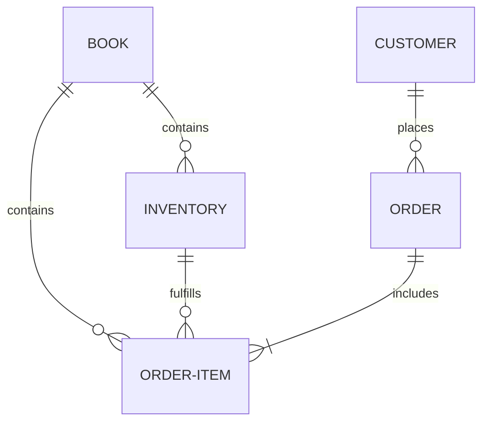
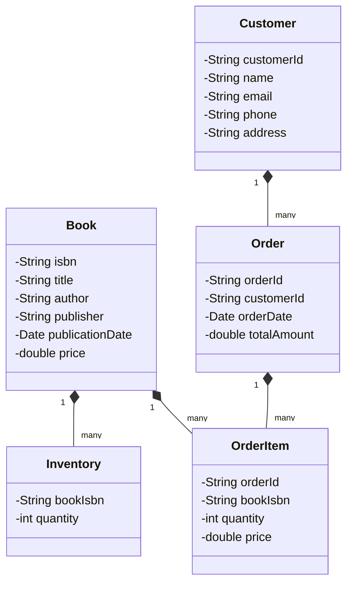

# 书店管理系统详细设计与具体代码实现

作者：禅与计算机程序设计艺术

## 1. 背景介绍

在现代社会中,书店作为文化传播和知识分享的重要场所,其管理工作的信息化和智能化已成为大势所趋。传统的人工管理模式已无法满足日益增长的业务需求,因此开发一套功能完善、易于操作的书店管理系统显得尤为重要。本文将详细阐述书店管理系统的设计思路和具体实现过程,为相关领域的研究和实践提供参考。

### 1.1 书店管理的现状与挑战

#### 1.1.1 传统书店管理模式的局限性

传统的书店管理主要依赖人工操作,存在效率低下、差错率高等问题。具体表现在:

- 图书信息的录入和更新需要大量的人力和时间
- 库存管理和盘点工作难度大,容易出现差错
- 销售数据的统计和分析效率低,无法为经营决策提供有力支持

#### 1.1.2 信息化管理的必要性

为了适应新时代的发展需求,书店亟需引入信息化管理手段。信息化管理具有以下优势:

- 提高图书信息管理的效率和准确性
- 实现实时库存监控,优化库存结构
- 便于销售数据的收集和分析,为经营决策提供数据支持
- 改善顾客体验,提供个性化的服务

### 1.2 书店管理系统的目标和意义

#### 1.2.1 系统开发目标

本书店管理系统旨在实现以下目标:

- 建立规范化的图书信息管理模块,支持图书的录入、查询、修改等操作
- 实现智能化的库存管理模块,支持实时库存监控和自动补货提醒
- 构建可视化的销售分析模块,为经营决策提供直观的数据支撑
- 设计人性化的客户管理模块,提供会员管理和个性化推荐服务

#### 1.2.2 系统开发的意义

书店管理系统的开发具有重要的现实意义:

- 提升书店管理效率,降低人工成本
- 加强库存周转,提高资金利用率
- 优化经营策略,提升书店竞争力
- 改善顾客体验,提高顾客粘性和忠诚度

## 2. 核心概念与关联

### 2.1 实体关系图

书店管理系统涉及的核心实体包括:图书、库存、订单、客户等。它们之间的关系可用下图表示:



### 2.2 类图设计

根据实体关系,我们可以设计出系统的核心类:



## 3. 核心算法原理与具体操作步骤

### 3.1 图书检索算法

图书检索是书店管理系统的核心功能之一。我们采用倒排索引技术,建立关键词到图书的映射,实现高效的图书检索。

#### 3.1.1 倒排索引构建步骤

1. 对图书信息进行分词,提取关键词
2. 建立关键词到图书ID的映射关系
3. 对关键词进行排序和去重
4. 将倒排索引写入磁盘/数据库

#### 3.1.2 图书检索步骤

1. 对用户输入的检索词进行分词
2. 在倒排索引中查找相应的关键词
3. 取出关键词对应的图书ID
4. 根据图书ID从图书库中获取详细信息
5. 对检索结果进行排序和分页,返回给用户

### 3.2 销售数据分析算法

销售数据分析对于书店的经营决策至关重要。我们采用 Apriori 算法,挖掘图书的关联规则,为图书推荐和营销策略提供支持。

#### 3.2.1 Apriori 算法原理

Apriori 算法基于以下两个原理:

- 频繁项集的子集也是频繁的
- 非频繁项集的超集也是非频繁的

算法通过逐层搜索的方式,从单个物品开始,递归地产生更大的频繁项集,直到无法产生为止。

#### 3.2.2 关联规则挖掘步骤

1. 根据订单数据,统计每本图书的销售次数,生成1-频繁项集
2. 根据1-频繁项集,递归生成 k-频繁项集(k>1)
3. 对于每个频繁项集,计算其支持度和置信度
4. 根据最小支持度和最小置信度,过滤掉不满足要求的关联规则
5. 将挖掘出的关联规则按照置信度排序,写入数据库

## 4. 数学模型与公式详解

### 4.1 销售预测模型

为了预测未来一段时间的图书销量,我们建立了如下的时间序列模型:

$$
\hat{y}_{t+1} = \alpha y_t + (1-\alpha) \hat{y}_t
$$

其中:
- $\hat{y}_{t+1}$ 表示 $t+1$ 时刻的预测值
- $y_t$ 表示 $t$ 时刻的实际值
- $\alpha$ 表示平滑系数,取值范围为 $[0,1]$

通过调整 $\alpha$ 的值,我们可以控制模型对近期数据的敏感程度。$\alpha$ 越大,模型越倾向于相信最近的观测值;$\alpha$ 越小,模型越倾向于相信过去的预测值。

### 4.2 客户价值模型

为了评估客户的价值,我们定义了如下的客户价值模型:

$$
CV = \frac{\sum_{i=1}^n (p_i - c_i)}{n}
$$

其中:
- $CV$ 表示客户价值
- $p_i$ 表示第 $i$ 笔订单的金额
- $c_i$ 表示第 $i$ 笔订单的成本
- $n$ 表示订单总数

该模型计算了客户平均每笔订单的净利润,以此作为客户价值的衡量标准。CV 值越高,表明客户的价值越大。

## 5. 项目实践:代码实例与详解

下面我们给出书店管理系统的部分核心代码,并进行详细解释。

### 5.1 图书检索模块

```python
class BookSearcher:
    def __init__(self, books):
        self.inverted_index = self._build_index(books)
        
    def _build_index(self, books):
        index = {}
        for book in books:
            keywords = self._extract_keywords(book)
            for keyword in keywords:
                if keyword not in index:
                    index[keyword] = set()
                index[keyword].add(book['id'])
        return index
        
    def _extract_keywords(self, book):
        # 对图书信息进行分词,提取关键词
        ...
        
    def search(self, query):
        keywords = self._extract_keywords({'title': query})
        book_ids = set()
        for keyword in keywords:
            if keyword in self.inverted_index:
                book_ids |= self.inverted_index[keyword]
        return book_ids
```

`BookSearcher` 类封装了图书检索的功能。它在初始化时根据图书信息构建倒排索引,然后通过 `search` 方法实现图书的检索。

`_build_index` 方法实现倒排索引的构建。它遍历所有图书,对每本图书提取关键词,然后建立关键词到图书ID的映射关系。

`_extract_keywords` 方法实现对图书信息的分词和关键词提取。这里为了简洁省略了具体实现,可以使用第三方的分词库如 jieba 等。

`search` 方法实现图书的检索。它首先对用户输入的检索词进行分词,然后在倒排索引中查找相应的关键词,取出关键词对应的图书ID,最后返回检索结果。

### 5.2 销售数据分析模块

```python
from collections import defaultdict

def apriori(orders, min_support=0.01, min_confidence=0.5):
    item_counts = defaultdict(int)
    for order in orders:
        for item in order:
            item_counts[item] += 1
            
    n_orders = len(orders)        
    frequent_items = {item for item, count in item_counts.items() 
                      if count / n_orders >= min_support}
                      
    rules = []
    for order in orders:
        for item_a in frequent_items:
            if item_a in order:
                for item_b in frequent_items:
                    if item_b in order and item_b != item_a:
                        confidence = item_counts[item_b] / item_counts[item_a]
                        if confidence >= min_confidence:
                            rules.append((item_a, item_b, confidence))
                            
    return rules
```

`apriori` 函数实现了 Apriori 算法,用于挖掘图书的关联规则。

函数首先统计每本图书的销售次数,计算出1-频繁项集。然后根据最小支持度,过滤掉不满足要求的图书,得到频繁项集。

接下来,函数遍历每个订单,对于订单中的每对频繁项,计算它们的置信度。如果置信度满足最小置信度要求,就将其作为一条关联规则保存下来。

最后,函数返回所有挖掘出的关联规则。

## 6. 实际应用场景

书店管理系统可以应用于各种类型和规模的实体书店和网上书店,具体场景包括:

- 大型连锁书店:系统可以帮助总部实现对分店的统一管理,包括图书配送、库存调拨、销售分析等。
- 独立书店:系统可以帮助书店老板提高管理效率,优化库存结构,改善顾客体验。
- 高校书店:系统可以为学生和教师提供个性化的图书推荐,支持教材的预订和发放。
- 网上书店:系统可以与网站前端紧密集成,实现图书的在线检索、订购、支付等功能。

不同场景下,系统需要根据具体的业务需求进行定制和优化,但核心的功能模块是相通的。

## 7. 工具和资源推荐

开发书店管理系统需要用到以下工具和资源:

- 编程语言:Java, Python 等
- Web 框架:Spring Boot, Django 等
- 数据库:MySQL, MongoDB 等
- 全文检索引擎:Elasticsearch, Solr 等
- 数据分析库:Pandas, Numpy 等
- 数据可视化库:Matplotlib, ECharts 等
- 前端框架:Vue, React 等
- UI 组件库:Element UI, Ant Design 等

选择合适的技术栈,并掌握相关的工具和类库,是开发高质量系统的前提。

## 8. 总结:未来发展趋势与挑战

随着人工智能和大数据技术的发展,书店管理系统也面临着新的机遇和挑战。未来的发展趋势包括:

- 个性化推荐:利用机器学习算法,根据用户的历史行为和偏好,提供精准的图书推荐。
- 智能客服:引入自然语言处理技术,实现智能客服助手,解答用户的常见问题。
- 虚拟现实:利用 VR 技术,为用户提供身临其境的书店体验,促进线上线下的融合。
- 区块链:利用区块链技术,实现图书版权保护和交易,促进知识的共享和传播。

与此同时,书店管理系统也面临着数据安全、用户隐私保护等方面的挑战。如何在发挥数据价值的同时,保障用户的合法权益,是系统开发和运营过程中需要重点关注的问题。

## 9. 附录:常见问题与解答

### 9.1 如何实现图书的动态定价?

可以参考以下策略:
- 根据图书的销量和库