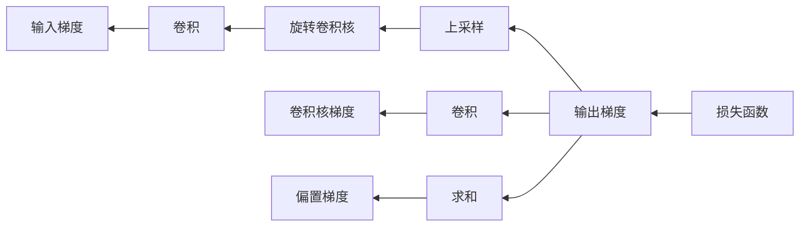

# 从零开始大模型开发与微调：PyTorch中的卷积函数实现详解

作者：禅与计算机程序设计艺术

## 1. 背景介绍
### 1.1 大模型的兴起与发展
近年来,随着深度学习技术的飞速发展,大规模预训练语言模型(Large Pre-trained Language Models,PLMs)受到了学术界和工业界的广泛关注。从2018年的BERT,到2019年的GPT-2,再到2020年的GPT-3,大模型在自然语言处理(NLP)领域取得了一系列突破性进展。这些大模型通过在海量无标注文本数据上进行自监督预训练,学习到了丰富的语言知识和常识,在下游任务上表现出了强大的迁移学习和少样本学习能力。

### 1.2 大模型面临的挑战
尽管大模型取得了瞩目的成绩,但它们仍然面临着诸多挑战:
1. 训练和推理的高昂计算成本。动辄上百亿、千亿参数量级的大模型对计算资源提出了极高的要求。
2. 模型的可解释性和可控性不足。大模型内部的工作机制仍是一个"黑箱",难以解释其决策过程。
3. 训练数据和模型的偏见问题。大模型从海量网络文本中学习,不可避免会继承其中的偏见。
4. 知识的稳定性和一致性问题。大模型存在生成不一致、自相矛盾的内容的风险。

### 1.3 大模型的开发与微调
为了进一步提升大模型的性能,并将其应用到实际任务中,我们需要在特定领域数据上对大模型进行微调(fine-tuning)。微调通过在下游任务数据上对预训练模型进行二次训练,使其适应特定领域的数据分布和任务目标。

本文将以PyTorch为例,详细介绍如何从零开始实现一个卷积神经网络,并将其应用到大模型的开发与微调中。卷积神经网络(Convolutional Neural Network, CNN)是一种广泛应用于计算机视觉领域的深度学习模型。近年来,CNN也被引入到了NLP领域,并在文本分类、情感分析、问答系统等任务上取得了优异的表现。

## 2. 核心概念与联系
### 2.1 卷积的数学定义
卷积是一种数学运算,它描述了两个函数之间的相互关系。对于连续函数$f(t)$和$g(t)$,它们的卷积定义为:

$$
(f*g)(t) = \int_{-\infty}^{\infty} f(\tau)g(t-\tau)d\tau
$$

其中,$*$表示卷积操作符。

对于离散函数$f[n]$和$g[n]$,卷积的定义为:

$$
(f*g)[n] = \sum_{m=-\infty}^{\infty} f[m]g[n-m]
$$

### 2.2 卷积神经网络中的卷积
在卷积神经网络中,卷积操作被用于提取输入数据的局部特征。给定一个输入张量$\mathbf{X} \in \mathbb{R}^{H \times W \times C}$和一个卷积核$\mathbf{K} \in \mathbb{R}^{k \times k \times C}$,卷积操作可以表示为:

$$
\mathbf{Y}[i,j] = \sum_{m=0}^{k-1}\sum_{n=0}^{k-1}\sum_{c=0}^{C-1} \mathbf{X}[i+m,j+n,c] \cdot \mathbf{K}[m,n,c]
$$

其中,$\mathbf{Y}$为输出特征图,$H$、$W$、$C$分别表示输入张量的高度、宽度和通道数,$k$为卷积核的大小。

卷积操作可以看作是卷积核在输入张量上滑动,并在每个位置上计算卷积核与输入张量局部区域的内积。通过学习不同的卷积核,CNN可以提取输入数据的不同特征。

### 2.3 卷积的性质
卷积操作具有以下重要性质:
1. 平移不变性(Translation Invariance):卷积操作对输入的平移具有不变性,即$f(t)*g(t) = f(t-\tau)*g(t-\tau)$。
2. 可分离性(Separability):多维卷积可以分解为多个一维卷积的组合,即$f(x,y)*g(x,y) = (f(x)*g(x))*(f(y)*g(y))$。
3. 结合律(Associativity):卷积操作满足结合律,即$(f*g)*h = f*(g*h)$。
4. 分配律(Distributivity):卷积操作对加法满足分配律,即$f*(g+h) = f*g + f*h$。

这些性质为卷积神经网络的设计和优化提供了理论基础。

## 3. 核心算法原理具体操作步骤
### 3.1 卷积层的前向传播
卷积层的前向传播过程可以分为以下步骤:
1. 初始化卷积核权重$\mathbf{K}$和偏置$\mathbf{b}$。
2. 对输入张量$\mathbf{X}$进行填充(padding),使其与卷积核的大小匹配。
3. 将卷积核滑动到输入张量的每个位置,计算卷积核与输入张量局部区域的内积,得到输出特征图$\mathbf{Y}$。
4. 对输出特征图$\mathbf{Y}$应用激活函数,如ReLU。
5. 对输出特征图$\mathbf{Y}$进行下采样(pooling),减小特征图的尺寸。

下面是卷积层前向传播的示意图:


### 3.2 卷积层的反向传播
卷积层的反向传播过程可以分为以下步骤:
1. 计算损失函数对输出特征图$\mathbf{Y}$的梯度$\frac{\partial L}{\partial \mathbf{Y}}$。
2. 对$\frac{\partial L}{\partial \mathbf{Y}}$进行上采样,还原到卷积操作之前的尺寸。
3. 将$\frac{\partial L}{\partial \mathbf{Y}}$与旋转180度的卷积核进行卷积,得到输入张量$\mathbf{X}$的梯度$\frac{\partial L}{\partial \mathbf{X}}$。
4. 将$\frac{\partial L}{\partial \mathbf{Y}}$与输入张量$\mathbf{X}$进行卷积,得到卷积核$\mathbf{K}$的梯度$\frac{\partial L}{\partial \mathbf{K}}$。
5. 对偏置$\mathbf{b}$的梯度$\frac{\partial L}{\partial \mathbf{b}}$进行求和。
6. 使用优化算法,如随机梯度下降(SGD),更新卷积核权重$\mathbf{K}$和偏置$\mathbf{b}$。

下面是卷积层反向传播的示意图:



## 4. 数学模型和公式详细讲解举例说明
### 4.1 卷积的数学推导
对于一个二维卷积,输入张量$\mathbf{X} \in \mathbb{R}^{H \times W}$,卷积核$\mathbf{K} \in \mathbb{R}^{k \times k}$,卷积操作可以表示为:

$$
\mathbf{Y}[i,j] = \sum_{m=0}^{k-1}\sum_{n=0}^{k-1} \mathbf{X}[i+m,j+n] \cdot \mathbf{K}[m,n]
$$

其中,$\mathbf{Y}$为输出特征图。

假设输入张量$\mathbf{X}$和卷积核$\mathbf{K}$分别为:

$$
\mathbf{X} = 
\begin{bmatrix}
1 & 2 & 3 \\
4 & 5 & 6 \\
7 & 8 & 9
\end{bmatrix},
\mathbf{K} = 
\begin{bmatrix}
1 & 0 \\
0 & 1
\end{bmatrix}
$$

则卷积操作的结果为:

$$
\mathbf{Y} = 
\begin{bmatrix}
1 & 2 \\
4 & 5
\end{bmatrix}
$$

可以看出,卷积操作提取了输入张量的局部特征。

### 4.2 卷积的梯度计算
对于卷积操作$\mathbf{Y} = \mathbf{X} * \mathbf{K}$,我们需要计算损失函数$L$对输入张量$\mathbf{X}$和卷积核$\mathbf{K}$的梯度。

根据链式法则,有:

$$
\frac{\partial L}{\partial \mathbf{X}} = \frac{\partial L}{\partial \mathbf{Y}} * \mathbf{K}^T
$$

$$
\frac{\partial L}{\partial \mathbf{K}} = \mathbf{X}^T * \frac{\partial L}{\partial \mathbf{Y}}
$$

其中,$\mathbf{K}^T$表示卷积核$\mathbf{K}$旋转180度后的结果。

假设损失函数对输出特征图$\mathbf{Y}$的梯度为:

$$
\frac{\partial L}{\partial \mathbf{Y}} = 
\begin{bmatrix}
1 & 2 \\
3 & 4
\end{bmatrix}
$$

则输入张量$\mathbf{X}$和卷积核$\mathbf{K}$的梯度分别为:

$$
\frac{\partial L}{\partial \mathbf{X}} = 
\begin{bmatrix}
1 & 2 & 0 \\
3 & 4 & 0 \\
0 & 0 & 0
\end{bmatrix}
$$

$$
\frac{\partial L}{\partial \mathbf{K}} = 
\begin{bmatrix}
23 & 34 \\
31 & 46
\end{bmatrix}
$$

通过梯度下降算法,我们可以不断更新卷积核的权重,使其学习到输入数据的特征表示。

## 5. 项目实践：代码实例和详细解释说明
下面我们使用PyTorch实现一个简单的卷积神经网络,并应用到手写数字识别任务中。

### 5.1 数据准备
我们使用MNIST数据集,它包含了60,000张训练图像和10,000张测试图像,每张图像的大小为28x28。

```python
import torch
import torch.nn as nn
import torch.optim as optim
from torchvision import datasets, transforms

# 定义数据转换
transform = transforms.Compose([
    transforms.ToTensor(),
    transforms.Normalize((0.1307,), (0.3081,))
])

# 加载MNIST数据集
train_dataset = datasets.MNIST(root='./data', train=True, download=True, transform=transform)
test_dataset = datasets.MNIST(root='./data', train=False, download=True, transform=transform)

# 定义数据加载器
train_loader = torch.utils.data.DataLoader(train_dataset, batch_size=64, shuffle=True)
test_loader = torch.utils.data.DataLoader(test_dataset, batch_size=1000, shuffle=False)
```

### 5.2 模型定义
我们定义一个简单的卷积神经网络,它包含两个卷积层和两个全连接层。

```python
class Net(nn.Module):
    def __init__(self):
        super(Net, self).__init__()
        self.conv1 = nn.Conv2d(1, 10, kernel_size=5)
        self.conv2 = nn.Conv2d(10, 20, kernel_size=5)
        self.fc1 = nn.Linear(320, 50)
        self.fc2 = nn.Linear(50, 10)

    def forward(self, x):
        x = nn.functional.relu(nn.functional.max_pool2d(self.conv1(x), 2))
        x = nn.functional.relu(nn.functional.max_pool2d(self.conv2(x), 2))
        x = x.view(-1, 320)
        x = nn.functional.relu(self.fc1(x))
        x = self.fc2(x)
        return nn.functional.log_softmax(x, dim=1)
```

### 5.3 模型训练
我们使用随机梯度下降(SGD)优化器和交叉熵损失函数来训练模型。

```python
model = Net()
optimizer = optim.SGD(model.parameters(), lr=0.01