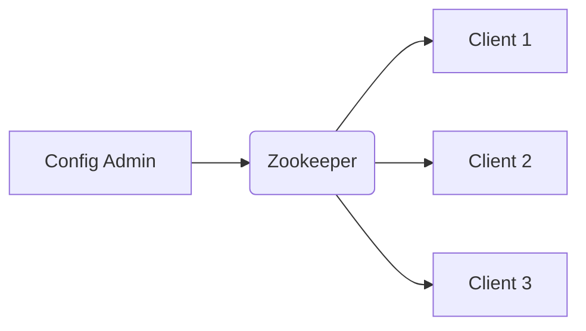

# 使用Zookeeper进行分布式配置管理

作者：禅与计算机程序设计艺术

## 1. 背景介绍

在现代分布式系统中,配置管理是一个非常重要且具有挑战性的问题。随着系统规模的不断扩大,部署的服务器数量越来越多,如何高效地管理这些服务器的配置信息,使得服务能够正常运行,并且在配置发生变更时能够快速地将变更同步到所有服务器,成为了一个亟待解决的难题。

传统的配置管理方式,如使用配置文件、数据库等,存在诸多不足:

1. 配置信息分散在各个服务器上,管理和维护成本高
2. 配置变更需要手动修改每台服务器上的配置文件,效率低下
3. 配置信息无法实时同步,可能导致服务运行不一致
4. 缺乏统一的配置管理平台,难以对配置进行集中管控

为了解决上述问题,业界提出了一种新的配置管理方案——使用 Zookeeper 进行分布式配置管理。本文将深入探讨 Zookeeper 在分布式配置管理中的应用,介绍其核心原理、最佳实践以及实际案例,帮助读者掌握利用 Zookeeper 进行分布式配置管理的方法。

## 2. 核心概念与联系

在讨论如何使用 Zookeeper 进行分布式配置管理之前,我们需要先了解一些核心概念:

### 2.1 Zookeeper 简介

Zookeeper 是一个开源的分布式协调服务,由 Yahoo 公司开发,现已成为 Apache 顶级项目。它可以为分布式系统提供配置管理、命名服务、分布式锁、集群管理等服务。

Zookeeper 的核心是一个精简的文件系统,它支持一些简单的操作,如创建节点、删除节点、读取节点数据等。Zookeeper 使用树形结构来存储数据,它的数据模型类似于一个标准的文件系统,由一系列被称为 znode 的数据节点组成,每个 znode 可以存储数据,也可以挂载子节点。

### 2.2 分布式配置管理

分布式配置管理是指在分布式系统中,如何将配置信息进行集中管理和维护,并将配置的变更高效地同步到所有节点的过程。

传统的配置管理方式是在每台服务器上保存一份配置文件,当配置发生变更时,需要手动修改所有服务器上的配置文件,这种方式难以维护,效率低下。而分布式配置管理则是将配置信息存储在一个集中的配置中心,各个节点通过配置中心来获取和更新配置,从而实现配置管理的自动化和高效化。

### 2.3 Zookeeper 与分布式配置管理

Zookeeper 天然适合用于实现分布式配置管理。我们可以将配置信息存储在 Zookeeper 的 znode 中,当配置发生变更时,只需要修改 Zookeeper 上的配置即可,Zookeeper 会自动将变更同步到所有的客户端。

使用 Zookeeper 进行配置管理具有如下优点:

1. 配置信息集中管理,易于维护
2. 配置变更自动同步到所有节点,实时生效
3. 基于 Zookeeper 的 watch 机制,客户端可以实时感知配置的变化
4. 配置信息支持版本管理,方便追踪和回滚

下图展示了使用 Zookeeper 进行分布式配置管理的基本架构:



## 3. 核心算法原理与具体操作步骤

### 3.1 在 Zookeeper 中存储配置信息

首先,我们需要在 Zookeeper 中创建一个用于存储配置信息的根节点,例如 `/config`。然后,在该节点下创建子节点,用于存储具体的配置项。

例如,我们可以创建以下层级结构来存储配置:

```
/config
  /db
    /url
    /username
    /password
  /cache
    /size
    /enabled
```

其中,`/config/db` 节点存储数据库相关的配置,`/config/cache` 节点存储缓存相关的配置。

我们可以使用 Zookeeper 的 Java 客户端 API 来创建这些节点:

```java
String configPath = "/config";
String dbPath = configPath + "/db";
String cachePath = configPath + "/cache";

// 创建配置根节点
zookeeper.create(configPath, null, ZooDefs.Ids.OPEN_ACL_UNSAFE, CreateMode.PERSISTENT);

// 创建数据库配置节点
zookeeper.create(dbPath, null, ZooDefs.Ids.OPEN_ACL_UNSAFE, CreateMode.PERSISTENT);
zookeeper.create(dbPath + "/url", "jdbc:mysql://localhost:3306/mydb".getBytes(), ZooDefs.Ids.OPEN_ACL_UNSAFE, CreateMode.PERSISTENT);
zookeeper.create(dbPath + "/username", "admin".getBytes(), ZooDefs.Ids.OPEN_ACL_UNSAFE, CreateMode.PERSISTENT);
zookeeper.create(dbPath + "/password", "123456".getBytes(), ZooDefs.Ids.OPEN_ACL_UNSAFE, CreateMode.PERSISTENT);

// 创建缓存配置节点 
zookeeper.create(cachePath, null, ZooDefs.Ids.OPEN_ACL_UNSAFE, CreateMode.PERSISTENT);
zookeeper.create(cachePath + "/size", "1000".getBytes(), ZooDefs.Ids.OPEN_ACL_UNSAFE, CreateMode.PERSISTENT);
zookeeper.create(cachePath + "/enabled", "true".getBytes(), ZooDefs.Ids.OPEN_ACL_UNSAFE, CreateMode.PERSISTENT);
```

### 3.2 客户端读取配置

当服务启动时,需要从 Zookeeper 中读取配置信息。我们可以使用 Zookeeper 的 `getData` 方法来读取指定节点的数据:

```java
byte[] data = zookeeper.getData(path, watcher, stat);
String value = new String(data);
```

其中,`path` 参数指定要读取的节点路径,`watcher` 参数用于注册事件监听器,当节点数据发生变化时可以收到通知,`stat` 参数用于获取节点的元数据信息,如版本号等。

例如,要读取数据库的 URL 配置,可以使用如下代码:

```java
String dbUrlPath = "/config/db/url";
byte[] data = zookeeper.getData(dbUrlPath, null, null);
String dbUrl = new String(data);
```

### 3.3 客户端动态更新配置

当配置信息发生变更时,我们需要将变更同步到所有客户端。在 Zookeeper 中,我们可以利用 watch 机制来实现配置的动态更新。

具体来说,客户端在读取配置时,可以同时注册一个 watch,当配置节点的数据发生变化时,Zookeeper 会发送一个事件通知给客户端,客户端收到通知后,可以重新读取最新的配置信息,从而实现配置的动态更新。

下面是一个简单的示例代码:

```java
private String getConfig(String path) {
    try {
        byte[] data = zookeeper.getData(path, new Watcher() {
            @Override
            public void process(WatchedEvent event) {
                if (event.getType() == EventType.NodeDataChanged) {
                    // 配置发生变更,重新读取最新的配置
                    String newConfig = getConfig(path);
                    System.out.println("Config changed: " + newConfig);
                    // 应用新的配置
                    applyConfig(newConfig);
                }
            }
        }, null);
        
        return new String(data);
    } catch (Exception e) {
        // 处理异常
        e.printStackTrace();
        return null;
    }
}
```

在上面的代码中,我们在读取配置时注册了一个 watch,当配置节点的数据发生变化时,会触发 `process` 方法,在该方法中,我们重新读取最新的配置,并将其应用到系统中。

## 4. 数学模型和公式详细讲解举例说明

Zookeeper 作为一个分布式协调服务,其背后有许多数学模型和算法支撑。下面我们重点介绍几个核心的数学模型和算法。

### 4.1 Paxos 算法

Paxos 是一种基于消息传递的一致性算法,由 Leslie Lamport 在 1990 年提出,是 Zookeeper 中 ZAB 协议的理论基础。

Paxos 算法定义了三种角色:Proposer、Acceptor 和 Learner。Proposer 负责提出提案,Acceptor 负责对提案进行投票,Learner 负责学习最终达成一致的提案。

在 Paxos 算法中,每个提案都有一个编号 $n$,编号越大,提案的优先级越高。当 Proposer 提出一个提案时,会向所有的 Acceptor 发送 Prepare 请求,Acceptor 收到请求后,如果提案的编号 $n$ 大于它已经接受的提案编号,就会承诺不再接受编号小于 $n$ 的提案,并且返回它已经接受的提案中编号最大的那个提案。

Proposer 收到 Acceptor 的响应后,如果发现有 Acceptor 已经接受了编号大于 $n$ 的提案,就会中止该提案。否则,Proposer 会向 Acceptor 发送 Accept 请求,请求 Acceptor 接受该提案。Acceptor 收到 Accept 请求后,如果该提案的编号 $n$ 不小于它承诺的提案编号,就会接受该提案。

当有超过半数的 Acceptor 接受了同一个提案时,该提案就达成了一致,成为最终的结果。Learner 通过与 Acceptor 通信,学习到最终达成一致的提案。

Paxos 算法可以保证在网络分区等异常情况下,系统仍然能够达成一致,从而保证了数据的一致性。

### 4.2 ZAB 协议

ZAB(Zookeeper Atomic Broadcast)协议是 Zookeeper 内部用于实现分布式一致性的核心协议,它基于 Paxos 算法,但做了一些简化和优化。

在 ZAB 协议中,Zookeeper 集群中的所有节点都有一个全局唯一的 ID,称为 ZXID(Zookeeper Transaction ID)。ZXID 是一个 64 位的整数,高 32 位是 epoch,用于标识 Leader 的版本,低 32 位是一个单调递增的计数器,用于对事务进行编号。

ZAB 协议定义了三种节点角色:Leader、Follower 和 Observer。其中,Leader 负责协调事务的提交,Follower 和 Observer 负责与 Leader 保持同步。

当 Leader 收到一个写请求时,会将其转化为一个事务,并为其分配一个全局唯一的 ZXID。然后,Leader 会将该事务以 Proposal 的形式广播给所有的 Follower。Follower 收到 Proposal 后,会将其写入磁盘,并向 Leader 发送 ACK 消息。当 Leader 收到超过半数 Follower 的 ACK 消息后,就会向所有 Follower 发送 Commit 消息,通知它们可以将该事务应用到内存中。

在 ZAB 协议中,如果 Leader 出现故障,剩余的 Follower 会进行 Leader 选举,选出一个新的 Leader。为了保证事务的顺序性和一致性,新的 Leader 必须具有所有已经提交的事务。因此,在选举过程中,每个 Follower 会向其他 Follower 发送自己的最大 ZXID,最终选举出拥有最大 ZXID 的 Follower 作为新的 Leader。

### 4.3 CAP 理论

CAP 理论是分布式系统领域的一个重要理论,它指出,一个分布式系统不可能同时满足以下三个属性:

- 一致性(Consistency):所有节点在同一时间具有相同的数据
- 可用性(Availability):每个请求都能收到一个响应,不管是成功还是失败
- 分区容错性(Partition tolerance):系统能够继续运行,即使在网络分区的情况下

CAP 理论认为,在分布式系统中,这三个属性不可能同时满足,我们只能在其中三者中选择两个。

Zookeeper 保证了分区容错性和一致性,但牺牲了一定的可用性。具体来说,当网络发生分区时,为了保证数据的一致性,Zookeeper 可能会拒绝某些请求,因此可用性会受到一定影响。但总的来说,Zookeeper 通过 ZAB 协议实现了较高的一致性和分