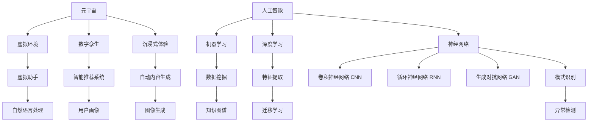

# 元宇宙的神经网络：AI的学习

作者：禅与计算机程序设计艺术

## 1. 背景介绍
### 1.1 元宇宙的概念与发展
#### 1.1.1 元宇宙的定义
#### 1.1.2 元宇宙的起源与发展历程
#### 1.1.3 元宇宙的特点与价值

### 1.2 人工智能在元宇宙中的应用
#### 1.2.1 人工智能与元宇宙的关系
#### 1.2.2 人工智能在元宇宙中的应用场景
#### 1.2.3 人工智能赋能元宇宙的潜力

## 2. 核心概念与联系
### 2.1 神经网络
#### 2.1.1 神经网络的定义与原理
#### 2.1.2 神经网络的类型与结构
#### 2.1.3 神经网络在人工智能中的应用

### 2.2 深度学习
#### 2.2.1 深度学习的概念与特点 
#### 2.2.2 深度学习的发展历程
#### 2.2.3 深度学习在人工智能中的应用

### 2.3 强化学习
#### 2.3.1 强化学习的定义与原理
#### 2.3.2 强化学习的算法与模型
#### 2.3.3 强化学习在元宇宙中的应用

## 3. 核心算法原理具体操作步骤
### 3.1 卷积神经网络（CNN）
#### 3.1.1 CNN的原理与结构
#### 3.1.2 CNN的前向传播与反向传播
#### 3.1.3 CNN在图像识别中的应用

### 3.2 循环神经网络（RNN）
#### 3.2.1 RNN的原理与结构
#### 3.2.2 RNN的前向传播与反向传播
#### 3.2.3 RNN在自然语言处理中的应用

### 3.3 生成对抗网络（GAN）
#### 3.3.1 GAN的原理与结构
#### 3.3.2 GAN的训练过程与损失函数
#### 3.3.3 GAN在图像生成中的应用

## 4. 数学模型和公式详细讲解举例说明
### 4.1 感知机模型
#### 4.1.1 感知机模型的数学表示
#### 4.1.2 感知机模型的激活函数
#### 4.1.3 感知机模型的训练过程

### 4.2 反向传播算法
#### 4.2.1 反向传播算法的数学推导
#### 4.2.2 反向传播算法的梯度计算
#### 4.2.3 反向传播算法的优化方法

### 4.3 损失函数
#### 4.3.1 均方误差损失函数
#### 4.3.2 交叉熵损失函数
#### 4.3.3 对比散度损失函数

## 5. 项目实践：代码实例和详细解释说明
### 5.1 使用TensorFlow实现卷积神经网络
#### 5.1.1 数据集的准备与预处理
#### 5.1.2 构建CNN模型
#### 5.1.3 模型训练与评估

### 5.2 使用PyTorch实现循环神经网络
#### 5.2.1 数据集的准备与预处理
#### 5.2.2 构建RNN模型
#### 5.2.3 模型训练与评估

### 5.3 使用Keras实现生成对抗网络
#### 5.3.1 数据集的准备与预处理
#### 5.3.2 构建GAN模型
#### 5.3.3 模型训练与生成图像

## 6. 实际应用场景
### 6.1 元宇宙中的虚拟助手
#### 6.1.1 虚拟助手的功能与特点
#### 6.1.2 虚拟助手的实现技术
#### 6.1.3 虚拟助手在元宇宙中的应用案例

### 6.2 元宇宙中的智能推荐系统
#### 6.2.1 智能推荐系统的原理与架构
#### 6.2.2 智能推荐系统的算法与模型
#### 6.2.3 智能推荐系统在元宇宙中的应用案例

### 6.3 元宇宙中的自动内容生成
#### 6.3.1 自动内容生成的概念与价值
#### 6.3.2 自动内容生成的技术与方法
#### 6.3.3 自动内容生成在元宇宙中的应用案例

## 7. 工具和资源推荐
### 7.1 深度学习框架
#### 7.1.1 TensorFlow
#### 7.1.2 PyTorch
#### 7.1.3 Keras

### 7.2 数据集资源
#### 7.2.1 ImageNet
#### 7.2.2 COCO
#### 7.2.3 WikiText

### 7.3 学习资源
#### 7.3.1 在线课程
#### 7.3.2 书籍推荐
#### 7.3.3 社区与论坛

## 8. 总结：未来发展趋势与挑战
### 8.1 元宇宙与人工智能的融合趋势
#### 8.1.1 元宇宙为人工智能提供新的应用场景
#### 8.1.2 人工智能赋能元宇宙的发展
#### 8.1.3 元宇宙与人工智能的协同创新

### 8.2 元宇宙中人工智能面临的挑战
#### 8.2.1 数据隐私与安全问题
#### 8.2.2 算法偏见与公平性问题
#### 8.2.3 人工智能的可解释性与可信任性

### 8.3 未来展望
#### 8.3.1 元宇宙与人工智能的未来发展方向
#### 8.3.2 人工智能在元宇宙中的潜在应用领域
#### 8.3.3 元宇宙与人工智能的协同发展前景

## 9. 附录：常见问题与解答
### 9.1 什么是元宇宙？
### 9.2 人工智能与元宇宙有什么关系？
### 9.3 神经网络在元宇宙中有哪些应用？
### 9.4 如何学习人工智能与元宇宙相关知识？
### 9.5 元宇宙与人工智能的发展前景如何？

元宇宙作为一个虚拟与现实相融合的数字世界，为人工智能的发展提供了广阔的应用场景和创新空间。神经网络作为人工智能的核心技术之一，在元宇宙中发挥着重要的作用，实现了虚拟助手、智能推荐、自动内容生成等功能，极大地丰富了元宇宙的内容和体验。

神经网络的原理源于对人脑神经元连接和信息传递过程的模拟，通过构建多层次的网络结构，实现了对复杂模式的学习和识别。卷积神经网络（CNN）、循环神经网络（RNN）和生成对抗网络（GAN）是三种常见的神经网络模型，分别在图像识别、自然语言处理和图像生成等领域取得了显著成果。

在数学模型和公式方面，感知机模型、反向传播算法和损失函数是神经网络的重要组成部分。感知机模型描述了神经元的数学表示和激活函数，反向传播算法实现了网络参数的优化和学习，损失函数则衡量了模型预测结果与真实标签之间的差异。

为了更好地理解和应用神经网络，本文提供了使用TensorFlow、PyTorch和Keras等深度学习框架实现CNN、RNN和GAN的代码实例和详细解释。同时，也介绍了元宇宙中虚拟助手、智能推荐系统和自动内容生成等实际应用场景，展示了神经网络在元宇宙中的广泛应用前景。

展望未来，元宇宙与人工智能的融合发展将成为必然趋势。元宇宙为人工智能提供了更加丰富和真实的数据环境，而人工智能则为元宇宙注入了智能化的内容和交互方式。然而，在这一过程中也面临着数据隐私、算法偏见、可解释性等挑战，需要学术界和产业界的共同努力和探索。

总之，元宇宙的神经网络为人工智能的学习和应用开辟了新的空间，推动了虚拟世界与现实世界的融合发展。通过深入理解神经网络的原理和算法，借助强大的深度学习框架和丰富的数据资源，我们有望在元宇宙中实现更加智能化、个性化和沉浸式的体验，开启人工智能发展的新篇章。

附录中的常见问题与解答部分，进一步阐明了元宇宙与人工智能的关系，以及如何学习和探索这一领域的知识。面对元宇宙与人工智能的无限可能，我们需要保持开放和创新的态度，不断学习和实践，共同推动技术的进步和应用，为人类社会的发展贡献力量。

以上是元宇宙与人工智能的核心概念和架构图，展示了两者之间的紧密联系和相互赋能。元宇宙为人工智能提供了丰富的应用场景，如虚拟助手、智能推荐和自动内容生成等，而人工智能则为元宇宙注入了智能化的内容和交互方式，提升了用户的沉浸式体验。

神经网络作为人工智能的核心技术之一，在元宇宙中发挥着重要作用。卷积神经网络（CNN）擅长处理图像和视频数据，可用于虚拟场景的识别和理解；循环神经网络（RNN）适用于处理序列数据，如自然语言和时间序列，可用于虚拟助手的对话和推荐；生成对抗网络（GAN）则可以生成逼真的图像和视频，用于自动内容生成和虚拟角色创建。

在元宇宙中，机器学习和深度学习算法也得到了广泛应用。数据挖掘技术可以发现虚拟世界中的模式和规律，特征提取方法可以提取数据的关键特征，模式识别算法可以识别用户的行为和偏好。知识图谱可以构建虚拟世界的语义网络，迁移学习可以跨域适应不同的虚拟环境，异常检测可以发现虚拟世界中的异常行为和安全威胁。

总之，元宇宙与人工智能的融合发展，为虚拟世界和现实世界的智能化和个性化体验提供了无限可能。通过深入理解和应用神经网络等人工智能技术，我们有望在元宇宙中实现更加智能、沉浸和交互的体验，推动数字经济和社会的发展。