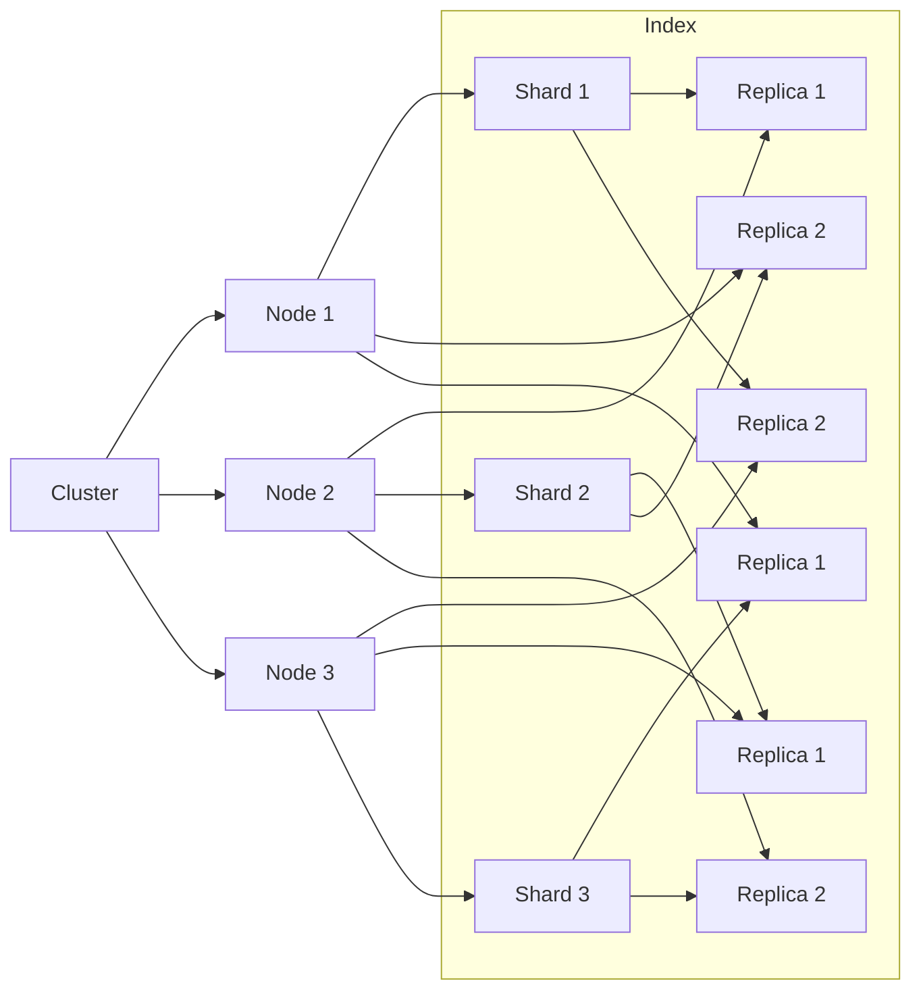

# 分布式搜索 原理与代码实例讲解

作者：禅与计算机程序设计艺术

## 1. 背景介绍

### 1.1 大数据时代的搜索需求

在当今大数据时代,数据量呈爆炸式增长,传统的集中式搜索架构已经无法满足海量数据的实时搜索需求。分布式搜索技术应运而生,通过将搜索任务分散到多个节点并行处理,可以大大提高搜索效率和吞吐量。

### 1.2 分布式搜索的优势

与集中式搜索相比,分布式搜索具有以下优势:

- 可扩展性:通过增加节点数量,可以线性扩展搜索能力。
- 高可用性:节点故障不会影响整个系统的可用性。
- 低延迟:并行处理可以显著降低搜索延迟。
- 负载均衡:搜索请求可以均匀分配到各个节点。

### 1.3 分布式搜索的应用场景

分布式搜索广泛应用于各种领域,例如:

- 搜索引擎:如Google、百度等
- 电商平台:商品搜索、推荐系统
- 社交网络:用户、内容搜索
- 日志分析:海量日志数据的实时检索和分析

## 2. 核心概念与关系

### 2.1 分布式搜索的核心概念

- 节点(Node):搜索集群中的单个服务器。
- 分片(Shard):将索引数据划分为若干部分,每部分称为一个分片。
- 副本(Replica):分片的备份,用于提高可用性和搜索性能。
- 集群(Cluster):由多个节点组成的分布式搜索系统。
- 索引(Index):搜索引擎对数据建立的倒排索引结构。

### 2.2 核心概念之间的关系

下图展示了分布式搜索的核心概念之间的关系:



- 索引被划分为多个分片,每个分片有多个副本。
- 分片和副本被分配到不同的节点,实现数据分布和冗余。
- 搜索请求会被路由到持有相关分片的节点并行处理。

## 3. 核心算法原理与操作步骤

### 3.1 倒排索引构建

倒排索引是实现快速全文搜索的核心数据结构。构建步骤如下:

1. 文本预处理:对原始文本进行分词、去停用词、词干化等操作。
2. 词项统计:统计每个词项在文档中的出现频率和位置信息。
3. 构建倒排表:以词项为key,对应的文档ID和位置信息为value,生成倒排表。
4. 索引优化:对倒排表进行压缩、打分等优化操作,提高搜索效率。

### 3.2 查询处理流程

分布式搜索的查询处理流程如下:

1. 查询解析:对用户输入的查询语句进行语法分析和语义解析。
2. 查询路由:根据查询词项所在的分片,将查询请求路由到相关节点。
3. 本地搜索:每个节点在本地倒排索引中执行查询,获取匹配的文档。
4. 结果合并:将各节点的搜索结果进行合并、排序和打分。
5. 结果返回:将最终的搜索结果返回给用户。

### 3.3 相关性排序算法

搜索结果的相关性排序是搜索引擎的核心功能之一。常见的排序算法包括:

- TF-IDF:基于词频-逆文档频率的经典排序算法。
- BM25:考虑了文档长度因素的改进版TF-IDF算法。
- 语言模型:基于概率统计的排序算法,如Query Likelihood Model。
- 机器学习排序:利用机器学习模型(如LambdaMART)对多种特征进行组合打分。

## 4. 数学模型与公式详解

### 4.1 TF-IDF 模型

TF-IDF(Term Frequency-Inverse Document Frequency)是一种用于评估词项在文档中重要性的统计方法。其数学表达式为:

$$
tfidf(t,d,D) = tf(t,d) \times idf(t,D)
$$

其中:
- $tf(t,d)$表示词项$t$在文档$d$中的词频。
- $idf(t,D)$表示词项$t$的逆文档频率,计算公式为:

$$
idf(t,D) = \log \frac{|D|}{|\{d \in D: t \in d\}|}
$$

- $|D|$表示语料库中的文档总数。
- $|\{d \in D: t \in d\}|$表示包含词项$t$的文档数。

TF-IDF的思想是,如果一个词项在一篇文档中出现频率高,且在其他文档中出现频率低,则认为该词项具有很好的类别区分能力,适合用来表示该文档。

### 4.2 BM25 模型

BM25是一种基于概率检索模型的排序函数,考虑了文档长度对相关性的影响。其计算公式为:

$$
score(D,Q) = \sum_{i=1}^n IDF(q_i) \cdot \frac{f(q_i,D) \cdot (k_1+1)}{f(q_i,D) + k_1 \cdot (1-b+b \cdot \frac{|D|}{avgdl})}
$$

其中:
- $IDF(q_i)$表示查询词$q_i$的逆文档频率。
- $f(q_i,D)$表示$q_i$在文档$D$中的词频。
- $|D|$表示文档$D$的长度。
- $avgdl$表示文档集合的平均长度。
- $k_1$和$b$是调节因子,控制词频和文档长度的影响力。

相比TF-IDF,BM25引入了文档长度因子,对长文档进行了一定程度的惩罚,提高了排序的合理性。

## 5. 项目实践:代码实例与详解

下面以Java语言为例,演示如何使用Lucene库实现一个简单的分布式搜索引擎。

### 5.1 索引构建

```java
// 创建索引写入器
IndexWriter writer = new IndexWriter(directory, new IndexWriterConfig(analyzer));

// 遍历文档集合
for (Document doc : documents) {
    // 创建索引文档
    org.apache.lucene.document.Document luceneDoc = new org.apache.lucene.document.Document();
    
    // 添加字段
    luceneDoc.add(new TextField("title", doc.getTitle(), Field.Store.YES));
    luceneDoc.add(new TextField("content", doc.getContent(), Field.Store.YES));
    
    // 写入索引
    writer.addDocument(luceneDoc);
}

// 提交并关闭索引写入器
writer.commit();
writer.close();
```

上述代码展示了如何使用Lucene创建索引。主要步骤包括:

1. 创建IndexWriter,指定索引目录和分析器。
2. 遍历原始文档集合,对每篇文档创建Lucene的Document对象。
3. 向Document对象添加需要索引的字段。
4. 通过IndexWriter将Document写入索引。
5. 提交并关闭IndexWriter。

### 5.2 分布式搜索

```java
// 创建索引搜索器
IndexSearcher searcher = new IndexSearcher(DirectoryReader.open(directory));

// 创建查询解析器
QueryParser parser = new QueryParser("content", analyzer);
Query query = parser.parse(queryString);

// 执行搜索
TopDocs topDocs = searcher.search(query, 10);

// 获取搜索结果
ScoreDoc[] scoreDocs = topDocs.scoreDocs;
for (ScoreDoc scoreDoc : scoreDocs) {
    int docId = scoreDoc.doc;
    Document doc = searcher.doc(docId);
    // 处理搜索结果
    // ...
}
```

上述代码展示了如何使用Lucene进行搜索。主要步骤包括:

1. 创建IndexSearcher,打开索引目录。
2. 创建QueryParser,指定默认搜索字段和分析器。
3. 解析用户输入的查询字符串,生成Query对象。
4. 调用IndexSearcher的search方法执行搜索,指定查询对象和返回结果数量。
5. 遍历搜索结果,获取文档ID和文档对象,进行后续处理。

在分布式搜索场景下,索引通常被划分为多个分片,分布在不同的节点上。搜索请求会被发送到所有相关节点,每个节点执行本地搜索,然后将结果汇总并返回给客户端。

## 6. 实际应用场景

分布式搜索在许多实际场景中得到广泛应用,例如:

### 6.1 电商商品搜索

- 商品数据量大,需要分布式存储和搜索。
- 搜索要求实时性高,用户体验要求好。
- 需要支持多种检索条件(如价格、品牌、属性等)的组合查询。

### 6.2 日志检索与分析

- 海量日志数据,需要分布式采集和索引。
- 要求快速检索和聚合分析,实现实时监控和告警。
- 常见应用如ELK(Elasticsearch、Logstash、Kibana)技术栈。

### 6.3 站内搜索

- 对网站内容(如文章、帖子、商品等)提供快速搜索。
- 搜索结果需要按相关性排序,提高用户体验。
- 常见于各种门户网站、社区论坛、博客平台等。

## 7. 工具与资源推荐

### 7.1 开源搜索引擎

- Elasticsearch:基于Lucene的分布式搜索和分析引擎,提供RESTful API。
- Apache Solr:高性能、可扩展的开源搜索服务器,也基于Lucene。
- Sphinx:高性能的全文搜索引擎,支持 SQL 和 NoSQL 数据源。

### 7.2 搜索引擎评测工具

- TREC(Text REtrieval Conference):由美国国家标准与技术研究所(NIST)组织的搜索引擎评测会议,提供标准测试集和评估方法。
- NTCIR(NII Testbeds and Community for Information access Research):由日本国立信息学研究所(NII)组织的搜索引擎评测项目。
- CLEF(Conference and Labs of the Evaluation Forum):欧洲的多语言信息检索评测会议。

### 7.3 相关学习资源

- 《这就是搜索引擎:核心技术详解》:全面介绍搜索引擎技术的入门书籍。
- 《信息检索导论》:信息检索领域的经典教材,系统讲解相关理论和算法。
- Coursera课程《文本检索和搜索引擎》:斯坦福大学的在线搜索引擎课程。
- Lucene官方文档:学习Lucene搜索库的权威指南。

## 8. 总结:未来趋势与挑战

### 8.1 个性化和语义化搜索

随着人工智能和自然语言处理技术的发展,未来的搜索引擎将更加注重用户的个性化需求和搜索意图的理解。个性化搜索可以根据用户的兴趣、历史行为等提供更加精准的搜索结果。语义化搜索则能够理解查询的上下文语义,提供更加智能的答案。

### 8.2 知识图谱与智能问答

知识图谱是一种结构化的知识表示方法,通过构建实体及其关系的语义网络,使机器能够更好地理解和推理知识。未来的搜索引擎可以利用知识图谱技术,实现更加智能的问答和推理功能,提供更加自然和人性化的交互方式。

### 8.3 跨模态搜索

随着多媒体数据的爆炸式增长,仅仅