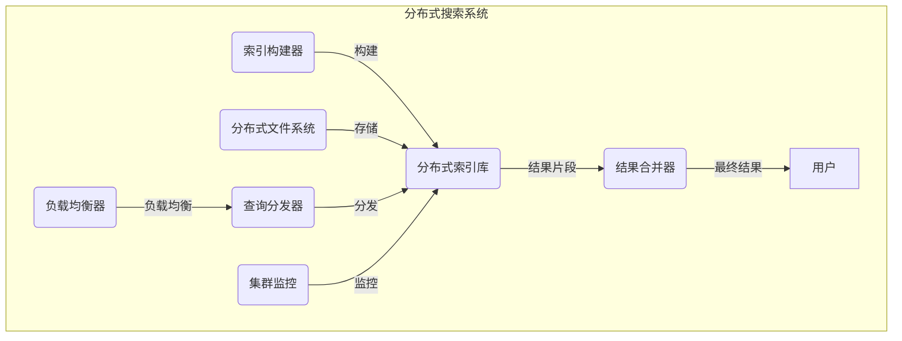

# 分布式搜索 原理与代码实例讲解

## 1. 背景介绍

在当今大数据时代，海量的数据正以前所未有的速度被产生和存储。有效地检索和处理这些数据已经成为一个关键挑战。传统的集中式搜索系统由于单点故障、可扩展性有限等问题,已经无法满足现代应用的需求。因此,分布式搜索系统应运而生,成为解决大规模数据检索问题的有力工具。

分布式搜索系统将数据分散存储在多个节点上,利用多个节点的计算资源并行处理查询请求,从而提高了系统的可扩展性、容错性和查询效率。它已被广泛应用于网络搜索引擎、电子商务平台、日志分析等领域。

### 1.1 集中式搜索系统的局限性

- **单点故障风险**:集中式系统由于只有一个节点,一旦发生故障,整个系统将瘫痪。
- **可扩展性差**:随着数据量的增长,单机的计算和存储资源将很快达到瓶颈。
- **高可用性难以保证**:由于只有一个节点,维护和升级时将导致系统停机。

### 1.2 分布式搜索系统的优势

- **高可扩展性**:可以通过添加更多节点来线性扩展系统的计算和存储能力。
- **高可用性**:由于有多个节点,单个节点故障不会导致整个系统瘫痪。
- **容错性强**:数据和计算被分散在多个节点上,提高了系统的容错能力。
- **高吞吐量**:多个节点并行处理查询请求,大大提高了系统的查询吞吐量。

## 2. 核心概念与联系

### 2.1 分布式系统的基本概念

在深入探讨分布式搜索系统之前,我们需要先了解一些分布式系统的基本概念。

1. **节点(Node)**: 分布式系统由多个节点组成,每个节点都是一台独立的计算机或服务器。

2. **集群(Cluster)**: 一组协同工作的节点集合,共同完成某个分布式任务。

3. **分片(Shard)**: 将海量数据分散存储在多个节点上的过程,每个节点存储一部分数据,称为一个分片。

4. **复制(Replication)**: 为了提高可用性和容错性,将数据复制到多个节点上。

5. **一致性(Consistency)**: 分布式系统中数据在多个节点之间保持一致的状态。

6. **分区容错(Partition Tolerance)**: 即使出现网络分区导致节点之间无法通信,系统也能继续部分工作。

7. **负载均衡(Load Balancing)**: 将工作负载合理分配到各个节点上,避免个别节点过载。

### 2.2 分布式搜索系统的核心组件

一个典型的分布式搜索系统通常包含以下几个核心组件:

1. **索引构建器(Indexer)**: 负责从数据源获取原始数据,并构建反向索引。

2. **分布式文件系统(Distributed File System)**: 用于存储海量数据和索引文件,如HDFS、Ceph等。

3. **分布式索引库(Distributed Index)**: 索引文件分散存储在多个节点上,如Elasticsearch、Solr等。

4. **查询分发器(Query Dispatcher)**: 接收用户查询请求,并将其分发到多个索引节点进行并行处理。

5. **结果合并器(Result Merger)**: 从多个索引节点收集查询结果片段,并合并为最终结果返回给用户。

6. **负载均衡器(Load Balancer)**: 将查询请求合理分发到多个查询分发器,实现负载均衡。

7. **集群监控(Cluster Monitoring)**: 监控整个集群的健康状态,并进行故障转移和自动恢复。

上图展示了一个典型的分布式搜索系统架构,各组件通过紧密协作来实现高效、可靠的大规模数据检索。

## 3. 核心算法原理具体操作步骤

分布式搜索系统的核心算法主要包括以下几个方面:

### 3.1 数据分片与复制策略

为了实现高可扩展性和容错性,分布式搜索系统需要将海量数据分散存储在多个节点上。常用的数据分片策略包括:

1. **哈希分片(Hash Sharding)**: 根据文档ID的哈希值,将文档分配到不同的分片上。

2. **范围分片(Range Sharding)**: 根据某个字段的值范围,将文档划分到不同的分片上。

3. **地理位置分片(Geo Sharding)**: 根据文档的地理位置信息,将其分配到不同的分片上。

为了提高可用性和容错性,每个分片都会被复制到多个节点上,这种策略称为数据复制。常用的复制策略包括:

1. **主从复制(Master-Slave Replication)**: 一个主分片,多个从分片,主分片负责写操作,从分片只读。

2. **对等复制(Peer-to-Peer Replication)**: 所有分片地位对等,任何一个分片都可读写。

### 3.2 分布式索引构建

索引构建是分布式搜索系统的关键环节。常用的分布式索引构建算法包括:

1. **MapReduce索引构建**: 利用MapReduce框架并行处理大规模数据,构建分布式索引。

2. **流式索引构建**: 采用流式处理方式,实时地将新增数据索引到分布式索引库中。

3. **增量索引构建**: 只对变更的数据部分进行索引更新,避免全量重建索引的开销。

### 3.3 查询处理算法

分布式搜索系统需要高效地处理用户查询,常用的查询处理算法包括:

1. **查询路由**: 根据查询条件,将查询请求路由到相关的分片节点上进行处理。

2. **并行查询**: 在多个分片节点上并行执行查询,提高查询效率。

3. **分布式连接**: 对于需要关联多个数据源的查询,采用分布式连接算法进行高效处理。

4. **分布式排序**: 对于需要对查询结果进行排序的场景,采用分布式排序算法。

5. **分布式聚合**: 对于需要对查询结果进行聚合统计的场景,采用分布式聚合算法。

### 3.4 负载均衡与故障转移

为了提高系统的可用性和响应能力,分布式搜索系统需要实现高效的负载均衡和故障转移机制:

1. **负载均衡算法**: 常用的负载均衡算法包括轮询、加权轮询、最小连接数等。

2. **主备切换**: 当主节点发生故障时,自动将备节点升级为主节点,实现无缝故障转移。

3. **自动扩缩容**: 根据系统负载情况,自动添加或移除节点,实现动态扩缩容。

4. **自动数据重平衡**: 当节点加入或移除时,自动对数据进行重新分片和复制,实现数据重平衡。

## 4. 数学模型和公式详细讲解举例说明

在分布式搜索系统中,常常需要使用一些数学模型和公式来量化和优化系统性能。下面我们介绍几个常用的模型和公式。

### 4.1 倒排索引模型

倒排索引是搜索引擎的核心数据结构,它将文档中的每个词项映射到包含该词项的文档列表。

假设我们有一个文档集合 $D = \{d_1, d_2, \ldots, d_n\}$,词汇表 $V = \{t_1, t_2, \ldots, t_m\}$,那么倒排索引可以表示为:

$$
I(t_i) = \{(d_j, \text{pos}_{ij1}, \text{pos}_{ij2}, \ldots) \mid t_i \in d_j\}
$$

其中 $I(t_i)$ 表示词项 $t_i$ 的倒排索引列表, $(d_j, \text{pos}_{ij1}, \text{pos}_{ij2}, \ldots)$ 表示词项 $t_i$ 在文档 $d_j$ 中出现的位置列表。

通过倒排索引,我们可以快速找到包含特定词项的所有文档,从而实现高效的全文检索。

### 4.2 文档评分模型

在搜索系统中,我们需要对查询结果进行排序,以便将最相关的文档排在前面。常用的文档评分模型包括:

1. **布尔模型**: 根据文档是否包含所有查询词项给出二值评分。

2. **向量空间模型**: 将文档和查询表示为向量,计算它们之间的相似度作为评分。

    $$
    \text{score}(q, d) = \vec{q} \cdot \vec{d} = \sum_{i=1}^{n} q_i \times d_i
    $$

    其中 $\vec{q}$ 和 $\vec{d}$ 分别表示查询和文档的向量表示。

3. **概率模型**: 根据文档满足查询的概率大小给出评分,例如 BM25 模型:

    $$
    \text{score}(q, d) = \sum_{i=1}^{n} \text{IDF}(q_i) \times \frac{f(q_i, d) \times (k_1 + 1)}{f(q_i, d) + k_1 \times (1 - b + b \times \frac{|d|}{avgdl})}
    $$

    其中 $\text{IDF}(q_i)$ 表示词项 $q_i$ 的逆文档频率, $f(q_i, d)$ 表示 $q_i$ 在文档 $d$ 中的词频, $|d|$ 表示文档 $d$ 的长度, $avgdl$ 表示文档集合的平均长度, $k_1$ 和 $b$ 是调节参数。

4. **学习排序模型**: 利用机器学习算法从大量数据中学习文档评分函数,如 LambdaMART、RankNet 等。

### 4.3 分布式系统一致性模型

在分布式系统中,由于网络延迟和分区等原因,很难实现完全的数据一致性。因此,我们需要权衡一致性和可用性,选择合适的一致性模型。常见的一致性模型包括:

1. **强一致性(Linearizability)**: 所有操作在所有节点上看起来是原子和序列化的,读操作总是返回最新写入的值。这是最严格的一致性模型,但代价是牺牲可用性。

2. **顺序一致性(Sequential Consistency)**: 所有操作在所有节点上看起来是按某种全局顺序执行的,但不要求这个顺序与实际操作顺序一致。

3. **因果一致性(Causal Consistency)**: 如果两个操作之间存在因果关系,那么所有节点都会以相同的顺序观察到这两个操作。

4. **最终一致性(Eventual Consistency)**: 在没有新的更新操作时,所有节点最终会converge到相同的值。这是一种弱一致性模型,但可以提供更高的可用性和分区容错性。

在分布