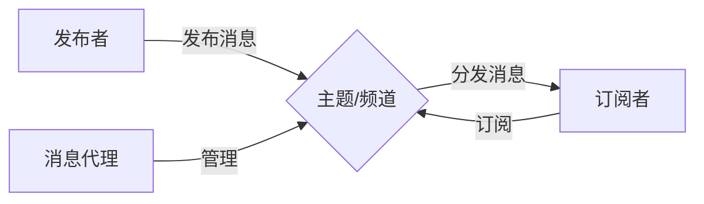

# 发布订阅 原理与代码实例讲解

作者：禅与计算机程序设计艺术

## 1. 背景介绍

在现代软件系统中，组件之间的解耦和异步通信变得越来越重要。发布订阅模式（Publish-Subscribe Pattern）作为一种消息传递范式，能够很好地满足这些需求。本文将深入探讨发布订阅模式的原理，并通过代码实例和数学模型来详细阐述其工作机制。

### 1.1 发布订阅模式的起源与发展
#### 1.1.1 早期的消息传递模型
#### 1.1.2 发布订阅模式的诞生
#### 1.1.3 发布订阅模式的演进

### 1.2 发布订阅模式的优势
#### 1.2.1 解耦
#### 1.2.2 可扩展性
#### 1.2.3 异步通信

### 1.3 发布订阅模式的应用场景
#### 1.3.1 事件驱动系统
#### 1.3.2 分布式系统
#### 1.3.3 实时数据处理

## 2. 核心概念与联系

要理解发布订阅模式，我们需要了解其中的几个核心概念：

### 2.1 发布者（Publisher）
#### 2.1.1 发布者的角色
#### 2.1.2 发布者的职责

### 2.2 订阅者（Subscriber）
#### 2.2.1 订阅者的角色 
#### 2.2.2 订阅者的职责

### 2.3 主题（Topic）或频道（Channel）
#### 2.3.1 主题/频道的概念
#### 2.3.2 主题/频道的分类

### 2.4 消息（Message）
#### 2.4.1 消息的定义
#### 2.4.2 消息的结构

### 2.5 消息代理（Message Broker）
#### 2.5.1 消息代理的作用
#### 2.5.2 常见的消息代理

这些概念之间的关系可以用下面的 Mermaid 流程图来表示：



## 3. 核心算法原理具体操作步骤

发布订阅模式的核心算法可以分为以下几个步骤：

### 3.1 订阅
#### 3.1.1 订阅者向消息代理注册
#### 3.1.2 消息代理记录订阅关系

### 3.2 发布 
#### 3.2.1 发布者向消息代理发送消息
#### 3.2.2 消息代理将消息路由到相应的主题/频道

### 3.3 匹配
#### 3.3.1 消息代理根据订阅关系匹配订阅者
#### 3.3.2 过滤和优化匹配算法

### 3.4 分发
#### 3.4.1 消息代理将消息发送给匹配的订阅者
#### 3.4.2 处理消息传递的可靠性和顺序性

## 4. 数学模型和公式详细讲解举例说明

为了更好地理解发布订阅模式，我们可以使用集合论和图论来建立数学模型。

### 4.1 集合论模型
#### 4.1.1 发布者集合和订阅者集合
假设有 $m$ 个发布者和 $n$ 个订阅者，分别表示为集合 $P=\{p_1,p_2,...,p_m\}$ 和 $S=\{s_1,s_2,...,s_n\}$。

#### 4.1.2 主题/频道集合
假设有 $k$ 个主题/频道，表示为集合 $T=\{t_1,t_2,...,t_k\}$。

#### 4.1.3 订阅关系
订阅关系可以表示为一个二元组集合 $R=\{(s,t)|s\in S,t\in T\}$，其中 $(s,t)$ 表示订阅者 $s$ 订阅了主题/频道 $t$。

### 4.2 图论模型
#### 4.2.1 构建发布订阅图
我们可以将发布订阅系统建模为一个二部图 $G=(V,E)$，其中 $V=P\cup S$，$E=\{(p,t),(t,s)|p\in P,t\in T,s\in S\}$。

#### 4.2.2 匹配算法
匹配订阅者的过程可以看作是在二部图中寻找与给定主题/频道相连的订阅者节点。常见的匹配算法包括广度优先搜索（BFS）和深度优先搜索（DFS）。

### 4.3 示例说明
假设有发布者集合 $P=\{p_1,p_2\}$，订阅者集合 $S=\{s_1,s_2,s_3\}$，主题/频道集合 $T=\{t_1,t_2\}$。订阅关系 $R=\{(s_1,t_1),(s_2,t_1),(s_2,t_2),(s_3,t_2)\}$。

当发布者 $p_1$ 向主题/频道 $t_1$ 发布消息时，消息代理将消息路由到 $t_1$，并根据订阅关系匹配订阅者 $s_1$ 和 $s_2$，最后将消息分发给他们。

## 5. 项目实践：代码实例和详细解释说明

下面我们通过一个简单的 Python 代码实例来演示发布订阅模式的实现。

### 5.1 发布者类

```python
class Publisher:
    def __init__(self, broker):
        self.broker = broker

    def publish(self, topic, message):
        self.broker.route(topic, message)
```

发布者类包含一个 `publish` 方法，用于向指定的主题/频道发布消息。

### 5.2 订阅者类

```python
class Subscriber:
    def __init__(self, name):
        self.name = name

    def update(self, message):
        print(f'{self.name} received message: {message}')
```

订阅者类包含一个 `update` 方法，用于接收和处理消息。

### 5.3 消息代理类

```python
class Broker:
    def __init__(self):
        self.subscriptions = {}

    def subscribe(self, topic, subscriber):
        if topic not in self.subscriptions:
            self.subscriptions[topic] = []
        self.subscriptions[topic].append(subscriber)

    def route(self, topic, message):
        if topic in self.subscriptions:
            for subscriber in self.subscriptions[topic]:
                subscriber.update(message)
```

消息代理类维护了一个订阅关系的字典 `subscriptions`，其中键为主题/频道，值为订阅者列表。`subscribe` 方法用于添加订阅关系，`route` 方法用于将消息路由到相应的主题/频道，并分发给订阅者。

### 5.4 示例代码

```python
broker = Broker()

publisher1 = Publisher(broker)
publisher2 = Publisher(broker)

subscriber1 = Subscriber('Subscriber 1')
subscriber2 = Subscriber('Subscriber 2')
subscriber3 = Subscriber('Subscriber 3')

broker.subscribe('topic1', subscriber1)
broker.subscribe('topic1', subscriber2)
broker.subscribe('topic2', subscriber2)
broker.subscribe('topic2', subscriber3)

publisher1.publish('topic1', 'Message 1')
publisher2.publish('topic2', 'Message 2')
```

输出结果：

```
Subscriber 1 received message: Message 1
Subscriber 2 received message: Message 1
Subscriber 2 received message: Message 2
Subscriber 3 received message: Message 2
```

## 6. 实际应用场景

发布订阅模式在实际应用中有广泛的应用场景，下面列举几个典型的例子：

### 6.1 消息队列系统
#### 6.1.1 Apache Kafka
#### 6.1.2 RabbitMQ
#### 6.1.3 Amazon Simple Queue Service (SQS)

### 6.2 实时数据处理和流处理
#### 6.2.1 Apache Flink
#### 6.2.2 Apache Spark Streaming
#### 6.2.3 Apache Storm

### 6.3 分布式系统和微服务架构
#### 6.3.1 事件驱动架构（EDA）
#### 6.3.2 服务间通信
#### 6.3.3 数据同步和复制

## 7. 工具和资源推荐

以下是一些实现发布订阅模式的常用工具和资源：

### 7.1 消息队列和流处理平台
- Apache Kafka
- RabbitMQ
- Apache Pulsar
- Apache Flink
- Apache Spark Streaming

### 7.2 发布订阅库和框架
- ZeroMQ
- Apache ActiveMQ
- NATS
- Redis Pub/Sub
- Google Cloud Pub/Sub

### 7.3 学习资源
- 《Kafka权威指南》
- 《RabbitMQ实战指南》
- 《流处理系统：概念、架构与实现》
- Coursera 课程："Distributed Programming in Java"
- Udemy 课程："Apache Kafka Series - Learn Apache Kafka for Beginners"

## 8. 总结：未来发展趋势与挑战

发布订阅模式已经成为现代软件系统中不可或缺的一部分，它为构建解耦、可扩展、高性能的分布式系统提供了有力的支持。未来，随着数据量的不断增长和实时处理需求的提高，发布订阅模式将面临新的机遇和挑战。

### 8.1 未来发展趋势
#### 8.1.1 与云原生架构的深度融合
#### 8.1.2 支持更多的消息传递语义
#### 8.1.3 与人工智能和机器学习的结合

### 8.2 面临的挑战
#### 8.2.1 性能和可扩展性
#### 8.2.2 消息顺序和一致性
#### 8.2.3 安全性和隐私保护

## 9. 附录：常见问题与解答

### 9.1 发布订阅模式与观察者模式有什么区别？
发布订阅模式和观察者模式都是用于实现对象间的一对多依赖关系，但发布订阅模式通常引入了一个中间层（消息代理）来实现解耦，而观察者模式是直接将观察者注册到目标对象。

### 9.2 发布订阅模式如何保证消息的可靠传递？
可靠的消息传递通常通过以下方式实现：
- 持久化消息：将消息存储在磁盘或数据库中，以防止消息丢失。
- 消息确认：发布者等待订阅者的确认信号，以确保消息已被成功处理。
- 重试机制：如果消息传递失败，可以设置重试策略，如指数退避算法。

### 9.3 发布订阅模式中的消息顺序如何保证？
保证消息顺序的常见方法包括：
- 使用时间戳或序列号对消息进行排序。
- 为每个订阅者维护一个单独的消息队列，保证每个订阅者内部的消息顺序。
- 使用全局的消息顺序，如使用一个中心化的消息代理来维护全局顺序。

通过深入理解发布订阅模式的原理、应用场景和实现方法，我们能够更好地设计和构建高效、可靠、灵活的分布式系统。随着技术的不断发展，发布订阅模式也将迎来新的机遇和挑战，成为现代软件架构中不可或缺的一部分。