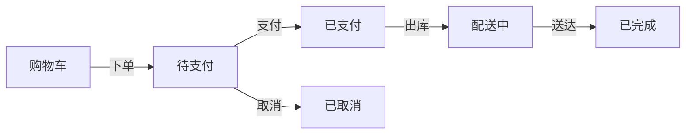
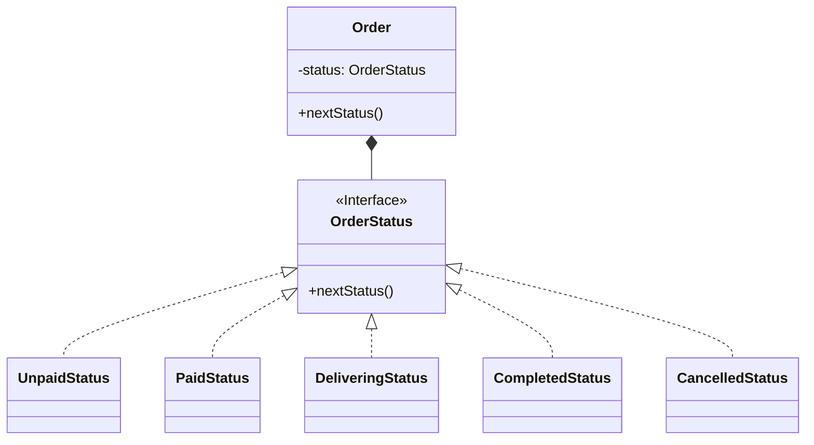
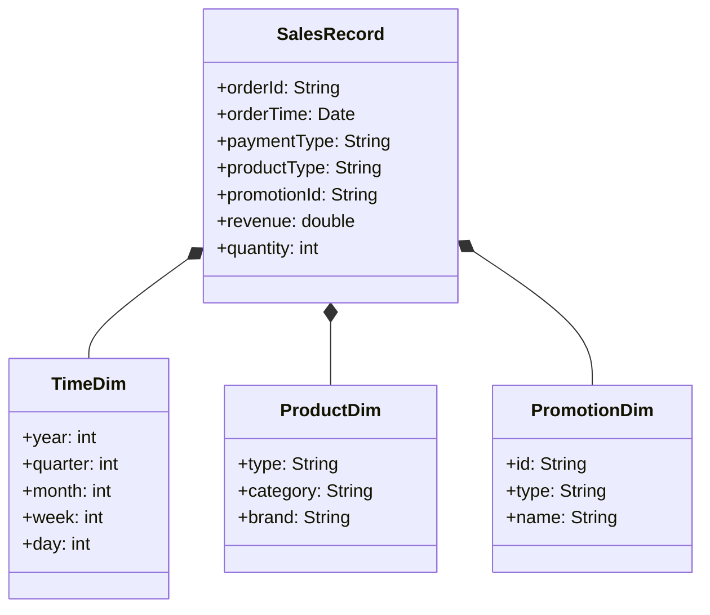

# 商场销售管理系统详细设计与具体代码实现

## 1. 背景介绍

### 1.1 销售管理系统的重要性

在当今快节奏的商业环境中,销售管理系统已经成为各大商场和零售企业的核心运营系统。一个高效、可靠的销售管理系统可以帮助企业实现以下目标:

- 提高运营效率,优化业务流程
- 改善客户体验,提升顾客满意度
- 实时监控销售数据,支持决策制定
- 精确控制库存,减少资源浪费
- 整合各个业务环节,实现数据共享

因此,构建一个功能完备、性能卓越的销售管理系统,对于企业的长期发展至关重要。

### 1.2 系统开发挑战

开发一套满足现代商场需求的销售管理系统并非易事,需要解决诸多技术挑战:

- 高并发处理能力,应对大规模用户请求
- 数据安全与隐私保护
- 系统可扩展性与可维护性
- 跨平台兼容性
- 友好的用户界面与操作体验

只有通过合理的系统架构设计、高效的算法实现和先进的开发技术,才能构建出一款真正实用的商场销售管理系统。

## 2. 核心概念与联系

### 2.1 系统架构概览

基于微服务架构,我们将系统划分为以下核心模块:

- 用户模块: 管理员、销售人员、顾客账号
- 商品模块: 商品信息、库存、定价管理
- 订单模块: 购物车、订单生成、支付处理
- 营销模块: 促销活动、优惠券、积分管理
- 报表模块: 销售数据统计、分析报表生成

各模块通过RESTful API进行交互,实现了高内聚低耦合的设计。

### 2.2 关键技术

- 后端: Spring Boot、MyBatis、Redis、RabbitMQ
- 前端: Vue.js、Element UI
- 数据库: MySQL
- 缓存: Redis
- 消息队列: RabbitMQ
- 搜索引擎: Elasticsearch
- 分布式文件系统: FastDFS

### 2.3 核心流程

1. 用户登录,根据角色加载不同功能模块
2. 浏览商品,加入购物车
3. 创建订单,选择支付方式
4. 支付成功,更新库存,发放优惠券/积分
5. 订单状态更新,生成销售报表
6. 管理员根据报表制定营销策略

## 3. 核心算法原理具体操作步骤

### 3.1 商品搜索

#### 3.1.1 搜索引擎原理

我们使用Elasticsearch作为商品搜索引擎,它基于Lucene,提供分布式、高性能的搜索能力。

Elasticsearch使用倒排索引数据结构,可以非常快速地响应大规模数据的查询。倒排索引的构建过程包括:

1. 文档收集
2. 分词
3. 构建倒排索引

倒排索引的关键概念包括:

- 文档(Document)
- 词条(Term)
- 倒排索引列表(Posting List)

```latex
倒排索引 = f(文档) = \{<词条_1, 文档集合_1>, <词条_2, 文档集合_2>, ...\}
```

#### 3.1.2 搜索流程

1. 用户输入搜索关键词
2. 对关键词进行分词
3. 根据分词结果,查找对应的倒排索引列表
4. 根据相关性算分规则,为每个候选文档计算相关性评分
5. 根据评分,返回最匹配的文档结果

#### 3.1.3 相关性算分

Elasticsearch使用基于TF-IDF的BM25算法计算相关性评分:

```latex
\mathrm{score}(D,Q) = \sum_{q\in Q} \mathrm{IDF}(q)\cdot \frac{f(q,D)\cdot(k_1+1)}{f(q,D)+k_1\cdot(1-b+b\cdot\frac{|D|}{avgdl})}
```

其中:

- $q$是查询语句中的词条
- $f(q,D)$是词条$q$在文档$D$中的词频
- $|D|$是文档长度
- $avgdl$是平均文档长度
- $k_1$和$b$是调优参数,控制词频和文档长度的权重

#### 3.1.4 查询优化

- 使用边缘节点缓存热点查询结果
- 预建倒排索引
- 对长尾查询使用更简单的相关性算分模型
- 使用分片和复制,提高并行处理能力

### 3.2 订单处理

#### 3.2.1 订单生命周期

一个订单从创建到完成,需要经历以下阶段:



#### 3.2.2 订单状态管理

我们使用状态模式设计订单状态管理:



每个状态对象实现`nextStatus`方法,控制订单状态流转逻辑。

#### 3.2.3 库存扣减

订单支付成功后,需要扣减相应的商品库存。我们使用乐观锁机制,保证并发扣减库存时的数据一致性:

```java
while(true) {
    // 获取当前库存量和版本号
    Stock stock = selectForUpdate(productId); 
    int currentCount = stock.getCount();
    int currentVersion = stock.getVersion();
    
    // 计算扣减后的库存量
    int newCount = currentCount - purchaseCount;
    if(newCount >= 0) {
        // 尝试更新库存和版本号
        int updatedRows = update(productId, newCount, currentVersion + 1);
        if(updatedRows == 1) {
            // 更新成功,扣减库存完成
            break;
        }
    } else {
        // 库存不足,扣减失败
        throw new InsufficientInventoryException();
    }
}
```

#### 3.2.4 支付处理

我们使用支付代理服务,集成了多种支付渠道:

- 微信支付
- 支付宝
- 银联支付
- PayPal

支付代理服务屏蔽了各家支付渠道的差异,对上层提供统一的支付接口。

### 3.3 营销活动管理

#### 3.3.1 营销活动类型

常见的营销活动包括:

- 打折促销
- 满减优惠
- 赠品活动
- 积分返利

不同类型的营销活动,其计算规则和处理流程也不尽相同。

#### 3.3.2 活动规则配置

我们使用规则引擎,将各类营销活动规则配置为可解析的规则集:

```json
{
  "name": "打折促销",
  "description": "情人节商品七五折",
  "startTime": "2023-02-14 00:00:00",
  "endTime": "2023-02-15 23:59:59",
  "rules": [
    {
      "name": "商品范围",
      "description": "所有商品类型为'礼品'的商品",
      "condition": "goods.type == 'gift'"
    },
    {
      "name": "折扣计算",
      "description": "原价的75%",
      "action": "finalPrice = originalPrice * 0.75"
    }
  ]
}
```

#### 3.3.3 规则执行引擎

规则执行引擎负责解析规则集,并根据输入的事实数据,执行相应的规则动作:

```java
public double calculatePrice(Order order, RuleSet ruleSet) {
    double originalPrice = calculateOriginalPrice(order);
    
    // 构建知识包
    StatefulKnowledgeSession ksession = ...
    
    // 插入事实数据
    ksession.insert(order);
    
    // 执行规则
    ksession.fireAllRules();
    
    // 获取计算结果
    double finalPrice = ...
    
    return finalPrice;
}
```

### 3.4 报表生成

#### 3.4.1 报表需求

销售管理系统需要提供多种维度的报表,包括但不限于:

- 按时间维度的销售额、订单量统计
- 按商品类型的销售额、销量排行
- 按支付方式的订单量统计
- 按营销活动的订单量和销售额对比

#### 3.4.2 数据建模

我们使用维度建模技术,将报表数据构建为多维数据集:



#### 3.4.3 报表生成流程

1. ETL过程,从数据源提取并加载数据到多维数据集
2. 使用OLAP引擎,对数据集执行切片、钻取等分析操作
3. 根据分析结果,生成报表文件(Excel、PDF等)

我们使用开源的Pentaho工具,集成了强大的数据集成和报表生成功能。

## 4. 数学模型和公式详细讲解举例说明

### 4.1 推荐系统相似度计算

在商品推荐模块中,我们需要计算商品之间的相似度。常用的相似度计算方法有:

#### 4.1.1 欧几里得距离

```latex
d(x, y) = \sqrt{\sum_{i=1}^{n}(x_i - y_i)^2}
```

其中$x$和$y$是$n$维空间中的两个点。

#### 4.1.2 余弦相似度

```latex
\text{sim}(x, y) = \frac{x \cdot y}{\|x\| \|y\|} = \frac{\sum_{i=1}^{n}x_iy_i}{\sqrt{\sum_{i=1}^{n}x_i^2}\sqrt{\sum_{i=1}^{n}y_i^2}}
```

其中$x$和$y$是$n$维空间中的两个向量。

余弦相似度计算两个向量的夹角余弦值,常用于计算文本相似度。

#### 4.1.3 Jaccard相似系数

```latex
J(A, B) = \frac{|A \cap B|}{|A \cup B|}
```

其中$A$和$B$是两个集合,分子是集合的交集,分母是集合的并集。

Jaccard相似系数常用于计算两个集合的相似度。

#### 4.1.4 案例分析

假设我们有两个商品$x$和$y$,分别由以下特征向量表示:

```
x = (2, 3, 0, 1)
y = (1, 2, 2, 0)
```

计算它们的欧几里得距离:

```latex
d(x, y) = \sqrt{(2-1)^2 + (3-2)^2 + (0-2)^2 + (1-0)^2} = \sqrt{1 + 1 + 4 + 1} = \sqrt{7}
```

计算它们的余弦相似度:

```latex
\text{sim}(x, y) = \frac{2\times1 + 3\times2 + 0\times2 + 1\times0}{\sqrt{2^2+3^2+0^2+1^2}\sqrt{1^2+2^2+2^2+0^2}} = \frac{6}{\sqrt{14}\sqrt{9}} = \frac{6}{14}
```

可以看出,欧几里得距离反映了两个向量在空间中的绝对距离,而余弦相似度反映了两个向量的方向相似性。在推荐系统中,通常使用余弦相似度作为相似度计算的标准。

### 4.2 协同过滤推荐算法

协同过滤是推荐系统中最常用的一种算法,根据用户的历史行为记录,找到与目标用户兴趣相似的其他用户,并推荐这些相似用