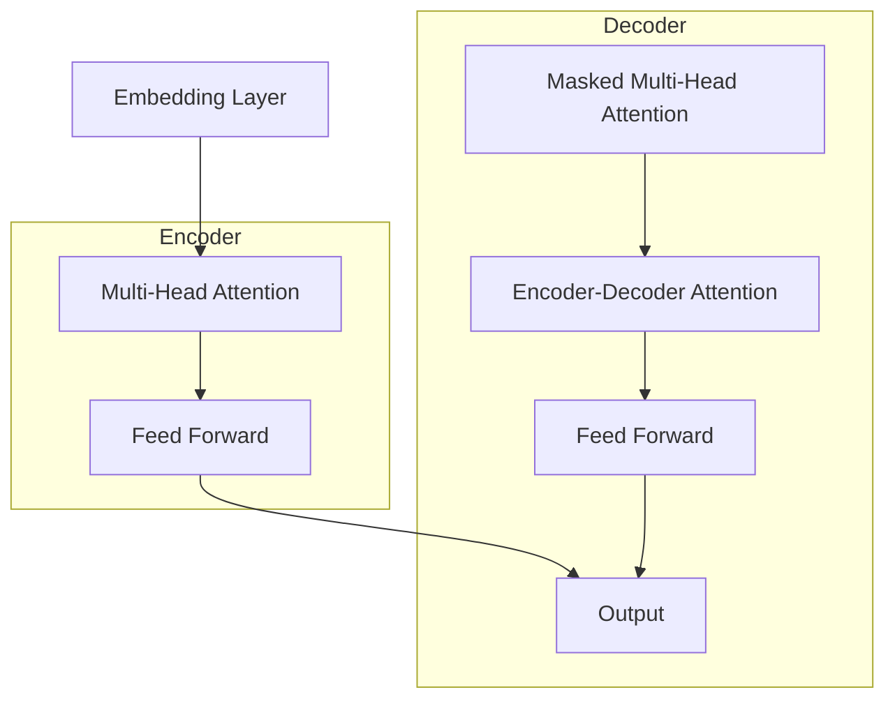

# 在Transformers中使用迁移学习

## 1.背景介绍

### 1.1 什么是迁移学习

迁移学习(Transfer Learning)是一种机器学习技术,它通过将在一个领域学习到的知识应用于另一个相关领域,从而提高模型在新领域的性能和学习效率。在深度学习时代,迁移学习已经成为解决数据不足、计算资源有限等问题的有效方法之一。

### 1.2 为什么需要迁移学习

训练深度神经网络通常需要大量的标注数据和计算资源。但在现实中,获取大规模高质量的标注数据往往是一个巨大的挑战。同时,从头开始训练一个复杂的深度模型也需要大量的计算资源和时间。迁移学习为我们提供了一种解决方案,可以利用在大型数据集上预训练的模型,将学习到的知识迁移到新的任务中,从而减少数据和计算需求。

### 1.3 Transformers简介  

Transformers是一种基于Self-Attention机制的序列到序列(Seq2Seq)模型,由Google在2017年提出,并在机器翻译、文本摘要、问答等自然语言处理任务中取得了卓越的表现。代表性模型包括BERT、GPT、T5等。Transformers结构灵活,可以高效地并行计算,在长序列建模方面表现出色。

## 2.核心概念与联系

### 2.1 预训练与微调

迁移学习在Transformers中的应用,通常分为两个阶段:预训练(Pre-training)和微调(Fine-tuning)。

**预训练**是在大规模无标注数据(如网页、书籍等)上训练Transformer模型,学习通用的语言表示。常用的预训练目标包括:

- **遮蔽语言模型(Masked Language Model,MLM)**: 随机遮蔽部分输入token,模型需要预测被遮蔽的token。
- **下一句预测(Next Sentence Prediction,NSP)**: 判断两个句子是否为连续的句子。

**微调**则是在有标注的小数据集上,基于预训练模型进行进一步训练,将通用知识迁移到特定的下游任务。微调通常只需要更新模型的部分参数,因此计算需求较小。

### 2.2 预训练模型种类

常见的预训练Transformer模型包括:

- **BERT**: 双向编码器,支持多种下游任务。
- **GPT**: 单向解码器,适用于生成式任务如文本生成。
- **T5**: 编码器-解码器模型,将所有NLP任务统一为"文本到文本"的形式。
- **ALBERT**: 更小更快的BERT变种,减少了参数量和训练时间。
- **RoBERTa**: 在BERT基础上改进的模型,提高了性能。

不同的预训练模型在结构、训练目标等方面有所区别,适用于不同的应用场景。

### 2.3 Transformer结构回顾

为了更好地理解迁移学习在Transformers中的应用,我们先回顾一下Transformer的基本结构:



Transformer由编码器(Encoder)和解码器(Decoder)组成。编码器将输入序列编码为向量表示,解码器则根据编码器的输出生成目标序列。注意力机制(Attention)是Transformer的核心,它允许模型捕获远程依赖关系,有效解决了RNN在长序列建模中的梯度消失问题。

## 3.核心算法原理具体操作步骤 

### 3.1 预训练阶段

预训练阶段的目标是在大量无标注数据上训练Transformer模型,学习通用的语言表示。常用的预训练方法有:

1. **Masked Language Modeling(MLM)**

    MLM的思想是随机遮蔽输入序列中的一些token,模型需要基于上下文预测被遮蔽的token。这种方式可以让模型学习双向语义信息。

    具体操作步骤如下:

    a) 随机选择输入序列中的部分token(通常15%左右)
    b) 将这些token用特殊的[MASK]标记替换
    c) 模型输入被遮蔽的序列,输出每个位置的token概率分布
    d) 以被遮蔽位置的实际token作为监督信号,最小化交叉熵损失

2. **Next Sentence Prediction(NSP)** 

    NSP任务是判断两个句子是否为连续的句子,旨在让模型学习捕获句子之间的关系和语境信息。

    操作步骤:

    a) 从语料库中随机采样句子对(A,B),50%的时候B为A的下一句,50%为随机句子
    b) 将句子对(A,B)拼接为单个序列,加入特殊标记[CLS]和[SEP]
    c) 模型以[CLS]标记的输出作为句子对表示,通过二分类判断A,B是否为连续句子
    d) 以实际标签(IsNext或NotNext)作为监督信号,最小化二分类损失

通过上述两个预训练任务,Transformer模型可以学习到通用的语义和句法知识,为后续的微调打下基础。

### 3.2 微调阶段

在微调阶段,我们将预训练模型应用到特定的下游任务,通过在少量标注数据上进行训练,将通用知识迁移到目标任务。

以文本分类任务为例,微调步骤如下:

1. **加载预训练模型**

    首先,加载预训练好的Transformer模型及其参数。常用的预训练模型可在Hugging Face的Transformers库中获取。

2. **构建数据管道**

    构建输入数据的处理管道,包括分词、填充、构建注意力掩码等步骤,将文本输入转化为模型可接受的张量形式。

3. **添加分类头**

    在Transformer模型的输出上添加一个分类头(Classification Head),通常是一个线性层和Softmax激活函数,将[CLS]标记的输出映射到分类标签的概率分布。

4. **微调训练**

    使用带标注的文本分类数据,以分类损失(如交叉熵损失)为目标函数,对整个模型(包括Transformer主体和分类头)进行端到端的微调训练。一般只需要更新部分参数,训练过程较快。

5. **评估和预测**

    在验证集上评估模型性能,选择最优模型进行预测和部署。

通过微调,预训练模型可以将通用语言知识迁移到目标任务,从而提高性能和数据利用效率。微调策略也可以根据具体任务做一些调整,如只微调部分层、使用不同的学习率等。

## 4.数学模型和公式详细讲解举例说明

在Transformer模型中,Self-Attention是核心机制之一。我们来看一下Self-Attention的数学原理:

给定一个输入序列$X = (x_1, x_2, ..., x_n)$,其中$x_i \in \mathbb{R}^{d_x}$表示第i个token的嵌入向量。Self-Attention的计算过程如下:

1. 将输入$X$分别线性映射到Query(Q)、Key(K)和Value(V)空间:

$$Q = XW_Q^T$$  
$$K = XW_K^T$$
$$V = XW_V^T$$

其中$W_Q, W_K, W_V \in \mathbb{R}^{d_x \times d_k}$是可学习的权重矩阵,维度$d_k$是注意力头的维度。

2. 计算Query和Key的点积,得到注意力分数矩阵:

$$\text{Attention}(Q, K, V) = \text{softmax}(\frac{QK^T}{\sqrt{d_k}})V$$

其中,注意力分数矩阵$\alpha_{ij} = \frac{q_i^Tk_j}{\sqrt{d_k}}$表示query向量$q_i$对key向量$k_j$的注意力权重。$\sqrt{d_k}$是为了防止内积过大导致softmax饱和。

3. 对注意力分数矩阵进行缩放和softmax归一化,得到归一化的注意力权重矩阵$\alpha'$。

4. 将注意力权重矩阵$\alpha'$与Value矩阵$V$相乘,得到加权后的Value向量作为注意力输出:

$$\text{Attention}(Q, K, V) = \alpha'V$$

Self-Attention的核心思想是让每个token可以基于其他token的表示,动态地计算自身的注意力权重,从而捕获序列内的长程依赖关系。

在实际应用中,Transformer通常使用多头注意力(Multi-Head Attention),将注意力机制在不同的子空间中运行,并将结果拼接,以提高模型的表达能力。多头注意力的公式如下:

$$\begin{aligned}
\text{MultiHead}(Q, K, V) &= \text{Concat}(\text{head}_1, ..., \text{head}_h)W^O\\
\text{where } \text{head}_i &= \text{Attention}(QW_i^Q, KW_i^K, VW_i^V)
\end{aligned}$$

其中$W_i^Q, W_i^K, W_i^V$是每个注意力头的线性映射,而$W^O$则是用于将多头注意力的输出拼接并映射回原始空间的可学习矩阵。

通过Self-Attention机制,Transformer可以高效地建模序列内的依赖关系,并行化计算,从而在长序列任务中取得优异的性能表现。

## 4.项目实践:代码实例和详细解释说明

接下来,我们通过一个实际的代码示例,演示如何使用Hugging Face的Transformers库在文本分类任务中进行迁移学习。

```python
# 导入所需库
from transformers import BertTokenizer, BertForSequenceClassification
import torch
from torch.utils.data import DataLoader
from tqdm import tqdm

# 加载预训练BERT模型和分词器
model_name = "bert-base-uncased"
tokenizer = BertTokenizer.from_pretrained(model_name)
model = BertForSequenceClassification.from_pretrained(model_name, num_labels=2) # 二分类任务

# 定义文本处理函数
def encode_text(text, max_length=512):
    encoding = tokenizer.encode_plus(
        text,
        add_special_tokens=True,
        max_length=max_length,
        padding='max_length',
        truncation=True,
        return_tensors='pt'
    )
    return encoding

# 加载训练数据
train_texts = [...] # 训练文本列表
train_labels = [...] # 训练标签列表

# 构建数据集和数据加载器
train_encodings = [encode_text(text) for text in train_texts]
train_dataset = [(encoding['input_ids'].squeeze(), encoding['attention_mask'].squeeze(), label) 
                 for encoding, label in zip(train_encodings, train_labels)]

train_loader = DataLoader(train_dataset, batch_size=16, shuffle=True)

# 定义优化器和损失函数
optimizer = torch.optim.Adam(model.parameters(), lr=2e-5)
loss_fn = torch.nn.CrossEntropyLoss()

# 训练循环
model.train()
for epoch in range(3):
    loop = tqdm(train_loader)
    for batch in loop:
        optimizer.zero_grad()
        
        input_ids = batch[0].to(device)
        attention_mask = batch[1].to(device)
        labels = batch[2].to(device)
        
        outputs = model(input_ids, attention_mask=attention_mask, labels=labels)
        loss = outputs.loss
        
        loss.backward()
        optimizer.step()
        
        loop.set_description(f'Epoch {epoch}')
        loop.set_postfix(loss=loss.item())
        
# 评估模型
model.eval()
val_texts = [...] # 验证集文本
val_encodings = [encode_text(text) for text in val_texts]
val_dataset = [(encoding['input_ids'].squeeze(), encoding['attention_mask'].squeeze()) for encoding in val_encodings]

correct = 0
total = 0
with torch.no_grad():
    for input_ids, attention_mask in val_dataset:
        input_ids = input_ids.unsqueeze(0).to(device)
        attention_mask = attention_mask.unsqueeze(0).to(device)
        
        outputs = model(input_ids, attention_mask=attention_mask)
        preds = torch.argmax(outputs.logits, dim=1)
        
        correct += (preds == val_labels).sum().item()
        total += len(val_labels)
        
accuracy = correct / total
print(f'Validation Accuracy: {accuracy*100:.2f}%')
```

上述代码演示了如何使用BERT进行文本二分类任务的迁移学习。我们首