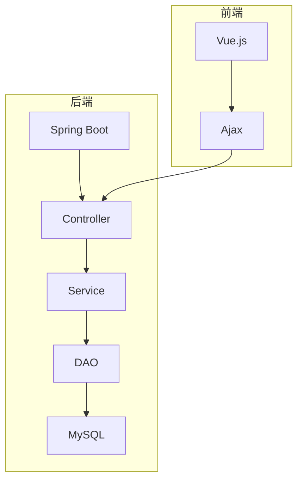

# 在线考试系统详细设计与具体代码实现

## 1.背景介绍

### 1.1 在线考试系统概述

随着互联网和信息技术的快速发展,在线考试系统逐渐取代了传统的纸笔考试方式,成为一种高效、便捷、环保的考试新模式。在线考试系统是一种基于Web的应用程序,可以实现考试过程的自动化管理,包括试卷组织、考生身份认证、考试监控、成绩评分和统计分析等功能。

### 1.2 在线考试系统的优势

与传统纸笔考试相比,在线考试系统具有以下优势:

1. 高效便捷:无需印刷大量试卷,节省人力物力成本。考生可以在任何地点通过网络参加考试。
2. 智能评阅:系统可自动批阅选择题和判断题,提高评分效率。
3. 数据安全:试题和考生答卷存储在服务器上,防止丢失或泄露。
4. 统计分析:系统可自动生成各类统计报表,方便分析考试数据。
5. 环境友好:无需消耗大量纸张,有利于环境保护。

### 1.3 在线考试系统的应用场景

在线考试系统可广泛应用于以下场景:

- 学校教育考试:中小学、大学期末考试、入学考试等
- 企业培训考核:员工培训后的在线考核、职业资格认证考试等
- 政府机构考试:公务员考试、专业技术资格考试等
- 其他场景:在线竞赛、证书认证考试等

## 2.核心概念与联系

### 2.1 系统架构

在线考试系统通常采用 B/S(Browser/Server)架构,包括以下几个核心组件:

1. **客户端(Browser)**: 考生使用Web浏览器访问在线考试系统,参加考试并提交答卷。
2. **Web服务器**: 负责接收客户端请求,处理业务逻辑,与数据库交互,并返回响应数据。
3. **数据库服务器**: 存储试题库、考生信息、考试记录等数据。
4. **应用服务器**: 在大型系统中,可部署应用服务器集群,实现负载均衡和高可用性。


### 2.2 核心功能模块

在线考试系统通常包含以下核心功能模块:

1. **用户管理模块**: 管理系统用户(管理员、教师、考生等),包括用户注册、登录、权限控制等。
2. **试卷管理模块**: 管理试卷库,包括添加、编辑、组卷等功能。
3. **考试管理模块**: 创建考试计划,分配考试资源,发布考试通知等。
4. **考试过程模块**: 考生身份认证、试卷显示、答题交卷、监控防作弊等。
5. **评分统计模块**: 自动批阅客观题,统计分数,生成成绩报表等。
6. **系统管理模块**: 管理系统参数配置、日志审计、备份恢复等。

### 2.3 关键技术点

在线考试系统涉及以下关键技术点:

1. **Web应用开发技术**: 如Java EE、.NET、PHP、Python等
2. **数据库技术**: 关系型数据库(MySQL、Oracle等)或NoSQL数据库
3. **前端技术**: HTML5、CSS3、JavaScript、React、Vue等
4. **安全技术**: 用户认证、权限控制、数据加密、防作弊策略等
5. **并发控制**: 处理高并发访问请求,实现负载均衡和集群部署
6. **缓存技术**: 提高系统响应速度和吞吐量
7. **报表技术**: 生成统计报表,如使用JasperReports等工具

## 3.核心算法原理具体操作步骤

### 3.1 试卷组卷算法

试卷组卷是在线考试系统的核心功能之一,需要根据考试要求从试题库中智能选择试题,生成符合要求的试卷。常用的组卷算法有:

1. **随机组卷算法**:从题库中随机抽取指定数量的试题。
2. **分层抽卷算法**:根据知识点、难度系数等条件,按比例从不同分层中抽取试题。
3. **蚁群优化算法**:模拟蚁群行为,根据题型、难度等因素评分,选取得分最高的试题组成试卷。
4. **遗传算法**:将试题作为基因,通过选择、交叉、变异等遗传操作,产生满足要求的试卷。

以分层抽卷算法为例,其基本步骤如下:

1. 根据考试大纲,将知识点分层,每层按一定权重分配题量。
2. 在每一层中,按照题型、难度系数等条件,进一步分层。
3. 在最小粒度层中,按配比随机抽取试题。
4. 按层级依次组装试题,直至满足总题量要求。

### 3.2 考试防作弊算法

为确保考试公平公正,需要采取防止作弊的策略,主要包括:

1. **考生身份认证**:要求考生提供身份证、学生证等有效证件,通过人脸识别等生物识别技术验证身份。
2. **行为监控分析**:通过摄像头、屏幕共享等方式,监控考生的行为轨迹,分析是否存在作弊嫌疑。
3. **网络流量分析**:检测考生设备是否访问了外部资源或与他人通讯,判断是否有外部作弊行为。
4. **试卷防泄漏**:对试题进行加密,只在考试开始时才在考生端解密显示,防止试卷内容泄露。
5. **区域限制**:限制考生只能在指定区域内参加考试,防止替考行为。
6. **设备检测**:检测考生设备是否存在非法程序或硬件,禁止使用外部存储设备等。

其中,行为监控分析算法是核心防作弊技术,可以通过计算机视觉和行为分析模型,检测考生的眼球运动轨迹、手部动作、环境声音等,判断是否有作弊嫌疑行为。

### 3.3 自动阅卷算法

对于选择题、判断题等客观题,在线考试系统需要具备自动阅卷功能,以提高评分效率。自动阅卷算法的基本步骤如下:

1. **预处理**:对考生答卷进行格式化,识别答题区域。
2. **分割**:将答题区域按题型分割成单个答题单元。
3. **识别**:使用OCR(光学字符识别)或OMR(光学标记识别)技术,识别考生的答案。
4. **比对**:将识别结果与标准答案进行比对,判断正误。
5. **统计**:汇总各题得分情况,生成总分数据。

此外,对于主观题(如编程题、问答题等),可以采用人工阅卷或基于NLP的智能阅卷算法。智能阅卷算法通过语义分析、知识图谱等技术,评判答案的准确性和完整性。

## 4.数学模型和公式详细讲解举例说明

### 4.1 信息熵模型

在试卷组卷过程中,为了确保试卷的信息量和区分度,可以借助信息熵模型进行试题选择。信息熵(Entropy)是信息论中的一个重要概念,用于衡量信息的不确定性。

假设一个离散随机变量 $X$ 的可能取值为 $\{x_1, x_2, \cdots, x_n\}$,相应的概率分布为 $P(X) = \{p_1, p_2, \cdots, p_n\}$,则 $X$ 的信息熵定义为:

$$H(X) = -\sum_{i=1}^n p_i \log_2 p_i$$

其中,如果概率 $p_i = 0$,则定义 $0\log_2 0 = 0$。

信息熵 $H(X)$ 的取值范围为 $[0, \log_2 n]$。当所有可能值的概率分布均匀时,即 $p_i = 1/n$,此时信息熵 $H(X)$ 取最大值 $\log_2 n$;当只有一个可能值的概率为 1 ,其余均为 0 时,此时信息熵 $H(X) = 0$。

在试卷组卷中,可以计算每个试题的信息熵,并根据熵值大小选择试题,从而使得试卷具有较高的信息量和区分度。

### 4.2 项目响应理论模型(IRT)

项目响应理论(Item Response Theory,IRT)是一种基于数理统计学的测量模型,常用于分析试题的难度和区分度。IRT模型的核心思想是:一个人答对某题的概率,取决于该人的能力水平和题目的难度。

在IRT模型中,常用的有三参数逻辑斯蒂模型(3PL):

$$P(U_i=1|θ_j,a_i,b_i,c_i) = c_i + \frac{1-c_i}{1+e^{-a_i(θ_j-b_i)}}$$

其中:
- $U_i$表示答题结果,正确为1,错误为0
- $θ_j$表示考生 j 的能力参数
- $a_i$表示试题 i 的难度参数
- $b_i$表示试题 i 的区分度参数
- $c_i$表示试题 i 的猜测度参数

通过IRT模型,可以估计出每个考生的能力值$θ$,以及每道试题的难度$a$、区分度$b$和猜测度$c$,从而为试题的选择和能力评价提供依据。

在试卷组卷过程中,可以结合IRT模型,选取适当难度和区分度的试题,使得试卷能够较好地区分不同能力水平的考生。

## 5.项目实践:代码实例和详细解释说明

本节将给出一个基于Spring Boot和Vue.js的在线考试系统示例项目,并对关键模块的代码实现进行详细说明。

### 5.1 系统架构

该示例项目采用前后端分离的架构设计,后端使用Spring Boot框架,前端使用Vue.js框架。后端提供RESTful API,前端通过Ajax方式调用API并渲染页面。系统架构如下图所示:



### 5.2 数据库设计

该系统的数据库使用MySQL,核心表结构设计如下:

- 用户表(user):存储系统用户信息,包括管理员、教师和考生等。
- 试卷表(exam_paper):存储试卷信息,包括试卷名称、考试时间等。
- 试题表(question):存储试题信息,包括题目内容、答案解析等。
- 考试记录表(exam_record):存储考生的考试记录,包括答卷内容和成绩等。

### 5.3 Spring Boot后端实现

以下是后端的部分核心代码示例:

#### 5.3.1 试卷管理模块

```java
// PaperController.java
@RestController
@RequestMapping("/api/papers")
public class PaperController {
    @Autowired
    private PaperService paperService;

    // 创建试卷
    @PostMapping
    public ResponseEntity<Paper> createPaper(@RequestBody Paper paper) {
        Paper createdPaper = paperService.createPaper(paper);
        return ResponseEntity.ok(createdPaper);
    }

    // 获取试卷列表
    @GetMapping
    public ResponseEntity<List<Paper>> getPapers() {
        List<Paper> papers = paperService.getPapers();
        return ResponseEntity.ok(papers);
    }
}

// PaperService.java
@Service
public class PaperService {
    @Autowired
    private PaperRepository paperRepository;
    @Autowired
    private QuestionService questionService;

    public Paper createPaper(Paper paper) {
        // 从题库中随机抽取试题
        List<Question> questions = questionService.getRandomQuestions(paper.getSubject(), paper.getNumOfQuestions());
        paper.setQuestions(questions);
        return