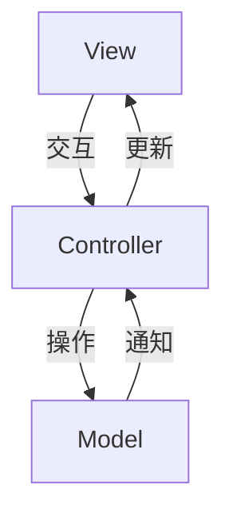

# 基于Android的小学生课外时间管理系统设计与实现

## 1.背景介绍

### 1.1 课外时间管理的重要性

随着社会的发展和教育理念的转变,课外时间管理对于小学生的全面发展越来越受到重视。合理安排课外时间不仅有助于培养学生的兴趣爱好,还能促进他们身心健康发展。然而,很多家长和学生都面临着如何有效利用课余时间的困扰。

### 1.2 移动应用程序的优势

移动应用程序作为一种新兴的信息技术手段,具有便携性强、交互性好等优势,非常适合用于课外时间管理。通过开发基于Android系统的课外时间管理APP,可以为小学生及其家长提供一个高效的时间规划和活动安排工具。

### 1.3 系统设计的必要性

为了更好地满足小学生课外时间管理的需求,有必要设计并实现一款专门的Android应用程序。该系统应具备时间安排、活动推荐、家长监督等功能,从而帮助小学生养成良好的时间管理习惯,促进全面发展。

## 2.核心概念与联系

### 2.1 时间管理

时间管理是指合理分配和利用时间资源的过程,包括制定计划、排定优先级、监控执行情况等环节。对于小学生来说,时间管理不仅有助于完成学习任务,还能培养自律性和责任心。

### 2.2 活动推荐

活动推荐是指根据小学生的兴趣爱好、年龄特点等,为其推荐适合的课外活动。合理的活动安排有利于小学生全面发展,培养多方面的能力。

### 2.3 家长监督

家长监督是指家长对小学生课外时间的安排和活动参与情况进行监控和指导。家长的参与有助于小学生养成良好的生活作息习惯,促进身心健康发展。

### 2.4 系统架构

该系统采用典型的Android应用程序架构,包括视图(View)层、控制器(Controller)层和模型(Model)层。视图层负责与用户交互;控制器层处理业务逻辑;模型层管理数据。此外,系统还需要与服务器端进行数据交互。

## 3.核心算法原理具体操作步骤

### 3.1 时间规划算法

时间规划算法的主要目标是根据用户的输入(如学习任务、兴趣爱好等),生成一个合理的时间安排方案。算法流程如下:

1. 收集用户输入的信息,包括学习任务、兴趣爱好活动、作息时间等;
2. 将这些信息转换为具有优先级的任务列表;
3. 根据任务的紧急程度和重要程度,使用一种启发式算法(如遗传算法)对任务列表进行排序; 
4. 将排序后的任务安排到时间表中,同时考虑任务之间的先后顺序和持续时间;
5. 根据剩余时间,插入休息时间和兴趣爱好活动;
6. 输出最终的时间安排方案。

该算法的关键在于任务排序和时间分配策略的设计,需要权衡不同因素,追求整体的时间利用效率。

### 3.2 活动推荐算法  

活动推荐算法的目标是为用户推荐合适的课外活动,算法流程如下:

1. 收集用户的个人信息,如年龄、性别、兴趣爱好等;
2. 从活动数据库中筛选出与用户信息相匹配的活动;
3. 根据活动的热门程度、难易程度、时间等因素,使用协同过滤或基于内容的推荐算法计算每个活动的推荐分数;
4. 按照推荐分数从高到低排序,选取前N个活动作为推荐结果;
5. 将推荐结果呈现给用户。

该算法需要设计合理的用户画像、活动特征提取和推荐策略,以提高推荐的准确性和多样性。

### 3.3 家长监督机制

家长监督机制的目的是让家长能够实时了解孩子的时间安排和活动情况,并进行必要的干预。具体流程如下:

1. 孩子的时间安排表和活动安排会实时同步到家长端;
2. 家长可以在APP中查看孩子的安排,并可视化地展示时间分配情况;
3. 如果发现问题(如时间分配不合理、活动不当等),家长可以发出修改建议;
4. 孩子收到家长的建议后,可以选择接受或拒绝;
5. 家长还可以设置一些限制条件,如上网时间限制等;
6. 系统会记录家长干预的历史,以便后续分析。

该机制需要设计良好的家长权限控制和信息交互方式,在尊重孩子的同时也能起到适当的监督作用。

## 4.数学模型和公式详细讲解举例说明

### 4.1 时间规划模型

我们可以将时间规划问题建模为一个约束优化问题,目标是最大化时间利用效率,同时满足一系列约束条件。

设有n个任务$T = \{t_1, t_2, \dots, t_n\}$,每个任务$t_i$有如下属性:
- $d_i$: 任务持续时间
- $p_i$: 任务优先级
- $s_i$: 任务开始时间
- $e_i$: 任务结束时间

我们希望最大化总体时间利用效率$U$,即:

$$\max U = \sum_{i=1}^n p_i \cdot \frac{d_i}{e_i - s_i}$$

同时需要满足以下约束条件:

1. 时间约束: $\forall i,j, (s_i \leq s_j \leq e_i) \vee (s_j \leq s_i \leq e_j) \Rightarrow |e_i - s_j| + |e_j - s_i| = d_i + d_j$
2. 优先级约束: $\forall i<j, p_i \geq p_j \Rightarrow s_i \leq s_j$
3. 时间窗口约束: $\forall i, s_i \in [t_{\text{start}}, t_{\text{end}}]$

其中$t_{\text{start}}$和$t_{\text{end}}$分别表示时间窗口的开始和结束时间。

该优化问题可以使用整数规划或约束规划等方法求解。在具体实现时,我们还需要考虑算法的时间复杂度和可扩展性。

### 4.2 活动推荐模型

我们可以将活动推荐问题建模为一个机器学习任务,目标是预测用户对某个活动的兴趣程度。

设有m个用户$U = \{u_1, u_2, \dots, u_m\}$,n个活动$A = \{a_1, a_2, \dots, a_n\}$,我们的训练数据是一个用户-活动评分矩阵$R = [r_{ij}]_{m \times n}$,其中$r_{ij}$表示用户$u_i$对活动$a_j$的评分(或者是隐式反馈,如参与时间)。

我们的目标是学习一个函数$f: U \times A \rightarrow \mathbb{R}$,对于任意用户$u_i$和活动$a_j$,可以预测$u_i$对$a_j$的兴趣程度$\hat{r}_{ij} = f(u_i, a_j)$。

常见的协同过滤模型包括:

- 基于邻域的方法: 计算用户(或活动)之间的相似度,并基于相似用户(或相似活动)的历史数据进行预测。
- 矩阵分解: 将评分矩阵$R$分解为两个低维矩阵的乘积,User矩阵和Item矩阵,作为用户和活动的潜在因子向量。
- 神经网络方法: 使用深度学习模型直接从用户和活动的原始特征中学习潜在表示,并基于这些表示进行预测。

在实际应用中,我们还需要考虑数据缺失、冷启动问题等,并结合其他辅助信息(如活动内容、社交关系等)以提高推荐质量。

## 4.项目实践:代码实例和详细解释说明

### 4.1 系统架构

该系统采用了典型的Android应用架构,包括视图(View)层、控制器(Controller)层和模型(Model)层,如下图所示:



- View层: 负责与用户交互,显示界面元素,如活动列表、时间表等。主要使用XML和Java代码实现。
- Controller层: 处理业务逻辑,如时间规划、活动推荐等。负责协调View层和Model层的交互。
- Model层: 管理系统数据,如用户信息、活动数据等。可以使用SQLite数据库或其他存储方式。

此外,系统还需要与服务器端进行数据交互,以获取活动信息、同步用户数据等。可以使用RESTful API或其他通信协议。

### 4.2 时间规划模块

时间规划模块的核心代码如下:

```java
// Task.java
public class Task {
    private String name;
    private int priority;
    private int duration; // 单位:分钟
    // ...
}

// TimeScheduler.java
public class TimeScheduler {
    private List<Task> taskList;
    private int startTime, endTime; // 时间窗口

    public TimeScheduler(List<Task> taskList, int startTime, int endTime) {
        this.taskList = taskList;
        this.startTime = startTime;
        this.endTime = endTime;
    }

    public Schedule generateSchedule() {
        // 1. 对任务列表按优先级排序
        taskList.sort((a, b) -> b.priority - a.priority);

        // 2. 使用遗传算法进行时间分配
        GeneticScheduler scheduler = new GeneticScheduler(taskList, startTime, endTime);
        Schedule schedule = scheduler.run();

        return schedule;
    }
}

// GeneticScheduler.java
public class GeneticScheduler {
    // ...

    public Schedule run() {
        // 1. 初始化种群
        initPopulation();

        // 2. 迭代进化
        for (int i = 0; i < MAX_GENERATIONS; i++) {
            // 选择
            selection();
            // 交叉
            crossover();
            // 变异
            mutation();
            // 更新种群
            updatePopulation();
        }

        // 3. 返回最优解
        return getBestSchedule();
    }

    // ...
}
```

在这个实现中,我们首先对任务列表按优先级进行排序。然后使用遗传算法对任务进行时间分配。遗传算法的基本思路是:

1. 初始化一个种群,每个个体表示一种时间安排方案;
2. 迭代进化,每一代进行选择、交叉和变异操作,产生新的个体;
3. 根据适应度函数(如时间利用效率)评估每个个体的质量,保留优秀的个体;
4. 重复2-3,直到满足终止条件(如达到最大迭代次数);
5. 返回种群中最优秀的个体,即最佳时间安排方案。

在具体实现中,我们需要设计合理的编码方式、适应度函数、遗传操作等,以提高算法的效率和性能。

### 4.3 活动推荐模块

活动推荐模块的核心代码如下:

```java
// User.java
public class User {
    private String name;
    private int age;
    private Set<String> interests;
    // ...
}

// Activity.java
public class Activity {
    private String name;
    private String category;
    private String description;
    private int difficulty;
    // ...
}

// RecommenderSystem.java
public class RecommenderSystem {
    private List<User> users;
    private List<Activity> activities;
    private RatingMatrix ratingMatrix;

    public RecommenderSystem(List<User> users, List<Activity> activities) {
        this.users = users;
        this.activities = activities;
        this.ratingMatrix = new RatingMatrix(users, activities);
    }

    public List<Activity> recommendActivities(User user, int numRecommendations) {
        // 1. 构建用户和活动的特征向量
        UserFeatureExtractor userExtractor = new UserFeatureExtractor();
        ActivityFeatureExtractor activityExtractor = new ActivityFeatureExtractor();
        List<double[]> userFeatures = userExtractor.extractFeatures(users);
        List<double[]> activityFeatures = activityExtractor.extractFeatures(activities);

        // 2. 训练神经网络模型
        NeuralNetworkModel model = new NeuralNetworkModel();
        model.train(userFeatures, activityFeatures, ratingMatrix);

        