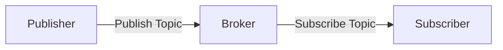
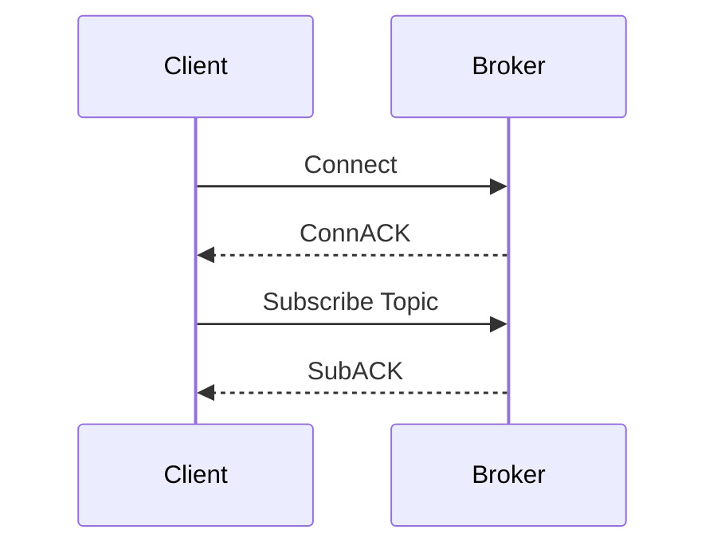
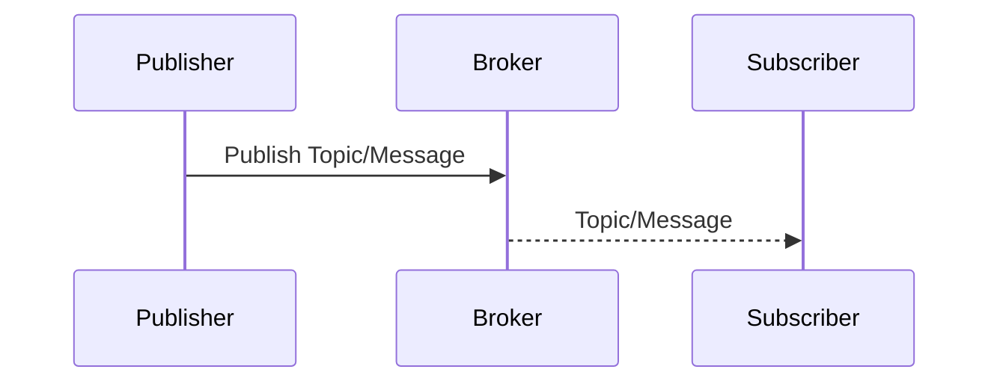
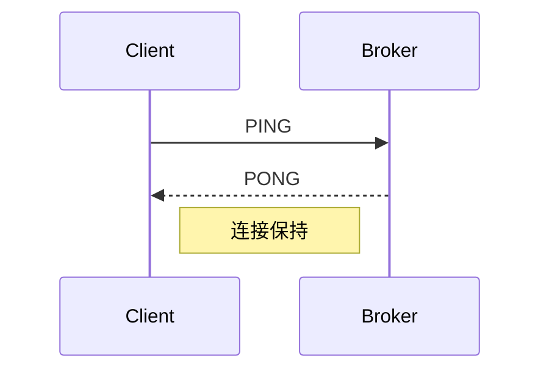
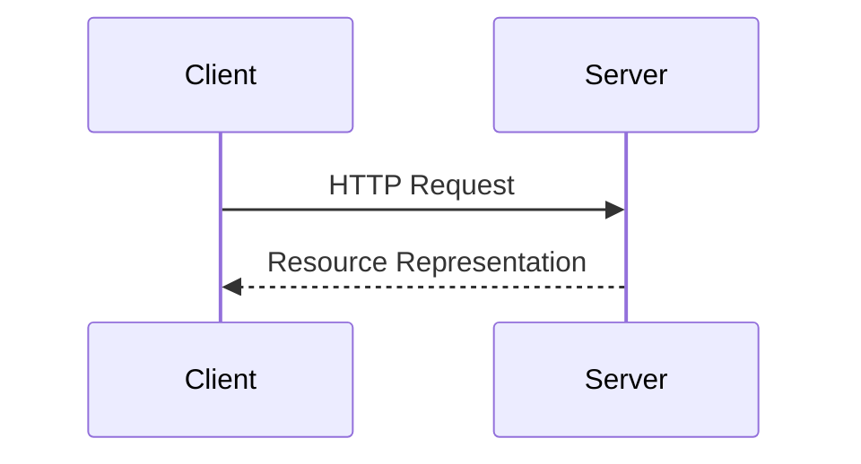
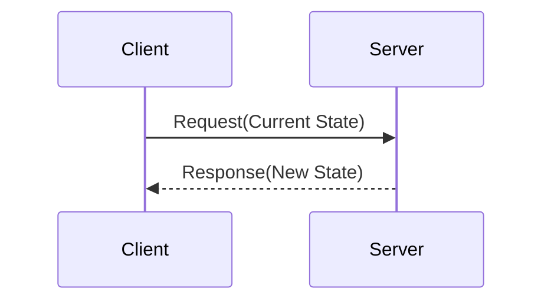
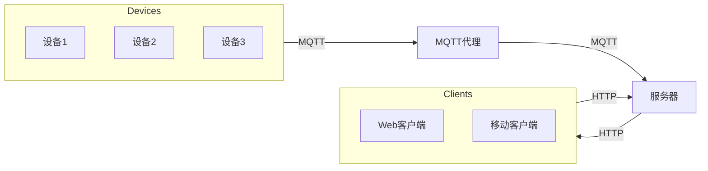

# 基于MQTT协议和RESTful API的智能家居能源消耗可视化

## 1.背景介绍

### 1.1 智能家居的兴起

随着物联网技术的快速发展,智能家居应用逐渐走进千家万户。智能家居系统通过将家中各种电器、安防设备等连接到网络,实现对这些设备的远程监控和控制,极大地提高了生活质量和能源利用效率。

### 1.2 能源消耗监测的重要性  

能源消耗一直是家庭支出的一大部分,合理利用能源不仅能节省开支,更有利于环境保护。通过对家电、照明等设备的能耗进行实时监测和数据可视化分析,用户可以清晰了解能源消耗情况,从而优化用电模式,实现节能减排。

### 1.3 MQTT和RESTful API

MQTT(Message Queuing Telemetry Transport)是一种基于发布/订阅模式的轻量级消息传输协议,被广泛应用于物联网领域。RESTful API则是一种软件架构风格,通过HTTP协议提供互联网服务。两者的结合可以高效实现智能家居系统的数据交换和远程控制。

## 2.核心概念与联系

### 2.1 MQTT协议

#### 2.1.1 发布/订阅模式

MQTT基于发布/订阅模式工作,包括以下三个核心组件:

- 发布者(Publisher): 发布主题(Topic)消息的客户端
- 订阅者(Subscriber): 订阅主题并接收消息的客户端  
- 代理(Broker): 负责分发主题消息的服务器



#### 2.1.2 主题层级

MQTT主题使用层级结构,由一个或多个级别的字符串组成,每级由"/"分隔。例如"smarthome/bedroom/temp"表示卧室温度主题。这种分层设计有利于组织和过滤信息。

#### 2.1.3 QoS级别

MQTT定义了三个服务质量(QoS)级别,用于控制消息传输:

- QoS 0: 最多一次,无确认和重试
- QoS 1: 至少一次,确保消息到达但可能重复
- QoS 2: 只有一次,确保消息只到达一次

不同级别在可靠性和性能之间进行权衡。

### 2.2 RESTful API

#### 2.2.1 资源

RESTful架构将Web服务抽象为资源,通过URI唯一标识。例如"http://smarthome.com/devices"表示设备资源。

#### 2.2.2 HTTP方法

RESTful API使用HTTP方法(GET、POST、PUT、DELETE等)对资源执行操作:

- GET: 获取资源
- POST: 创建资源 
- PUT: 更新资源
- DELETE: 删除资源

#### 2.2.3 无状态

RESTful API是无状态的,每个请求都包含执行所需的全部信息,不依赖之前的请求。这简化了服务器端的设计和扩展。

### 2.3 MQTT与RESTful API的结合

MQTT和RESTful API在智能家居系统中发挥互补作用:

- MQTT用于设备与服务器之间的实时数据传输,如上报能耗数据
- RESTful API用于客户端与服务器之间的请求响应,如查询历史数据

通过两者的有机结合,可以构建高效、可扩展的智能家居系统。

## 3.核心算法原理具体操作步骤  

### 3.1 MQTT连接与通信

#### 3.1.1 MQTT连接建立

1. 客户端(发布者或订阅者)向MQTT代理发送连接请求
2. 代理验证客户端身份(可选)并建立连接
3. 客户端订阅感兴趣的主题



#### 3.1.2 MQTT数据发布

1. 发布者客户端发布主题消息
2. 代理根据主题分发消息给订阅者



#### 3.1.3 MQTT保持连接

- 客户端定期向代理发送PING请求
- 代理回复PONG保持连接存活
- 若长时间未收到PING,代理断开连接



### 3.2 RESTful API交互

#### 3.2.1 资源表示

1. 客户端向服务器发送HTTP请求(GET/POST/PUT/DELETE)
2. 服务器处理请求,操作资源
3. 服务器返回资源表示(JSON/XML)



#### 3.2.2 状态转移

1. 客户端根据资源当前状态发送请求
2. 服务器执行请求,资源状态发生转移
3. 服务器返回新的资源表示



#### 3.2.3 RESTful API最佳实践

- 正确使用HTTP方法
- 使用复数形式的名词表示资源
- 使用嵌套关系表示资源层级
- 在响应中返回足够的元数据
- 使用合适的状态码

## 4.数学模型和公式详细讲解举例说明

在智能家居能源消耗可视化系统中,需要对能源数据进行处理和分析。以下是一些常用的数学模型和公式:

### 4.1 能量计算

能量是功率在一定时间内的积分,公式如下:

$$
E = \int_{t_1}^{t_2} P(t) dt
$$

其中:
- $E$表示能量(千瓦时)
- $P(t)$表示时间$t$的功率(千瓦)
- $t_1$和$t_2$分别是起始和结束时间

对于离散数据,可使用数值积分:

$$
E = \sum_{i=1}^{n} P_i \Delta t_i
$$

其中:
- $P_i$是第$i$个时间段的平均功率
- $\Delta t_i$是第$i$个时间段的时长

### 4.2 费用计算

根据能源消耗量和当地电价,可计算电费:

$$
C = E \times R
$$

其中:
- $C$表示电费(货币单位)
- $E$表示能量消耗量(千瓦时)
- $R$表示电价(货币单位/千瓦时)

### 4.3 统计分析

对于一段时间内的能源数据,可计算均值、方差、峰值等统计量:

$$
\begin{aligned}
\mu &= \frac{1}{n} \sum_{i=1}^{n} x_i \\
\sigma^2 &= \frac{1}{n} \sum_{i=1}^{n} (x_i - \mu)^2 \\
\max &= \max \{ x_1, x_2, \ldots, x_n \}
\end{aligned}
$$

其中:
- $\mu$表示均值
- $\sigma^2$表示方差
- $\max$表示最大值
- $x_i$表示第$i$个数据点
- $n$表示数据点总数

这些统计量可用于分析能源消耗模式,发现异常值等。

### 4.4 时间序列分析

能源数据通常呈现出一定的周期性和趋势,可使用时间序列分析方法进行建模和预测,如移动平均、指数平滑、ARIMA等。

以简单移动平均为例,长度为$m$的移动平均序列为:

$$
S_t = \frac{1}{m} \sum_{i=t-m+1}^{t} x_i
$$

其中$x_i$为原始数据序列。移动平均可以消除随机波动,突出数据趋势。

## 4.项目实践: 代码实例和详细解释说明

为了更好地理解智能家居能源消耗可视化系统的实现,我们将通过一个基于Python的示例项目进行说明。

### 4.1 系统架构



该系统由以下几个主要组件构成:

- **设备**: 智能家电、传感器等,通过MQTT协议向代理发布能耗数据
- **MQTT代理**: 接收设备发布的数据,转发给服务器
- **服务器**: 提供RESTful API,处理客户端请求,存储和分析能源数据
- **客户端**: Web或移动应用,通过RESTful API与服务器交互,查看能源数据可视化

### 4.2 MQTT客户端

设备作为MQTT客户端,使用Paho MQTT Python客户端库连接代理并发布数据。

```python
import paho.mqtt.client as mqtt

# MQTT代理配置
BROKER_HOST = "broker.smarthome.com"
BROKER_PORT = 1883

# 连接回调函数
def on_connect(client, userdata, flags, rc):
    print(f"Connected with result code {rc}")
    # 订阅主题
    client.subscribe("smarthome/devices/#")

# 消息接收回调函数  
def on_message(client, userdata, msg):
    payload = msg.payload.decode()
    print(f"Received {msg.topic}: {payload}")

# 创建MQTT客户端
client = mqtt.Client()
client.on_connect = on_connect
client.on_message = on_message

# 连接MQTT代理
client.connect(BROKER_HOST, BROKER_PORT)

# 发布数据
client.publish("smarthome/devices/device1", "25.6")
```

在上述示例中,设备连接到MQTT代理,订阅主题"smarthome/devices/#"以接收所有设备的消息。然后,它发布一条消息到主题"smarthome/devices/device1"。

### 4.3 RESTful API

服务器使用Flask框架提供RESTful API,处理客户端的HTTP请求。

```python
from flask import Flask, jsonify, request
import paho.mqtt.subscribe as subscribe

app = Flask(__name__)

# 获取设备能耗数据
@app.route('/api/devices/<device_id>/energy', methods=['GET'])
def get_device_energy(device_id):
    topic = f"smarthome/devices/{device_id}"
    msg = subscribe.simple(topic, hostname="broker.smarthome.com")
    energy = float(msg.payload.decode())
    return jsonify({"deviceId": device_id, "energy": energy})

# 保存设备能耗数据
@app.route('/api/devices/<device_id>/energy', methods=['POST'])
def save_device_energy(device_id):
    energy = request.json['energy']
    # 保存能耗数据到数据库
    return jsonify({"message": "Energy data saved successfully"})

if __name__ == '__main__':
    app.run(host='0.0.0.0', port=5000)
```

在这个示例中,我们定义了两个API端点:

- `GET /api/devices/<device_id>/energy`: 获取指定设备的当前能耗数据,通过订阅MQTT主题获取数据
- `POST /api/devices/<device_id>/energy`: 保存指定设备的能耗数据,可将数据存储到数据库中

客户端可以通过HTTP请求与这些API端点交互,获取或保存能源数据。

### 4.4 Web可视化

使用JavaScript和Chart.js库,我们可以在Web应用中实现能源数据的可视化。

```html
<!DOCTYPE html>
<html>
<head>
    <title>Energy Consumption Visualization</title>
    <script src="https://cdn.jsdelivr.net/npm/chart.js"></script>
</head>
<body>
    <canvas id="energyChart"></canvas>
    <script>
        // 从服务器获取能源数据
        fetch('/api/devices/device1/energy')
            .then(response => response.json())
            .then(data => {
                // 创建图表
                var ctx = document.getElementById('energyChart').getContext('2d');
                var chart = new Chart(ctx, {
                    type: 'line',
                    data: {
                        labels: ['00:00', '03:00', '06:00', '09:00', '12:00', '15:00', '18:00', '21:00'],
                        datasets: [{
                            label: 'Energy Consumption (kWh)',
                            data: [0.5, 0.3, 0.8, 