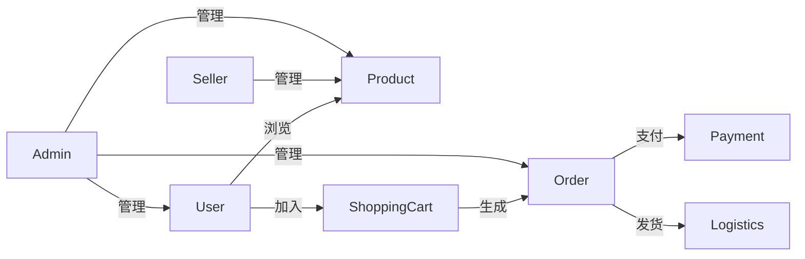

# 基于WEB的网上购物系统详细设计与具体代码实现

## 1.背景介绍

### 1.1 网上购物系统概述

随着互联网技术的快速发展和普及,网上购物系统已经成为当今电子商务的核心应用之一。网上购物系统为消费者提供了一种全新的购物体验,消费者无需亲临实体店,只需通过网络就可以浏览商品信息、下单购买、在线支付等,极大地方便了人们的生活。

网上购物系统通常由以下几个核心模块组成:

- 商品模块:用于管理商品信息、商品分类、库存等
- 订单模块:处理订单的生成、支付、发货等流程
- 用户模块:实现用户注册、登录、个人中心等功能
- 支付模块:集成第三方支付平台,处理在线支付
- 后台管理:提供系统运营、数据统计分析等管理功能

### 1.2 网上购物系统的优势

与传统的实体店相比,网上购物系统具有以下显著优势:

1. **无地域限制**:消费者可以随时随地通过互联网访问购物网站,不受地理位置的限制。
2. **商品种类丰富**:网上商城可以销售各种商品,种类远远超过实体店。
3. **价格透明**:网上商品的价格一般比实体店更加透明,消费者可以方便地进行价格比较。
4. **购物便捷**:消费者无需亲临实体店,可以在家中或任何地方通过网络完成购物。
5. **个性化服务**:根据用户的浏览和购买记录,系统可以为用户推荐感兴趣的商品。

### 1.3 网上购物系统的挑战

尽管网上购物系统具有诸多优势,但在实际开发和运营过程中,也面临着一些挑战:

1. **系统性能**:高并发访问和大量数据处理对系统的性能提出了很高的要求。
2. **安全性**:需要保护用户隐私信息和交易数据的安全性。
3. **可用性**:系统必须具备高可用性,确保7x24小时不间断运行。
4. **可扩展性**:系统需要具备良好的可扩展性,以适应未来的业务增长。
5. **用户体验**:提供良好的用户体验是吸引并留住用户的关键。

## 2.核心概念与联系

在设计和实现网上购物系统之前,我们需要理解一些核心概念及它们之间的关系。

### 2.1 用户(User)

用户是网上购物系统的核心,整个系统的设计都是为了满足用户的需求。用户可以分为以下几种角色:

- **游客(Guest)**:未注册的访问者,可以浏览商品信息、加入购物车等,但无法下单购买。
- **买家(Buyer)**:已注册的用户,可以完成商品的购买、支付、查看订单等操作。
- **卖家(Seller)**:提供商品的供应商或个人卖家,可以管理商品信息、库存、订单等。
- **管理员(Admin)**:系统的运营管理人员,拥有最高权限,可以管理用户、商品、订单等全部数据。

### 2.2 商品(Product)

商品是网上购物系统的核心资源,包括实体商品和虚拟商品(如电子书、游戏虚拟装备等)。每种商品都有相应的属性,如名称、价格、描述、图片等。商品通常按一定的分类体系进行组织和管理。

### 2.3 订单(Order)

订单是用户购买商品的凭证,记录了用户购买的商品、数量、金额等信息。订单的生命周期包括:

1. 生成订单
2. 用户付款
3. 商家发货
4. 用户收货
5. 订单完成或取消

订单的状态在整个生命周期中会不断变化,系统需要对订单状态进行实时跟踪和管理。

### 2.4 购物车(Shopping Cart)

购物车是用户临时存放所选商品的地方,用户可以根据需要将商品加入或移出购物车。当用户准备下单时,购物车中的商品会生成一个订单。

### 2.5 支付(Payment)

支付是网上购物系统的核心环节之一。系统通常会集成第三方支付平台(如PayPal、Alipay等),为用户提供多种在线支付方式,如信用卡、借记卡、电子钱包等。

### 2.6 物流(Logistics)

物流是网上购物的最后一个环节。系统需要与物流公司对接,实现订单的发货、物流跟踪等功能,为用户提供完整的购物体验。

### 2.7 核心概念关系

上述核心概念之间的关系如下图所示:

## 3.核心算法原理具体操作步骤

在实现网上购物系统时,需要设计和实现一些核心算法,以实现系统的各种功能。下面我们介绍几个关键算法的原理和具体操作步骤。

### 3.1 商品推荐算法

商品推荐算法的目标是为用户推荐感兴趣的商品,提高用户体验和销售额。常用的推荐算法包括:

1. **基于内容的推荐算法**:根据用户浏览和购买的商品内容(如类别、属性等),推荐相似内容的商品。

2. **协同过滤算法**:根据其他与目标用户有相似兴趣的用户的行为,推荐这些用户喜欢的商品。包括基于用户的协同过滤和基于项目的协同过滤。

3. **组合推荐算法**:将上述两种算法结合,综合考虑商品内容和用户行为,提高推荐的准确性。

以基于项目的协同过滤算法为例,具体步骤如下:

1. 计算任意两个商品之间的相似度,常用的相似度计算方法有余弦相似度、皮尔逊相关系数等。

2. 将所有商品两两计算相似度,得到商品相似度矩阵。

3. 对于目标用户,获取其购买过的商品集合 $U$。

4. 计算其他商品与 $U$ 中商品的相似度之和,得到推荐分数:

   $$\text{score}(j) = \sum\limits_{i \in U} \text{sim}(i, j)$$

   其中 $\text{sim}(i, j)$ 表示商品 $i$ 和 $j$ 的相似度。

5. 根据推荐分数从高到低排序,推荐前 $N$ 个商品给用户。

该算法的优点是简单、高效,但也存在一些缺陷,如无法处理新商品的冷启动问题、对热门商品有偏好等。在实际应用中,我们可以根据具体需求选择合适的算法或者将多种算法组合使用。

### 3.2 购物车算法

购物车算法需要实现以下几个核心功能:

1. **添加商品到购物车**
2. **从购物车移除商品**
3. **修改购物车中商品数量**
4. **计算购物车商品总价**
5. **清空购物车**

以添加商品到购物车为例,具体步骤如下:

1. 检查用户是否登录,未登录则跳转到登录页面。
2. 获取商品ID和添加的数量。
3. 查询商品信息,检查商品是否有效、库存是否足够等。
4. 查询购物车中是否已存在该商品,如果存在则更新数量,否则新建购物车项。
5. 更新购物车总价。
6. 将购物车信息持久化到数据库或其他存储中。

该算法的复杂度为 $O(1)$,可以高效地响应用户的操作。

### 3.3 订单处理算法

订单处理是网上购物系统的核心流程,包括订单生成、支付、发货、收货等多个环节。以订单生成为例,具体步骤如下:

1. 获取用户的购物车信息。
2. 检查购物车中的商品库存是否足够。
3. 计算订单总金额。
4. 生成订单号(可使用UUID或其他编码算法)。
5. 创建订单对象,包括订单号、商品列表、总金额、下单时间等信息。
6. 将订单信息持久化到数据库。
7. 清空购物车。
8. 返回订单号供用户支付。

该算法的复杂度为 $O(n)$,其中 $n$ 为购物车中商品的数量。在实际应用中,我们还需要考虑并发控制、事务一致性等问题,以确保订单处理的正确性和可靠性。

### 3.4 库存管理算法

库存管理是网上购物系统的另一个重要环节,需要实时跟踪和更新商品库存。常用的库存管理策略包括:

1. **乐观锁策略**:在更新库存时,先检查当前库存是否足够,如果足够则更新,否则拒绝操作。这种策略可以最大限度地利用系统资源,但存在并发问题。

2. **悲观锁策略**:在更新库存前,先对库存记录加锁,更新完成后再释放锁。这种策略可以避免并发问题,但可能导致系统资源浪费。

3. **库存预留策略**:在下单时预先扣减库存,支付成功后确认扣减,支付失败则回滚库存。这种策略可以较好地平衡并发和资源利用。

以乐观锁策略为例,减少商品库存的具体步骤如下:

1. 获取商品ID和需要减少的数量。
2. 从数据库中读取商品当前库存。
3. 检查当前库存是否足够:
   $$
   \text{if (currentStock} \ge \text{reduceAmount)}
   $$
4. 如果库存足够,则执行更新操作:
   $$
   \text{newStock = currentStock - reduceAmount}
   $$
5. 如果库存不足,则拒绝操作并返回错误信息。

该算法的复杂度为 $O(1)$,但在高并发场景下可能会出现并发问题。我们可以通过加锁或其他策略来解决这个问题。

## 4.数学模型和公式详细讲解举例说明

在网上购物系统中,我们还需要使用一些数学模型和公式来实现特定的功能,如商品相似度计算、协同过滤推荐等。下面我们详细讲解几个常用的数学模型和公式。

### 4.1 余弦相似度

余弦相似度是计算两个向量之间相似度的一种常用方法,常用于基于内容的推荐算法中。假设有两个商品向量 $\vec{a}$ 和 $\vec{b}$,它们的余弦相似度定义为:

$$
\text{sim}(\vec{a}, \vec{b}) = \cos(\theta) = \frac{\vec{a} \cdot \vec{b}}{\|\vec{a}\| \|\vec{b}\|} = \frac{\sum\limits_{i=1}^{n} a_i b_i}{\sqrt{\sum\limits_{i=1}^{n} a_i^2} \sqrt{\sum\limits_{i=1}^{n} b_i^2}}
$$

其中 $\theta$ 是两个向量的夹角, $n$ 是向量的维度。

余弦相似度的值域为 $[0, 1]$,值越大表示两个向量越相似。当两个向量的方向完全相同时,余弦相似度为1;当两个向量正交时,余弦相似度为0。

例如,我们可以将商品的类别、属性等特征表示为一个向量,然后计算任意两个商品向量之间的余弦相似度,作为推荐的依据。

### 4.2 皮尔逊相关系数

皮尔逊相关系数是另一种常用的相似度计算方法,常用于协同过滤推荐算法中。假设有两个商品 $i$ 和 $j$,它们被 $n$ 个用户评分,则它们的皮尔逊相关系数定义为:

$$
\text{sim}(i, j) = \frac{\sum\limits_{u=1}^{n} (r_{ui} - \overline{r_i})(r_{uj} - \overline{r_j})}{\sqrt{\sum\limits_{u=