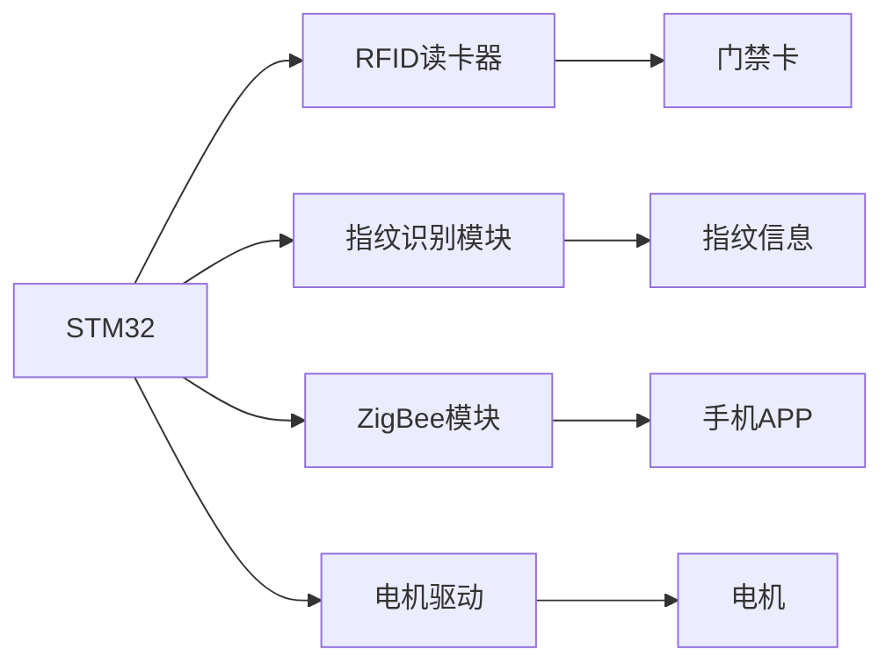

# 基于stm32的智能门锁设计

作者：禅与计算机程序设计艺术

## 1. 背景介绍

随着物联网技术的快速发展,智能家居已经逐渐走入人们的日常生活。作为智能家居的重要组成部分,智能门锁受到了广泛关注。智能门锁不仅能提供传统机械锁的安全性,还具备诸如远程开锁、密码修改、记录查询等智能化功能。本文将详细介绍一种基于STM32单片机的智能门锁设计方案。

### 1.1 智能门锁的发展现状

智能门锁经历了从机械锁到电子锁,再到如今的智能锁的发展过程。早期的智能门锁主要采用单片机作为控制核心,成本较高功能较为单一。随着物联网、人工智能等技术的发展,智能门锁呈现出多样化、智能化的发展趋势。

### 1.2 STM32在智能门锁中的应用优势  

STM32是意法半导体(ST)推出的一款基于ARM Cortex-M内核的32位微控制器。其具有高性能、低功耗、成本适中等优点,在工业控制、消费电子等领域得到广泛应用。将STM32应用于智能门锁,可以提供足够的运算能力,实现多种智能化功能。

### 1.3 本文的研究意义

本文旨在设计一款基于STM32的智能门锁,实现密码认证、指纹识别、远程控制、记录查询等功能。探索了STM32在智能门锁领域的应用,为相关产品的设计和研发提供参考。

## 2. 核心概念与联系

本节将介绍智能门锁设计涉及的核心概念,并阐述它们之间的内在联系。

### 2.1 STM32微控制器  

STM32是本设计的控制核心,其内部集成了ARM Cortex-M内核、Flash、SRAM等资源,可以满足智能门锁的处理需求。STM32通过GPIO、USART、IIC等接口与各类传感器、执行器进行数据交互。

### 2.2 RFID技术

RFID(Radio Frequency Identification,射频识别)是一种非接触式的自动识别技术。本设计利用RFID技术实现门禁卡的识别,用户只需将门禁卡靠近RFID读卡器,就能完成身份认证,提高了开锁的便捷性。

### 2.3 指纹识别算法  

指纹识别是智能门锁的重要功能之一。本设计采用光学指纹识别模块,并在STM32中实现指纹图像的特征提取和比对算法,实现指纹认证开锁。指纹识别算法的准确性和效率直接影响智能门锁的可靠性和用户体验。

### 2.4 无线通信协议

为实现远程控制功能,智能门锁需要支持无线通信。本设计选择了低功耗、组网灵活的ZigBee无线通信协议。通过ZigBee模块,智能门锁可以与手机、网关等设备进行数据通信,实现远程开锁、状态查询等功能。

下图展示了智能门锁各模块之间的关系:



## 3. 核心算法原理与具体操作步骤

智能门锁的核心算法包括指纹识别算法和数据加密算法。本节将重点介绍指纹识别算法的原理和实现步骤。

### 3.1 指纹识别算法原理

指纹识别算法通常分为两个阶段:指纹特征提取和指纹匹配。

#### 3.1.1 指纹图像预处理

为提高指纹识别的准确性,需要对采集到的指纹图像进行预处理,主要步骤包括:
1. 图像灰度化:将彩色图像转为灰度图像,减少计算量。
2. 图像二值化:根据灰度阈值将图像转为黑白二值图像。
3. 图像增强:通过直方图均衡化、平滑滤波等操作,提高图像质量。

#### 3.1.2 指纹特征提取

指纹特征提取是指从预处理后的指纹图像中提取特征信息,常用的特征包括指纹纹线走向、端点、分叉点等。提取步骤如下:
1. 指纹图像分割:去除指纹图像周围的背景区域。
2. 指纹纹线细化:将指纹纹线细化为单像素宽度。 
3. 特征点提取:检测指纹纹线的端点和分叉点,并记录其坐标。
4. 特征点筛选:剔除误检的特征点,得到可靠的特征点集合。

#### 3.1.3 指纹特征存储

将提取到的指纹特征转换为特定的数据格式,并存储到系统数据库中,用于后续的指纹匹配。常见的指纹特征存储格式有指纹模板、特征点坐标序列等。

#### 3.1.4 指纹匹配

指纹匹配是将当前采集到的指纹特征与数据库中存储的指纹特征进行比对,判断是否为同一指纹。常用的指纹匹配算法有:
1. 特征点匹配:比较两个指纹特征点集合之间的相似度。
2. 纹线匹配:比较两个指纹纹线走向的相似度。
3. 融合匹配:结合特征点和纹线信息进行综合匹配。

### 3.2 指纹识别算法实现步骤

本设计采用基于特征点的指纹识别算法,具体实现步骤如下:

#### 3.2.1 指纹图像采集与预处理
1. 通过光学指纹传感器采集指纹图像。
2. 对指纹图像进行灰度化和二值化处理。
3. 使用中值滤波算法对二值化图像进行平滑去噪。

#### 3.2.2 指纹特征提取
1. 采用八邻域法对指纹图像进行细化。
2. 通过像素值变化检测指纹纹线的端点和分叉点。
3. 提取特征点的方向和类型信息。
4. 剔除距离过近的特征点,得到可靠的特征点集合。

#### 3.2.3 指纹特征存储与匹配
1. 将特征点的坐标、方向、类型等信息按照一定格式组织成指纹模板。
2. 将指纹模板存储到STM32的Flash存储器中。
3. 在匹配阶段,提取当前指纹的特征点,与存储的指纹模板进行特征点匹配。
4. 统计匹配的特征点数量,超过阈值则认为匹配成功。

## 4. 数学模型和公式详细讲解举例说明

本节将介绍指纹识别算法中涉及的几个关键数学模型,并给出相应的公式和举例说明。

### 4.1 指纹图像二值化

指纹图像二值化是将灰度图像转换为黑白二值图像的过程,其数学模型可表示为:

$$
B(x,y) = \begin{cases}
1, & \text{if } G(x,y) \geq T \\
0, & \text{if } G(x,y) < T
\end{cases}
$$

其中,$B(x,y)$表示二值化后的像素值,$G(x,y)$表示原始灰度值,$T$为二值化阈值。

举例说明:假设某指纹图像的灰度阈值为100,则灰度值大于等于100的像素点被置为1(白色),灰度值小于100的像素点被置为0(黑色)。

### 4.2 指纹纹线细化

指纹纹线细化是将粗细不均的指纹纹线细化为单像素宽度的过程,常用的细化算法有Hilditch算法和Zhang-Suen算法。以Zhang-Suen算法为例,其数学模型为:

1. 定义像素点$P_1$的八邻域如下:

```
P9 P2 P3
P8 P1 P4
P7 P6 P5
```

2. 定义两个条件函数:
   
$$
\begin{aligned}
B(P_1) &= \sum_{i=2}^9 S(P_i) \\
A(P_1) &= \sum_{i=2}^9 |P_i - P_{i+1}|, P_{10}=P_2
\end{aligned}
$$

其中,$S(P_i)$表示像素值为1的像素点数量。

3. 像素点$P_1$满足以下4个条件则被删除:
   - $2 \leq B(P_1) \leq 6$
   - $A(P_1) = 1$
   - $P_2 \times P_4 \times P_6 = 0$
   - $P_4 \times P_6 \times P_8 = 0$

4. 重复步骤3,直到没有像素点被删除。

### 4.3 指纹特征点提取

指纹特征点提取是在细化后的指纹纹线上检测端点和分叉点。以端点检测为例,其数学模型为:

1. 定义像素点$P_1$的八邻域(同4.2节)。

2. 定义端点条件函数:

$$
E(P_1) = \sum_{i=2}^9 |P_i - P_{i+1}|, P_{10}=P_2
$$

3. 如果$E(P_1) = 2$,则$P_1$为端点。

举例说明:假设像素点$P_1$的八邻域像素值为:

```
0 0 0
1 P1 0
0 1 0
```

则$E(P_1) = |0-0| + |0-0| + |0-1| + |1-0| + |0-1| + |1-0| + |0-0| = 2$,故$P_1$为端点。

### 4.4 指纹特征点匹配

指纹特征点匹配是比较两个指纹特征点集合的相似度,常用的算法有最小距离匹配和结构匹配。以最小距离匹配为例,其数学模型为:

1. 设两个指纹的特征点集合分别为$A=\{a_1,a_2,...,a_m\}$和$B=\{b_1,b_2,...,b_n\}$。

2. 定义特征点之间的距离为欧氏距离:

$$
d(a_i,b_j) = \sqrt{(x_{a_i}-x_{b_j})^2 + (y_{a_i}-y_{b_j})^2}
$$

其中,$(x_{a_i},y_{a_i})$和$(x_{b_j},y_{b_j})$分别表示特征点$a_i$和$b_j$的坐标。

3. 对于集合$A$中的每个特征点$a_i$,在集合$B$中找到距离最小的特征点$b_j$,记为一对匹配点。

4. 统计匹配点对的数量$N$,计算匹配度:

$$
S = \frac{N}{\min(m,n)} \times 100\%
$$

举例说明:假设集合$A$有5个特征点,集合$B$有6个特征点,通过最小距离匹配找到了4对匹配点,则匹配度$S=\frac{4}{5} \times 100\% = 80\%$。

## 5. 项目实践:代码实例与详细解释说明

本节将给出智能门锁项目中几个关键模块的代码实例,并进行详细的解释说明。

### 5.1 STM32初始化配置

在使用STM32进行开发时,首先需要对其进行初始化配置,主要包括时钟配置、GPIO配置、USART配置等。以时钟配置为例:

```c
void SystemClock_Config(void)
{
  RCC_OscInitTypeDef RCC_OscInitStruct = {0};
  RCC_ClkInitTypeDef RCC_ClkInitStruct = {0};

  // 配置时钟源  
  RCC_OscInitStruct.OscillatorType = RCC_OSCILLATORTYPE_HSE;
  RCC_OscInitStruct.HSEState = RCC_HSE_ON;
  RCC_OscInitStruct.HSEPredivValue = RCC_HSE_PREDIV_DIV1;
  RCC_OscInitStruct.HSIState = RCC_HSI_ON;
  RCC_OscInitStruct.PLL.PLLState = RCC_PLL_ON;
  RCC_OscInitStruct.PLL.PLLSource = RCC_PLLSOURCE