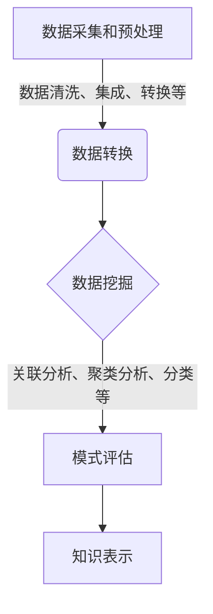

# 基于数据挖掘的图书馆智慧信息服务研究

## 1. 背景介绍

### 1.1 图书馆服务的重要性

图书馆是知识和信息的宝库,为读者提供丰富的资源和服务。在当今信息时代,图书馆的作用不仅仅是传统的藏书楼,更是知识传播和学习交流的重要场所。提供优质的信息服务,满足读者多样化的需求,是图书馆的核心使命。

### 1.2 数据挖掘在图书馆服务中的应用

随着大数据时代的到来,图书馆积累了大量的数字资源和用户行为数据。如何高效利用这些数据,深入挖掘潜在的知识价值,成为图书馆智慧服务的关键。数据挖掘技术作为一种先进的数据分析方法,可以从海量数据中发现有价值的模式和规律,为图书馆决策和服务优化提供有力支持。

### 1.3 研究目的和意义

本研究旨在探索基于数据挖掘的图书馆智慧信息服务模式,提出一种系统的理论框架和技术方法。通过对图书馆数据进行深入分析和知识发现,实现个性化推荐、资源优化配置、服务质量评估等智慧化应用,提升图书馆服务水平,更好地满足读者需求。

## 2. 核心概念与联系

### 2.1 数据挖掘

数据挖掘(Data Mining)是从大量的数据中通过自动或半自动的方式提取出之前未知的、隐含的和潜在有用的信息和知识的过程。它融合了多种技术,包括机器学习、模式识别、统计学、数据库技术等。

#### 2.1.1 数据挖掘过程

数据挖掘一般包括以下几个主要步骤:

1. 数据采集和预处理
2. 数据转换
3. 数据挖掘
4. 模式评估
5. 知识表示



#### 2.1.2 数据挖掘常用算法

一些常用的数据挖掘算法包括:

- 决策树算法(Decision Tree)
- 贝叶斯分类算法(Naive Bayes) 
- 人工神经网络(Artificial Neural Network)
- K-Means聚类算法
- Apriori关联规则挖掘算法
- ...

### 2.2 图书馆智慧信息服务

图书馆智慧信息服务是指利用大数据、云计算、人工智能等新兴技术,对图书馆数据资源进行深度分析和智能处理,从而实现信息服务的智能化、个性化和高效化。它包括以下几个主要方面:

- 个性化推荐服务
- 智能检索和知识发现
- 资源优化配置
- 服务质量评估
- 决策支持系统
- ...

### 2.3 数据挖掘与图书馆智慧服务的联系

数据挖掘技术为图书馆智慧信息服务提供了有力支撑。通过对图书馆数字资源、读者行为数据、服务日志等进行深入挖掘,可以发现隐藏的知识模式,为个性化推荐、资源优化、服务评估等应用提供决策依据。数据挖掘与图书馆智慧服务相辅相成,共同推动图书馆服务的智能化和现代化发展。

## 3. 核心算法原理具体操作步骤  

在图书馆智慧信息服务中,数据挖掘算法扮演着核心角色。下面将介绍几种常用的数据挖掘算法及其在图书馆应用场景中的具体实现步骤。

### 3.1 关联规则挖掘算法 - Apriori算法

关联规则挖掘是发现事物之间存在的内在联系的过程,广泛应用于购物篮分析、网页挖掘等领域。在图书馆场景中,可用于发现读者借阅行为的关联模式,为个性化推荐和资源调配提供支持。

Apriori算法是经典的关联规则挖掘算法,具体步骤如下:

1. 设置最小支持度阈值minsup和最小置信度阈值minconf
2. 扫描数据集,统计每个项集的支持度
3. 保留支持度 >= minsup 的频繁项集
4. 利用频繁项集生成候选关联规则
5. 计算每条规则的置信度
6. 输出置信度 >= minconf 的强关联规则

```python
# Apriori 伪代码
def apriori(dataset, minsup, minconf):
    freq_itemsets = find_frequent_itemsets(dataset, minsup) # 找到所有频繁项集
    rules = []
    for itemset in freq_itemsets:
        rules += generate_rules(itemset, dataset, minconf) # 生成强关联规则
    return rules

def generate_rules(itemset, dataset, minconf):
    rules = []
    for i in range(1, len(itemset)):
        antecedants = list(itertools.combinations(itemset, i))
        consequents = [set(itemset) - set(ant) for ant in antecedants]
        rules += [Rule(ant, cons, dataset) for ant, cons in zip(antecedants, consequents)
                  if Rule(ant, cons, dataset).confidence >= minconf]
    return rules
```

### 3.2 聚类分析算法 - K-Means算法

聚类分析是将数据对象分成多个类或簇的过程,目的是使同一簇内的对象相似,而不同簇之间的对象不相似。在图书馆应用中,可用于读者群体划分、图书分类等。

K-Means是一种简单有效的聚类算法,步骤如下:

1. 选择K个初始质心
2. 将每个数据对象分配到最近的质心所属的簇
3. 重新计算每个簇的质心
4. 重复步骤2和3,直到质心不再变化

```python
# K-Means 伪代码 
def k_means(dataset, k):
    centroids = initialize_centroids(dataset, k) # 初始化质心
    clusters = [-1] * len(dataset) # 初始化簇分配
    converged = False
    while not converged:
        old_clusters = clusters.copy()
        for i, data in enumerate(dataset):
            clusters[i] = closest_centroid(data, centroids) # 分配到最近质心
        centroids = recompute_centroids(dataset, clusters, k) # 重新计算质心
        converged = (old_clusters == clusters) # 检查是否收敛
    return clusters
```

### 3.3 决策树算法 - C4.5算法

决策树是一种常用的分类和预测算法,通过构建决策树模型对数据进行分类。在图书馆中可用于读者行为预测、图书分类等。

C4.5算法是经典的决策树生成算法,基于信息增益准则递归地构建决策树,主要步骤包括:

1. 计算数据集的信息熵
2. 对于每个特征,计算其信息增益
3. 选择信息增益最大的特征作为根节点
4. 根据该特征将数据集分割成子集
5. 对每个子集递归调用步骤1-4,构建子树
6. 直到满足停止条件,生成决策树模型

```python
# C4.5 伪代码
def C45(dataset, features):
    root = get_best_feature(dataset, features) # 选择最优特征作为根节点
    tree = {root: {}}
    values = dataset[root].unique() # 获取该特征的所有值
    for value in values:
        subtree = C45(dataset[dataset[root]==value].drop(root, axis=1), features-{root})
        tree[root][value] = subtree
    return tree
```

以上算法展示了数据挖掘在图书馆智慧服务中的应用,通过对读者行为数据、图书元数据等进行分析和建模,可以发现有价值的知识模式,为个性化推荐、资源优化等应用提供支持。

## 4. 数学模型和公式详细讲解举例说明

在数据挖掘算法中,通常需要使用一些数学模型和公式来量化数据特征、评估模型性能等。下面将详细介绍一些常用的数学模型和公式。

### 4.1 信息熵和信息增益

信息熵(Entropy)是信息论中的一个重要概念,用于衡量数据的无序程度。在决策树算法中,信息熵被用于选择最优特征进行数据分割。

给定数据集D,包含m个类别,第i个类别的概率为$p_i$,则数据集D的信息熵定义为:

$$
Ent(D) = -\sum_{i=1}^m p_i \log_2 p_i
$$

信息增益(Information Gain)衡量了由于特征的引入而使得数据集的无序程度降低的程度。设特征A有n个不同的取值{$a_1, a_2, ..., a_n$},根据特征A将数据集D分割成n个子集{$D_1, D_2, ..., D_n$},则信息增益计算公式为:

$$
Gain(D, A) = Ent(D) - \sum_{j=1}^n \frac{|D_j|}{|D|} Ent(D_j)
$$

在构建决策树时,我们选择信息增益最大的特征作为根节点,使得后续分支的无序程度降低最多。

### 4.2 支持度和置信度

在关联规则挖掘中,支持度(Support)和置信度(Confidence)是评价规则重要性的两个重要指标。

假设数据集D包含n个项目,规则$X \Rightarrow Y$表示如果项目集X出现,则项目集Y也会出现。规则的支持度和置信度定义如下:

- 支持度:包含项目集X和Y的记录数占总记录数的比例
    $$
    \text{Support}(X \Rightarrow Y) = \frac{\text{count}(X \cup Y)}{n}
    $$
- 置信度:包含项目集X的记录中同时包含Y的比例
    $$
    \text{Confidence}(X \Rightarrow Y) = \frac{\text{count}(X \cup Y)}{\text{count}(X)}
    $$

在关联规则挖掘算法(如Apriori算法)中,通常设置一个最小支持度阈值和最小置信度阈值,只输出满足这两个条件的强关联规则。

### 4.3 簇内平方和和簇间平方和

在聚类分析中,簇内平方和(Within-Cluster Sum of Squares, WCSS)和簇间平方和(Between-Cluster Sum of Squares, BCSS)是评估聚类质量的两个重要指标。

假设数据集D包含n个数据点{$x_1, x_2, ..., x_n$},被划分为k个簇{$C_1, C_2, ..., C_k$},每个簇$C_i$的质心为$\mu_i$,则:

- 簇内平方和:衡量每个簇内部数据点与质心的偏离程度
    $$
    \text{WCSS} = \sum_{i=1}^k \sum_{x \in C_i} \left\Vert x - \mu_i \right\Vert^2
    $$
- 簇间平方和:衡量不同簇质心之间的离散程度
    $$
    \text{BCSS} = \sum_{i=1}^k |C_i| \left\Vert \mu_i - \mu \right\Vert^2
    $$
    其中$\mu$是整个数据集的质心。

一般来说,簇内平方和越小、簇间平方和越大,表示聚类质量越好。K-Means等聚类算法通常以最小化WCSS作为目标函数。

通过上述数学模型和公式,我们可以量化数据挖掘算法中的各种指标,为模型评估和参数选择提供理论支持。

## 5. 项目实践:代码实例和详细解释说明

为了更好地理解数据挖掘算法在图书馆智慧服务中的应用,下面将通过具体的Python代码示例,演示如何实现关联规则挖掘、聚类分析和决策树构建。

### 5.1 关联规则挖掘 - 基于Apriori算法的读者借阅行为分析

```python
import pandas as pd
from mlxtend.frequent_patterns import apriori, association_rules

# 加载图书馆借阅记录数据
loans = pd.read_csv('library_loans.csv')

# 将每个借阅记录转换为项目集
transactions = []
for _, basket in loans.groupby(['user_id', 'loan_date']):
    transactions.append(list(