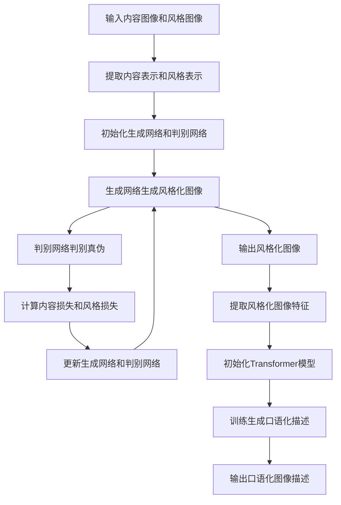

# 基于生成对抗网络的口语化图片表达风格迁移技术

## 1. 背景介绍

### 1.1 图像风格迁移的重要性

在当今视觉信息时代,图像数据无处不在,对图像进行风格迁移具有重要的应用价值。图像风格迁移技术可以将一种风格迁移到另一种图像上,使图像获得全新的视觉体验。这种技术在多个领域都有广泛应用,例如:

- 艺术创作:将名画风格迁移到普通照片上,赋予照片独特的艺术魅力
- 图像增强:提高图像质量、对比度等,增强图像的细节和视觉冲击力  
- 影视特效:将真实场景与动画风格相结合,制作逼真的视觉特效
- 图像编辑:对图像进行风格化编辑,满足个性化需求

### 1.2 口语化图像表达的意义

口语化图像表达是指将图像内容以口语化、生动形象的方式进行表达。与枯燥的技术描述不同,口语化表达更贴近人类的理解和交流方式,具有以下优势:

- 增强图像可理解性:通过生动形象的语言,使图像内容更容易被理解
- 提高交互体验:口语化表达有助于人机交互,提升用户体验
- 促进跨领域应用:口语化表达能够将专业领域知识通俗化,推动跨领域应用

因此,将口语化表达与图像风格迁移技术相结合,可以为图像内容赋予全新的表现形式,拓展图像数据的应用场景。

## 2. 核心概念与联系

### 2.1 生成对抗网络(GAN)

生成对抗网络是一种由生成模型和判别模型组成的无监督深度学习架构。其核心思想是通过生成模型生成逼真的数据样本,而判别模型则判断生成的样本是真实的还是伪造的。两个模型相互对抗,最终达到生成模型生成的样本无法被判别模型区分的状态。

生成对抗网络可以概括为一个minimax二人游戏,生成模型和判别模型相互对抗,目标是找到一个纳什均衡:

$$\min_G \max_D V(D,G) = \mathbb{E}_{x\sim p_{\text{data}}(x)}\big[\log D(x)\big] + \mathbb{E}_{z\sim p_z(z)}\big[\log(1-D(G(z)))\big]$$

其中,$G$是生成模型,$D$是判别模型,$p_{\text{data}}$是真实数据分布,$p_z$是噪声输入的分布。

### 2.2 图像风格迁移

图像风格迁移是指将一种图像风格(如画作风格)迁移到另一种图像内容(如照片)上,生成具有新风格的图像。这个过程可以分为两个步骤:

1. 内容表示提取:从内容图像中提取内容表示,保留图像的内容信息
2. 风格迁移:将风格图像的风格迁移到内容表示上,生成新的图像

常见的风格迁移方法包括基于神经网络的优化方法和基于生成对抗网络的方法等。

### 2.3 口语化图像表达

口语化图像表达是指使用口语化、生动形象的语言来描述图像内容。这需要将图像的视觉信息转化为自然语言表达,捕捉图像的关键内容和细节特征。

常见的口语化图像描述方法包括:

- 基于模板的方法:使用预定义的模板将视觉特征转化为语句
- 基于检索的方法:检索与图像相似的描述语句
- 基于生成的方法:使用序列生成模型直接生成图像描述

### 2.4 核心联系

基于生成对抗网络的口语化图像表达风格迁移技术,是将上述三个核心概念紧密结合的创新方法:

1. 利用生成对抗网络进行图像风格迁移,生成新的风格化图像
2. 针对风格化图像,使用口语化图像描述技术生成生动形象的语言描述
3. 语言描述不仅包含图像内容,还融入了风格化的视觉元素,实现内容与风格的完美融合

该技术的创新之处在于,不仅能生成具有新颖视觉风格的图像,还能用口语化的方式对图像内容和风格进行生动描述,为图像数据赋予全新的表现形式和交互体验。

## 3. 核心算法原理及操作步骤

### 3.1 生成对抗网络风格迁移

生成对抗网络风格迁移的核心思路是:使用生成网络生成风格化图像,判别网络则判断生成图像是否符合目标风格。两个网络相互对抗,促使生成网络生成更加贴近目标风格的图像。

算法步骤如下:

1. **数据准备**:准备内容图像$x$和风格图像$y$的数据集
2. **网络初始化**:初始化生成网络$G$和判别网络$D$
3. **内容表示提取**:使用预训练的深度卷积网络(如VGG19)提取内容图像$x$的内容表示$C(x)$
4. **风格表示提取**:提取风格图像$y$的风格表示$S(y)$,通常使用Gram矩阵来表示
5. **生成网络训练**:
    - 对于生成网络$G$,目标是最小化内容损失$L_C$和风格损失$L_S$:
        
        $$L_G = \alpha L_C(G(z),x) + \beta L_S(G(z),y)$$
        
        其中,$\alpha,\beta$是权重系数,$L_C$测量生成图像与内容图像的内容差异,$L_S$测量生成图像与风格图像的风格差异。
    - 对于判别网络$D$,目标是最大化判别真实风格图像和生成图像的能力:
    
        $$L_D = -\mathbb{E}_{y\sim p_{\text{data}}}[\log D(y)] - \mathbb{E}_{z\sim p_z}[\log(1-D(G(z)))]$$
        
6. **生成风格化图像**:经过多轮训练后,生成网络$G$能够生成同时保留内容特征和风格特征的风格化图像。

该算法的关键是通过对抗训练,促使生成网络学习到内容图像的内容表示和风格图像的风格表示,从而生成具有新颖风格的图像。

### 3.2 口语化图像描述

为了生成风格化图像的口语化描述,我们可以采用基于Transformer的序列生成模型,例如BERT等。算法步骤如下:

1. **数据准备**:准备图像-描述对的数据集,其中描述使用口语化、生动形象的语言表达
2. **特征提取**:使用预训练的卷积神经网络(如ResNet)提取图像的视觉特征向量
3. **模型初始化**:初始化Transformer编码器-解码器模型
4. **模型训练**:
    - 将图像特征向量输入编码器,生成上下文向量表示
    - 将上下文向量和描述序列输入解码器,训练解码器生成目标描述
    - 损失函数为生成序列与目标序列的交叉熵损失
5. **生成描述**:对于新的风格化图像,提取其特征向量,输入训练好的模型,生成其口语化描述序列。

该算法的关键是使用Transformer模型直接从图像特征生成描述序列,避免了中间表示,能够生成更加流畅自然的描述。同时,通过训练数据的设计,模型能够学习到生动形象的语言表达方式。

### 3.3 算法流程图

上述流程图展示了该算法的整体流程,包括生成对抗网络风格迁移和基于Transformer的口语化图像描述两个主要部分。通过两个模型的有机结合,实现了图像内容、视觉风格与口语化描述的融合。

## 4. 数学模型和公式详细讲解

### 4.1 生成对抗网络损失函数

生成对抗网络的目标是找到一个纳什均衡,使得生成网络$G$生成的图像无法被判别网络$D$区分为伪造图像。这可以表示为一个minimax优化问题:

$$\min_G \max_D V(D,G) = \mathbb{E}_{x\sim p_{\text{data}}(x)}\big[\log D(x)\big] + \mathbb{E}_{z\sim p_z(z)}\big[\log(1-D(G(z)))\big]$$

其中,$p_{\text{data}}$是真实数据分布,$p_z$是噪声输入$z$的分布。

判别网络$D$的目标是最大化判别真实样本和生成样本的能力,即最大化$\log D(x)$和$\log(1-D(G(z)))$的期望。而生成网络$G$的目标是最小化$\log(1-D(G(z)))$,使得生成的样本$G(z)$被判别为真实样本。

在实际训练中,通常采用如下策略:

1. 固定生成网络$G$,最大化判别网络$D$的目标:

$$\max_D V(D,G) = \mathbb{E}_{x\sim p_{\text{data}}(x)}\big[\log D(x)\big] + \mathbb{E}_{z\sim p_z(z)}\big[\log(1-D(G(z)))\big]$$

2. 固定判别网络$D$,最小化生成网络$G$的目标:

$$\min_G V(G) = \mathbb{E}_{z\sim p_z(z)}\big[\log(1-D(G(z)))\big]$$

这种交替优化的方式能够促进生成网络和判别网络相互提升,最终达到生成网络生成的样本无法被判别网络区分的状态。

### 4.2 图像风格迁移损失函数

在图像风格迁移中,生成网络$G$的目标是生成同时保留内容特征和风格特征的图像。因此,损失函数包括两个部分:内容损失和风格损失。

**内容损失**:

内容损失$L_C$衡量生成图像$G(z)$与内容图像$x$的内容差异,通常使用预训练的卷积神经网络(如VGG19)提取特征,计算特征映射之间的均方差:

$$L_C(G(z),x) = \frac{1}{N}\sum_{i,j}(F_{ij}^l(G(z))-F_{ij}^l(x))^2$$

其中,$F^l$是网络第$l$层的特征映射,$N$是特征映射的尺寸。

**风格损失**:

风格损失$L_S$衡量生成图像$G(z)$与风格图像$y$的风格差异,通常使用Gram矩阵来表示风格特征:

$$G_{ij}^l = \sum_k F_{ik}^lF_{jk}^l$$

其中,$G^l$是第$l$层特征映射的Gram矩阵。风格损失定义为生成图像和风格图像Gram矩阵之间的均方差:

$$L_S(G(z),y) = \frac{1}{N^2M}\sum_{l=1}^M\sum_{i,j}(G_{ij}^l(G(z))-G_{ij}^l(y))^2$$

其中,$M$是用于计算风格损失的特征映射层数。

**总损失函数**:

生成网络$G$的总损失函数是内容损失和风格损失的加权和:

$$L_G = \alpha L_C(G(z),x) + \beta L_S(G(z),y)$$

其中,$\alpha,\beta$是权重系数,用于平衡内容保持和风格迁移的重要性。

通过最小化总损失函数,生成网络$G$能够生成同时保留内容特征和风格特征的图像。

### 4.3 Transformer模型序列生成

在口语化图像描述中,我们采用基于Transformer的