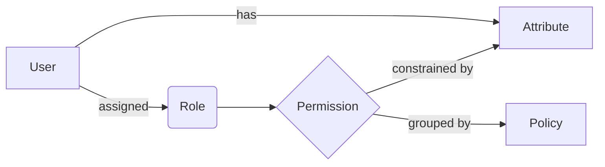

# 多级身份管理系统设计与实现

作者：禅与计算机程序设计艺术

## 1. 背景介绍

在当今数字化时代,身份管理已成为各个组织和企业的关键议题。随着业务复杂度的增加和用户群体的扩大,传统的单一层次身份管理模式已无法满足日益增长的安全性、可扩展性和灵活性需求。因此,设计和实现一个多级身份管理系统成为了亟待解决的问题。

本文将深入探讨多级身份管理系统的设计原理和实现方法,提出一种基于角色的访问控制(RBAC)和属性的访问控制(ABAC)相结合的混合模型,并给出了详细的系统架构设计和核心算法。通过对实际项目的代码实践和应用场景分析,展示了该系统在解决复杂身份管理问题方面的优势。最后,本文还对多级身份管理领域的未来发展趋势和挑战进行了展望。

### 1.1 身份管理的重要性

在信息安全领域,身份管理是一个至关重要的概念。它涉及到对用户身份的确认、授权和访问控制等一系列过程。有效的身份管理可以帮助组织:

- 提高系统和数据的安全性
- 简化用户账户的管理
- 加强合规性和审计能力
- 改善用户体验和工作效率

### 1.2 传统身份管理模式的局限性

传统的身份管理通常采用单一层次的用户-权限直接映射模型。这种模式存在以下局限性:

- 难以应对大规模用户和复杂权限的管理
- 缺乏灵活性,无法适应组织结构和业务需求的变化 
- 容易出现权限分配混乱和冗余
- 审计和合规性追踪困难

### 1.3 多级身份管理的优势

相比传统模式,多级身份管理具有以下优势:

- 引入角色和属性的抽象层,简化了权限管理
- 支持更细粒度和动态的访问控制
- 提供更好的可扩展性和灵活性
- 增强了审计和合规性追踪能力
- 提高了系统的安全性和可维护性

## 2. 核心概念与联系

要设计一个多级身份管理系统,首先需要理解其中的几个核心概念:

### 2.1 用户(User)

用户是系统中的个体,可以是人、设备或应用程序。每个用户都有一个唯一的标识符。

### 2.2 角色(Role)

角色是一组权限的集合,代表了用户在系统中的职责和任务。角色可以层次化组织,支持继承关系。

### 2.3 权限(Permission)

权限定义了对资源的访问规则,包括对资源的操作类型(如读、写、执行等)和约束条件。

### 2.4 属性(Attribute)

属性是用户、角色、权限或环境的一些特征,如用户的部门、角色的激活时间、访问的IP地址等。属性可用于定义更细粒度的访问控制规则。

### 2.5 策略(Policy)

策略是一组访问控制规则的集合,用于定义在什么条件下允许或拒绝对资源的访问。策略可基于角色或属性来制定。

以下是这些概念之间的关系图:



在该系统中,用户被分配一个或多个角色,角色关联了一组权限。同时,用户和权限都可以有属性,属性可用于对权限进行约束。权限根据策略进行分组管理。

## 3. 核心算法原理与操作步骤

本节将介绍实现多级身份管理系统的核心算法——基于角色的访问控制(RBAC)和基于属性的访问控制(ABAC)。

### 3.1 RBAC算法

RBAC的核心思想是将权限与角色关联,再将角色分配给用户。当用户请求访问资源时,系统根据用户的角色来判断是否允许访问。

#### 3.1.1 RBAC模型

RBAC模型包含以下几个关键元素:

- 用户(User):系统中的个体。
- 角色(Role):代表一组权限的集合。
- 权限(Permission):对资源的访问规则。
- 会话(Session):用户与系统交互的上下文。

它们之间的关系如下:

- 用户与角色之间是多对多的关系(UA)
- 角色与权限之间是多对多的关系(PA) 
- 用户与角色之间的映射称为用户分配(User Assignment)
- 角色与权限之间的映射称为权限分配(Permission Assignment)

#### 3.1.2 RBAC的访问控制流程

1. 用户登录系统,创建会话。
2. 在会话中,用户被激活一个或多个角色。
3. 当用户请求访问资源时,系统检查该用户的活跃角色是否拥有相应的权限。
4. 如果有权限,则允许访问;否则,拒绝访问。

#### 3.1.3 RBAC的角色继承

RBAC支持角色继承,即角色可以形成层次结构。子角色继承父角色的所有权限。

例如,假设有以下角色继承关系:

```
Employee
  |- Developer 
  |- Manager
     |- Senior Manager
```

如果 `Employee` 角色拥有 `read` 权限,则 `Developer`、`Manager` 和 `Senior Manager` 都自动继承了这个权限。

### 3.2 ABAC算法

ABAC的核心思想是根据属性来定义访问控制规则。属性可以是用户属性、资源属性、环境属性或自定义属性。

#### 3.2.1 ABAC模型

ABAC模型包含以下几个关键元素:

- 主体(Subject):发起访问请求的实体,可以是用户、设备或应用程序。
- 客体(Object):被访问的资源,如文件、数据库记录等。
- 操作(Action):对资源执行的操作,如读、写、删除等。
- 环境(Environment):访问发生的上下文,如时间、地点、IP地址等。
- 策略(Policy):定义了在什么条件下允许或拒绝访问。

#### 3.2.2 ABAC的访问控制流程

1. 主体发起访问请求,提供自己的属性信息。
2. 系统获取请求中的主体、客体、操作和环境属性。
3. 将属性与预定义的策略进行匹配。
4. 如果满足策略条件,则允许访问;否则,拒绝访问。

#### 3.2.3 ABAC策略的定义

ABAC策略使用布尔表达式来定义访问控制规则。例如:

```
(user.department = "IT" AND user.role = "Developer") OR 
(user.department = "Finance" AND resource.type = "financial_report")
```

该策略表示:如果用户属于IT部门且角色是Developer,或者用户属于财务部门且访问的是财务报告,则允许访问。

### 3.3 RBAC与ABAC的结合

RBAC和ABAC可以结合使用,形成一个更加灵活和细粒度的访问控制模型。

具体而言,可以在RBAC的基础上,为角色和权限添加属性约束。这样,角色不仅代表了一组权限,还具有了动态的属性条件。

例如,可以定义一个策略:

```
role = "Manager" AND time.hour >= 9 AND time.hour <= 17
```

该策略表示:只有在工作时间(9点到17点)内,拥有Manager角色的用户才能访问某个资源。

结合RBAC和ABAC的优势在于:

- RBAC提供了一个清晰的角色层次结构,便于管理和理解。
- ABAC提供了更细粒度的属性约束,支持动态的访问控制。
- 两者结合可以大大简化策略的定义和维护,提高系统的灵活性和可扩展性。

## 4. 数学模型与公式

本节介绍多级身份管理系统中涉及的数学模型和公式。

### 4.1 RBAC的形式化定义

我们可以使用以下元组来形式化定义RBAC模型:

$$
RBAC = (U, R, P, UA, PA)
$$

其中:

- $U$: 用户集合
- $R$: 角色集合
- $P$: 权限集合
- $UA \subseteq U \times R$: 用户-角色分配关系
- $PA \subseteq R \times P$: 角色-权限分配关系

例如,假设有以下用户、角色和权限:

- 用户: $U = \{u_1, u_2, u_3\}$
- 角色: $R = \{r_1, r_2, r_3\}$
- 权限: $P = \{p_1, p_2, p_3, p_4\}$

则可以定义以下用户-角色分配关系:

$$
UA = \{(u_1, r_1), (u_1, r_2), (u_2, r_2), (u_3, r_3)\}
$$

和角色-权限分配关系:

$$
PA = \{(r_1, p_1), (r_1, p_2), (r_2, p_2), (r_2, p_3), (r_3, p_4)\}
$$

### 4.2 RBAC的角色继承模型

假设角色之间存在继承关系 $\preceq$,其中 $r_1 \preceq r_2$ 表示 $r_1$ 继承 $r_2$ 的所有权限。

我们可以定义一个继承闭包函数 $h: R \rightarrow 2^R$:

$$
h(r) = \{r' \in R | r' \preceq r\}
$$

该函数返回角色 $r$ 的所有祖先角色集合。

则角色 $r$ 的有效权限集合 $P_r$ 为:

$$
P_r = \bigcup_{r' \in h(r)} \{p \in P | (r', p) \in PA\}
$$

即角色 $r$ 自身的权限与其所有祖先角色的权限的并集。

### 4.3 ABAC的策略模型

在ABAC中,策略可以用一个布尔表达式来表示:

$$
policy: A_1 \times A_2 \times ... \times A_n \rightarrow \{true, false\}
$$

其中 $A_i$ 是属性 $i$ 的取值集合。

例如,对于一个包含用户角色和时间属性的策略:

$$
policy(role, time) = (role = "Manager" \land time \geq 9 \land time \leq 17)
$$

该策略可以用以下真值表来表示:

| role      | time | policy |
|-----------|------|--------|
| Manager   | 8    | false  |
| Manager   | 10   | true   |
| Developer | 10   | false  |
| ...       | ...  | ...    |

策略的求值过程可以看作一个函数,将属性值映射到布尔值:

$$
eval: (a_1, a_2, ..., a_n) \mapsto policy(a_1, a_2, ..., a_n)
$$

其中 $a_i \in A_i$ 是属性 $i$ 的具体取值。

## 5. 项目实践

本节通过一个简单的项目实例,演示如何使用Java语言实现一个基于RBAC和ABAC相结合的多级身份管理系统。

### 5.1 项目结构

项目采用分层架构,主要包含以下几个模块:

- `model`: 存放核心模型类,如 `User`、`Role`、`Permission` 等。
- `dao`: 数据访问层,负责与数据库交互。
- `service`: 业务逻辑层,实现身份管理的核心功能。
- `controller`: 控制器层,提供RESTful API接口。

### 5.2 核心模型

#### 5.2.1 用户模型

```java
public class User {
    private Long id;
    private String username;
    private String password;
    private Set<Role> roles;
    // getters and setters
}
```

#### 5.2.2 角色模型

```java
public class Role {
    private Long id;
    private String name;
    private Set<Permission> permissions;
    // getters and setters
}
```

#### 5.2.3 权限模型

```java
public class Permission {
    private Long id;
    private String name;
    private String resource;
    private String action;
    // getters and setters
}
```

### 5.3 数据访问层

数据访问层使用Spring Data JPA实现,主要包含以下接口:

```java
public interface UserRepository extends JpaRepository<User, Long> {
    User findByUsername(String username);
}

public interface RoleRepository extends JpaRepository<Role, Long> {
    Role findByName(String name);
}

public interface 