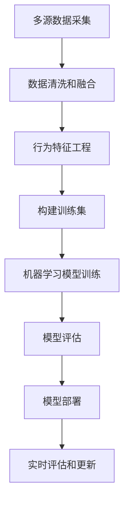

# 大数据下个人用户信用行为的等级评估及应用研究

## 1.背景介绍

### 1.1 信用评估的重要性

在当今的数字时代,个人信用评估已经成为金融、电子商务、共享经济等诸多领域的关键基础。良好的信用记录不仅能够为个人带来更多的机会和便利,同时也是社会信任和和谐发展的重要保证。随着大数据时代的到来,海量的个人行为数据为信用评估提供了前所未有的数据支撑,使得传统的信用评估方式面临着巨大的挑战和变革。

### 1.2 大数据环境下的新挑战

大数据时代,个人在线上的行为数据呈现出多源异构、高维度、动态演化等新特征,这给信用评估带来了以下几个主要挑战:

1. 数据质量问题:来源复杂、噪声较大、缺失值多等,需要有效的数据清洗和处理方法。
2. 隐私保护问题:个人行为数据涉及隐私,需要在数据使用和隐私保护之间寻求平衡。
3. 实时性评估问题:用户行为是动态变化的,需要实时更新评估以反映最新信用状况。
4. 可解释性问题:传统评估方法往往是黑箱操作,而新的评估方法需要具有较好的可解释性。

### 1.3 研究目标和意义

针对上述挑战,本文将探讨如何利用大数据分析技术,建立一种新的个人信用行为等级评估模型。该模型应能够有效地从多源异构的大数据中提取用户信用行为特征,并基于机器学习算法对用户的信用行为进行分级评估,从而为各类信用决策提供数据支持。

该研究对于完善个人信用体系、促进数字经济健康发展、维护社会信任秩序等具有重要的理论意义和现实意义。

## 2.核心概念与联系

### 2.1 个人信用行为

个人信用行为是指个人在经济活动和社会生活中所表现出的诚实守信、依法履约的行为表现。良好的信用行为不仅体现个人的诚信修养,也是社会信任的基础。常见的个人信用行为包括:

- 金融信用行为:如按时还贷、信用卡使用情况等
- 消费行为:如网购行为、共享经济使用情况等
- 社会行为:如交通违章、执法记录等
- 网络行为:如网上评论、社交媒体发言等

### 2.2 大数据与个人信用评估

传统的个人信用评估主要依赖有限的金融数据和人工评估,存在数据来源单一、评估滞后、过程不透明等缺陷。而大数据时代,个人在线上的海量行为数据为信用评估提供了新的数据支撑,使得评估过程更加全面、实时和透明。

大数据为个人信用评估提供了以下机遇:

1. 数据全面性:能够覆盖金融、消费、社会、网络等多个维度的行为数据
2. 实时动态性:能够实时采集和更新用户最新行为
3. 行为挖掘性:能够深度挖掘用户行为模式和潜在特征

### 2.3 信用等级评估模型

信用等级评估模型是将个人信用行为数据转化为可解释的信用等级评分的核心模块。一个好的评估模型应具备:

- 特征工程:能够从原始数据中提取有效的行为特征
- 算法模型:基于机器学习算法进行自动化评估
- 等级划分:将评估结果映射为多个明确的信用等级
- 可解释性:评估过程具有较好的可解释性

## 3.核心算法原理具体操作步骤 

### 3.1 算法流程概览

个人信用行为等级评估的核心算法流程如下所示:

### 3.2 多源数据采集

第一步是从多个渠道采集与个人信用相关的行为数据,主要包括:

- 金融数据:贷款、信用卡、投资理财等记录
- 电商数据:网购、外卖订单、共享经济使用等
- 社会数据:交通违章、诚信记录等
- 网络数据:社交媒体、论坛评论、搜索记录等

### 3.3 数据清洗和融合

由于原始数据来源复杂、格式多样,需要进行数据清洗和融合,包括:

1. 数据去重和格式统一
2. 缺失值处理(填充、删除等)
3. 异常值检测和处理
4. 数据融合(按用户ID等关联)

### 3.4 行为特征工程

从清洗和融合后的数据中,提取反映个人信用行为的特征,主要包括:

- 静态特征:性别、年龄、职业、学历、居住地等
- 金融特征:贷款金额、逾期次数、信用卡使用频率等
- 消费特征:网购频率、金额分布、商品品类等
- 社会特征:违章次数、严重程度等
- 网络特征:发帖评论内容、社交行为等

特征工程对最终模型的性能至关重要,需要进行特征选择、降维、构造等操作。

### 3.5 构建训练集

基于提取的特征数据,构建有标注的训练集,即已知每个样本的信用等级。可采取以下方式:

1. 人工标注:专家对部分样本进行信用等级评估和标注
2. 规则标注:根据已有的信用评估规则对样本进行自动标注
3. 混合标注:结合人工和规则标注

训练集的质量对模型效果有重大影响,需要保证标注的一致性和覆盖性。

### 3.6 机器学习模型训练

基于构建的训练集,使用监督学习算法训练信用等级评估模型,可选择的算法包括:

- 决策树/随机森林:可解释性好,对异常值有一定鲁棒性
- 逻辑回归:计算简单,容易理解
- 支持向量机:对非线性数据有良好的分类能力
- 神经网络:对复杂数据模式有强大的拟合能力

模型训练过程中需要进行参数优化、交叉验证等,以获得最佳的模型性能。

### 3.7 模型评估

在独立的测试集上评估模型的性能,常用的评估指标包括:

- 准确率:正确分类的样本占总样本的比例
- 精确率和召回率:对正负样本的分类质量评估
- ROC曲线和AUC:评估不同阈值下的分类能力
- 其他指标:F1分数、混淆矩阵等

评估的目的是检验模型的泛化能力,并与其他基线模型进行对比。

### 3.8 模型部署和实时评估

将评估效果良好的模型部署到线上系统中,对新的个人行为数据进行实时评估,包括:

1. 数据采集:从各渠道实时获取最新的用户行为数据
2. 特征提取:对新数据进行特征工程,得到模型输入向量
3. 模型评估:将特征输入到已训练模型,得到信用等级评分
4. 结果更新:将新的评估结果与历史结果进行融合更新

通过实时评估,能够随时反映用户的最新信用状况,为相关决策提供支持。

## 4.数学模型和公式详细讲解举例说明

在个人信用行为等级评估中,常用的数学模型和公式主要包括以下几类:

### 4.1 特征工程

#### 4.1.1 数值特征处理

对于连续数值特征,常用的处理方法包括标准化和归一化:

标准化(Z-Score标准化):
$$z = \frac{x - \mu}{\sigma}$$

其中$x$为原始值,$\mu$为均值,$\sigma$为标准差。

归一化(Min-Max归一化):
$$x' = \frac{x - x_{\min}}{x_{\max} - x_{\min}}$$

其中$x'$为归一化后的值,$x_{\min}$和$x_{\max}$分别为最小值和最大值。

#### 4.1.2 类别特征编码

对于类别特征,常用的编码方式包括:

- 一热编码(One-Hot Encoding):将每个类别映射为一个独热向量
- 标签编码(Label Encoding):将每个类别映射为一个数值标签
- 目标编码(Target Encoding):将每个类别映射为其对应的目标均值

#### 4.1.3 特征组合

通过组合原有特征,可以构造新的更有意义的特征,如:

- 交叉特征:将两个或多个特征的乘积作为新特征
- 多项式特征:将原特征的多次幂作为新特征
- 统计量特征:计算原特征的均值、方差等统计量作为新特征

### 4.2 模型算法

#### 4.2.1 逻辑回归

逻辑回归是一种广泛使用的分类算法,其数学模型为:

$$\ln\left(\frac{p}{1-p}\right)=\beta_0+\beta_1x_1+\beta_2x_2+\cdots+\beta_nx_n$$

其中$p$为正例的概率,$x_i$为特征,$\beta_i$为对应的权重系数。

通过极大似然估计可以求解出$\beta$的值,进而得到分类概率。

#### 4.2.2 决策树

决策树是一种基于特征对样本进行分类的树形模型,其中每个内部节点对应一个特征,每个分支对应该特征的一个值,而每个叶节点则对应一个分类结果。

决策树的生成可以使用信息增益或基尼指数作为选择特征的标准,具体公式为:

信息增益:
$$\text{Gain}(X,a)=\text{H}(X)-\sum_{i=1}^{n}\frac{|X_i|}{|X|}\text{H}(X_i)$$

基尼指数:
$$\text{Gini}(X)=1-\sum_{i=1}^{n}p_i^2$$

其中$X$为样本集,$a$为特征,$X_i$为特征$a$取值为$i$的子集,$p_i$为第$i$个类别的概率。

#### 4.2.3 支持向量机

支持向量机(SVM)是一种基于核技巧的非线性分类模型,其目标是求解能够正确分类训练数据且最大化间隔的超平面,数学模型为:

$$\begin{aligned}
&\min\limits_{\omega,b,\xi}\frac{1}{2}\|\omega\|^2+C\sum_{i=1}^{n}\xi_i\\
&\text{s.t.}\quad y_i(\omega^T\phi(x_i)+b)\geq 1-\xi_i\\
&\xi_i\geq 0,\quad i=1,2,\cdots,n
\end{aligned}$$

其中$\omega$和$b$定义了超平面,$\xi_i$为松弛变量,用于处理不可分情况,$C$为惩罚系数,控制模型复杂度,$\phi(\cdot)$为核函数,将输入映射到高维空间。

#### 4.2.4 神经网络

神经网络是一种有强大非线性拟合能力的模型,常用于处理高维复杂数据。以多层感知机(MLP)为例,其前向传播公式为:

$$\begin{aligned}
z_1&=W_1x+b_1\\
a_1&=\sigma(z_1)\\
z_2&=W_2a_1+b_2\\
a_2&=\sigma(z_2)\\
&\cdots\\
y&=a_L
\end{aligned}$$

其中$x$为输入,$W_i$和$b_i$为第$i$层的权重和偏置,$\sigma$为激活函数(如ReLU、Sigmoid等),$a_i$为第$i$层的输出,$y$为最终输出。

通过反向传播算法可以计算损失函数对模型参数的梯度,并使用优化算法(如SGD、Adam等)进行参数更新,从而训练神经网络模型。

### 4.3 模型评估

在模型评估过程中,常用的一些数学公式包括:

#### 4.3.1 准确率

$$\text{Accuracy