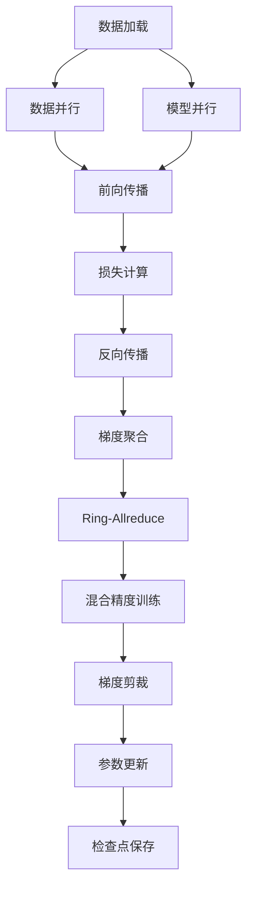

# 大规模语言模型从理论到实践 LLaMA分布式训练实践

## 1. 背景介绍

### 1.1 大规模语言模型的兴起

近年来,大规模语言模型(Large Language Models, LLMs)在自然语言处理(Natural Language Processing, NLP)领域掀起了一场革命。这些模型通过在海量文本数据上进行预训练,学习了丰富的语言知识和上下文信息,从而在下游任务中表现出令人惊叹的泛化能力。

GPT-3、PaLM、ChatGPT等知名语言模型的出现,不仅推动了NLP技术的飞速发展,也为各行各业带来了全新的应用场景和商业价值。然而,训练这些庞大的模型需要耗费大量的计算资源,这对于普通开发者和研究人员来说是一个巨大的挑战。

### 1.2 LLaMA:Meta AI开源的大规模语言模型

为了降低大规模语言模型的训练门槛,Meta AI(原Facebook AI研究所)于2023年2月开源了LLaMA(Large Language Model Antiprompt)模型系列。LLaMA模型涵盖了7B、13B、33B、65B四种不同规模,其中65B参数模型在多项基准测试中表现优异,接近人类水平。

LLaMA模型的开源不仅为研究人员提供了一个强大的基线模型,也让普通开发者有机会体验和利用大规模语言模型的强大能力。然而,训练这些大型模型仍然是一个巨大的挑战,需要大量的计算资源和分布式训练技术的支持。

### 1.3 分布式训练的重要性

对于大规模语言模型来说,分布式训练是一种高效的训练方式。由于模型参数的庞大规模,单机训练不仅训练时间漫长,而且容易受到硬件资源(如GPU显存)的限制。相比之下,分布式训练可以将模型参数和计算任务分散到多个节点上,充分利用集群的并行计算能力,从而大幅提高训练效率。

本文将重点介绍LLaMA模型的分布式训练实践,包括基本概念、核心算法原理、代码实现细节、实际应用场景等多个方面。我们将从理论和实践两个层面全面解析分布式训练的方方面面,为读者提供一个完整而深入的指南。

## 2. 核心概念与联系

在深入探讨LLaMA分布式训练之前,我们需要先了解一些核心概念和它们之间的联系。

### 2.1 数据并行与模型并行

在分布式训练中,常见的并行策略有两种:数据并行(Data Parallelism)和模型并行(Model Parallelism)。

#### 2.1.1 数据并行

数据并行是指将训练数据均匀分割到多个节点上,每个节点独立计算前向和反向传播,然后汇总梯度并更新模型参数。这种方式适用于模型参数相对较小的情况,因为每个节点都需要维护一份完整的模型参数副本。

数据并行的优点是实现简单,可扩展性强,但当模型参数过大时,单个节点的内存可能无法容纳完整的模型,从而限制了模型的进一步扩展。

#### 2.1.2 模型并行

与数据并行不同,模型并行是将模型的不同层或模块分配到不同的节点上,每个节点只需要维护模型的一部分参数。在前向传播时,节点之间需要传递中间计算结果;在反向传播时,则需要传递梯度。

模型并行的优点是可以支持更大的模型,因为模型参数被分散在多个节点上,但它也增加了节点间通信的开销,实现复杂度也更高。

大规模语言模型通常需要结合数据并行和模型并行两种策略,以充分利用集群资源,实现高效的分布式训练。

### 2.2 All-Reduce和Ring-Allreduce

在分布式训练中,不同节点之间需要频繁地交换梯度信息,以确保模型参数的一致性。All-Reduce和Ring-Allreduce是两种常见的梯度聚合算法。

#### 2.2.1 All-Reduce

All-Reduce算法将所有节点的梯度数据聚合到一个节点上,然后将结果广播给其他节点。这种算法的通信开销较大,尤其是在节点数量较多的情况下。

#### 2.2.2 Ring-Allreduce

Ring-Allreduce算法将节点组织成一个逻辑环形结构,每个节点只需要与相邻两个节点进行通信。梯度数据在环形结构上传递,每个节点都会累加自己的梯度,最终所有节点都会获得完整的梯度信息。

相比All-Reduce,Ring-Allreduce算法的通信开销更小,尤其是在节点数量较多的情况下,因此它被广泛应用于大规模分布式训练中。

### 2.3 混合精度训练

为了进一步提高训练效率,大规模语言模型的训练通常采用混合精度(Mixed Precision)技术。这种技术将模型参数和梯度表示为较低精度(如FP16或BF16)以节省内存,同时利用张量核心(Tensor Core)等专用硬件加速器进行计算,从而显著提高计算性能。

然而,低精度计算可能会导致数值不稳定和梯度消失等问题。为了解决这个问题,混合精度训练通常采用损失缩放(Loss Scaling)和动态损失缩放(Dynamic Loss Scaling)等技术,在保证数值稳定性的同时,充分利用低精度计算的性能优势。

### 2.4 梯度剪裁

在训练大规模语言模型时,梯度爆炸(Gradient Explosion)是一个常见的问题。为了防止梯度值过大导致不稳定,通常需要对梯度进行剪裁(Gradient Clipping)。

常见的梯度剪裁技术包括:

- 值剪裁(Value Clipping):将梯度值限制在一个预设的范围内。
- 梯度归一化(Gradient Normalization):将梯度向量缩放到一个预设的范数。
- 分段梯度剪裁(Piecewise Gradient Clipping):对梯度向量中的每个元素分别进行剪裁。

合理地应用梯度剪裁技术,可以有效防止梯度爆炸,提高模型训练的稳定性和收敛性。

### 2.5 Mermaid流程图

以下是LLaMA分布式训练的核心概念和流程的Mermaid流程图:



在上述流程中,数据并行和模型并行是两种并行策略,它们分别负责数据分发和模型分割。前向传播、损失计算和反向传播是标准的深度学习训练流程。梯度聚合通过Ring-Allreduce算法实现,同时应用混合精度训练和梯度剪裁技术,最后更新模型参数并保存检查点。

## 3. 核心算法原理具体操作步骤

在了解了核心概念之后,我们来深入探讨LLaMA分布式训练的核心算法原理和具体操作步骤。

### 3.1 数据并行

数据并行是分布式训练中最基本的并行策略。它的核心思想是将训练数据均匀分割到多个节点上,每个节点独立计算前向和反向传播,然后汇总梯度并更新模型参数。

具体操作步骤如下:

1. **数据分发**:将训练数据均匀分割到多个节点上,确保每个节点拥有相同数量的数据样本。
2. **模型复制**:在每个节点上复制一份完整的模型参数副本。
3. **前向传播**:每个节点独立计算前向传播,得到预测结果和损失值。
4. **反向传播**:每个节点独立计算反向传播,得到梯度值。
5. **梯度聚合**:使用All-Reduce或Ring-Allreduce算法,将所有节点的梯度值聚合到一个节点上。
6. **参数更新**:使用聚合后的梯度值,更新每个节点上的模型参数。
7. **同步模型参数**:将更新后的模型参数广播给其他节点,确保所有节点的模型参数保持一致。

数据并行的优点是实现简单,可扩展性强,但当模型参数过大时,单个节点的内存可能无法容纳完整的模型,从而限制了模型的进一步扩展。

### 3.2 模型并行

对于大规模语言模型,单纯依赖数据并行往往无法满足需求,因为模型参数过于庞大,单个节点的内存无法容纳。这时,我们需要引入模型并行的策略。

模型并行的核心思想是将模型的不同层或模块分配到不同的节点上,每个节点只需要维护模型的一部分参数。在前向传播时,节点之间需要传递中间计算结果;在反向传播时,则需要传递梯度。

具体操作步骤如下:

1. **模型分割**:将模型的不同层或模块分配到不同的节点上,每个节点只需要维护模型的一部分参数。
2. **前向传播**:每个节点计算分配给它的模型层的前向传播,并将中间结果传递给下一个节点。
3. **反向传播**:从最后一个节点开始,每个节点计算分配给它的模型层的反向传播,并将梯度传递给上一个节点。
4. **梯度聚合**:使用All-Reduce或Ring-Allreduce算法,将所有节点的梯度值聚合到一个节点上。
5. **参数更新**:使用聚合后的梯度值,更新每个节点上对应的模型参数。
6. **同步模型参数**:将更新后的模型参数广播给其他节点,确保所有节点的模型参数保持一致。

模型并行的优点是可以支持更大的模型,因为模型参数被分散在多个节点上,但它也增加了节点间通信的开销,实现复杂度也更高。

### 3.3 混合并行

在实际应用中,通常需要结合数据并行和模型并行两种策略,以充分利用集群资源,实现高效的分布式训练。这种混合并行策略的具体操作步骤如下:

1. **数据分发**:将训练数据均匀分割到多个节点组上,每个节点组内部采用数据并行策略。
2. **模型分割**:在每个节点组内部,将模型的不同层或模块分配到不同的节点上,采用模型并行策略。
3. **前向传播**:每个节点先在本地计算分配给它的模型层的前向传播,然后将中间结果传递给下一个节点。在节点组内部,中间结果通过模型并行方式传递;在节点组之间,中间结果通过数据并行方式传递。
4. **反向传播**:从最后一个节点开始,每个节点计算分配给它的模型层的反向传播,并将梯度传递给上一个节点。在节点组内部,梯度通过模型并行方式传递;在节点组之间,梯度通过数据并行方式传递。
5. **梯度聚合**:使用All-Reduce或Ring-Allreduce算法,将所有节点的梯度值聚合到一个节点上。
6. **参数更新**:使用聚合后的梯度值,更新每个节点上对应的模型参数。
7. **同步模型参数**:将更新后的模型参数广播给其他节点,确保所有节点的模型参数保持一致。

混合并行策略结合了数据并行和模型并行的优点,可以支持更大规模的模型,同时提高训练效率和可扩展性。然而,它也增加了实现复杂度,需要更多的通信和同步开销。

### 3.4 Mermaid流程图

以下是LLaMA分布式训练的核心算法原理和具体操作步骤的Mermaid流程图:

```mermaid
graph TD
    A[数据分发] --> B[数据并行]
    A --> C[模型分割