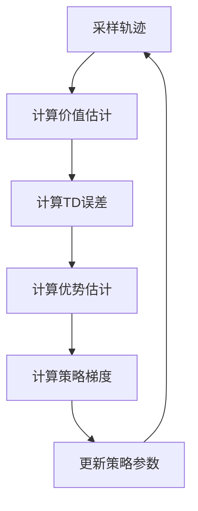

# 大规模语言模型从理论到实践：广义优势估计

## 1.背景介绍

### 1.1 语言模型的重要性

语言模型在自然语言处理(NLP)领域扮演着关键角色。它们是许多应用程序的核心组件,包括机器翻译、语音识别、文本生成和问答系统。随着深度学习的兴起,基于神经网络的大规模语言模型已经成为主流方法,展现出令人印象深刻的性能。

### 1.2 大规模语言模型的兴起

近年来,由于计算能力和数据可用性的提高,训练大规模语言模型成为可能。这些模型能够在海量文本数据上进行预训练,捕捉丰富的语言知识。著名的例子包括GPT(GenerativePre-trained Transformer)、BERT(Bidirectional Encoder Representations from Transformers)和T5(Text-to-Text Transfer Transformer)等。它们在各种下游NLP任务中表现出色。

### 1.3 广义优势估计的重要性

尽管大规模语言模型取得了长足进步,但它们的性能仍然存在局限性。其中一个关键挑战是,这些模型往往会产生不合理、不一致或不安全的输出,这可能会导致严重后果。为了应对这一挑战,广义优势估计(Generalized Advantage Estimation,GAE)作为一种重要技术应运而生。

## 2.核心概念与联系

### 2.1 强化学习与策略梯度

要理解广义优势估计,我们需要先了解强化学习和策略梯度的基本概念。强化学习是一种基于环境交互的学习范式,其目标是找到一个策略(policy),使得代理(agent)在给定环境中获得最大的累积奖励。

策略梯度方法是解决强化学习问题的一种常用技术。它通过对策略参数进行梯度上升,来直接优化期望奖励。这种方法的关键是估计策略梯度,即期望奖励相对于策略参数的梯度。

### 2.2 优势函数与策略梯度定理

在策略梯度方法中,优势函数(Advantage function)扮演着重要角色。优势函数定义为一个状态-行为对的价值,超过该状态下所有行为的平均价值。直观地说,它衡量了一个特定行为相对于其他行为的优势。

策略梯度定理表明,期望奖励的梯度可以用优势函数的期望值来表示。这为我们提供了一种计算策略梯度的方法,即估计优势函数的期望值。

### 2.3 广义优势估计(GAE)

广义优势估计是一种用于估计优势函数的技术。它结合了蒙特卡罗估计和时序差分(TD)估计的优点,提供了一种有偏但低方差的优势函数估计。

GAE通过引入一个参数λ来平衡偏差和方差之间的权衡。当λ=0时,它等同于一次性蒙特卡罗估计;当λ=1时,它等同于TD(∞)估计。通过适当选择λ,GAE可以获得更好的性能。

## 3.核心算法原理具体操作步骤

### 3.1 GAE算法步骤

GAE算法的具体步骤如下:

1. **采样轨迹(Trajectory Sampling)**:首先,根据当前策略π在环境中采样一个轨迹(τ),获得一系列的状态(s)、行为(a)和奖励(r)。

2. **计算价值估计(Value Estimation)**:对于每个时间步t,计算状态价值估计V(st)。这可以使用任何函数逼近器,如神经网络。

3. **计算TD误差(TD Error Computation)**:计算每个时间步的时序差分(TD)误差δt,其定义为:

$$δ_t = r_t + γV(s_{t+1}) - V(s_t)$$

其中γ是折现因子。

4. **计算优势估计(Advantage Estimation)**:使用TD误差计算广义优势估计(GAE)A(st,at):

$$A(s_t,a_t) = \sum_{l=0}^{\infty} (γλ)^l δ_{t+l}$$

实际上,我们使用一个truncated版本,将无限和近似为有限和:

$$\hat{A}(s_t,a_t) = \sum_{l=0}^{T-t-1} (γλ)^l δ_{t+l} + (γλ)^{T-t}V(s_T)$$

其中T是轨迹的终止时间步。

5. **计算策略梯度(Policy Gradient Computation)**:使用估计的优势函数计算策略梯度:

$$\nabla_θ J(θ) \approx \frac{1}{N}\sum_{t=1}^{T}\nabla_θ\log π_θ(a_t|s_t)\hat{A}(s_t,a_t)$$

其中N是轨迹的数量。

6. **更新策略参数(Policy Parameter Update)**:使用策略梯度更新策略参数θ,例如通过随机梯度上升。

### 3.2 算法流程图



## 4.数学模型和公式详细讲解举例说明

在上一节中,我们已经介绍了GAE算法的核心步骤。现在,让我们更深入地探讨一些关键公式和数学模型。

### 4.1 TD误差

时序差分(TD)误差是强化学习中一个重要概念,它衡量了当前状态价值估计与实际回报之间的差异。TD误差的公式为:

$$δ_t = r_t + γV(s_{t+1}) - V(s_t)$$

其中:
- $r_t$是时间步t获得的即时奖励
- $γ$是折现因子,用于权衡未来奖励的重要性
- $V(s_t)$是状态$s_t$的估计价值
- $V(s_{t+1})$是下一状态$s_{t+1}$的估计价值

TD误差反映了我们对当前状态价值估计的误差。如果TD误差为正,则表明我们低估了当前状态的价值;如果TD误差为负,则表明我们高估了当前状态的价值。

### 4.2 广义优势估计(GAE)

GAE是一种估计优势函数的技术,它结合了蒙特卡罗估计和TD估计的优点。GAE的公式为:

$$\hat{A}(s_t,a_t) = \sum_{l=0}^{T-t-1} (γλ)^l δ_{t+l} + (γλ)^{T-t}V(s_T)$$

其中:
- $\hat{A}(s_t,a_t)$是状态-行为对$(s_t,a_t)$的优势估计
- $δ_{t+l}$是时间步$t+l$的TD误差
- $γ$是折现因子
- $λ$是一个介于0和1之间的参数,用于平衡偏差和方差
- $V(s_T)$是终止状态$s_T$的估计价值

当$λ=0$时,GAE等同于一次性蒙特卡罗估计,具有无偏但高方差的特点。当$λ=1$时,GAE等同于TD($\infty$)估计,具有有偏但低方差的特点。通过适当选择$λ$,我们可以在偏差和方差之间进行权衡,获得更好的性能。

让我们用一个简单的例子来说明GAE的计算过程。假设我们有一个长度为5的轨迹,每个时间步的TD误差如下:

$$δ_1 = 0.2, δ_2 = -0.1, δ_3 = 0.3, δ_4 = -0.2, δ_5 = 0.1$$

终止状态的估计价值为$V(s_5) = 0.5$,我们取$γ=0.9$和$λ=0.8$。那么,时间步$t=3$的优势估计为:

$$\begin{aligned}
\hat{A}(s_3,a_3) &= δ_3 + (γλ)δ_4 + (γλ)^2δ_5 + (γλ)^2V(s_5) \\
&= 0.3 + (0.9 \times 0.8)(-0.2) + (0.9 \times 0.8)^2(0.1) + (0.9 \times 0.8)^2(0.5) \\
&= 0.3 - 0.144 + 0.0576 + 0.0576 \\
&= 0.2688
\end{aligned}$$

通过这个例子,我们可以看到GAE是如何将TD误差和蒙特卡罗回报进行加权平均,从而获得优势估计的。

### 4.3 策略梯度

一旦我们获得了优势估计,我们就可以计算策略梯度,并用它来更新策略参数。策略梯度的公式为:

$$\nabla_θ J(θ) \approx \frac{1}{N}\sum_{t=1}^{T}\nabla_θ\log π_θ(a_t|s_t)\hat{A}(s_t,a_t)$$

其中:
- $J(θ)$是期望奖励,我们希望最大化它
- $N$是轨迹的数量
- $T$是每个轨迹的长度
- $π_θ(a_t|s_t)$是在状态$s_t$下选择行为$a_t$的策略概率
- $\hat{A}(s_t,a_t)$是状态-行为对$(s_t,a_t)$的优势估计

这个公式表明,我们应该增加那些具有正优势估计的行为的概率,并减小那些具有负优势估计的行为的概率。通过这种方式,我们可以逐步提高策略的期望奖励。

## 4.项目实践:代码实例和详细解释说明

为了更好地理解GAE,让我们通过一个简单的示例项目来实践一下。在这个项目中,我们将训练一个智能体(agent)在经典的CartPole环境中平衡一根杆。

我们将使用PyTorch和OpenAI Gym库来实现GAE算法。以下是关键代码片段及解释:

### 4.1 定义环境和策略网络

```python
import gym
import torch
import torch.nn as nn

# 创建CartPole环境
env = gym.make('CartPole-v1')

# 定义策略网络
class PolicyNetwork(nn.Module):
    def __init__(self, state_dim, action_dim):
        super(PolicyNetwork, self).__init__()
        self.fc1 = nn.Linear(state_dim, 128)
        self.fc2 = nn.Linear(128, action_dim)

    def forward(self, state):
        x = torch.relu(self.fc1(state))
        action_probs = torch.softmax(self.fc2(x), dim=-1)
        return action_probs

# 初始化策略网络
policy_net = PolicyNetwork(env.observation_space.shape[0], env.action_space.n)
```

在这段代码中,我们首先创建了CartPole环境,然后定义了一个简单的全连接神经网络作为策略网络。策略网络的输入是环境状态,输出是每个可能行为的概率分布。

### 4.2 实现GAE算法

```python
import torch.optim as optim

# 超参数
gamma = 0.99
lam = 0.95
learning_rate = 1e-3

# 优化器
optimizer = optim.Adam(policy_net.parameters(), lr=learning_rate)

def compute_gae(rewards, values, next_value, gamma, lam):
    # 计算TD误差
    deltas = rewards + gamma * next_value - values
    
    # 初始化优势估计
    advantages = torch.zeros_like(rewards)
    
    # 计算GAE
    advantage = 0
    for t in reversed(range(len(rewards))):
        advantage = advantage * gamma * lam + deltas[t]
        advantages[t] = advantage
    
    return advantages

def train_step(states, actions, rewards, next_state):
    # 计算状态价值估计
    values = policy_net(states).gather(1, actions.unsqueeze(1)).squeeze(1)
    next_value = policy_net(next_state.unsqueeze(0))[0]
    
    # 计算优势估计
    advantages = compute_gae(rewards, values, next_value, gamma, lam)
    
    # 计算策略损失
    policy_loss = (-advantages * values).mean()
    
    # 优化策略网络
    optimizer.zero_grad()
    policy_loss.backward()
    optimizer.step()
```

在这段代码中,我们首先定义了一些超参数,如折现因子gamma和GAE参数lam。然后,我们实现了两个关键函数:

1. `compute_gae`函数用于计算GAE优势估计。它首先计算TD误差,然后使用公式对优势估计进行计算。

2. `train_step