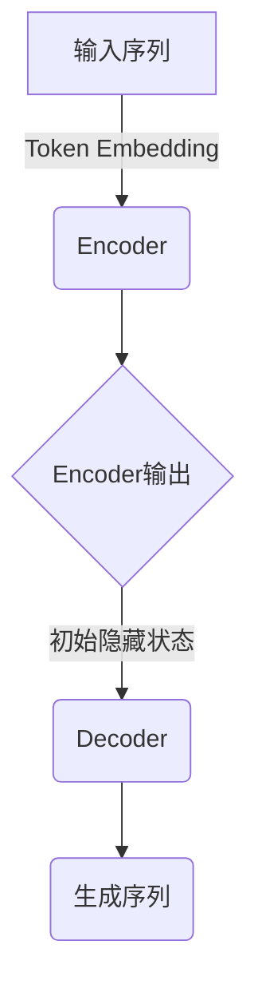
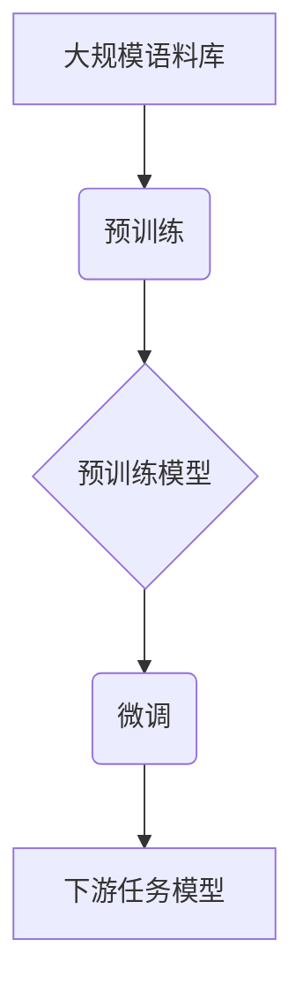
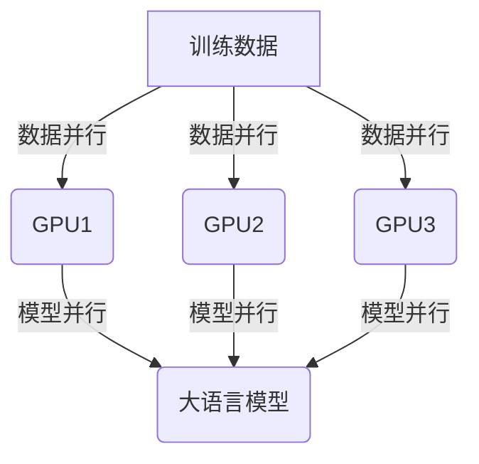

# 大语言模型原理与工程实践：手把手教你训练 7B 大语言模型自动化训练框架

## 1. 背景介绍

### 1.1 大语言模型的兴起

近年来,大型语言模型(Large Language Models, LLMs)在自然语言处理(NLP)领域掀起了一股热潮。这些模型通过在海量文本数据上进行预训练,学习了丰富的语言知识,展现出令人惊叹的语言理解和生成能力。以GPT-3、PaLM、ChatGPT等为代表的大语言模型,不仅在各种NLP任务上取得了卓越的表现,更是在问答、对话、文本创作等场景中展现出了超乎想象的能力,引发了广泛关注和讨论。

### 1.2 大语言模型的挑战

尽管大语言模型取得了巨大成功,但训练这些庞大的模型也面临着诸多挑战。首先,训练数据的规模和质量对模型性能至关重要,需要投入大量的人力和计算资源来收集和处理海量高质量数据。其次,模型训练过程计算量巨大,需要强大的硬件设施和高效的分布式训练系统。此外,如何有效控制模型输出,避免产生不当或有害内容,也是一个亟待解决的问题。

### 1.3 自动化训练框架的重要性

为了应对上述挑战,构建一个高效、可扩展、易于使用的自动化训练框架就显得尤为重要。这样的框架不仅能够简化模型训练的流程,还能够充分利用现有的硬件资源,提高训练效率,从而加速大语言模型的研发进程。同时,通过模块化设计和标准化接口,这种框架还能够促进不同组件之间的互操作性,方便集成各种优化策略和控制机制,为训练出高质量的大语言模型奠定基础。

## 2. 核心概念与联系  

### 2.1 大语言模型架构

大语言模型通常采用基于Transformer的序列到序列(Seq2Seq)架构,由编码器(Encoder)和解码器(Decoder)两部分组成。编码器负责将输入序列(如文本)编码为隐藏状态表示,而解码器则根据编码器的输出和前一时刻的输出,生成下一个token。

### 2.2 预训练与微调

大语言模型通常采用两阶段训练策略:预训练(Pretraining)和微调(Finetuning)。在预训练阶段,模型在大规模无标注语料库上进行自监督学习,获取通用的语言知识。在微调阶段,预训练好的模型将在特定的下游任务数据上进行进一步训练,使其适应特定的应用场景。

### 2.3 模型并行与数据并行

为了高效训练大规模模型,通常需要采用模型并行和数据并行相结合的策略。模型并行将模型分割到多个设备(如GPU)上,每个设备只需要处理模型的一部分,从而降低了单个设备的计算压力。而数据并行则是将训练数据划分到多个设备上进行并行计算,提高了数据处理效率。

### 2.4 自动化训练管道

自动化训练框架通常由数据预处理、模型定义、训练配置、分布式训练、模型评估、模型导出等多个模块组成,构成了一个完整的端到端训练管道。每个模块都可以灵活配置和扩展,以适应不同的训练需求。

## 3. 核心算法原理具体操作步骤

### 3.1 Transformer模型

Transformer是大语言模型的核心架构,由编码器(Encoder)和解码器(Decoder)组成。编码器将输入序列编码为隐藏状态表示,解码器则根据编码器输出和前一时刻的输出,生成下一个token。

#### 3.1.1 Self-Attention机制

Self-Attention是Transformer的核心组件,它允许模型捕捉输入序列中任意两个位置之间的依赖关系。具体来说,Self-Attention通过计算Query、Key和Value之间的相似性得分,对Value进行加权求和,从而生成新的表示。

$$
\mathrm{Attention}(Q, K, V) = \mathrm{softmax}(\frac{QK^T}{\sqrt{d_k}})V
$$

其中$Q$、$K$、$V$分别表示Query、Key和Value,它们都是通过线性变换从输入序列中得到的。$d_k$是缩放因子,用于防止内积值过大导致梯度消失。

#### 3.1.2 Multi-Head Attention

为了捕捉不同的依赖关系,Transformer采用了Multi-Head Attention机制,将注意力分成多个子空间,每个子空间学习不同的依赖关系,最后将它们的结果拼接起来。

$$
\mathrm{MultiHead}(Q, K, V) = \mathrm{Concat}(\mathrm{head}_1, \dots, \mathrm{head}_h)W^O
$$

其中$\mathrm{head}_i = \mathrm{Attention}(QW_i^Q, KW_i^K, VW_i^V)$,表示第$i$个注意力头,$W_i^Q$、$W_i^K$、$W_i^V$是对应的线性变换矩阵,$W^O$是最终的线性变换矩阵。

#### 3.1.3 位置编码

由于Self-Attention没有捕捉序列顺序信息的能力,Transformer引入了位置编码(Positional Encoding)来赋予每个位置一个独特的向量表示,从而捕捉序列的位置信息。

$$
\mathrm{PE}_{(pos, 2i)} = \sin(pos / 10000^{2i / d_\mathrm{model}})\\
\mathrm{PE}_{(pos, 2i+1)} = \cos(pos / 10000^{2i / d_\mathrm{model}})
$$

其中$pos$表示token的位置索引,$i$表示维度索引,$d_\mathrm{model}$是模型隐藏层的维度大小。

#### 3.1.4 前馈神经网络

除了Self-Attention子层,Transformer的每个编码器/解码器层还包含一个前馈全连接神经网络,它对每个位置的表示进行独立的非线性变换,捕捉更复杂的特征。

$$
\mathrm{FFN}(x) = \max(0, xW_1 + b_1)W_2 + b_2
$$

其中$W_1$、$W_2$、$b_1$、$b_2$是可学习的参数。

### 3.2 预训练策略

大语言模型通常采用自监督学习的方式进行预训练,以获取通用的语言知识。常见的预训练策略包括掩码语言模型(Masked Language Modeling, MLM)和下一句预测(Next Sentence Prediction, NSP)等。

#### 3.2.1 掩码语言模型

MLM任务是在输入序列中随机掩码部分token,要求模型根据上下文预测被掩码的token。具体来说,对于每个输入序列,我们随机选择一些token进行掩码(用特殊的[MASK]token替换),然后最大化被掩码token的条件概率作为训练目标。

$$
\mathcal{L}_\mathrm{MLM} = -\mathbb{E}_{x \sim X} \left[ \sum_{t \in \mathrm{MASK}} \log P(x_t | x_{\backslash t}) \right]
$$

其中$X$表示语料库,$x$表示一个输入序列,$\mathrm{MASK}$是被掩码的token集合,$x_{\backslash t}$表示除去$x_t$的其他token。

#### 3.2.2 下一句预测

NSP任务要求模型判断两个句子是否为连续的句子对。在训练时,我们随机从语料库中采样一些句子对,其中一半是真实的连续句子对,另一半是随机构造的不连续句子对。模型的目标是正确预测句子对是否为连续的。

$$
\mathcal{L}_\mathrm{NSP} = -\mathbb{E}_{(x, y) \sim D} \left[ y \log P(y | x_1, x_2) + (1 - y) \log (1 - P(y | x_1, x_2)) \right]
$$

其中$D$表示句子对的分布,$x_1$和$x_2$分别表示句子对中的两个句子,$y \in \{0, 1\}$表示句子对是否为连续的标签。

通过结合MLM和NSP两种预训练策略,大语言模型可以同时学习到词级和句级的语义信息,为下游任务奠定基础。

### 3.3 微调策略

预训练完成后,大语言模型还需要在特定的下游任务数据上进行微调,以适应具体的应用场景。常见的微调策略包括序列分类、序列到序列学习等。

#### 3.3.1 序列分类

对于序列分类任务(如情感分析、文本分类等),我们通常在预训练模型的输出上添加一个分类头(Classification Head),将模型的最终隐藏状态输出映射到目标类别空间。

$$
P(y | x) = \mathrm{softmax}(W h_\mathrm{CLS} + b)
$$

其中$x$表示输入序列,$h_\mathrm{CLS}$是模型对应[CLS]token的最终隐藏状态表示,$W$和$b$是可学习的分类头参数,$y$是目标类别。

在微调过程中,我们在下游任务数据上最小化分类损失函数(如交叉熵损失),同时保持大部分预训练参数不变,只微调分类头和模型的最后几层。

#### 3.3.2 序列到序列学习

对于序列到序列任务(如机器翻译、文本摘要等),我们利用预训练模型的编码器-解码器架构,将输入序列编码为隐藏状态表示,然后由解码器自回归地生成目标序列。

在微调过程中,我们最小化解码器在每个时间步上预测的条件概率的负对数似然:

$$
\mathcal{L}_\mathrm{seq2seq} = -\mathbb{E}_{(x, y) \sim D} \left[ \sum_{t=1}^{|y|} \log P(y_t | y_{<t}, x; \theta) \right]
$$

其中$x$和$y$分别表示源序列和目标序列,$y_{<t}$表示目标序列的前$t$个token,$\theta$是模型参数。

与序列分类任务类似,我们也可以在保持大部分预训练参数不变的情况下,只微调解码器的部分参数。

通过上述微调策略,大语言模型可以很好地迁移通用的语言知识到特定的下游任务中,展现出卓越的性能表现。

## 4. 数学模型和公式详细讲解举例说明

在前面的章节中,我们已经介绍了Transformer模型、预训练策略和微调策略的核心原理和数学模型。现在,让我们通过一些具体的例子,进一步解释和说明这些公式和概念。

### 4.1 Self-Attention机制示例

假设我们有一个输入序列"The cat sat on the mat",我们来计算一下第三个token "sat"对应的Self-Attention输出。

首先,我们将输入序列映射为Query、Key和Value矩阵:

$$
\begin{aligned}
Q &= \begin{bmatrix}
q_\mathrm{The} \\ q_\mathrm{cat} \\ q_\mathrm{sat} \\ q_\mathrm{on} \\ q_\mathrm{the} \\ q_\mathrm{mat}
\end{bmatrix} &
K &= \begin{bmatrix}
k_\mathrm{The} & k_\mathrm{cat} &