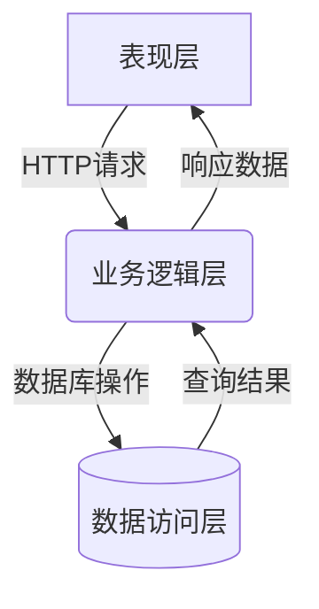

# 学生成绩管理系统详细设计与具体代码实现

## 1.背景介绍

### 1.1 学生成绩管理系统的重要性

在教育领域中,成绩管理系统扮演着至关重要的角色。它不仅能够有效地跟踪和记录学生的学习表现,还能够为教师和管理人员提供宝贵的数据分析和决策支持。随着教育信息化的不断推进,构建一个高效、安全、可扩展的成绩管理系统已经成为当前教育信息化建设的重中之重。

### 1.2 传统成绩管理方式的缺陷

在传统的成绩管理模式下,教师通常使用纸质记录或简单的电子表格来记录和管理学生的成绩数据。然而,这种方式存在诸多缺陷:

1. 数据录入效率低下,容易出现人工错误
2. 数据存储和管理缺乏统一标准,难以实现数据共享
3. 数据分析能力有限,无法深入挖掘数据价值
4. 数据安全性无法得到有效保障

因此,开发一套完善的学生成绩管理系统,不仅能够提高工作效率,降低人工成本,更重要的是能够为教育决策提供数据支持,促进教学质量的持续提升。

## 2.核心概念与联系

### 2.1 系统架构概览

学生成绩管理系统通常采用经典的三层架构模式,包括表现层(前端)、业务逻辑层(中间件)和数据访问层(后端)。



### 2.2 核心概念解析

1. **用户管理**:包括学生、教师、管理员等不同类型用户的身份认证、权限控制等功能。
2. **成绩管理**:涵盖学生成绩的录入、修改、查询、统计分析等核心功能。
3. **课程管理**:维护课程信息、教学班级、教师分配等相关数据。
4. **数据安全**:确保系统数据的完整性、可靠性,防止数据泄露和非法访问。

这些核心概念相互关联、相互作用,共同构建了一个完整的成绩管理系统。

## 3.核心算法原理具体操作步骤

### 3.1 用户身份认证算法

用户身份认证是系统安全的基石,通常采用密码哈希存储和加盐处理的方式来提高密码存储的安全性。具体步骤如下:

1. 用户输入用户名和密码
2. 系统从数据库查询该用户的密码哈希值和盐值
3. 将用户输入的密码和盐值进行哈希运算,得到一个新的哈希值
4. 比对新的哈希值和数据库存储的密码哈希值是否一致
5. 如果一致,则认证通过,否则拒绝访问

该算法的优点是即使数据库被攻破,攻击者也无法直接获取明文密码,从而有效提高了系统安全性。

### 3.2 成绩计算算法

成绩计算是成绩管理系统的核心功能之一,需要根据不同的评分规则对学生的多项成绩进行加权求和,得到最终的综合成绩。

假设一门课程包含三个评分项:平时分(30%)、期中考试(30%)和期末考试(40%),成绩计算公式如下:

$$
综合成绩 = 平时分 \times 30\% + 期中考试分数 \times 30\% + 期末考试分数 \times 40\%
$$

算法步骤:

1. 获取学生在各评分项的原始分数
2. 根据评分规则的权重系数,分别计算每一项的加权分数
3. 将所有加权分数相加,得到综合成绩
4. 根据综合成绩与分数等级对应规则,确定学生的最终等级(优秀、良好、中等、及格、不及格)

该算法不仅适用于单门课程的成绩计算,还可以扩展到整个学期或学年的综合成绩计算,只需要调整权重系数即可。

## 4.数学模型和公式详细讲解举例说明

在学生成绩管理系统中,数学模型和公式主要应用于数据分析和可视化环节,以便更好地挖掘数据价值,发现潜在的规律和趋势。

### 4.1 成绩分布模型

假设一门课程的总分为100分,我们可以将成绩分为10个等级,每个等级的分数区间为10分,构建一个成绩分布模型。

设$X$为随机变量,表示学生的成绩,$X \in [0, 100]$,则成绩分布的概率密度函数$f(x)$可以定义为:

$$
f(x) = \begin{cases}
\frac{1}{10}, & \text{if }x \in [0, 10) \\
\frac{1}{10}, & \text{if }x \in [10, 20) \\
\vdots & \vdots \\
\frac{1}{10}, & \text{if }x \in [90, 100]
\end{cases}
$$

根据该模型,我们可以计算出每个分数等级的学生人数占比,并将其可视化,从而直观地了解整体成绩分布情况。

### 4.2 成绩趋势分析

对于同一门课程的历年成绩数据,我们可以使用回归分析的方法,拟合出成绩的发展趋势线,从而预测未来的成绩表现。

假设我们有$n$年的成绩数据$\{(x_1, y_1), (x_2, y_2), \ldots, (x_n, y_n)\}$,其中$x_i$表示年份,$y_i$表示该年的平均成绩。我们可以使用最小二乘法拟合一条直线$y = ax + b$,使得离散数据点到直线的总距离之和最小。

该模型的目标函数为:

$$
\min \sum_{i=1}^{n}(y_i - ax_i - b)^2
$$

对$a$和$b$求偏导,并令其等于0,可以得到$a$和$b$的解析解:

$$
a = \frac{\sum_{i=1}^{n}(x_i - \bar{x})(y_i - \bar{y})}{\sum_{i=1}^{n}(x_i - \bar{x})^2}, \quad b = \bar{y} - a\bar{x}
$$

其中$\bar{x}$和$\bar{y}$分别表示$x$和$y$的均值。

通过这种方法,我们可以清晰地观察到成绩的发展趋势,并为教学决策提供依据。

## 4.项目实践:代码实例和详细解释说明

为了更好地理解学生成绩管理系统的实现细节,我们将展示一些核心功能模块的代码示例,并进行详细的解释说明。

### 4.1 用户模块

用户模块负责管理系统中的不同类型用户,包括学生、教师和管理员。我们使用Python的Flask Web框架搭建RESTful API,并使用SQLAlchemy进行数据库操作。

```python
from flask import Flask, jsonify, request
from flask_sqlalchemy import SQLAlchemy
import bcrypt

app = Flask(__name__)
app.config['SQLALCHEMY_DATABASE_URI'] = 'sqlite:///users.db'
db = SQLAlchemy(app)

class User(db.Model):
    id = db.Column(db.Integer, primary_key=True)
    username = db.Column(db.String(80), unique=True, nullable=False)
    password = db.Column(db.String(120), nullable=False)
    role = db.Column(db.String(20), nullable=False)

    def __repr__(self):
        return f'<User {self.username}>'

@app.route('/users', methods=['POST'])
def create_user():
    data = request.get_json()
    username = data['username']
    password = data['password'].encode('utf-8')
    role = data['role']

    # 使用bcrypt加密密码
    salt = bcrypt.gensalt()
    hashed_password = bcrypt.hashpw(password, salt)

    user = User(username=username, password=hashed_password, role=role)
    db.session.add(user)
    db.session.commit()

    return jsonify({'message': 'User created successfully'})

# 其他API端点...

if __name__ == '__main__':
    app.run(debug=True)
```

在上面的代码中,我们定义了一个`User`模型,包含了用户名、密码(哈希存储)和角色等属性。`create_user`函数实现了用户注册功能,使用`bcrypt`库对密码进行加盐哈希处理,从而提高了密码存储的安全性。

### 4.2 成绩管理模块

成绩管理模块是整个系统的核心部分,负责处理学生成绩的录入、修改、查询和统计分析等功能。我们将使用Python的Django Web框架和Django ORM进行开发。

```python
from django.db import models

class Course(models.Model):
    name = models.CharField(max_length=100)
    teacher = models.ForeignKey('Teacher', on_delete=models.CASCADE)

class Student(models.Model):
    name = models.CharField(max_length=100)
    courses = models.ManyToManyField(Course, through='Grade')

class Grade(models.Model):
    student = models.ForeignKey(Student, on_delete=models.CASCADE)
    course = models.ForeignKey(Course, on_delete=models.CASCADE)
    assignment_score = models.DecimalField(max_digits=5, decimal_places=2)
    midterm_score = models.DecimalField(max_digits=5, decimal_places=2)
    final_score = models.DecimalField(max_digits=5, decimal_places=2)

    @property
    def total_score(self):
        weights = [0.3, 0.3, 0.4]  # 平时分、期中考试、期末考试权重
        scores = [self.assignment_score, self.midterm_score, self.final_score]
        return sum(weight * score for weight, score in zip(weights, scores))
```

在上面的代码中,我们定义了`Course`、`Student`和`Grade`三个模型,分别表示课程、学生和成绩信息。`Grade`模型包含了平时分、期中考试分数和期末考试分数三个字段,并通过`total_score`属性计算出综合成绩,使用了加权求和的方式。

通过Django ORM,我们可以方便地进行数据库操作,例如:

```python
# 获取某门课程的所有学生成绩
course = Course.objects.get(name='计算机科学导论')
grades = Grade.objects.filter(course=course)

# 统计某门课程的平均成绩
from django.db.models import Avg
avg_score = grades.aggregate(Avg('total_score'))['total_score__avg']
```

### 4.3 数据可视化模块

为了更直观地展示学生成绩数据,我们将使用Python的Matplotlib库进行数据可视化。以下是一个绘制成绩分布直方图的示例代码:

```python
import matplotlib.pyplot as plt
from django.db.models import Count

# 获取某门课程的成绩数据
course = Course.objects.get(name='计算机科学导论')
grades = Grade.objects.filter(course=course).values_list('total_score', flat=True)

# 计算每个分数区间的学生人数
bins = range(0, 101, 10)  # 分数区间: [0, 10), [10, 20), ..., [90, 100]
counts, _ = np.histogram(grades, bins=bins)

# 绘制直方图
plt.figure(figsize=(10, 6))
plt.bar(bins[:-1], counts, width=10, edgecolor='black')
plt.xlabel('Score Range')
plt.ylabel('Number of Students')
plt.title('Score Distribution')
plt.xticks(bins[:-1] + 5, [f'{bin_start}-{bin_end}' for bin_start, bin_end in zip(bins[:-1], bins[1:])])
plt.show()
```

该代码首先从数据库中获取某门课程的所有学生成绩数据,然后使用`numpy.histogram`函数计算每个分数区间的学生人数。最后,使用Matplotlib绘制一个直方图,展示成绩分布情况。

通过数据可视化,教师和管理人员可以更直观地了解学生的学习情况,从而制定相应的教学策略和改进措施。

## 5.实际应用场景

学生成绩管理系统在实际教育场景中有着广泛的应用,不仅可以为中小学、大专院校等传统教育机构提供成绩管理解决方案,也可以为在线教育平台、培训机构等新兴教育形态提供技术支持。

### 5.1 中小学成绩管理

在中小学教育领域,成绩管理系统可以实现以下功能:

1. 教师可以方便地录入和管理学生的各科成绩
2. 自动计算学生的综合成绩和排名