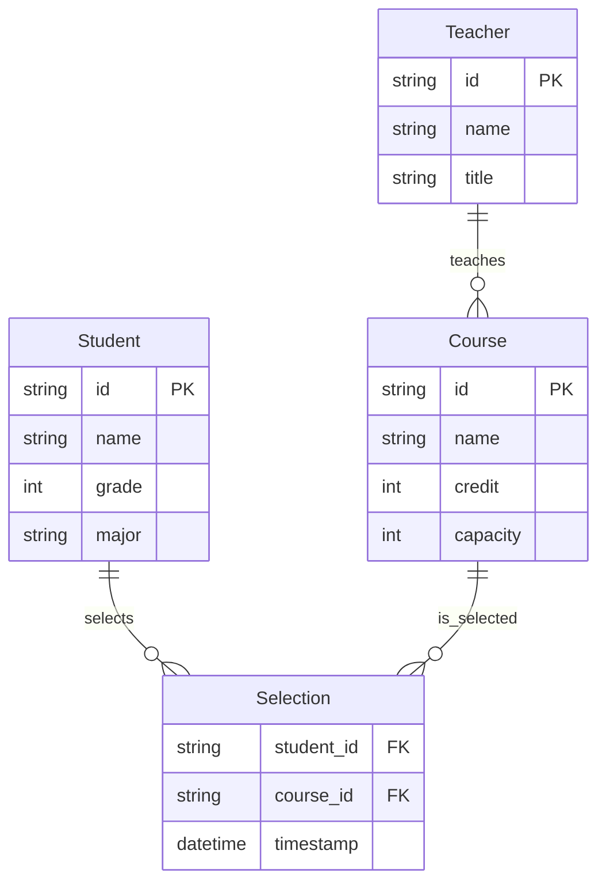

# 学生选课系统详细设计与具体代码实现

作者：禅与计算机程序设计艺术

## 1. 背景介绍

### 1.1 选课系统的重要性

在现代高校教育中,选课系统扮演着至关重要的角色。它为学生提供了灵活选择课程的机会,使他们能够根据自己的兴趣、专业需求和时间安排来规划学习。同时,选课系统也为教务管理提供了便利,使得课程的开设、学生选课情况的统计和学分的管理更加高效。

### 1.2 选课系统面临的挑战

然而,设计和实现一个优秀的选课系统并非易事。它需要考虑诸多因素,例如:

- 系统性能:面对大量学生同时访问,系统需要有足够的性能和稳定性。
- 公平性:要确保所有学生都有平等选课的机会,防止少数学生"秒杀"热门课程。 
- 数据一致性:选课数据涉及学生、课程、教师等多个实体,需要确保数据的一致性和完整性。
- 用户体验:选课系统需要有友好的界面设计和清晰的交互流程。

### 1.3 本文的目标

本文将详细阐述如何设计和实现一个优秀的学生选课系统。我们将从需求分析开始,然后进行概要和详细设计,最后给出核心功能的代码实现。通过本文,读者将掌握设计选课系统的方法,并能够开发出一个满足实际需求的选课系统。

## 2. 核心概念与关系

在选课系统中,涉及到以下几个核心概念:

- 学生:选课的主体,拥有学号、姓名等属性。
- 课程:学生选择的对象,拥有课程号、课程名、学分、授课教师等属性。
- 教师:课程的授课者,拥有教工号、姓名等属性。
- 选课记录:学生选课的结果,包含学生、课程、选课时间等信息。

这些概念之间的关系可以用下面的 ER 图来表示:



从 ER 图可以看出:

- 学生和课程是多对多的关系,通过选课记录联系起来。
- 教师和课程是一对多的关系,一个教师可以教授多门课程。

## 3. 核心算法原理与具体步骤

选课系统的核心是选课算法,即如何在选课开始时,快速、公平、准确地为学生分配课程。下面我们详细讲解几种常见的选课算法。

### 3.1 先到先得算法

这是最简单直观的算法,步骤如下:

1. 选课开始时,所有学生都可以看到所有课程的实时余量。
2. 学生提交选课请求后,系统按请求到达的时间顺序依次处理。
3. 对于每个请求,如果课程余量大于0,则选课成功,余量减1;否则选课失败。
4. 重复步骤3,直到所有请求都被处理。

先到先得算法优点是简单易懂,但缺点是对网络速度和运气要求较高,容易引起学生的不满。

### 3.2 随机排序算法

该算法通过随机排序来提高选课的公平性,步骤如下:

1. 选课开始前,系统收集所有学生提交的选课请求。
2. 对所有请求按随机顺序排序。
3. 按随机顺序依次处理请求。对于每个请求:
   - 如果课程余量大于0,则选课成功,余量减1。
   - 否则,将该请求标记为失败,继续处理下一个请求。
4. 所有请求处理完毕后,对于标记为失败的请求,按课程余量重新随机分配,直到课程余量为0或所有请求都满足为止。

随机排序算法相比先到先得更加公平,但可能导致部分学生选不到任何课程。

### 3.3 优先级排序算法

该算法根据学生的优先级来分配课程,步骤如下:

1. 选课开始前,系统根据一定的规则(如年级、成绩等)计算每个学生的优先级。
2. 将所有学生按优先级从高到低排序,优先级相同的学生随机排序。
3. 按优先级顺序依次处理每个学生的选课请求。对于每个学生:
   - 按学生提交的课程顺序依次尝试选课。
   - 如果课程余量大于0,则选课成功,余量减1;否则尝试下一门课程。
   - 直到选择完所有课程或达到限选数量为止。
4. 重复步骤3,直到所有学生都完成选课。

优先级排序兼顾了公平性和学生的实际需求,是较为理想的选课算法。

## 4. 数学模型与公式详解

在设计选课算法时,我们可以用数学语言来描述问题,下面给出几个常用的数学模型。

### 4.1 集合模型

我们可以用集合来表示学生、课程和选课结果:

- 学生集合 $S=\{s_1,s_2,…,s_n\}$,其中 $s_i$ 表示第 $i$ 个学生。
- 课程集合 $C=\{c_1,c_2,…,c_m\}$,其中 $c_j$ 表示第 $j$ 门课程。
- 选课结果 $R$ 可以表示为一个 $n \times m$ 的矩阵,其中 $R_{ij}=1$ 表示学生 $s_i$ 选了课程 $c_j$,否则 $R_{ij}=0$。

目标是求解一个合法的选课结果 $R$,使得尽可能多的学生选到课程。

### 4.2 整数规划模型

我们可以将选课问题建模为一个 0-1 整数规划模型:

$$
\max \sum_{i=1}^n \sum_{j=1}^m R_{ij}
$$

$$
\begin{align*}
\text{s.t.} \quad 
& \sum_{i=1}^n R_{ij} \leq Cap_j, \forall j=1,2,…,m \\
& \sum_{j=1}^m R_{ij} \leq L_i, \forall i=1,2,…,n \\
& R_{ij} \in \{0,1\}, \forall i,j
\end{align*}
$$

其中 $Cap_j$ 表示课程 $c_j$ 的容量,$L_i$ 表示学生 $s_i$ 的限选数量。

该模型的目标是最大化选课总数,约束条件包括:

- 每门课程的选课人数不超过容量。
- 每个学生选课数量不超过限选数量。
- 决策变量 $R_{ij}$ 为 0-1 变量。

求解该整数规划模型可以得到最优的选课方案,但在实际中较难直接求解。

### 4.3 排序模型

将选课问题转化为对学生和课程的排序问题。假设我们得到了一个学生的排序 $\pi_s$ 和课程的排序 $\pi_c$,则可以按以下规则进行选课:

1. 从学生排序 $\pi_s$ 中依次取出每个学生 $s_i$。
2. 对于每个学生 $s_i$,从课程排序 $\pi_c$ 中依次取出每门课程 $c_j$:
   - 如果 $s_i$ 还没选满课且 $c_j$ 还有余量,则 $s_i$ 选 $c_j$,课程余量减1。
   - 否则跳过,取下一门课程。
3. 重复步骤2,直到所有学生都遍历完毕。

该模型将选课问题转化为两个排序问题:

- 学生排序 $\pi_s$ 可以基于优先级规则生成,体现选课的公平性。
- 课程排序 $\pi_c$ 可以基于课程热门度、学生意愿等生成,体现学生的偏好。

通过调整 $\pi_s$ 和 $\pi_c$ 的生成策略,可以灵活地控制选课结果。

## 5. 项目实践:代码实例与详解

下面我们给出一个简单的选课系统的核心代码实现。该系统采用优先级排序算法,基于学生的年级和成绩计算优先级。

### 5.1 数据结构定义

首先定义学生、课程和选课记录的数据结构:

```python
class Student:
    def __init__(self, id, name, grade, score):
        self.id = id
        self.name = name
        self.grade = grade
        self.score = score
        self.priority = grade * 100 + score
        
    def __lt__(self, other):
        return self.priority > other.priority

class Course:
    def __init__(self, id, name, capacity):
        self.id = id
        self.name = name
        self.capacity = capacity
        self.selected = 0
        
    def is_available(self):
        return self.selected < self.capacity
        
class Selection:
    def __init__(self, student, course):
        self.student = student
        self.course = course
```

其中,`Student` 类的 `priority` 属性表示学生的优先级,按年级和成绩计算。`__lt__` 方法定义了学生之间的比较规则,优先级高的学生排在前面。

`Course` 类的 `is_available` 方法判断课程是否还有余量。

`Selection` 类表示一条选课记录,包含学生和课程信息。

### 5.2 选课算法实现

下面是优先级排序选课算法的 Python 实现:

```python
def select_courses(students, courses, max_courses):
    selections = []
    students.sort()  # 按优先级排序学生
    
    for student in students:
        selected = 0
        for course in courses:
            if course.is_available():
                selections.append(Selection(student, course))
                course.selected += 1
                selected += 1
                if selected == max_courses:
                    break
                    
    return selections
```

算法的输入包括学生列表 `students`、课程列表 `courses` 和每个学生的限选课程数 `max_courses`,输出为选课记录列表 `selections`。

算法首先按优先级对学生排序,然后遍历每个学生:

- 对于每个学生,遍历所有课程。
- 如果课程有余量,则选课成功,创建选课记录,课程余量减1,学生选课数加1。
- 如果学生选满了 `max_courses` 门课,则跳过后续课程。

最终返回所有选课记录。

### 5.3 测试代码

下面是一个测试代码,演示如何使用上述算法:

```python
students = [
    Student(1, 'Alice', 3, 90),
    Student(2, 'Bob', 2, 85),
    Student(3, 'Charlie', 3, 80),
    Student(4, 'David', 1, 95),
    Student(5, 'Eve', 2, 88),
]

courses = [
    Course(1, 'Math', 2),
    Course(2, 'English', 3),
    Course(3, 'Physics', 2),
    Course(4, 'Chemistry', 2),
    Course(5, 'Biology', 3),
]

selections = select_courses(students, courses, 3)

for s in selections:
    print(f'{s.student.name} selected {s.course.name}')
```

输出结果为:

```
Alice selected Math
Alice selected English
Alice selected Physics
Charlie selected Chemistry
Charlie selected Biology
Charlie selected English
Bob selected English
Bob selected Biology
Bob selected Chemistry
Eve selected Biology
Eve selected Physics
Eve selected Chemistry
David selected Math
David selected Physics
David selected Chemistry
```

可以看到,优先级高的学生(如 Alice 和 Charlie)优先选到了课程,而优先级低的学生(如 David)只能选择剩余的课程。同时每个学生选课数量不超过3门,每门课程的选课人数也不超过容量。

## 6. 实际应用场景

选课系统在高校教务管理中有广泛的应用,下面列举几个典型场景。

### 6.1 本科生选课

本科生选课是最常见的场景。每学期开始前,学生根据培养方案和个人兴趣,在规定时间内通过选课系统选择课程。选课结束后,系统根据选课结果安排教学资源并生成课表。

### 6.2 研究生选课

研究生选课与本科生选课略有不同。研究生通常有更大的选课自由度