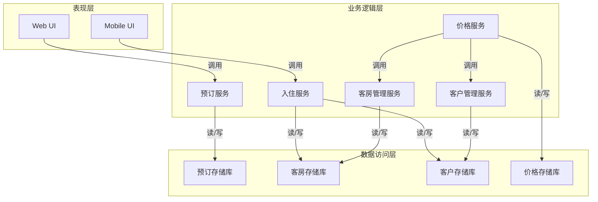

# 宾馆客房管理系统设计与实现

## 1.背景介绍

### 1.1 宾馆行业概述

宾馆业是服务业的重要组成部分,为旅客提供临时住宿和相关服务。随着旅游业的蓬勃发展和人们生活水平的不断提高,宾馆业在现代社会中扮演着越来越重要的角色。有效的客房管理对于提高宾馆的运营效率、优化客户体验和增加收益至关重要。

### 1.2 客房管理系统的必要性

传统的手工操作方式已经无法满足现代宾馆业的需求,存在着诸多缺陷,如工作效率低下、人为错误频繁、数据管理混乱等。因此,开发一套完善的客房管理系统(Hotel Room Management System,HRMS)以实现客房管理的自动化和信息化已经成为当务之急。

### 1.3 系统目标

宾馆客房管理系统的主要目标是:

1. 实现客房状态的实时监控和高效管理
2. 优化客房分配和预订流程
3. 提高工作效率,降低人为操作错误
4. 实现客户信息和订单数据的集中管理
5. 为决策提供数据支持,提升经营管理水平

## 2.核心概念与联系

### 2.1 客房状态

客房状态是客房管理系统的核心概念,包括以下几种状态:

- 可预订(Available)
- 已预订(Booked) 
- 已入住(Checked-in)
- 已退房(Checked-out)
- 维修中(Under Maintenance)
- 已打扫(Cleaned)

客房状态之间的转换关系如下:

```mermaid
stateDiagram-v2
    Available --> Booked: 预订
    Booked --> Checked-in: 入住
    Checked-in --> Checked-out: 退房
    Checked-out --> Cleaned: 打扫
    Cleaned --> Available: 准备就绪
    Checked-out --> Available: 直接准备
    Checked-in --> UnderMaintenance: 需要维修
    UnderMaintenance --> Cleaned: 维修完毕
```

### 2.2 客户信息

客户信息是系统的另一核心数据,包括:

- 基本信息(姓名、联系方式等)
- 身份信息(证件类型、号码等)
- 付款信息(信用卡、支付方式等)
- 历史记录(曾经预订、入住等)

客户信息需要合理存储和管理,以支持客户识别、优惠政策执行等功能。

### 2.3 预订管理

预订是将来入住的预约行为,包括:

- 预订信息(入住/离店日期、房型、客户信息等)
- 付款信息(订金、全款等)
- 预订状态(有效、已入住、已取消等)

预订管理是系统的核心业务流程之一。

### 2.4 入住管理

入住是客户实际入住宾馆的过程,包括:

- 分配客房
- 办理入住手续
- 房费结算
- 生成入住记录

入住管理直接影响着客户的入住体验。

### 2.5 其他概念

其他相关概念还包括:

- 房型(单人房、双人房等)
- 价格策略(淡季、旺季、节假日等)
- 打扫管理
- 维修管理
- 财务管理
- 报表统计

## 3.核心算法原理具体操作步骤  

### 3.1 客房分配算法

客房分配是入住管理的关键环节,需要一种高效的算法来自动分配最佳客房。以下是一种常用的客房分配算法:

1. 获取预订信息(入住日期、离店日期、房型要求等)
2. 查询符合要求的所有可用客房
3. 对可用客房进行打分排序:
    - 打分规则示例:
        - 房型匹配度得分(单人房+2分,双人房+1分,其他-1分)
        - 可住宿天数得分(恰好相等+3分,多于要求+1分,少于要求-2分)
        - 楼层位置得分(偏好楼层+2分,其他+0分)
        - ...
4. 选择得分最高的客房
5. 如果有多个最高分,按特定规则(如编号)进一步排序
6. 将选中的客房状态设置为"已预订"
7. 为客户生成预订记录

该算法的时间复杂度为O(n),n为可用客房数量。

### 3.2 价格计算算法

价格计算是系统的另一个核心算法,需要考虑多种因素:

1. 获取入住信息(入住日期、离店日期、房型等)
2. 确定基础房价(按房型、季节等因素)
3. 计算房费:
    $$
    房费 = 基础房价 \times 住房天数 \times (1+\sum 系数)
    $$
    - 系数示例:
        - 周末/节假日系数
        - 最后一分钟预订系数  
        - 提前预订优惠系数
        - ...
4. 计算其他费用(服务费、手续费等)
5. 生成费用明细

该算法的时间复杂度为O(1)。

### 3.3 其他算法

其他一些常见算法包括:

- 最短路径寻找算法(为打扫人员分配工作路线)
- 时间表调度算法(为客房维修分配时间窗口)
- 关联规则挖掘算法(发现客户消费习惯,为个性化推荐服务)
- ...

## 4.数学模型和公式详细讲解举例说明

在宾馆客房管理系统中,有许多场景需要使用数学模型和公式,以下是一些常见示例:

### 4.1 房价预测模型

我们可以使用机器学习技术,基于历史数据构建房价预测模型,为制定价格策略提供依据。

假设我们有如下训练数据:
- $X$:特征矩阵,每行是一个样本,包含日期、房型、节假日等特征
- $y$:房价标量

我们可以使用线性回归模型:

$$
y = X\beta + \epsilon\\
\epsilon \sim N(0,\sigma^2)
$$

使用最小二乘法估计参数$\beta$:

$$
\hat{\beta} = (X^TX)^{-1}X^Ty
$$

对于新的特征向量$x_{new}$,预测房价为:

$$
\hat{y}_{new} = x_{new}^T\hat{\beta}
$$

### 4.2 客房优化调度模型

我们可以将客房调度问题建模为整数线性规划(ILP)问题:

**目标函数**:
$$
\max \sum\limits_{i=1}^{n}\sum\limits_{j=1}^{m}p_{ij}x_{ij}
$$
其中:
- $n$:客房数量
- $m$:预订数量 
- $p_{ij}$:将第$i$个客房分配给第$j$个预订的收益
- $x_{ij}$:决策变量,如果将第$i$个客房分配给第$j$个预订,则为1,否则为0

**约束条件**:

1.每个客房至多分配给一个预订:
$$
\sum\limits_{j=1}^{m}x_{ij} \leq 1,\quad \forall i
$$

2.每个预订必须分配一个客房:
$$
\sum\limits_{i=1}^{n}x_{ij} = 1,\quad \forall j
$$

3.其他约束(如房型、入住时间等)

通过求解该ILP问题,我们可以得到最优的客房分配方案。

### 4.3 其他模型

其他常见模型包括:

- 马尔可夫模型(预测客户状态转移概率)
- 时间序列模型(预测客房需求量)
- 聚类模型(客户分类)
- 协同过滤模型(个性化推荐)
- ...

## 5.项目实践:代码实例和详细解释说明

为了更好地说明系统的实现,我们给出一些核心代码示例。

### 5.1 系统架构



该系统采用经典的三层架构,分别是:

1. **表现层**:提供Web和移动端UI界面
2. **业务逻辑层**:实现系统的核心业务逻辑
3. **数据访问层**:负责对底层数据的存取

各层之间通过定义良好的接口相互调用,遵循高内聚低耦合的设计原则。

### 5.2 预订服务

预订服务是系统的核心服务之一,负责处理预订相关的业务逻辑。以下是一个简化的`ReservationService`示例:

```python
from typing import List
from datetime import date
from dataclasses import dataclass

@dataclass
class RoomType:
    name: str
    base_price: float

@dataclass 
class Reservation:
    id: int
    customer_id: int
    check_in_date: date
    check_out_date: date
    room_type: RoomType
    total_price: float

class ReservationService:
    def __init__(self, room_repo, customer_repo, pricing_svc):
        self.room_repo = room_repo
        self.customer_repo = customer_repo
        self.pricing_svc = pricing_svc

    def make_reservation(self, customer_id: int, check_in_date: date,
                         check_out_date: date, room_type: RoomType) -> Reservation:
        # 检查客户是否存在
        customer = self.customer_repo.get_customer(customer_id)
        if not customer:
            raise ValueError(f"Customer {customer_id} does not exist")

        # 查找可用客房
        available_rooms = self.room_repo.find_available_rooms(
            check_in_date, check_out_date, room_type)
        if not available_rooms:
            raise ValueError(f"No rooms available for {room_type.name} "
                             f"from {check_in_date} to {check_out_date}")

        # 计算总价
        total_price = self.pricing_svc.calculate_price(
            check_in_date, check_out_date, room_type)

        # 创建预订记录并保存
        reservation = Reservation(
            id=self.reserve_id(),
            customer_id=customer_id,
            check_in_date=check_in_date,
            check_out_date=check_out_date,
            room_type=room_type,
            total_price=total_price
        )
        self.room_repo.update_reservation(reservation, available_rooms[0])
        return reservation

    def reserve_id(self) -> int:
        ...  # 生成预订ID的逻辑
```

该服务的核心功能是`make_reservation`方法,它完成了以下工作:

1. 检查客户是否存在
2. 查找可用客房
3. 计算总价格
4. 创建预订记录并保存

该示例使用了Python 3.7+的数据类(dataclass),可以方便地定义数据结构。同时,它展示了服务如何与其他服务(如`PricingService`)和存储库(如`RoomRepo`和`CustomerRepo`)进行交互。

### 5.3 其他示例

其他一些核心代码示例包括:

- `RoomService`:客房管理服务,实现客房分配、状态更新等功能
- `CheckInService`:入住服务,处理客户入住、退房等流程
- `PricingService`:价格服务,计算房价并执行相关策略
- `Customer`和`Room`模型定义
- 数据访问层的存储库实现
- ...

## 6.实际应用场景

宾馆客房管理系统在现实世界中有广泛的应用场景,包括但不限于:

1. **酒店和连锁酒店**:客房管理是酒店运营的核心,系统可以提高效率、优化客户体验、降低成本。

2. **度假村和别墅区**:这些场所通常拥有大量客房和复杂的管理需求,需要一个先进的系统进行集中管理。

3. **学生