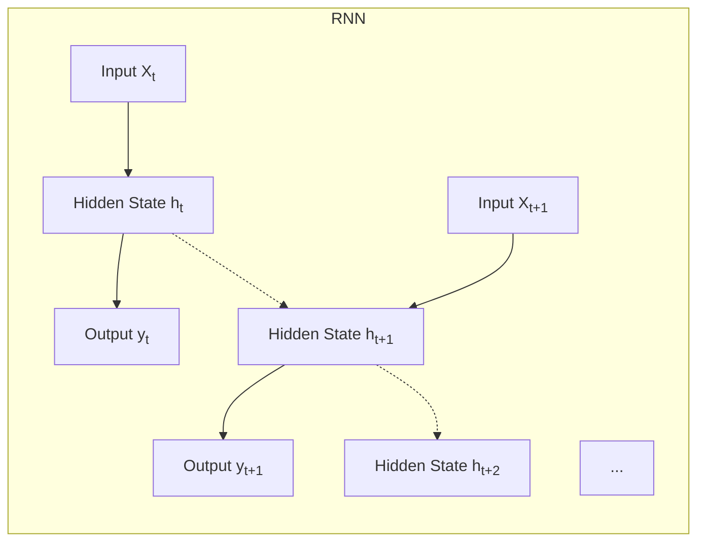

# 循环神经网络(Recurrent Neural Network)原理与代码实战案例讲解

## 1.背景介绍

### 1.1 神经网络简介

神经网络是一种受生物神经系统启发而设计的计算模型,广泛应用于模式识别、数据挖掘、图像处理等领域。传统的前馈神经网络(Feedforward Neural Networks)将输入信号通过多层神经元进行传递变换,最终输出结果。然而,这种网络结构无法很好地处理序列数据,如自然语言、语音和时间序列等。

### 1.2 循环神经网络的产生

为了解决序列数据处理问题,循环神经网络(Recurrent Neural Networks, RNNs)应运而生。与前馈网络不同,RNNs在隐藏层中引入了循环连接,使得网络具有"记忆"能力,能够捕捉序列数据中的长期依赖关系。这种结构使得RNNs在自然语言处理、语音识别、机器翻译等领域取得了巨大成功。

### 1.3 循环神经网络的应用

循环神经网络已广泛应用于以下领域:

- **自然语言处理**: 语言模型、机器翻译、文本生成、情感分析等
- **语音识别**: 自动语音识别、语音合成等
- **时间序列预测**: 股票预测、天气预测、异常检测等
- **机器人控制**: 通过观测环境状态序列控制机器人行为
- **手写识别**: 通过笔画序列识别手写字符
- **图像字幕生成**: 根据图像生成相应的文字描述

## 2.核心概念与联系

### 2.1 循环神经网络的结构

循环神经网络的基本结构如下图所示:

每个时间步长$t$,网络接收当前输入$X_t$和前一时间步的隐藏状态$h_{t-1}$,计算当前时间步的隐藏状态$h_t$和输出$y_t$。隐藏状态$h_t$被传递到下一时间步,用于计算$h_{t+1}$,这种循环连接赋予了RNNs处理序列数据的能力。

### 2.2 RNNs与前馈网络的区别

与传统前馈网络相比,RNNs具有以下特点:

- **序列输入输出**: 可以处理变长序列输入和输出
- **记忆能力**: 通过隐藏状态捕捉序列中的长期依赖关系
- **参数共享**: 在每个时间步使用相同的权重,减少参数量
- **动态行为**: 网络在时间步之间传播信息,表现出动态行为

### 2.3 RNNs面临的挑战

尽管RNNs在序列建模方面表现出色,但也面临一些挑战:

1. **梯度消失/爆炸**: 在长序列中,梯度可能会在反向传播时exponentially衰减或爆炸,导致训练困难。
2. **缓存盲区**: RNNs难以捕捉长期依赖关系,因为信息在传播过程中会逐渐丢失。
3. **并行计算**: 由于每个时间步骤之间存在依赖关系,难以实现高效的并行计算。

为解决这些问题,研究人员提出了多种改进方法,如LSTM(Long Short-Term Memory)和GRU(Gated Recurrent Unit)等。

## 3.核心算法原理具体操作步骤 

### 3.1 RNNs的前向传播

在时间步$t$,RNNs的前向传播过程为:

$$h_t = \tanh(W_{hx}x_t + W_{hh}h_{t-1} + b_h)$$
$$y_t = W_{yh}h_t + b_y$$

其中:
- $x_t$是当前时间步的输入
- $h_{t-1}$是前一时间步的隐藏状态
- $W_{hx}$、$W_{hh}$、$W_{yh}$、$b_h$、$b_y$是可训练参数
- $\tanh$是激活函数,可用其他非线性函数代替

上式中,$h_t$是当前时间步的隐藏状态,通过前一隐藏状态$h_{t-1}$和当前输入$x_t$计算得到。$y_t$是当前时间步的输出,由$h_t$线性变换得到。

### 3.2 RNNs的反向传播

RNNs的反向传播采用BPTT(Back-Propagation Through Time)算法,将时间展开的网络视为一个超级深层前馈网络。对于时间步$t$,损失函数对$W_{hx}$、$W_{hh}$、$W_{yh}$、$b_h$、$b_y$的梯度为:

$$\frac{\partial L}{\partial W_{hx}} = \sum_t \frac{\partial L}{\partial h_t}\frac{\partial h_t}{\partial W_{hx}}$$
$$\frac{\partial L}{\partial W_{hh}} = \sum_t \frac{\partial L}{\partial h_t}\frac{\partial h_t}{\partial W_{hh}}$$
$$\frac{\partial L}{\partial W_{yh}} = \sum_t \frac{\partial L}{\partial y_t}\frac{\partial y_t}{\partial W_{yh}}$$
$$\frac{\partial L}{\partial b_h} = \sum_t \frac{\partial L}{\partial h_t}\frac{\partial h_t}{\partial b_h}$$
$$\frac{\partial L}{\partial b_y} = \sum_t \frac{\partial L}{\partial y_t}\frac{\partial y_t}{\partial b_y}$$

其中,$\frac{\partial L}{\partial h_t}$和$\frac{\partial L}{\partial y_t}$可通过链式法则计算得到。

由于RNNs在时间步之间存在依赖关系,因此需要通过BPTT算法沿时间反向传播误差梯度。这种计算方式虽然简单,但在长序列时容易出现梯度消失或爆炸问题。

### 3.3 LSTM和GRU

为解决RNNs面临的梯度问题,研究人员提出了LSTM(Long Short-Term Memory)和GRU(Gated Recurrent Unit)等改进版本。

#### 3.3.1 LSTM

LSTM通过引入门控机制和携带状态,显式地控制信息的流动,从而缓解了梯度消失/爆炸问题。LSTM的核心计算步骤如下:

1. 遗忘门: $f_t = \sigma(W_f[h_{t-1}, x_t] + b_f)$
2. 输入门: $i_t = \sigma(W_i[h_{t-1}, x_t] + b_i)$
3. 候选状态: $\tilde{C}_t = \tanh(W_C[h_{t-1}, x_t] + b_C)$
4. 更新细胞状态: $C_t = f_t \odot C_{t-1} + i_t \odot \tilde{C}_t$
5. 输出门: $o_t = \sigma(W_o[h_{t-1}, x_t] + b_o)$
6. 隐藏状态: $h_t = o_t \odot \tanh(C_t)$

其中,$\sigma$是sigmoid函数,$\odot$表示元素乘积。LSTM通过遗忘门、输入门和输出门有选择地更新细胞状态和隐藏状态,从而捕捉长期依赖关系。

#### 3.3.2 GRU

GRU(Gated Recurrent Unit)是LSTM的一种变体,结构更加简单。GRU的核心计算步骤如下:

1. 更新门: $z_t = \sigma(W_z[h_{t-1}, x_t] + b_z)$  
2. 重置门: $r_t = \sigma(W_r[h_{t-1}, x_t] + b_r)$
3. 候选隐藏状态: $\tilde{h}_t = \tanh(W_h[r_t \odot h_{t-1}, x_t] + b_h)$
4. 隐藏状态: $h_t = (1 - z_t) \odot h_{t-1} + z_t \odot \tilde{h}_t$

GRU合并了LSTM中的遗忘门和输入门,使用更新门控制保留旧信息的程度,重置门控制忽略旧状态的程度。GRU相比LSTM参数更少,在某些任务上表现也更好。

## 4.数学模型和公式详细讲解举例说明

### 4.1 RNNs的数学表示

我们可以将RNNs的计算过程用数学形式表示。设输入序列为$\mathbf{x} = (x_1, x_2, \ldots, x_T)$,对应的隐藏状态序列为$\mathbf{h} = (h_1, h_2, \ldots, h_T)$,输出序列为$\mathbf{y} = (y_1, y_2, \ldots, y_T)$。RNNs的前向计算过程为:

$$h_t = f_W(x_t, h_{t-1})$$
$$y_t = g_V(h_t)$$

其中,$f_W$是根据当前输入$x_t$和前一隐藏状态$h_{t-1}$计算当前隐藏状态$h_t$的函数,参数为$W$;$g_V$是根据当前隐藏状态$h_t$计算当前输出$y_t$的函数,参数为$V$。

对于简单RNNs,$f_W$和$g_V$可具体表示为:

$$f_W(x_t, h_{t-1}) = \tanh(W_{hx}x_t + W_{hh}h_{t-1} + b_h)$$
$$g_V(h_t) = W_{yh}h_t + b_y$$

在训练过程中,我们需要最小化损失函数$L(\mathbf{y}, \hat{\mathbf{y}})$,其中$\hat{\mathbf{y}}$是期望的输出序列。通过反向传播算法,我们可以计算参数$W$和$V$的梯度,并使用优化算法(如SGD)更新参数。

### 4.2 LSTM和GRU的数学表示

对于LSTM,其前向计算过程可表示为:

$$\begin{aligned}
f_t &= \sigma(W_f[h_{t-1}, x_t] + b_f) \\
i_t &= \sigma(W_i[h_{t-1}, x_t] + b_i) \\
\tilde{C}_t &= \tanh(W_C[h_{t-1}, x_t] + b_C) \\
C_t &= f_t \odot C_{t-1} + i_t \odot \tilde{C}_t \\
o_t &= \sigma(W_o[h_{t-1}, x_t] + b_o) \\
h_t &= o_t \odot \tanh(C_t)
\end{aligned}$$

其中,$f_t$、$i_t$、$o_t$分别表示遗忘门、输入门和输出门;$C_t$是细胞状态。

对于GRU,其前向计算过程可表示为:

$$\begin{aligned}
z_t &= \sigma(W_z[h_{t-1}, x_t] + b_z) \\
r_t &= \sigma(W_r[h_{t-1}, x_t] + b_r) \\
\tilde{h}_t &= \tanh(W_h[r_t \odot h_{t-1}, x_t] + b_h) \\
h_t &= (1 - z_t) \odot h_{t-1} + z_t \odot \tilde{h}_t
\end{aligned}$$

其中,$z_t$和$r_t$分别表示更新门和重置门。

通过上述数学表示,我们可以更清晰地理解LSTM和GRU的计算过程,并在此基础上进行模型优化和改进。

### 4.3 反向传播算法

RNNs的训练过程采用反向传播算法,具体步骤如下:

1. **前向传播**:给定输入序列$\mathbf{x}$,计算隐藏状态序列$\mathbf{h}$和输出序列$\mathbf{y}$。
2. **计算损失**:根据期望输出$\hat{\mathbf{y}}$,计算损失函数$L(\mathbf{y}, \hat{\mathbf{y}})$。
3. **反向传播**:通过链式法则,计算损失函数对每个参数的梯度。
    - 对于$W_{yh}$和$b_y$,梯度为:
        $$\frac{\partial L}{\partial W_{yh}} = \sum_t \frac{\partial L