# 智能机器人和自动化技术的发展

## 1.背景介绍

### 1.1 人工智能和机器人技术的兴起

人工智能(Artificial Intelligence, AI)和机器人技术在过去几十年中发展迅猛,已经渗透到我们生活和工作的方方面面。随着计算能力的不断提高,算法的不断优化,以及大数据和云计算的兴起,人工智能和机器人技术正在经历前所未有的飞跃。

### 1.2 自动化需求的增长

在当今快节奏的商业环境中,自动化已成为提高效率、降低成本和提高生产力的关键驱动力。无论是制造业、服务业还是其他行业,自动化都被广泛应用,以优化流程、减少人工错误并释放人力资源专注于更有价值的工作。

### 1.3 智能机器人的崛起

智能机器人结合了人工智能和机器人技术,成为自动化的尖端力量。它们能够感知环境、学习和自主决策,执行复杂的任务。从工业机器人到服务机器人,智能机器人的应用范围不断扩大,为各行业带来了新的机遇和挑战。

## 2.核心概念与联系  

### 2.1 人工智能

人工智能是一门致力于开发能够模拟人类智能行为的理论、方法、技术与应用系统的学科。它包括以下几个核心概念:

#### 2.1.1 机器学习

机器学习是数据驱动的人工智能方法,通过利用算法从数据中自动分析并获取模式,进而对新数据做出预测或决策。常见的机器学习算法包括监督学习、非监督学习和强化学习等。

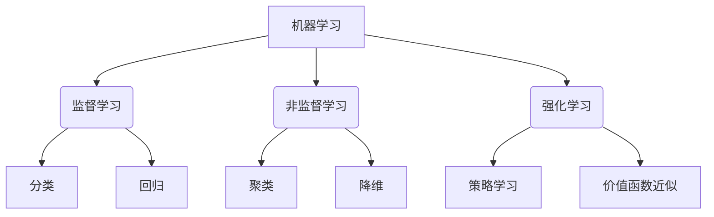

#### 2.1.2 深度学习

深度学习是机器学习的一个子领域,它利用深层神经网络模型对数据进行表征学习和端到端的自动模式分析。深度学习在计算机视觉、自然语言处理、语音识别等领域取得了突破性进展。

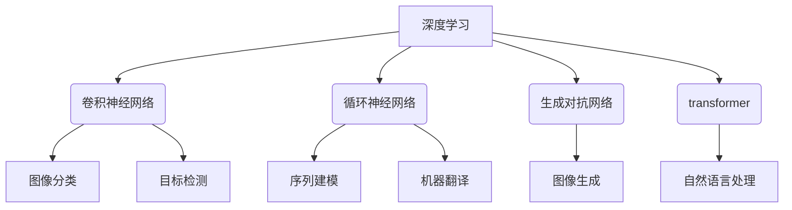

#### 2.1.3 知识表示与推理  

知识表示是使用形式语言对现实世界知识进行描述的过程,而推理则是基于这些表示的知识以及推理规则进行自动推导的过程。常见的知识表示方法包括逻辑、语义网络、框架等。

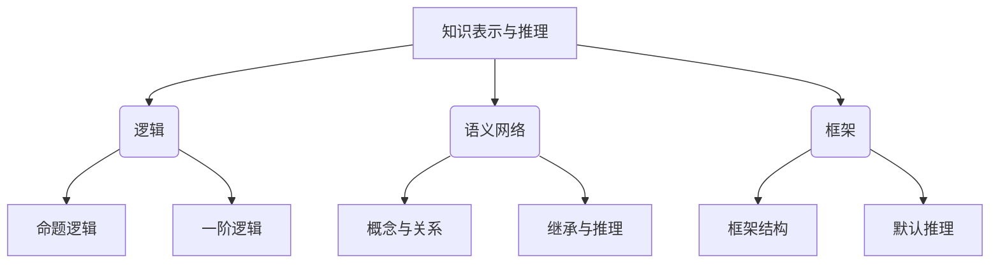

#### 2.1.4 自然语言处理

自然语言处理(Natural Language Processing, NLP)是人工智能的一个重要分支,旨在使计算机能够理解和生成人类语言。它包括语音识别、语义理解、对话系统、机器翻译等技术。

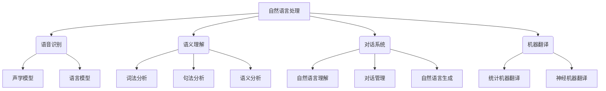

#### 2.1.5 计算机视觉

计算机视觉是人工智能的另一个重要分支,致力于使计算机能够从图像或视频中获取有意义的信息。它包括图像分类、目标检测、语义分割、实例分割等任务。

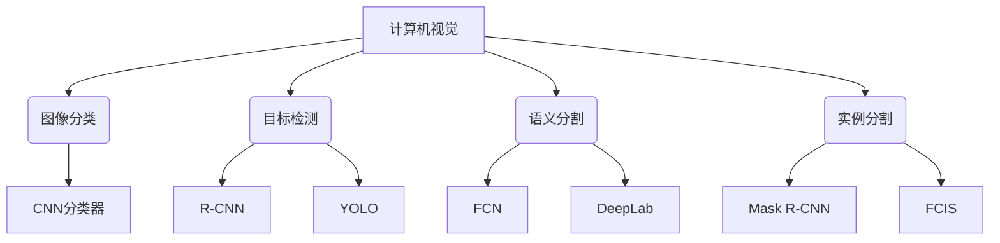

### 2.2 机器人技术

机器人技术是一门综合性学科,涉及机械、电子、控制、计算机等多个领域。它包括以下几个核心概念:

#### 2.2.1 机构设计

机构设计是机器人硬件的基础,决定了机器人的运动能力和工作空间。常见的机构形式包括串联机构、并联机构和柔性机构等。

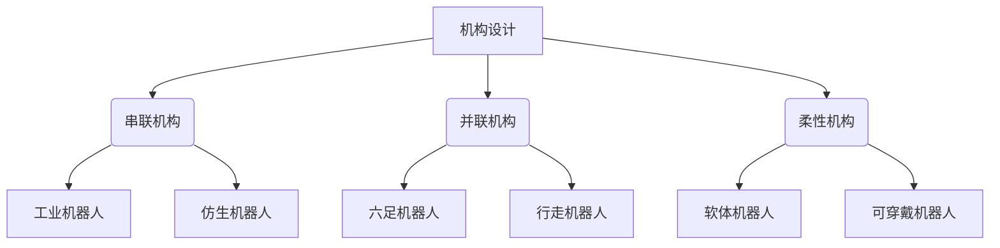

#### 2.2.2 传感技术

传感技术使机器人能够感知周围环境,是实现自主导航、运动控制和交互的关键。常见的传感器包括视觉传感器、力/触觉传感器、惯性传感器等。

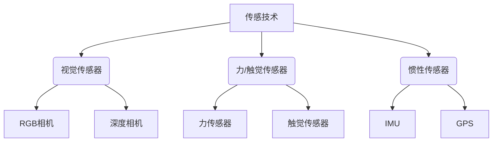

#### 2.2.3 运动控制

运动控制是实现机器人精确运动的关键技术,包括运动规划、轨迹跟踪和伺服控制等。不同类型的机器人需要采用不同的控制算法和策略。

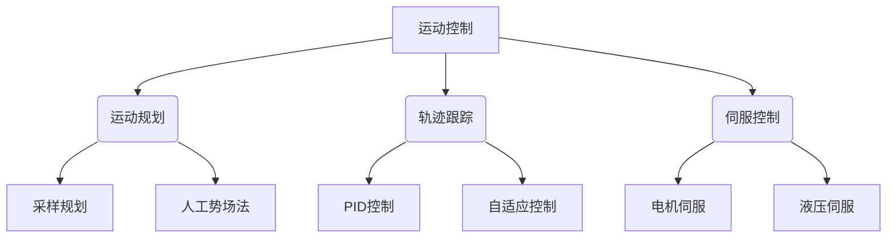

#### 2.2.4 人机交互

人机交互技术使机器人能够与人自然地交流和协作,包括语音交互、手势交互、触觉交互等形式。

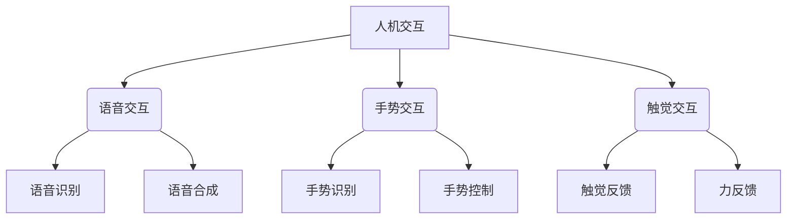

### 2.3 自动化技术

自动化技术是将人工智能和机器人技术应用于各行业流程的关键,旨在提高效率、降低成本并释放人力资源。它包括以下几个核心概念:

#### 2.3.1 工业自动化

工业自动化是将机器人和控制系统应用于制造业的过程,包括机器人装配、机器视觉检测、智能物流等。

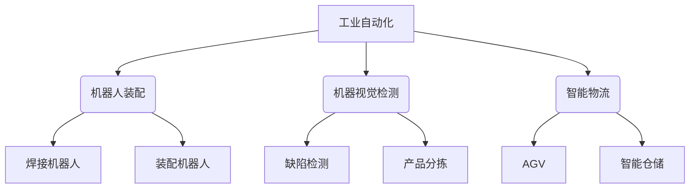

#### 2.3.2 服务自动化

服务自动化是将人工智能和机器人技术应用于服务业的过程,包括智能客服、送餐机器人、清洁机器人等。

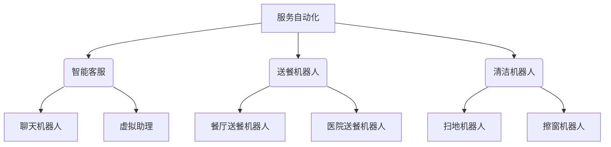

#### 2.3.3 智能过程自动化

智能过程自动化(Intelligent Process Automation, IPA)是将人工智能、机器学习和自动化技术相结合,以优化和自动化企业内部的业务流程。

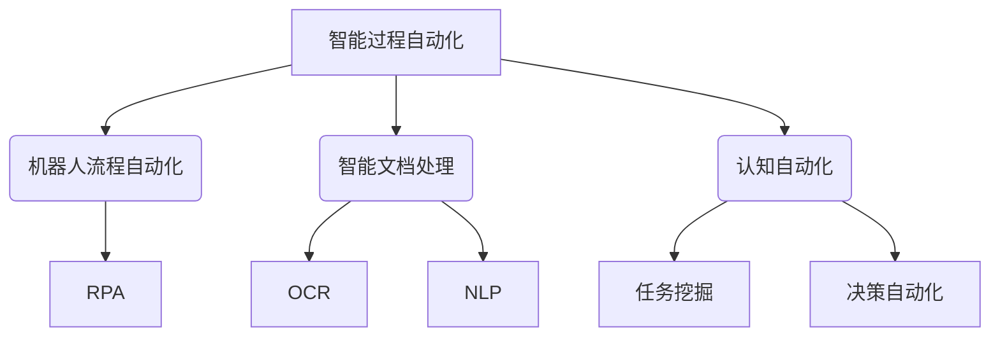

#### 2.3.4 智能系统集成

智能系统集成是将人工智能、机器人和自动化技术与传统系统相结合,构建端到端的智能解决方案。

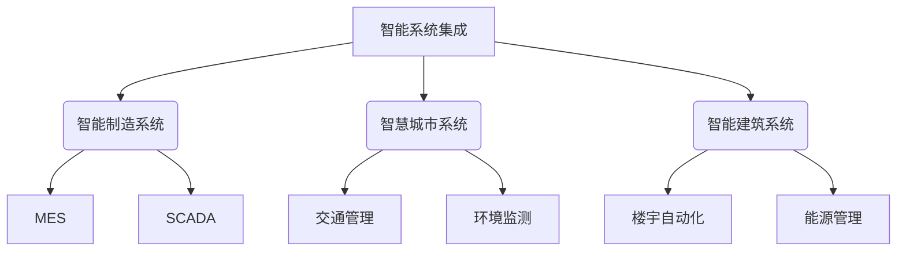

上述人工智能、机器人和自动化技术的核心概念相互关联、相辅相成,共同推动着智能系统的发展。

## 3.核心算法原理具体操作步骤

### 3.1 机器学习算法

#### 3.1.1 监督学习算法

监督学习是机器学习中最常见的一种范式,其目标是基于已标注的训练数据学习一个模型,从而对新的未标注数据进行预测或分类。常见的监督学习算法包括:

1. **线性回归**

线性回归是一种简单但有效的算法,用于预测连续值的目标变量。其核心思想是找到一条最佳拟合直线,使得数据点到直线的残差平方和最小。

算法步骤:

1) 初始化模型参数(权重和偏置)
2) 计算预测值与真实值之间的残差平方和(损失函数)
3) 使用梯度下降法更新模型参数,最小化损失函数
4) 重复步骤2和3,直到收敛或达到最大迭代次数

2. **逻辑回归**

逻辑回归是一种用于分类任务的算法,特别适用于二分类问题。它通过对数几率回归模型将输入映射到0到1之间的概率值,然后根据阈值(通常为0.5)进行分类。

算法步骤:

1) 初始化模型参数(权重和偏置)
2) 计算预测概率与真实标签之间的交叉熵损失
3) 使用梯度下降法更新模型参数,最小化损失函数
4) 重复步