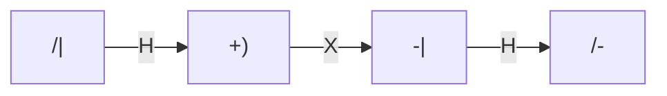

# 机器学习与量子计算：探索新的计算范式

## 1. 背景介绍

### 1.1 传统计算的局限性

传统的计算机系统基于经典计算理论,利用二进制数字(0和1)来表示和处理信息。虽然这种方法在过去几十年中取得了巨大的成就,但它也面临着一些固有的局限性。随着数据量的快速增长和计算需求的不断扩大,传统计算机在处理复杂问题时往往会遇到计算能力和效率的瓶颈。

### 1.2 新兴计算范式的需求

为了应对这些挑战,科学家和工程师一直在探索新的计算范式,旨在突破传统计算的局限,提供更强大的计算能力。其中,机器学习和量子计算被认为是两个最有前景的新兴计算范式。

## 2. 核心概念与联系  

### 2.1 机器学习

机器学习是一种通过利用数据构建算法模型的方法,使计算机能够自动改进性能,而无需显式编程。它利用统计技术在数据中寻找模式,并使用这些模式对新数据进行预测或决策。机器学习已经在许多领域取得了巨大的成功,例如计算机视觉、自然语言处理、推荐系统等。

#### 2.1.1 监督学习

监督学习是机器学习中最常见的一种形式。它使用带有标签的训练数据集,通过学习输入数据与标签之间的映射关系来构建模型。常见的监督学习算法包括线性回归、逻辑回归、决策树、支持向量机等。

#### 2.1.2 无监督学习

无监督学习则不使用带标签的数据,而是直接从数据中寻找内在的模式和结构。常见的无监督学习算法包括聚类算法(如K-means)和降维算法(如主成分分析)。

#### 2.1.3 强化学习

强化学习是一种基于奖惩机制的学习方式,代理通过与环境交互并获得反馈来学习如何采取最优行动。它广泛应用于机器人控制、游戏AI等领域。

### 2.2 量子计算

量子计算是基于量子力学原理构建的一种全新的计算模式。与传统计算机使用二进制数字不同,量子计算机利用量子比特(qubit)来表示和处理信息。量子比特可以同时处于0和1的叠加态,这使得量子计算机能够同时进行大量并行计算。

#### 2.2.1 量子并行性

量子并行性是量子计算的一个关键优势。由于量子比特的叠加态特性,量子计算机可以同时对所有可能的输入进行计算,从而大大提高了计算效率。

#### 2.2.2 量子算法

量子算法是专门为量子计算机设计的算法,利用量子力学原理来解决一些在传统计算机上难以高效解决的问题。著名的量子算法包括Shor's算法(用于整数分解)和Grover's算法(用于无结构搜索)。

### 2.3 机器学习与量子计算的联系

机器学习和量子计算虽然起源不同,但它们之间存在着密切的联系。一方面,量子计算可以为机器学习算法提供加速,提高训练和推理的效率;另一方面,机器学习也可以应用于量子计算领域,例如量子误差缓解、量子控制优化等。

此外,量子机器学习(Quantum Machine Learning)作为一个新兴的交叉领域,正在探索将量子计算与机器学习相结合的新方法和算法。

## 3. 核心算法原理具体操作步骤

在这一部分,我们将介绍一些机器学习和量子计算领域中的核心算法原理和具体操作步骤。

### 3.1 机器学习算法

#### 3.1.1 线性回归

线性回归是一种监督学习算法,用于预测连续值的目标变量。它假设目标变量和特征变量之间存在线性关系,并通过最小化误差平方和来拟合最佳的线性模型。

具体操作步骤如下:

1. 收集数据集,包括特征变量(自变量)和目标变量(因变量)。
2. 将数据集分为训练集和测试集。
3. 使用训练集数据,通过最小二乘法或梯度下降法估计线性模型的系数。
4. 在测试集上评估模型的性能,计算均方根误差(RMSE)等指标。
5. 根据需要调整模型参数或特征工程,重复步骤3和4。
6. 将训练好的模型应用于新的数据,进行预测。

#### 3.1.2 逻辑回归

逻辑回归是一种用于分类问题的监督学习算法。它通过估计概率值来预测实例属于某个类别的可能性。

操作步骤如下:

1. 收集包含特征变量和类别标签的数据集。
2. 将数据集分为训练集和测试集。
3. 使用训练集数据,通过最大似然估计或梯度下降法估计逻辑回归模型的系数。
4. 在测试集上评估模型的性能,计算准确率、精确率、召回率等指标。
5. 根据需要调整模型参数或特征工程,重复步骤3和4。
6. 将训练好的模型应用于新的数据,进行分类预测。

#### 3.1.3 决策树

决策树是一种常用的监督学习算法,可用于回归和分类问题。它通过构建一个树状结构来表示数据特征与目标变量之间的决策过程。

构建决策树的步骤如下:

1. 选择最优特征,根据该特征将数据集划分为子集。
2. 对每个子集重复步骤1,构建决策树的分支节点。
3. 直到满足停止条件(如所有实例属于同一类别或没有剩余特征可用),将节点标记为叶节点。

常用的决策树算法包括ID3、C4.5和CART等。

### 3.2 量子算法

#### 3.2.1 Shor's算法

Shor's算法是一种用于在量子计算机上高效解决整数分解问题的量子算法。它利用量子并行性和量子傅里叶变换,可以在多项式时间内完成分解任务,而在传统计算机上这个问题是NP难的。

Shor's算法的主要步骤如下:

1. 初始化量子寄存器,将其设置为所有可能的输入值的叠加态。
2. 应用量子傅里叶变换,将输入值映射到它们的周期。
3. 通过量子测量获取周期信息。
4. 使用经典算法从周期信息中恢复出所需的整数分解结果。

#### 3.2.2 Grover's算法

Grover's算法是一种用于无结构搜索问题的量子算法。它可以在$\mathcal{O}(\sqrt{N})$的时间内找到一个无结构数据库中的特定元素,而在传统计算机上这个问题需要$\mathcal{O}(N)$的时间。

Grover's算法的主要步骤如下:

1. 初始化量子寄存器为均匀叠加态。
2. 应用一系列量子操作,将目标解的振幅逐渐增大。
3. 重复步骤2的过程,直到目标解的振幅达到最大值。
4. 测量量子寄存器,获得目标解。

Grover's算法的核心是一种幅度放大过程,通过构造合适的量子线路来实现。

## 4. 数学模型和公式详细讲解举例说明

在机器学习和量子计算领域中,数学模型和公式扮演着重要的角色。下面我们将详细讲解一些核心的数学概念和公式。

### 4.1 线性代数

线性代数是机器学习和量子计算的基础数学工具。向量、矩阵和线性变换在这两个领域都有广泛的应用。

#### 4.1.1 向量和矩阵

向量是一组有序的数值,可以用来表示数据实例或模型参数。矩阵则是一种二维数组,可以表示线性变换或数据集。

向量通常用列向量表示:

$$
\vec{x} = \begin{bmatrix}
x_1 \\
x_2 \\
\vdots \\
x_n
\end{bmatrix}
$$

矩阵的表示形式为:

$$
A = \begin{bmatrix}
a_{11} & a_{12} & \cdots & a_{1n} \\
a_{21} & a_{22} & \cdots & a_{2n} \\
\vdots & \vdots & \ddots & \vdots \\
a_{m1} & a_{m2} & \cdots & a_{mn}
\end{bmatrix}
$$

#### 4.1.2 线性变换

线性变换是一种将向量映射到另一个向量空间的函数,它在机器学习中扮演着重要的角色。例如,线性回归模型就是一种线性变换。

给定一个矩阵$A$和向量$\vec{x}$,线性变换可以表示为:

$$
A\vec{x} = \begin{bmatrix}
a_{11}x_1 + a_{12}x_2 + \cdots + a_{1n}x_n \\
a_{21}x_1 + a_{22}x_2 + \cdots + a_{2n}x_n \\
\vdots \\
a_{m1}x_1 + a_{m2}x_2 + \cdots + a_{mn}x_n
\end{bmatrix}
$$

### 4.2 概率论和统计学

概率论和统计学是机器学习的理论基础,也在量子计算中扮演着重要的角色。

#### 4.2.1 概率分布

概率分布描述了随机变量取值的可能性。在机器学习中,我们常常需要估计数据的概率分布,并基于此进行建模和预测。

离散随机变量的概率质量函数(PMF)定义为:

$$
P(X = x_i) = p_i, \quad \sum_{i} p_i = 1
$$

连续随机变量的概率密度函数(PDF)定义为:

$$
f(x) = \lim_{\Delta x \rightarrow 0} \frac{P(x \leq X \leq x + \Delta x)}{\Delta x}
$$

#### 4.2.2 最大似然估计

最大似然估计(MLE)是一种常用的参数估计方法,在机器学习和量子计算中都有应用。

假设我们有一个概率模型$P(X|\theta)$,其中$\theta$是需要估计的参数向量。给定观测数据$\{x_1, x_2, \ldots, x_n\}$,我们希望找到一个$\theta$值,使得观测数据的似然函数$L(\theta|x_1, x_2, \ldots, x_n) = \prod_{i=1}^n P(x_i|\theta)$最大化。

通过对似然函数取对数并求导,我们可以得到最大似然估计的方程:

$$
\frac{\partial}{\partial \theta} \log L(\theta|x_1, x_2, \ldots, x_n) = 0
$$

### 4.3 量子力学

量子力学是量子计算的理论基础,描述了量子系统的行为和演化规律。

#### 4.3.1 量子态和量子测量

在量子力学中,一个量子系统的状态可以用一个复数向量(称为态矢量)来表示:

$$
|\psi\rangle = \begin{bmatrix}
\alpha_1 \\
\alpha_2 \\
\vdots \\
\alpha_n
\end{bmatrix}
$$

其中,$\alpha_i$是复数,并且满足归一化条件$\sum_i |\alpha_i|^2 = 1$。

量子测量是观测量子系统的过程,它会使量子态坍缩到特定的基态之一。测量的结果是随机的,结果$i$出现的概率为$|\alpha_i|^2$。

#### 4.3.2 量子门和量子线路

量子门是量子计算的基本运算单元,它们对应着对量子态的一种线性变换。常见的量子门包括Pauli门、Hadamard门、相位移门等。

量子线路则是由多个量子门按照一定顺序组合而成的,用于实现更复杂的量子算法。例如,下面是一个简单的量子线路:

这个量子线路包含三个量子门(Hadamard门H、NOT门X和Hadamard门