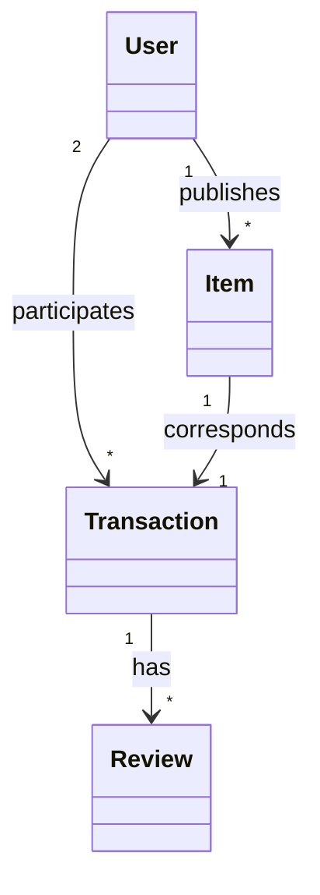
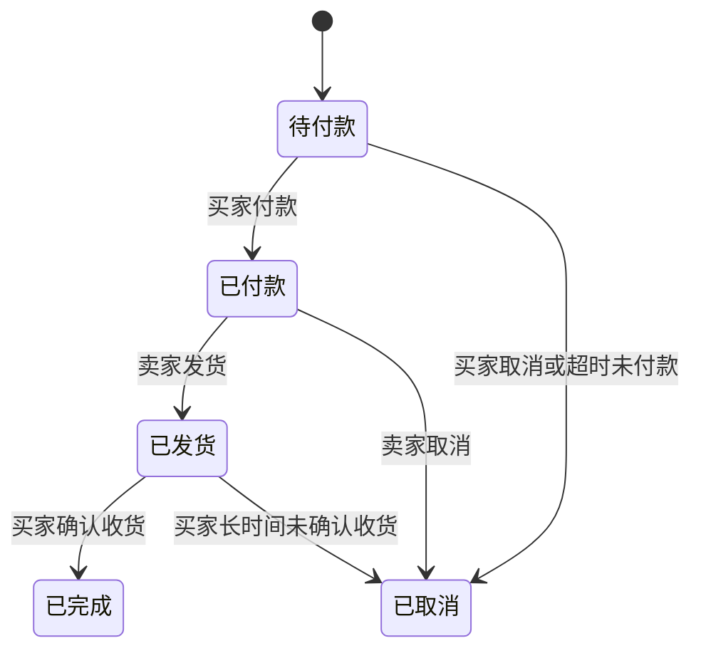

# 校园物品交易系统详细设计与具体代码实现

作者：禅与计算机程序设计艺术

## 1. 背景介绍

### 1.1 校园二手交易现状

在大学校园中，学生之间的二手物品交易非常频繁。学生们常常需要出售自己不再需要的物品，如教科书、电子产品、自行车等，同时也希望能够以较低的价格购买到所需的二手物品。然而，目前大多数校园内缺乏一个专门的平台来支持这类交易活动，学生们通常只能通过社交媒体、论坛或者线下交易的方式进行二手物品的买卖，存在信息不对称、交易不便、诚信难以保证等问题。

### 1.2 校园物品交易系统的必要性

为了解决上述问题，开发一个专门的校园物品交易系统显得尤为重要和必要。这样一个系统可以为学生提供一个统一的平台，方便他们发布和浏览二手物品的信息，并提供在线交易和评价的功能，从而提高交易的效率和可信度。同时，学校也可以通过这个系统加强对校园二手交易的管理和监督，营造一个健康有序的交易环境。

### 1.3 系统目标与功能需求

校园物品交易系统的主要目标是为大学生提供一个方便、可靠、高效的二手物品交易平台。具体来说，系统需要实现以下核心功能：

1. 用户注册与登录：允许学生使用学号进行注册，并提供登录功能。
2. 物品发布：用户可以方便地发布自己想要出售的二手物品信息，包括物品名称、类别、图片、描述、价格等。
3. 物品浏览与搜索：用户可以浏览所有发布的物品信息，并可以按照类别、关键词等条件进行搜索。
4. 在线交易：买家可以在线向卖家发起购买请求，双方可以就交易细节进行沟通并完成交易。
5. 用户评价：交易完成后，买家和卖家可以互相对对方进行评价，以建立信任机制。
6. 个人中心：用户可以管理自己发布的物品，查看交易记录，并修改个人信息。

## 2. 核心概念与关系

在校园物品交易系统中，主要涉及以下几个核心概念：

- 用户（User）：代表使用该系统的学生，包括买家和卖家。每个用户都有一个唯一的学号作为标识。
- 物品（Item）：代表用户发布的二手物品。每个物品都有一个唯一的ID，并包含名称、类别、图片、描述、价格等信息。
- 交易（Transaction）：代表买家和卖家之间达成的一次交易。每个交易都有一个唯一的ID，并包含物品信息、交易金额、交易时间、交易状态等。
- 评价（Review）：代表买家或卖家对对方的评价。每个评价都与一个具体的交易关联，并包含评分和评价内容。

这些核心概念之间的关系如下：

- 一个用户可以发布多个物品，每个物品都属于一个用户。
- 一个用户可以参与多次交易，每次交易都涉及一个买家和一个卖家。
- 一次交易对应一个物品，即每次交易都是围绕一个特定的物品展开的。
- 一次交易可以对应多条评价，买家和卖家可以分别对对方进行评价。

下图使用Mermaid语法展示了这些概念之间的关系：



## 3. 核心算法原理与具体操作步骤

在校园物品交易系统中，有几个关键的算法和操作需要实现，包括：

### 3.1 物品推荐算法

为了提高用户的使用体验，系统需要根据用户的浏览记录、购买记录等信息，自动向用户推荐可能感兴趣的物品。这里可以使用协同过滤（Collaborative Filtering）算法来实现推荐功能。

具体步骤如下：

1. 收集用户的历史行为数据，包括浏览记录、购买记录等。
2. 构建用户-物品评分矩阵，矩阵中的每个元素表示某个用户对某个物品的评分（可以是显式评分或隐式评分）。
3. 计算用户之间的相似度，常用的相似度度量方法有余弦相似度、皮尔逊相关系数等。
4. 根据用户相似度，为目标用户找到最相似的K个用户（K为超参数）。
5. 对这K个用户评分较高但目标用户尚未浏览或购买过的物品，计算预测评分，并按照预测评分从高到低进行排序。
6. 将排名靠前的物品推荐给目标用户。

### 3.2 信用评分机制

为了维护交易的诚信，需要对每个用户计算一个信用评分，用于衡量该用户的可信度。信用评分可以综合考虑以下因素：

1. 交易次数：用户参与交易的次数越多，信用评分越高。
2. 好评率：用户收到的好评数占总评价数的比例越高，信用评分越高。
3. 交易金额：用户参与的交易金额越大，信用评分越高。
4. 交易纠纷：用户卷入的交易纠纷越少，信用评分越高。

具体的信用评分计算公式可以设计为：

$$
\text{CreditScore} = \alpha \times \frac{\text{NumTransactions}}{\text{TotalTransactions}} + \beta \times \frac{\text{NumGoodReviews}}{\text{TotalReviews}} + \gamma \times \frac{\text{TotalAmount}}{\text{AvgAmount}} - \delta \times \frac{\text{NumDisputes}}{\text{TotalTransactions}}
$$

其中，$\alpha$, $\beta$, $\gamma$, $\delta$是权重系数，可以根据实际情况进行调整。

### 3.3 交易状态管理

每笔交易都需要经历多个状态，例如：

- 待付款：买家已经向卖家发起交易请求，等待买家付款。
- 已付款：买家已经完成付款，等待卖家发货。
- 已发货：卖家已经发货，等待买家确认收货。
- 已完成：买家已经确认收货，交易完成。
- 已取消：买家或卖家取消了交易。

状态之间的转换关系如下图所示：



为了实现状态管理，系统需要记录每笔交易的当前状态，并在合适的时机触发状态转换。同时，还需要设置一些超时机制，例如买家在一定时间内未付款或确认收货，系统自动将交易取消。

## 4. 数学模型与公式详解

在校园物品交易系统中，除了前面提到的信用评分计算公式外，还可能涉及一些其他的数学模型和公式，例如：

### 4.1 物品相似度计算

在物品推荐算法中，除了基于用户相似度的协同过滤外，还可以考虑基于物品相似度的推荐。物品相似度可以通过计算物品之间的余弦相似度来衡量：

$$
\text{sim}(i, j) = \frac{\sum_{u \in U} R_{ui} R_{uj}}{\sqrt{\sum_{u \in U} R_{ui}^2} \sqrt{\sum_{u \in U} R_{uj}^2}}
$$

其中，$i$和$j$是两个物品，$U$是对这两个物品都有评分的用户集合，$R_{ui}$和$R_{uj}$分别表示用户$u$对物品$i$和$j$的评分。

### 4.2 用户购买力估计

为了更好地对用户进行分类和管理，可以估计每个用户的购买力。一种简单的方法是根据用户的历史交易金额和频率来计算：

$$
\text{PurchasingPower} = \frac{\text{TotalAmount}}{\text{AvgAmount}} \times \log(\text{NumTransactions} + 1)
$$

其中，$\text{TotalAmount}$是用户的总交易金额，$\text{AvgAmount}$是系统中所有交易的平均金额，$\text{NumTransactions}$是用户的交易次数。对数函数的作用是减少交易次数的影响，避免次数过大时导致购买力估计值过高。

### 4.3 价格合理性评估

为了帮助用户判断物品的价格是否合理，可以计算物品的平均价格和价格区间。假设物品$i$的所有历史交易价格为$P_1, P_2, \dots, P_n$，则平均价格为：

$$
\text{AvgPrice}_i = \frac{1}{n} \sum_{k=1}^n P_k
$$

价格区间可以用均值加减两个标准差来表示：

$$
[\text{AvgPrice}_i - 2\sigma_i, \text{AvgPrice}_i + 2\sigma_i]
$$

其中，标准差$\sigma_i$的计算公式为：

$$
\sigma_i = \sqrt{\frac{1}{n-1} \sum_{k=1}^n (P_k - \text{AvgPrice}_i)^2}
$$

如果一个物品的价格远高于或远低于这个区间，就可以提示用户价格可能不太合理。

## 5. 项目实践：代码实例与详解

下面我们通过一些具体的代码实例来展示如何实现校园物品交易系统的某些关键功能。这里以Python语言为例。

### 5.1 用户注册与登录

首先，我们需要一个`User`类来表示用户，并实现用户注册和登录的功能：

```python
class User:
    def __init__(self, username, password, email):
        self.username = username
        self.password = password
        self.email = email
        
    @staticmethod
    def register(username, password, email):
        # 检查用户名是否已存在
        if User.find_by_username(username):
            return None
        
        # 创建新用户并保存到数据库
        user = User(username, password, email)
        user.save_to_db()
        
        return user
        
    @staticmethod
    def login(username, password):
        # 根据用户名查找用户
        user = User.find_by_username(username)
        
        # 检查密码是否正确
        if user and user.password == password:
            return user
        
        return None
        
    @staticmethod
    def find_by_username(username):
        # 在数据库中根据用户名查找用户，返回User对象或None
        pass
        
    def save_to_db(self):
        # 将用户信息保存到数据库
        pass
```

在这个`User`类中，我们定义了`register`方法用于注册新用户，`login`方法用于用户登录。这两个方法都是静态方法，可以直接通过类名调用，而不需要创建对象实例。

`register`方法首先检查用户名是否已经存在，如果不存在则创建一个新的`User`对象并保存到数据库中。`login`方法根据用户名查找用户，并检查密码是否正确，如果正确则返回对应的`User`对象，否则返回`None`。

`find_by_username`和`save_to_db`方法分别用于在数据库中查找用户和保存用户信息，具体的实现方式取决于所使用的数据库技术。

### 5.2 物品发布与浏览

接下来，我们定义一个`Item`类表示物品，并实现物品的发布和浏览功能：

```python
class Item:
    def __init__(self, name, description, price, seller):
        self.name = name
        self.description = description
        self.price = price
        self.seller = seller
        
    def publish(self):
        # 将物品信息保存到数据库
        self.save_to_db()
        
    @staticmethod
    def get_all_items():
        # 从数据库中获取所有物品信息，返回Item对象列表
        pass
        
    @staticmethod
    def find_by_name(name):
        # 在数据库中根据物品名称进行模糊查找，返回匹配的Item对象列表
        pass
        
    def save_to_db(self):