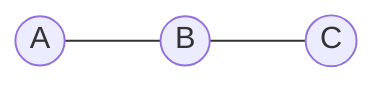

# 概率图模型原理与代码实战案例讲解

## 1.背景介绍

### 1.1 什么是概率图模型

概率图模型(Probabilistic Graphical Models, PGMs)是一种将概率论与图论相结合的有效框架,用于表示和推理复杂系统中的不确定性和随机性。它们提供了一种直观且富有表现力的方式来描述随机变量之间的条件独立性和概率依赖关系。

概率图模型主要分为两大类:

1. **贝叶斯网络(Bayesian Networks)**: 也称为有向无环图模型,用于表示因果关系和推理。
2. **马尔可夫随机场(Markov Random Fields)**: 也称为无向图模型,用于表示变量之间的相关性和联合分布。

### 1.2 概率图模型的应用

概率图模型在各个领域都有广泛的应用,包括但不限于:

- 机器学习和模式识别
- 计算机视觉和图像处理
- 自然语言处理和信息检索
- 生物信息学和基因组学
- 决策理论和风险分析
- 故障诊断和可靠性工程

它们为解决复杂的不确定性问题提供了强大的工具,如预测、诊断、决策和学习等。

## 2.核心概念与联系  

### 2.1 概率图模型的表示

概率图模型由两个基本组成部分构成:

1. **结构(Structure)**: 用图(网络)来表示随机变量之间的条件独立性和依赖关系。
2. **参数(Parameters)**: 用概率分布的参数(如条件概率表)来量化变量之间的依赖关系强度。

#### 2.1.1 贝叶斯网络

贝叶斯网络使用有向无环图(Directed Acyclic Graph, DAG)来表示变量之间的因果关系。每个节点表示一个随机变量,有向边表示变量之间的条件依赖关系。

例如,下图是一个简单的贝叶斯网络,描述了天气、潮湿度和草坪是否结露之间的关系:

在这个例子中,天气影响潮湿度,而潮湿度又影响草坪是否结露。

#### 2.1.2 马尔可夫随机场

马尔可夫随机场使用无向图来表示变量之间的相关性,每个节点表示一个随机变量,无向边连接相关的变量。常见的马尔可夫随机场包括:

- **贝叶斯马尔可夫网络(Bayesian Markov Networks)**: 由贝叶斯网络转换而来。
- **马尔可夫网络(Markov Networks)**: 也称为马尔可夫随机场。
- **条件随机场(Conditional Random Fields, CRFs)**: 常用于序列标注任务。

例如,下图是一个简单的马尔可夫网络,描述了三个变量之间的相关性:

在这个例子中,A与B相关,B与C相关,但A与C之间是否相关则取决于具体的概率分布。

### 2.2 核心概念

理解概率图模型需要掌握以下几个核心概念:

1. **条件独立性(Conditional Independence)**: 描述在给定某些条件下,两个或多个随机变量是否相互独立。
2. **d-分离(d-Separation)**: 用于确定在给定证据的情况下,概率图模型中哪些变量是条件独立的。
3. **马尔可夫性质(Markov Properties)**: 定义了概率图模型中变量的局部马尔可夫性质,即一个变量在给定它的马尔可夫祖先后与其他变量条件独立。
4. **因子分解(Factorization)**: 利用条件独立性将联合概率分布分解为局部函数(如条件概率表)的乘积,从而简化计算。
5. **推理(Inference)**: 根据观测到的证据,计算感兴趣变量的后验概率分布,包括精确推理和近似推理算法。
6. **学习(Learning)**: 从数据中自动学习概率图模型的结构和参数,包括参数估计和结构学习。

这些概念构成了概率图模型的理论基础,并为各种推理和学习算法奠定了基础。

## 3.核心算法原理具体操作步骤

概率图模型的核心算法包括推理算法和学习算法,下面将分别介绍它们的原理和具体操作步骤。

### 3.1 推理算法

推理算法的目标是计算给定证据下感兴趣变量的后验概率分布。常见的推理算法包括:

#### 3.1.1 精确推理

精确推理算法能够准确计算后验概率,但在复杂模型中往往计算代价很高。常见的精确推理算法有:

1. **变量消元(Variable Elimination)**: 通过对无关变量求和或积分,逐步消去中间变量,最终得到目标变量的边际分布。

   算法步骤:
   1) 构建因子图(Factor Graph)
   2) 选择消元顺序
   3) 逐步消去无关变量
   4) 归一化得到目标变量的边际分布

2. **信念传播(Belief Propagation)**: 在树形或多树形结构的概率图模型中,通过在节点之间传递消息(信念)来高效计算边际分布。包括Sum-Product算法和Max-Product算法。

   算法步骤:
   1) 初始化节点的信念
   2) 在节点之间传递消息
   3) 更新节点的信念
   4) 重复步骤2和3直到收敛
   5) 归一化得到目标变量的边际分布

#### 3.1.2 近似推理

对于复杂的概率图模型,精确推理往往是不可行的,需要使用近似推理算法。常见的近似推理算法有:

1. **马尔可夫蒙特卡洛(Markov Chain Monte Carlo, MCMC)**: 通过构建马尔可夫链来近似采样目标分布,常用算法包括Gibbs采样和Metropolis-Hastings算法。

   算法步骤:
   1) 初始化马尔可夫链的起始状态
   2) 根据转移核(如Gibbs采样或Metropolis-Hastings)生成新的样本
   3) 重复步骤2直到收敛
   4) 使用采样结果近似计算目标分布

2. **变分推理(Variational Inference)**: 通过优化一个简化的近似分布,使其与目标分布尽可能接近,常用的有平均场(Mean Field)和期望传播(Expectation Propagation)算法。

   算法步骤:
   1) 选择合适的近似分布族
   2) 构造变分下界(如ELBO)
   3) 优化近似分布参数,最大化变分下界
   4) 使用优化后的近似分布进行推理

这些推理算法为概率图模型的应用奠定了基础,但在实际问题中需要根据具体情况选择合适的算法。

### 3.2 学习算法

学习算法的目标是从数据中自动估计概率图模型的结构和参数。常见的学习算法包括:

#### 3.2.1 参数学习

在已知模型结构的情况下,参数学习算法用于从数据中估计概率分布的参数,如条件概率表(CPT)。常用的参数学习算法有:

1. **最大似然估计(Maximum Likelihood Estimation, MLE)**: 通过最大化数据的似然函数来估计参数。

   算法步骤:
   1) 构造似然函数
   2) 使用数值优化算法(如梯度下降)最大化似然函数
   3) 得到参数的最大似然估计值

2. **贝叶斯估计(Bayesian Estimation)**: 将参数视为随机变量,在先验分布的基础上结合数据计算参数的后验分布。

   算法步骤:
   1) 设定参数的先验分布
   2) 根据贝叶斯公式计算参数的后验分布
   3) 使用后验分布的期望或最大值点作为参数估计

#### 3.2.2 结构学习

结构学习算法用于从数据中自动发现概率图模型的结构(网络拓扑)。常用的结构学习算法有:

1. **约束基结构学习(Constraint-based Structure Learning)**: 通过条件独立性测试来识别变量之间的依赖关系,如PC算法和IC算法。

   算法步骤:
   1) 对变量对进行条件独立性测试
   2) 构建无向图,连接不满足条件独立性的变量对
   3) 确定边的方向以满足无环约束
   4) 进行模型评分和修剪以得到最终结构

2. **评分基结构学习(Score-based Structure Learning)**: 通过最大化某个评分函数(如BIC或BDeu)来搜索最优模型结构,如贪婪搜索和MCMC等。

   算法步骤:
   1) 定义结构评分函数
   2) 使用搜索算法(如贪婪搜索或MCMC)优化评分函数
   3) 得到最优模型结构

3. **约束驱动学习(Constraint-driven Learning)**: 结合先验知识(如因果关系)和数据进行结构学习,如半监督学习等。

这些学习算法使概率图模型能够从数据中自动获取知识,提高了模型的泛化能力和适用性。

## 4.数学模型和公式详细讲解举例说明

概率图模型的数学基础主要包括图论、概率论和因子分解等内容,下面将详细介绍相关的数学模型和公式。

### 4.1 图论基础

概率图模型使用图论来表示随机变量之间的条件独立性和依赖关系。常用的图论概念包括:

1. **有向无环图(Directed Acyclic Graph, DAG)**: 用于表示贝叶斯网络的结构,每个节点表示一个随机变量,有向边表示条件依赖关系,且不存在环路。

2. **无向图(Undirected Graph)**: 用于表示马尔可夫随机场的结构,每个节点表示一个随机变量,无向边连接相关的变量。

3. **团(Clique)**: 无向图中所有节点两两相连的最大完全子图。

4. **马尔可夫毯(Markov Blanket)**: 给定一个节点,其马尔可夫毯是使该节点与其他节点条件独立的最小节点集合。

5. **d-分离(d-Separation)**: 用于判断在给定证据的情况下,概率图模型中哪些变量是条件独立的。

这些图论概念为概率图模型的表示和推理奠定了基础。

### 4.2 概率论基础

概率图模型建立在概率论的基础之上,涉及到以下重要概念和公式:

1. **联合概率分布(Joint Probability Distribution)**: 描述多个随机变量的联合分布,记为 $P(X_1, X_2, \dots, X_n)$。

2. **条件概率(Conditional Probability)**: 描述在给定某些条件下,事件发生的概率,记为 $P(A|B)$。

3. **贝叶斯定理(Bayes' Theorem)**: 用于计算已知先验概率和证据概率时的后验概率,公式为:

$$P(A|B) = \frac{P(B|A)P(A)}{P(B)}$$

4. **链式法则(Chain Rule)**: 用于将联合概率分解为条件概率的乘积,公式为:

$$P(X_1, X_2, \dots, X_n) = P(X_1)P(X_2|X_1)P(X_3|X_1,X_2)\cdots P(X_n|X_1,\dots,X_{n-1})$$

5. **边际概率(Marginal Probability)**: 通过对无关变量求和或积分来计算某个变量的边际分布,公式为:

$$P(X) = \sum_Y P(X,Y)$$

这些概率论概念为概率图模型的推理和学习提供了理论基础。

### 4.3 因子分解

概率图模型的核心思想是利用条件独立性将联合概率分布分解为局部函数(因子)的乘积,从而简化计算。这个过程称为因子分解(Factorization)。

对于贝叶斯网络,联合概率分布可以分解为条件概率的乘积:

$$P(X_1, X_2, \dots, X_n) = \prod_{i=1}^n P(X_i|Pa(X_i))$$

其中 $Pa(X_i)$ 表示 $