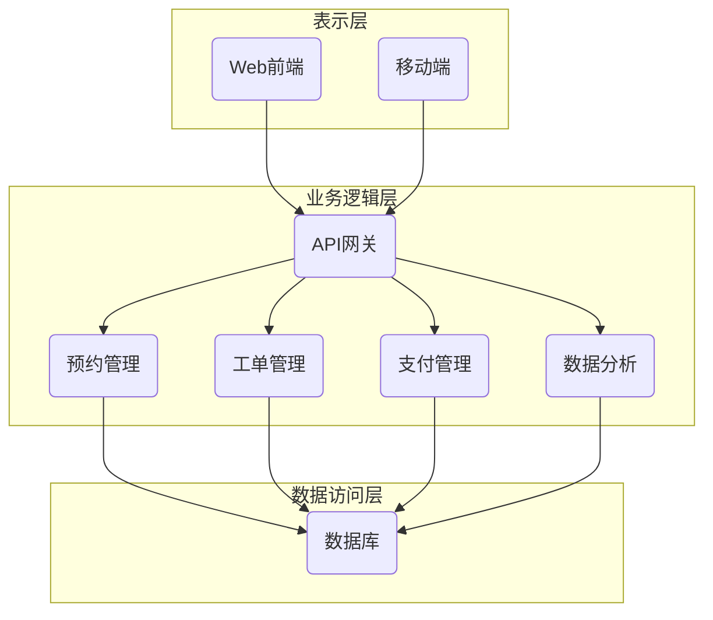
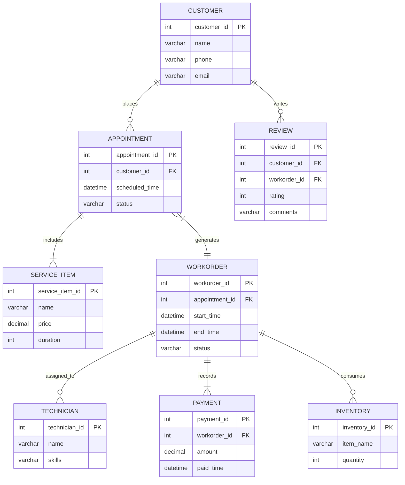

# 汽车美容管理系统详细设计与具体代码实现

## 1. 背景介绍

### 1.1 汽车美容行业概况

随着汽车保有量的不断增加和人们生活水平的提高,汽车美容服务需求也在不断扩大。汽车美容不仅能够保持汽车的良好外观,还能延长汽车的使用寿命,提高二手车的残值。因此,汽车美容行业发展迅速,市场前景广阔。

### 1.2 汽车美容管理系统的必要性

传统的汽车美容服务管理方式存在诸多问题,如信息孤岛、数据冗余、响应效率低下等,严重影响了企业的运营效率和服务质量。因此,开发一套高效、智能的汽车美容管理系统以规范化、信息化的方式管理美容服务流程,优化业务流程,提高工作效率,成为行业内企业的迫切需求。

## 2. 核心概念与联系

### 2.1 汽车美容服务流程

汽车美容服务流程通常包括:

1. 客户预约
2. 服务项目确认
3. 支付结算
4. 服务实施
5. 质量检查
6. 客户评价

### 2.2 系统核心概念

1. **用户管理**:包括客户信息、员工信息等。
2. **服务项目管理**:包括服务项目设置、服务项目组合等。
3. **预约管理**:客户预约服务的时间和项目安排。
4. **支付管理**:服务费用结算和支付。
5. **工单管理**:生成工单,分配任务,跟踪进度。
6. **库存管理**:管理美容所需物料的采购、库存。
7. **评价管理**:收集客户对服务的评价反馈。
8. **数据分析**:对业务数据进行多维分析,为决策提供支持。

## 3. 核心算法原理具体操作步骤  

### 3.1 工单分配算法

工单分配是美容管理系统的核心功能之一。算法的目标是将工单合理分配给员工,以提高工作效率,缩短等待时间。常用的工单分配算法有:

1. **先来先服务(FCFS)算法**:按工单到达的时间顺序分配。
2. **最短剩余时间优先(SRPT)算法**:优先分配预计服务时间最短的工单。
3. **优先级调度算法**:根据工单优先级进行调度,优先级高的工单先被服务。

#### 3.1.1 FCFS算法步骤

1) 维护一个工单队列,按到达时间排序
2) 选择队列最前面的工单
3) 查找空闲员工,分配该工单
4) 重复以上步骤,直到队列为空

FCFS算法实现简单,但可能导致某些工单长时间等待。

#### 3.1.2 SRPT算法步骤  

1) 维护一个工单队列,按预计服务时间由小到大排序
2) 选择队列最前面的工单
3) 查找空闲员工,分配该工单
4) 重复以上步骤,直到队列为空

SRPT算法可缩短平均等待时间,但对长工单不利。

#### 3.1.3 优先级调度算法步骤

1) 维护一个工单优先级队列
2) 选择队列最前面的高优先级工单  
3) 查找空闲员工,分配该工单
4) 重复以上步骤,直到队列为空

优先级调度算法可确保高优先级工单优先获得服务,但可能导致低优先级工单长时间等待。

#### 3.1.4 算法优化

可根据实际需求,对上述算法进行组合和优化,如:

- 结合SRPT和优先级调度,先按优先级排序,再按预计时间排序
- 引入工单超时机制,防止工单长时间等待
- 引入员工技能等级,将工单合理分配给匹配的员工

### 3.2 库存管理算法

合理的库存管理对于控制成本、保证供应至关重要。常用的库存管理算法有:

1. **经济订货量(EOQ)模型**
2. **周期补货(PR)模型**  
3. **ABC分类管理法**

#### 3.2.1 EOQ模型

EOQ模型旨在确定每次补货的最佳订货量,使订货成本和库存成本之和最小。

EOQ计算公式:

$$EOQ = \sqrt{\frac{2DC_o}{C_h}}$$

其中:
- D是年度需求量
- $C_o$是每次订货的固定成本  
- $C_h$是每单位产品的年库存成本

#### 3.2.2 PR模型

PR模型根据预先设定的时间周期进行补货,以满足一定时间内的需求。

补货量计算公式:

$$Q = D \times L$$

其中:
- Q是补货量
- D是单位时间内的需求量
- L是补货周期

#### 3.2.3 ABC分类管理法

ABC分类管理法根据物料的重要程度和价值将其划分为A、B、C三类,对不同类别采取不同的管理策略。

- A类物料:数量少但价值高,实施严格管控
- B类物料:数量和价值适中,实施一般管控
- C类物料:数量多但价值低,实施简化管控

### 3.3 数据分析算法

数据分析算法可以从海量业务数据中发现有价值的模式和规律,为企业决策提供支持。常用的数据分析算法有:

1. **关联规则挖掘**:发现事物之间的关联关系
2. **聚类分析**:将相似的数据对象归为同一类别
3. **时序模式分析**:发现数据随时间的变化规律

#### 3.3.1 关联规则挖掘

关联规则挖掘算法用于发现事物之间的关联关系,如:

- 购买A商品的顾客也可能购买B商品
- 90%购买A和B商品的顾客也购买了C商品

关联规则的两个重要指标是支持度和置信度:

- 支持度:规则的适用对象占总对象的比例
- 置信度:对于符合规则前件的对象,有多大比例也符合规则后件

常用的关联规则挖掘算法有Apriori算法和FP-Growth算法。

#### 3.3.2 聚类分析

聚类分析算法根据数据对象之间的相似性,将其自动分为多个类别或簇。常用的聚类算法有:

- K-Means算法
- DBSCAN算法
- 层次聚类算法

这些算法可用于客户细分、异常检测等场景。

#### 3.3.3 时序模式分析  

时序模式分析算法发现数据随时间的变化规律,如:

- 某一时间段的客户流量高峰
- 服务项目的季节性波动规律
- 缺陷数据的周期性变化

常用的时序模式挖掘算法有:

- 时序规则挖掘算法
- 周期性模式挖掘算法
- 异常检测算法

## 4. 数学模型和公式详细讲解举例说明

### 4.1 马尔可夫模型

马尔可夫模型是描述随机过程的重要数学工具,可用于建模和分析系统的动态行为。

在汽车美容管理系统中,可以使用马尔可夫模型描述系统的各个状态及其转移规律,如:

- 客户预约到达状态
- 工单分配状态
- 服务实施状态
- 等待支付状态
- ......

设系统有n个状态,用$S = \{s_1, s_2, ..., s_n\}$表示状态空间。在时刻t,系统处于某一状态$s_i$,则在时刻t+1,系统将以$p_{ij}$的概率转移到状态$s_j$。

$$p_{ij} = P(X_{t+1}=s_j|X_t=s_i), \sum_{j=1}^n p_{ij} = 1$$

所有状态转移概率组成n阶转移概率矩阵P:

$$
P = 
\begin{bmatrix}
p_{11} & p_{12} & \cdots & p_{1n} \\
p_{21} & p_{22} & \cdots & p_{2n} \\
\vdots & \vdots & \ddots & \vdots \\
p_{n1} & p_{n2} & \cdots & p_{nn}
\end{bmatrix}
$$

基于马尔可夫模型,我们可以计算系统在未来某一时刻处于各个状态的概率,并优化系统的状态转移过程。

### 4.2 排队论模型

排队论模型用于研究排队现象及其规律,可用于分析和优化服务系统的响应能力。

在汽车美容管理系统中,可将客户到达、工单分配、服务实施等过程建模为排队系统。

常用的排队模型包括:

1. **M/M/1模型**:客户到达服从泊松分布,服务时间服从负指数分布,有单一服务台
2. **M/M/c模型**:客户到达服从泊松分布,服务时间服从负指数分布,有c个服务台
3. **M/G/1模型**:客户到达服从泊松分布,服务时间服从任意分布,有单一服务台

以M/M/1模型为例,设客户到达率为$\lambda$,服务率为$\mu$,则系统的利用率为:

$$\rho = \frac{\lambda}{\mu}$$

当$\rho < 1$时,系统保持稳定状态。系统的一些重要性能指标为:

- 平均队长$L_q = \frac{\rho^2}{1-\rho}$  
- 平均等待时间$W_q = \frac{\rho}{(1-\rho)\mu}$
- 平均响应时间$W = W_q + \frac{1}{\mu}$

通过构建和分析排队模型,我们可以评估系统的性能瓶颈,并采取相应措施(如增加服务窗口数)进行优化。

## 5. 项目实践:代码实例和详细解释说明

### 5.1 系统架构设计

汽车美容管理系统采用经典的三层架构,包括表示层(前端)、业务逻辑层(中间件)和数据访问层。

前端提供Web界面和移动APP两种方式,通过API网关访问后端服务。后端服务按功能模块化部署,共享数据访问层对数据库的访问。

### 5.2 数据库设计 

该ER图描述了系统的核心数据模型,包括:

- 客户(CUSTOMER)、预约(APPOINTMENT)、服务项目(SERVICE_ITEM)
- 工单(WORKORDER)、技师(TECHNICIAN)、支付(PAYMENT)
- 库存(INVENTORY)、评价(REVIEW)等实体及其关系

### 5.3 关键功能模块代码实例

以下是系统的部