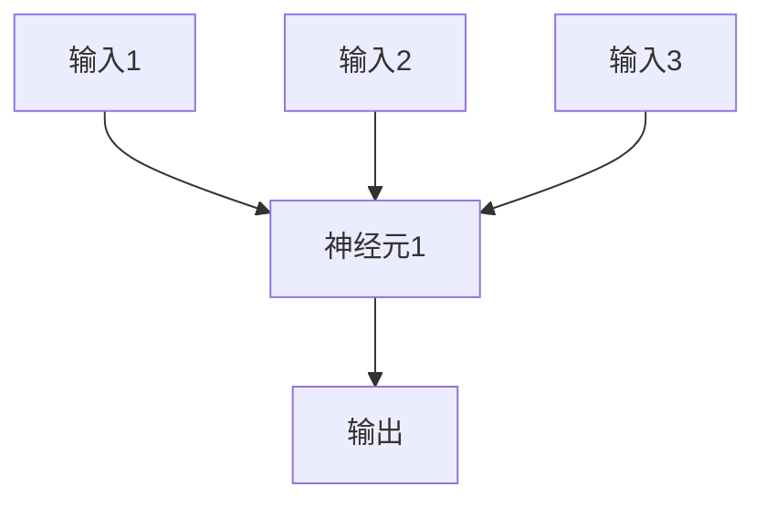
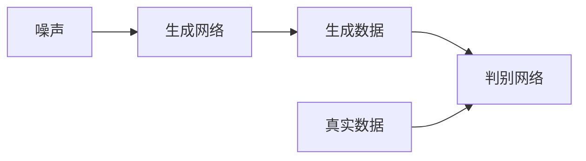

# 深度学习原理与代码实例讲解

## 1. 背景介绍

### 1.1 什么是深度学习？

深度学习(Deep Learning)是机器学习的一个新兴热门领域,它是一种基于对数据进行表征学习的机器学习算法。深度学习通过对大量数据进行训练,让计算机像人脑一样自主学习数据的特征表示,并用于解决诸如计算机视觉、自然语言处理、语音识别等复杂的人工智能问题。

### 1.2 深度学习的发展历程

- 1940s: 生物学家发现动物大脑由神经元组成的网络结构
- 1950s: 人工神经网络理论提出
- 1980s: 反向传播算法被重新发现,多层感知器获得突破
- 1990s-2000s: 卷积神经网络、长短期记忆网络等新型网络相继出现
- 2010s: 深度学习在计算机视觉、语音识别等领域大放异彩
- 2020s: 深度学习模型不断创新,推动人工智能技术飞速发展

### 1.3 深度学习的重要性

深度学习是推动人工智能发展的核心动力,在诸多领域展现出超人类的能力:

- 计算机视觉: 图像分类、目标检测、语义分割等
- 自然语言处理: 机器翻译、文本生成、对话系统等  
- 语音识别: 语音转文本、声纹识别等
- 推荐系统: 个性化推荐、广告投放等
- 医疗健康: 医学图像分析、药物分子设计等
- 金融: 信用评分、欺诈检测等
- ...

## 2. 核心概念与联系

### 2.1 人工神经网络

人工神经网络是深度学习的核心基础,它模拟了生物神经网络对信息的处理方式,由大量互连的节点(神经元)组成。每个神经元接收来自其他神经元的输入信号,经过加权求和和激活函数的非线性变换后,输出一个新的信号。

### 2.2 前馈神经网络与反向传播

前馈神经网络是最基本的人工神经网络结构,信号只从输入层向输出层单向传播。通过反向传播算法,可以有效地训练多层神经网络模型。

反向传播算法的核心思想是:
1. 前向传播计算输出
2. 计算输出与标签的损失
3. 反向传播计算每层参数的梯度
4. 基于梯度更新网络参数

$$
\begin{aligned}
y &= f(w_1x_1 + w_2x_2 + b) \\
L &= \text{loss}(y, \hat{y}) \\
\frac{\partial L}{\partial w_1} &= \frac{\partial L}{\partial y} \cdot \frac{\partial y}{\partial w_1} \\
w_1^\prime &= w_1 - \eta \frac{\partial L}{\partial w_1}
\end{aligned}
$$

其中 $y$ 为输出, $\hat{y}$ 为标签, $L$ 为损失函数, $\eta$ 为学习率。

### 2.3 卷积神经网络

卷积神经网络(CNN)是一种用于处理网格结构数据(如图像)的强大神经网络,具有局部连接、权值共享和池化等特点,大大减少了网络参数量,显著提高了训练效率。

CNN 典型结构包括:
- 卷积层: 提取局部特征
- 池化层: 降低特征维度,实现平移不变性
- 全连接层: 将特征映射到标签空间

### 2.4 循环神经网络

循环神经网络(RNN)擅长处理序列数据,如自然语言、语音、时间序列等。与前馈网络不同,RNN 在每个时刻的输出不仅取决于当前输入,还取决于前一时刻的隐藏状态,从而捕获序列数据中的长期依赖关系。

$$
\begin{aligned}
h_t &= f_W(x_t, h_{t-1}) \\
y_t &= g_V(h_t)
\end{aligned}
$$

其中 $x_t$ 为时刻 $t$ 的输入, $h_t$ 为隐藏状态, $y_t$ 为输出。

长短期记忆网络(LSTM)和门控循环单元网络(GRU)是 RNN 的改进版本,通过门控机制有效缓解了长期依赖问题。

### 2.5 生成对抗网络

生成对抗网络(GAN)由生成网络和判别网络组成,两者相互对抗,最终达到生成网络生成的数据无法被判别网络识别的状态。GAN 可用于图像生成、语音合成、数据增强等应用。

### 2.6 深度强化学习

深度强化学习将深度神经网络引入强化学习框架,使智能体能够直接从原始输入(如图像、语音等)中学习策略,在复杂环境中获得超人类的表现。深度Q网络(DQN)、策略梯度等是重要的深度强化学习算法。

## 3. 核心算法原理具体操作步骤

### 3.1 前馈神经网络训练

1. **网络初始化**: 随机初始化网络权重和偏置
2. **前向传播**: 
   - 输入层: $a^{(1)} = x$
   - 隐藏层: $z^{(l)} = W^{(l)}a^{(l-1)} + b^{(l)}$, $a^{(l)} = f(z^{(l)})$
   - 输出层: $\hat{y} = a^{(n_l)}$
3. **计算损失**: $L = J(\hat{y}, y)$
4. **反向传播**:
   - 输出层: $\delta^{(n_l)} = \nabla_a J(a^{(n_l)}, y) \odot f'(z^{(n_l)})$ 
   - 隐藏层: $\delta^{(l)} = (W^{(l+1)T}\delta^{(l+1)}) \odot f'(z^{(l)})$
5. **更新权重和偏置**:
   - $W^{(l)} := W^{(l)} - \alpha \delta^{(l+1)}(a^{(l)})^T$
   - $b^{(l)} := b^{(l)} - \alpha \delta^{(l+1)}$
6. **重复2-5**,直到收敛

### 3.2 卷积神经网络前向传播

1. **输入层**: 输入图像 $X$ 
2. **卷积层**:
   - 滤波器卷积: $S(i, j) = (X*K)(i,j) = \sum_m\sum_n X(i+m, j+n)K(m,n)$
   - 加偏置: $Z = S + b$
   - 激活: $A = f(Z)$
3. **池化层**:
   - 最大/平均池化: $P(i,j) = \max/\text{avg} \{A(i*s:i*s+k, j*s:j*s+k)\}$
4. **展平层**: 将特征图拉平为一维向量
5. **全连接层**: 与普通神经网络相同

### 3.3 循环神经网络前向传播

对于序列 $x_1, x_2, ..., x_T$:

1. 初始化隐藏状态 $h_0 = 0$
2. 对于时刻 $t=1,2,...,T$:
   - $h_t = f_W(x_t, h_{t-1})$
   - $y_t = g_V(h_t)$
3. 输出序列 $y_1, y_2, ..., y_T$

其中 $f_W$ 和 $g_V$ 分别为隐藏层和输出层的函数,通常使用门控机制(如 LSTM、GRU)。

### 3.4 生成对抗网络训练

1. **初始化生成网络 $G$ 和判别网络 $D$ 的参数**
2. **训练循环**:
   - 固定 $G$, 最大化 $D$ 的目标函数: $\max_D V(D) = \mathbb{E}_{x\sim p_\text{data}}[\log D(x)] + \mathbb{E}_{z\sim p_z}[\log(1-D(G(z)))]$
   - 固定 $D$, 最小化 $G$ 的目标函数: $\min_G V(G) = \mathbb{E}_{z\sim p_z}[\log(1-D(G(z)))]$
   - 更新 $D$ 和 $G$ 的参数
3. **重复2**,直到收敛

### 3.5 深度强化学习算法

以深度Q网络(DQN)为例:

1. **初始化Q网络和目标Q网络**
2. **训练循环**:
   - 执行 $\epsilon$-贪婪策略,获取 $(s_t, a_t, r_t, s_{t+1})$ 
   - 存入经验回放池
   - 从经验回放池采样批量数据
   - 计算目标Q值: $y_j = r_j + \gamma \max_{a'} Q'(s_{j+1}, a'; \theta^-)$
   - 更新Q网络参数: $\theta \leftarrow \theta - \alpha \nabla_\theta (y_j - Q(s_j, a_j; \theta))^2$
   - 更新目标Q网络参数: $\theta^- \leftarrow \tau\theta + (1-\tau)\theta^-$
3. **重复2**,直到收敛

## 4. 数学模型和公式详细讲解举例说明

### 4.1 激活函数

激活函数引入非线性,使神经网络能够拟合任意复杂的函数。常用的激活函数包括:

- Sigmoid: $\sigma(x) = \frac{1}{1+e^{-x}}$
- Tanh: $\tanh(x) = \frac{e^x - e^{-x}}{e^x + e^{-x}}$
- ReLU: $\text{ReLU}(x) = \max(0, x)$
- Leaky ReLU: $\text{LReLU}(x) = \max(\alpha x, x)$

其中 ReLU 及其变体由于不存在梯度消失问题,在深层网络中表现更佳。

### 4.2 损失函数

损失函数用于衡量模型预测与真实值之间的差异,是优化模型的驱动力。常用的损失函数包括:

- 均方误差(MSE): $\text{MSE}(y, \hat{y}) = \frac{1}{n}\sum_{i=1}^n(y_i - \hat{y}_i)^2$
- 交叉熵(CE): $\text{CE}(y, \hat{y}) = -\sum_i y_i \log \hat{y}_i$
- Huber损失: $\text{Huber}(y, \hat{y}) = \begin{cases}\frac{1}{2}(y-\hat{y})^2 & |y-\hat{y}| \leq \delta \\ \delta(|y-\hat{y}| - \frac{1}{2}\delta) & \text{otherwise}\end{cases}$

对于分类问题,交叉熵损失函数更为常用;对于回归问题,均方误差和Huber损失函数更加鲁棒。

### 4.3 优化算法

优化算法用于有效地更新网络参数,最小化损失函数。常用的优化算法包括:

- 随机梯度下降(SGD): $\theta_{t+1} = \theta_t - \eta \nabla_\theta J(\theta_t)$
- 动量SGD: $v_{t+1} = \gamma v_t + \eta \nabla_\theta J(\theta_t)$, $\theta_{t+1} = \theta_t - v_{t+1}$
- RMSProp: $E[g^2]_{t+1} = 0.9E[g^2]_t + 0.1(g_t)^2$, $\theta_{t+1} = \theta_t - \frac{\eta}{\sqrt{E[g^2]_{t+1}+\epsilon}}g_t$
- Adam: $m_{t+1} = \beta_1 m_t + (1-\beta_1)g_t$, $v_{t+1} = \beta_2 v_t + (1-\beta_2)(g_t