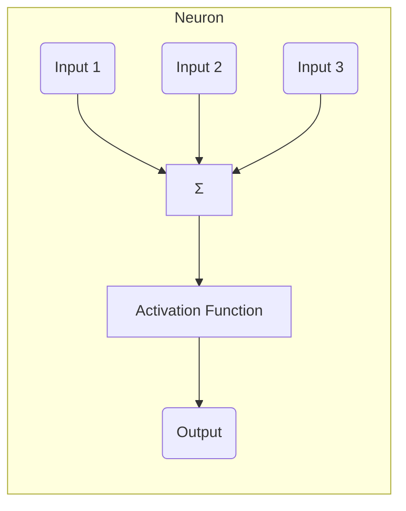
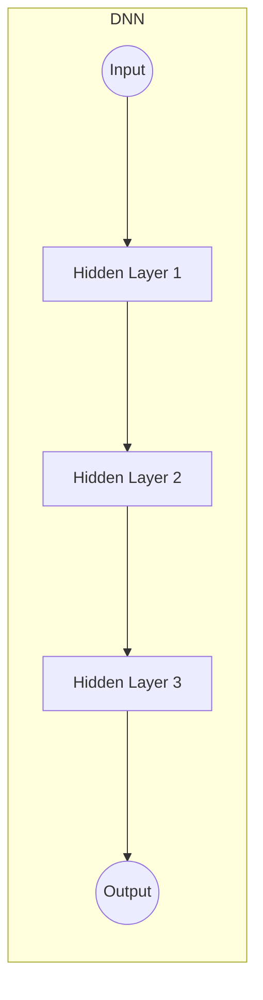
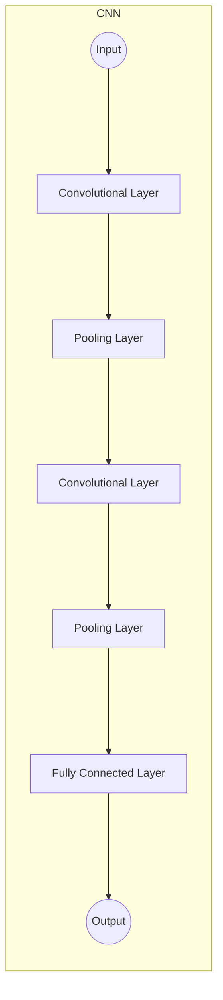
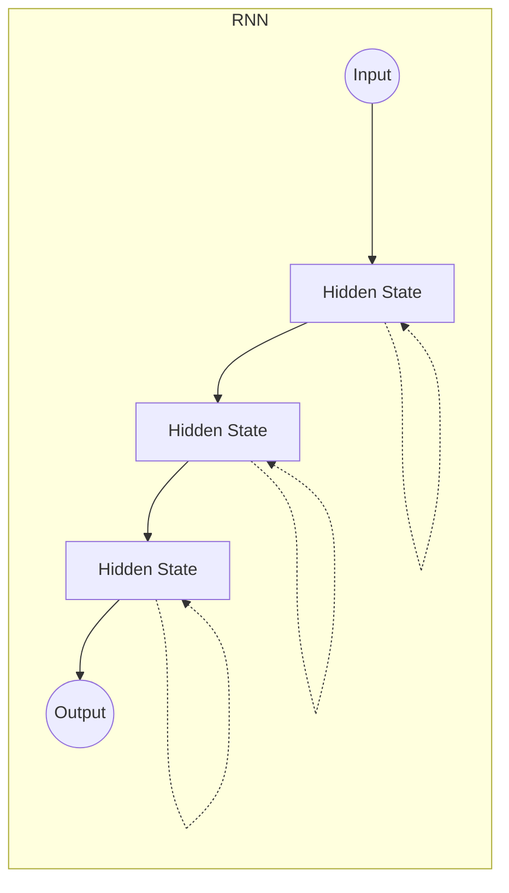
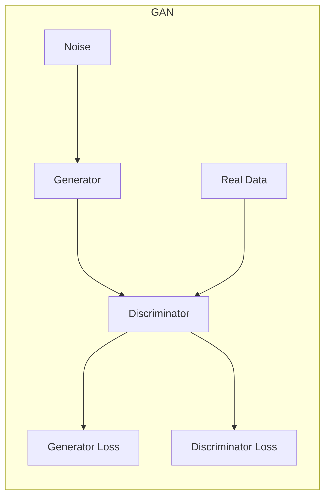

# 深度学习原理与代码实战案例讲解

## 1.背景介绍

### 1.1 什么是深度学习？

深度学习(Deep Learning)是机器学习的一个新的研究热点,它是一种试图通过数据建模高层次抽象的算法,模仿人脑神经网络对数据进行分层表示学习。深度学习的动机在于构建一种算法模型,使计算机能够自动学习数据的特征,并利用这些特征对复杂的样本数据进行分类或预测。

传统的机器学习算法需要人工设计合适的特征,而深度学习则可以自动从数据中学习出这些特征表示,从而大大降低了特征工程的工作量。深度学习算法主要包括深度神经网络(Deep Neural Networks)、卷积神经网络(Convolutional Neural Networks)、递归神经网络(Recurrent Neural Networks)等。

### 1.2 深度学习的发展历程

深度学习的理论基础可以追溯到上世纪80年代提出的神经网络理论。但是由于当时的计算能力和数据量的限制,神经网络并未取得实质性突破。直到近年来,大数据时代的到来、硬件计算能力的飞速提升以及一些新算法的提出,才使得深度学习得以重新焕发生机。

2006年,小型神经网络在识别手写数字的任务上首次超过了其他机器学习技术。2012年,深度神经网络在ImageNet大型视觉识别挑战赛中,将识别错误率降低了将近20%,从此开启了深度学习在计算机视觉领域的广泛应用。随后,深度学习也在自然语言处理、语音识别等领域取得了突破性进展。

### 1.3 深度学习的重要性

深度学习作为人工智能领域的一个重要突破,正在全面渗透和改变着各行各业。它为解决复杂的现实问题提供了一种全新的思路和手段,展现出巨大的应用前景。一些典型的应用场景包括:

- 计算机视觉:图像分类、目标检测、图像分割等
- 自然语言处理:机器翻译、语音识别、问答系统等 
- 推荐系统:个性化推荐、广告投放等
- 医疗健康:医学图像分析、药物分子设计等
- 金融保险:欺诈检测、风险管理等
- 交通运输:自动驾驶、智能交通等

深度学习的发展也推动了人工智能技术的快速发展和广泛应用,对于提高生产效率、优化资源配置、改善生活质量等具有重要意义。因此,深入理解深度学习的原理和实践是当前计算机科学以及相关领域的重要课题。

## 2.核心概念与联系  

### 2.1 神经网络简介

神经网络(Neural Network)是一种按照生物神经网络的结构和工作原理来构建的数学模型,旨在模拟人脑神经元之间的工作方式。它由大量的人工神经元互相连接而成,每个神经元接收多个输入信号,经过内部处理后输出一个信号。

神经网络的基本单元是人工神经元,其结构如下图所示:

人工神经元接收多个加权输入 $I_1, I_2, \dots, I_n$,将它们相加得到净输入 $net = \sum_{i=1}^{n}w_iI_i + b$,其中 $w_i$ 是对应输入的权重, $b$ 是偏置项。然后将净输入通过一个非线性激活函数 $f$ 进行处理,得到神经元的输出 $O = f(net)$。常用的激活函数包括Sigmoid函数、ReLU函数等。

多个神经元通过不同的连接方式组成不同类型的神经网络,如前馈神经网络、卷积神经网络、递归神经网络等,用于解决不同的问题。

### 2.2 深度神经网络

深度神经网络(Deep Neural Network, DNN)是一种包含多个隐藏层的前馈神经网络。与传统的浅层神经网络相比,深度神经网络能够更好地捕捉输入数据的抽象特征,从而提高了模型的表达能力和泛化性能。

一个典型的深度神经网络结构如下所示:

深度神经网络中的每一层都是一个由多个神经元组成的全连接层,每个神经元与上一层的所有神经元相连。网络的输入层接收原始数据,然后经过多个隐藏层的非线性变换,最终在输出层产生预测结果。

通过增加隐藏层的数量和每层神经元的数量,深度神经网络可以学习到越来越抽象的特征表示,从而更好地拟合复杂的数据模式。但是,过深的网络也容易出现梯度消失/爆炸等问题,因此需要采用一些优化技术如残差连接、Batch Normalization等。

### 2.3 卷积神经网络

卷积神经网络(Convolutional Neural Network, CNN)是一种专门用于处理网格结构数据(如图像、语音等)的深度神经网络。它在传统神经网络的基础上引入了卷积层和池化层,能够有效地捕捉输入数据的局部特征。

一个典型的卷积神经网络结构如下所示:

- 卷积层(Convolutional Layer)通过滑动卷积核在输入数据上进行卷积操作,提取局部特征。
- 池化层(Pooling Layer)对卷积层的输出进行下采样,减小数据量并保留主要特征。
- 全连接层(Fully Connected Layer)将前面提取的特征进行整合,并输出最终的预测结果。

卷积神经网络在计算机视觉、语音识别等领域有着广泛的应用,展现出非常优秀的性能。

### 2.4 递归神经网络

递归神经网络(Recurrent Neural Network, RNN)是一种专门设计用于处理序列数据(如文本、语音、时间序列等)的深度神经网络。与前馈神经网络不同,RNN在隐藏层之间引入了循环连接,使得网络能够对序列数据进行建模。

一个典型的递归神经网络结构如下所示:

在每个时间步,RNN根据当前输入和前一时间步的隐藏状态计算出新的隐藏状态,并基于新的隐藏状态产生输出。这种循环结构使得RNN能够捕捉序列数据中的长期依赖关系。

但是,传统的RNN在处理长序列时容易出现梯度消失/爆炸问题。为了解决这个问题,提出了长短期记忆网络(Long Short-Term Memory, LSTM)和门控循环单元(Gated Recurrent Unit, GRU)等改进的RNN变体。

递归神经网络在自然语言处理、语音识别、时间序列预测等领域有着广泛的应用。

### 2.5 生成对抗网络

生成对抗网络(Generative Adversarial Networks, GANs)是一种全新的深度学习架构,由生成器(Generator)和判别器(Discriminator)两个对抗的神经网络组成。生成器的目标是生成逼真的数据样本,而判别器则试图区分生成的样本和真实的样本。

生成对抗网络的训练过程可以看作是一个迷你max游戏,生成器和判别器相互对抗,最终达到一种平衡状态(Nash均衡)。此时,生成器能够生成逼真的样本,而判别器无法可靠地区分真实样本和生成样本。

生成对抗网络的架构如下所示:

生成对抗网络在图像生成、语音合成、数据增强等领域有着广泛的应用前景。它为深度学习带来了全新的思路和可能性,是当前研究的热点方向之一。

## 3.核心算法原理具体操作步骤

在上一节中,我们介绍了深度学习的几种核心模型,包括深度神经网络、卷积神经网络、递归神经网络和生成对抗网络。接下来,我们将详细讨论这些模型的训练原理和具体算法步骤。

### 3.1 深度神经网络的训练

深度神经网络的训练过程是一个优化问题,目标是找到一组最优的权重参数,使得网络在训练数据上的损失函数最小化。常用的优化算法包括梯度下降法及其变体。

假设我们有一个深度神经网络 $f(x; \theta)$,其中 $x$ 是输入数据, $\theta$ 是网络的所有可训练参数。给定一个训练数据集 $\{(x_i, y_i)\}_{i=1}^N$,我们定义损失函数 $\mathcal{L}(\theta) = \frac{1}{N}\sum_{i=1}^N L(y_i, f(x_i; \theta))$,其中 $L$ 是针对单个样本的损失函数,如均方误差、交叉熵损失等。

训练的目标是最小化损失函数:

$$
\theta^* = \arg\min_\theta \mathcal{L}(\theta)
$$

我们通过计算损失函数相对于参数 $\theta$ 的梯度,并沿着梯度的反方向更新参数,从而不断减小损失函数的值。具体的梯度下降算法步骤如下:

1. 初始化网络参数 $\theta^{(0)}$
2. 对于迭代次数 $t = 0, 1, 2, \dots$:
    a. 计算梯度 $g^{(t)} = \nabla_\theta \mathcal{L}(\theta^{(t)})$
    b. 更新参数 $\theta^{(t+1)} = \theta^{(t)} - \eta g^{(t)}$,其中 $\eta$ 是学习率

在实际应用中,我们通常采用小批量随机梯度下降(Mini-batch Stochastic Gradient Descent)的方式,每次只计算一个小批量数据的梯度,从而加快收敛速度并提高泛化能力。

为了避免梯度消失/爆炸问题,我们还可以使用一些优化技术,如残差连接、Batch Normalization等。此外,还需要合理设置学习率策略、正则化方法等超参数,以获得更好的训练效果。

### 3.2 卷积神经网络的训练

卷积神经网络的训练过程与普通的深度神经网络类似,也是一个优化问题,目标是最小化网络在训练数据上的损失函数。但是,卷积神经网络中引入了卷积层和池化层等特殊层,因此需要对这些层的参数进行专门的处理。

假设我们有一个卷积神经网络 $f(x; \theta)$,其中 $x$ 是输入数据(如图像), $\theta$ 是网络的所有可训练参数,包括卷积核权重、偏置项等。给定一个训练数据集 $\{(x_i, y_i)\}_{i=1}^N$,我们定义损失函数 $\mathcal{L}(\theta) = \frac{1}{N}\sum_{i=1}^N L(y_i, f(x_i; \theta))$,其中 $L$ 是针对单个样本的损失函数,如交叉熵损失等。

训练的目标是最小化损失函数:

$$
\theta^