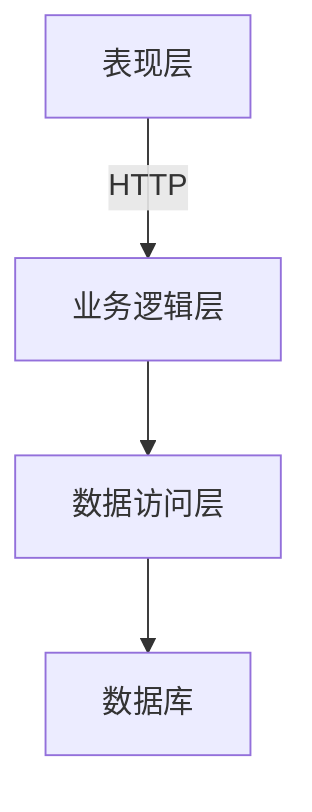
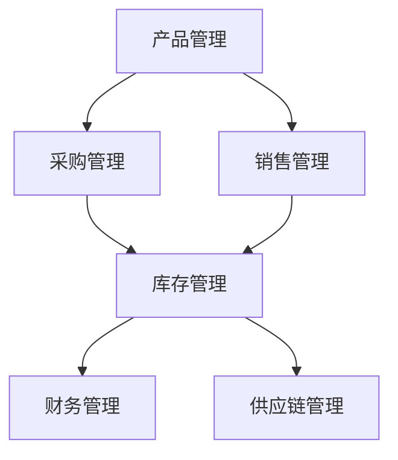
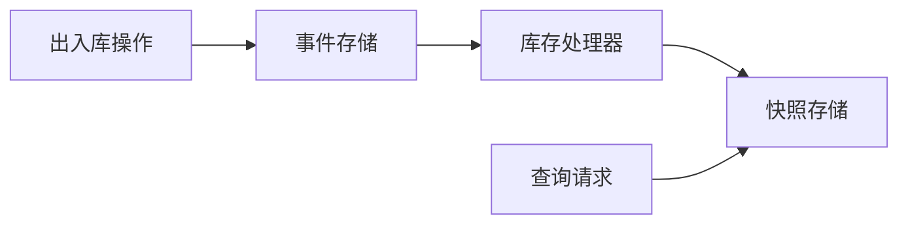

# 烟花爆竹经销管理系统详细设计与具体代码实现

## 1. 背景介绍

### 1.1 烟花爆竹行业概述

烟花爆竹是一种传统的民间娱乐用品,在中国有着悠久的历史和深厚的文化底蕴。它不仅是庆祝节日、喜庆活动的必备物品,也是一种独特的艺术形式。然而,随着社会的发展和环保意识的提高,烟花爆竹行业面临着严格的监管和环保挑战。

### 1.2 行业现状与痛点

1. 监管政策日趋严格,对烟花爆竹生产、经营、运输等环节提出了更高的要求。
2. 传统的手工作业模式效率低下,难以满足现代化管理的需求。
3. 缺乏完善的信息化系统,导致数据管理混乱、库存控制困难。
4. 供应链管理效率低下,无法实现精准的订单跟踪和物流管控。

### 1.3 系统需求与目标

为了解决上述痛点,提高烟花爆竹经销企业的管理水平和运营效率,迫切需要一套完善的信息化管理系统。该系统应当具备以下核心功能:

1. 实现烟花爆竹产品的全生命周期管理,包括采购、入库、销售、库存等。
2. 支持多渠道销售模式,包括线下门店、线上商城等。
3. 提供供应链可视化管理,实现订单跟踪和物流监控。
4. 集成财务模块,实现收支核算和报表生成。
5. 满足行业监管要求,提供合规性数据报表。

## 2. 核心概念与联系

### 2.1 系统架构概览

烟花爆竹经销管理系统采用经典的三层架构,包括表现层(前端)、业务逻辑层(后端)和数据访问层。前端主要负责用户界面和交互逻辑,后端负责业务逻辑处理和数据访问,数据访问层则负责与数据库进行交互。



### 2.2 核心概念解析

1. **产品管理**: 包括产品信息维护、产品分类管理、产品库存管理等。
2. **采购管理**: 包括供应商管理、采购计划制定、采购订单处理等。
3. **销售管理**: 包括销售订单处理、发货管理、收款管理等。
4. **库存管理**: 包括入库管理、出库管理、库存盘点等。
5. **财务管理**: 包括收支核算、账务处理、报表生成等。
6. **供应链管理**: 包括订单跟踪、物流监控、供应商评估等。
7. **系统管理**: 包括用户权限管理、系统参数配置、日志审计等。

### 2.3 核心模块关系

上述核心概念相互关联,构成了系统的核心业务流程。其中,产品管理是基础,为采购、销售、库存等模块提供数据支持。采购管理和销售管理则是两个核心业务流程,分别与供应商和客户对接。库存管理是连接采购和销售的纽带,确保库存数据的准确性。财务管理和供应链管理则是辅助模块,为核心业务提供支持。



## 3. 核心算法原理具体操作步骤

### 3.1 产品库存管理算法

产品库存管理是整个系统的核心,需要准确地跟踪每一笔出入库记录,并实时更新库存数据。我们采用了基于事件sourcing的CQRS架构模式,将命令(写操作)和查询(读操作)分离,提高系统的可扩展性和性能。

1. **写模型(Command)**:
   - 所有出入库操作都会生成一条库存事件(Event),例如`ProductInboundEvent`、`ProductOutboundEvent`等。
   - 这些事件将被持久化存储在事件存储(Event Store)中。
   - 一个库存处理器(Inventory Processor)将消费这些事件,并基于事件计算出最新的库存快照(Snapshot),存储在快照存储(Snapshot Store)中。

2. **读模型(Query)**:
   - 读取库存数据时,直接从快照存储中获取最新的库存快照数据。
   - 如果快照不存在或过期,则从头重放事件存储中的所有事件,重建库存快照。

该算法的优点是写操作非常快速,只需持久化事件即可,而读操作虽然相对耗时,但可以通过缓存和异步预计算来优化。同时,基于事件sourcing的模型还具有良好的审计能力和恢复能力。



### 3.2 供应链优化算法

为了提高供应链效率,降低运营成本,我们设计了一种基于约束规划的供应链优化算法。该算法的目标是在满足各种约束条件(如库存量、运输能力等)的前提下,寻找最优的发货方案,最小化运输成本。

1. **建模**:
   - 将供应链问题建模为约束优化问题(Constraint Optimization Problem, COP)。
   - 决策变量包括发货数量、发货路线等。
   - 约束条件包括库存量约束、运输能力约束、时间窗口约束等。
   - 目标函数为最小化总运输成本。

2. **求解**:
   - 采用约束规划求解器(CP Solver)来解决该优化问题,例如Google OR-Tools。
   - CP Solver使用了启发式搜索算法和约束传播技术,可以高效地求解复杂的组合优化问题。

3. **优化**:
   - 在求解过程中,我们还引入了元启发式算法(如模拟退火、禁忌搜索等),避免陷入局部最优解。
   - 同时,我们对算法的决策变量、约束条件和目标函数进行了优化,提高了求解效率。

通过上述供应链优化算法,我们可以自动生成最优的发货方案,从而降低运输成本,提高供应链效率。

### 3.3 其他核心算法

除了上述两个核心算法之外,系统中还包含了一些其他重要算法,例如:

- **产品需求预测算法**: 基于历史销售数据和时间序列模型,预测未来一段时间内的产品需求量,为采购计划提供依据。
- **供应商评估算法**: 根据供应商的产品质量、交货时间、服务态度等多个指标,计算综合评分,作为供应商选择和管理的参考。
- **价格优化算法**: 分析市场行情、成本和竞争对手的价格策略,自动调整产品定价,实现利润最大化。
- **推荐系统算法**: 基于协同过滤和内容过滤技术,为客户推荐感兴趣的产品,提高销售转化率。

## 4. 数学模型和公式详细讲解举例说明

### 4.1 产品需求预测模型

我们采用了经典的ARIMA(Auto-Regressive Integrated Moving Average)时间序列模型来预测产品需求量。ARIMA模型由三个部分组成:AR(自回归)、I(差分)和MA(移动平均)。

ARIMA模型的数学表达式为:

$$
y_t = c + \phi_1 y_{t-1} + \phi_2 y_{t-2} + ... + \phi_p y_{t-p} + \theta_1 \epsilon_{t-1} + \theta_2 \epsilon_{t-2} + ... + \theta_q \epsilon_{t-q} + \epsilon_t
$$

其中:

- $y_t$是时间t的观测值
- $c$是常数项
- $\phi_1, \phi_2, ..., \phi_p$是自回归系数
- $\theta_1, \theta_2, ..., \theta_q$是移动平均系数
- $\epsilon_t$是时间t的残差(白噪声)

我们使用Python的statsmodels库来拟合ARIMA模型。以下是一个示例代码:

```python
import pandas as pd
from statsmodels.tsa.arima.model import ARIMA

# 加载历史销售数据
sales_data = pd.read_csv('sales_data.csv', index_col='date', parse_dates=True)

# 拟合ARIMA模型
model = ARIMA(sales_data, order=(1, 1, 1))
model_fit = model.fit()

# 生成未来30天的预测
forecast = model_fit.forecast(steps=30)[0]
```

在上述代码中,我们首先加载了历史销售数据,然后使用`ARIMA`类拟合了一个ARIMA(1,1,1)模型。最后,我们使用`forecast`方法生成了未来30天的需求预测值。

### 4.2 供应商评估模型

我们采用了基于主成分分析(Principal Component Analysis, PCA)的多指标综合评估模型,对供应商进行打分和排名。

设有n个供应商,每个供应商有m个评估指标,构成一个$n \times m$的矩阵$X$。我们的目标是将m个指标压缩为k个主成分(主成分数量k远小于m),并基于这k个主成分计算供应商的综合评分。

1. **标准化**:
   首先对原始数据矩阵$X$进行标准化,得到标准化矩阵$Z$:
   $$Z = (X - \mu) / \sigma$$
   其中$\mu$是每列的均值,而$\sigma$是每列的标准差。

2. **主成分分析**:
   计算标准化矩阵$Z$的协方差矩阵$\Sigma$,求解特征值和特征向量:
   $$\Sigma v_i = \lambda_i v_i$$
   其中$\lambda_i$是第i个特征值,$v_i$是对应的特征向量。

3. **主成分提取**:
   选取前k个最大的特征值对应的特征向量$v_1, v_2, ..., v_k$,构成主成分载荷矩阵$P$:
   $$P = (v_1, v_2, ..., v_k)$$
   然后计算主成分得分矩阵$Y$:
   $$Y = ZP$$

4. **综合评分**:
   对于每个供应商,我们将其在k个主成分上的得分进行加权求和,得到综合评分:
   $$\text{Score}_i = w_1 y_{i1} + w_2 y_{i2} + ... + w_k y_{ik}$$
   其中$w_1, w_2, ..., w_k$是主成分的权重系数,可由决策者根据实际情况确定。

通过上述模型,我们可以将高维的多指标评估问题简化为低维的主成分评估问题,从而更加直观地对供应商进行综合评估和排名。

## 5. 项目实践:代码实例和详细解释说明

### 5.1 产品模块

产品模块是整个系统的基础,负责维护产品信息、分类管理和库存管理等功能。以下是一些核心代码示例:

**产品模型**:

```python
from django.db import models

class ProductCategory(models.Model):
    name = models.CharField(max_length=100)
    parent = models.ForeignKey('self', null=True, blank=True, on_delete=models.CASCADE)

class Product(models.Model):
    name = models.CharField(max_length=100)
    category = models.ForeignKey(ProductCategory, on_delete=models.CASCADE)
    price = models.DecimalField(max_digits=10, decimal_places=2)
    description = models.TextField()
    image = models.ImageField(upload_to='product_images')

class ProductInventory(models.Model):
    product = models.OneToOneField(Product, on_delete=models.CASCADE)
    quantity = models.PositiveIntegerField(default=0)
```

在上述代码中,我们定义了三个模型:`ProductCategory`(产品分类)、`Product`(产品)和`ProductInventory`(产品库存)。其中,`ProductCategory`支持无限级分类,`Product`包含了产品的基本信息,而`ProductInventory`则记录了产品的库存量。

**产品视图**:

```python
from django.shortcuts import render, get_object_or_404
from .models import Product, ProductInventory
from .forms import ProductForm

def product_list(request):
    products = Product.objects.all()
    return render(request, 'products/product_list.html', {'products': products})

def product_detail(request, pk):