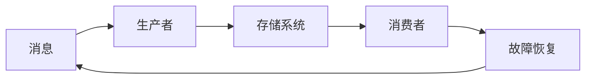

## 1.背景介绍

在分布式系统中，Exactly-once语义（EOS）是一种理想的消息传递语义，它保证每个操作只执行一次。然而，实现这种语义并非易事，因为我们需要处理网络延迟、系统故障和数据丢失等问题。尽管如此，Exactly-once语义在许多应用中仍然非常重要，例如在金融交易、订单处理和数据同步等场景中。

## 2.核心概念与联系

Exactly-once语义的核心概念包括消息、生产者、消费者、存储系统和故障恢复。这些概念之间的关系可以使用以下Mermaid流程图表示：



## 3.核心算法原理具体操作步骤

实现Exactly-once语义的核心算法包括三个步骤：发送消息、接收消息和处理故障。

### 3.1 发送消息

生产者将消息发送到存储系统，并等待确认。为了确保消息的可靠传递，生产者需要保存每个消息的状态，包括消息ID、消息内容和确认状态。

### 3.2 接收消息

消费者从存储系统接收消息，并发送确认。为了处理可能的重复消息，消费者需要保存每个消息的处理状态。

### 3.3 处理故障

当生产者或消费者发生故障时，需要通过故障恢复机制来恢复消息的传递。这通常涉及到重试机制和幂等操作。

## 4.数学模型和公式详细讲解举例说明

Exactly-once语义的实现可以用以下数学模型描述：

设 $M$ 是消息集合，$S$ 是存储系统，$P$ 是生产者，$C$ 是消费者，$F$ 是故障恢复机制。我们可以定义以下函数：

- $send: P \times M \rightarrow S$：生产者发送消息到存储系统。
- $receive: S \rightarrow C \times M$：消费者从存储系统接收消息。
- $recover: F \rightarrow P \cup C$：故障恢复机制恢复生产者或消费者。

## 5.项目实践：代码实例和详细解释说明

以下是一个使用Python实现的简单例子，它模拟了生产者发送消息、消费者接收消息和处理故障的过程。

```python
class Message:
    def __init__(self, id, content):
        self.id = id
        self.content = content
        self.ack = False

class Producer:
    def __init__(self):
        self.messages = []

    def send(self, message):
        self.messages.append(message)
        return message

class Consumer:
    def __init__(self):
        self.messages = []

    def receive(self, message):
        if message not in self.messages:
            self.messages.append(message)
            message.ack = True
        return message

class Storage:
    def __init__(self):
        self.messages = []

    def store(self, message):
        self.messages.append(message)
        return message

class FaultRecovery:
    def recover(self, producer, consumer):
        for message in producer.messages:
            if not message.ack:
                consumer.receive(message)
```

## 6.实际应用场景

Exactly-once语义在许多实际应用场景中都非常重要，例如：

- 在金融交易系统中，我们需要确保每笔交易只处理一次，否则可能会导致资金的重复转账。
- 在订单处理系统中，我们需要确保每个订单只处理一次，否则可能会导致商品的重复发货。
- 在数据同步系统中，我们需要确保每个数据更新只处理一次，否则可能会导致数据的不一致。

## 7.总结：未来发展趋势与挑战

尽管Exactly-once语义在理论上很难实现，但在实际应用中，我们可以通过各种策略和技术来近似实现这种语义。未来的发展趋势可能包括更强大的故障恢复机制、更高效的消息传递协议和更智能的生产者和消费者。

## 8.附录：常见问题与解答

1. 问题：Exactly-once语义和At-least-once语义有什么区别？
答：Exactly-once语义保证每个操作只执行一次，而At-least-once语义只保证每个操作至少执行一次，可能会执行多次。

2. 问题：为什么说实现Exactly-once语义很难？
答：因为我们需要处理网络延迟、系统故障和数据丢失等问题，这些问题在分布式系统中都很常见。

3. 问题：如何处理重复的消息？
答：我们可以通过在消费者端保存每个消息的处理状态来处理重复的消息。当收到重复的消息时，我们可以检查其处理状态，如果已经处理过，则直接忽略；否则，进行处理，并更新其处理状态。

4. 问题：Exactly-once语义在实际应用中有哪些用途？
答：Exactly-once语义在许多应用中都非常重要，例如在金融交易、订单处理和数据同步等场景中。