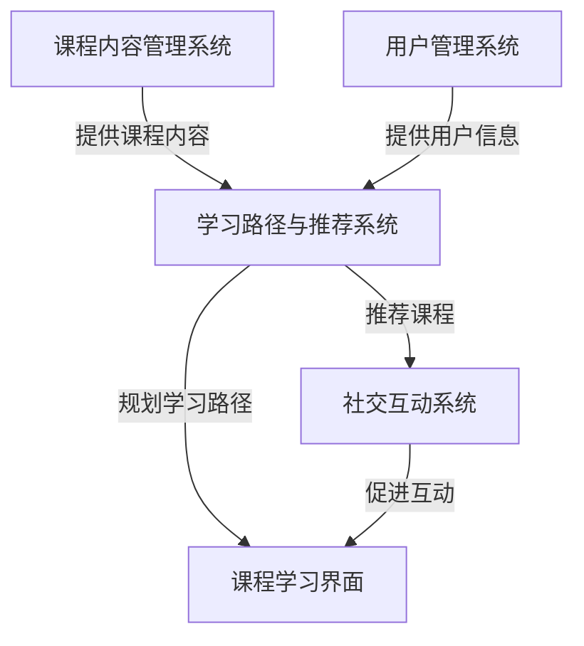

# 精品课程网站详细设计与具体代码实现

## 1.背景介绍

随着在线教育的蓬勃发展,构建一个优质的课程网站已经成为教育机构和个人创业者的迫切需求。一个精心设计的课程网站不仅能够为学习者提供优质的学习资源,还能够为教育机构或个人创造收益。然而,设计和开发一个功能完善且用户体验良好的课程网站并非一蹴而就,需要综合考虑多方面因素。

### 1.1 课程网站的重要性

课程网站在当今时代扮演着越来越重要的角色,主要有以下几个原因:

1. **提供远程学习机会**:课程网站打破了地理位置的限制,使得学习者可以在任何地方、任何时间进行学习,极大地提高了教育资源的可及性。

2. **个性化学习体验**:优秀的课程网站能够根据学习者的需求和进度提供个性化的学习路径,满足不同层次学习者的需求。

3. **降低教育成本**:相比于传统的面授教学,在线课程的制作和传播成本更低,有利于教育资源的普及。

4. **促进教学模式创新**:课程网站为教学模式的创新提供了新的可能性,例如采用微课、翻转课堂等新型教学模式。

5. **数据化教学管理**:课程网站能够记录学习者的学习行为数据,为教学管理和课程优化提供数据支持。

### 1.2 课程网站面临的挑战

尽管课程网站具有诸多优势,但在设计和开发过程中也面临着一些挑战:

1. **用户体验优化**:如何提供流畅、直观的用户界面和交互设计,提升学习者的使用体验。

2. **内容组织与呈现**:如何合理组织海量课程内容,并以易于理解的方式呈现给学习者。

3. **个性化推荐系统**:如何根据学习者的兴趣爱好、学习进度等数据,为其推荐合适的课程资源。

4. **社交互动功能**:如何为学习者提供讨论交流的平台,促进知识共享和协作学习。

5. **系统安全与隐私保护**:如何保障系统的安全性,防止数据泄露,保护用户隐私。

6. **移动端适配**:如何实现课程网站在不同设备上的无缝体验,满足移动学习的需求。

本文将重点探讨如何设计和开发一个功能完善、用户体验优秀的课程网站,并针对上述挑战提出解决方案。

## 2.核心概念与联系

在深入探讨课程网站的设计与实现之前,我们需要先了解一些核心概念及其之间的联系。

### 2.1 课程内容管理系统(CMS)

课程内容管理系统(Course Management System,CMS)是课程网站的核心部分,负责管理和呈现课程内容。一个优秀的CMS应该具备以下功能:

- **课程创建与组织**:提供直观的界面,支持教师创建、编辑和组织课程内容。
- **多媒体内容支持**:支持文本、图像、视频、音频等多种媒体格式的课程内容。
- **版本控制与协作**:支持课程内容的版本控制,方便多人协作编辑。
- **内容发布与访问控制**:可以控制课程内容的发布时间和访问权限。
- **进度跟踪与评估**:记录学习者的学习进度,提供在线测验等评估功能。

### 2.2 用户管理系统(UMS)

用户管理系统(User Management System,UMS)负责管理课程网站的用户信息和权限。一个完善的UMS应该包括以下功能:

- **用户注册与认证**:提供安全的用户注册和身份认证机制。
- **角色与权限管理**:根据不同的用户角色(如教师、学生、管理员等)分配相应的权限。
- **个人资料管理**:允许用户编辑和维护个人资料信息。
- **消息通知系统**:向用户推送系统通知、课程更新等信息。

### 2.3 学习路径与推荐系统

学习路径与推荐系统旨在为学习者提供个性化的学习体验。主要包括以下功能:

- **学习路径规划**:根据学习者的知识基础、学习目标等信息,为其规划合理的学习路径。
- **课程推荐算法**:基于协同过滤、内容分析等算法,为学习者推荐感兴趣的课程。
- **学习行为分析**:分析学习者的学习行为数据,优化推荐策略。

### 2.4 社交互动系统

社交互动系统为学习者提供了交流、讨论和协作的平台,有助于知识共享和互助学习。主要功能包括:

- **课程讨论区**:学习者可以就课程内容进行讨论、提问和回答。
- **学习小组**:支持学习者组建小组,进行协作学习和项目合作。
- **个人博客**:学习者可以撰写个人博客,分享学习心得和见解。

### 2.5 核心概念之间的联系

上述核心概念相互关联,共同构建了一个完整的课程网站系统。它们的关系如下图所示:

- 课程内容管理系统(CMS)提供了课程内容,为学习路径与推荐系统提供了数据基础。
- 用户管理系统(UMS)管理用户信息,为学习路径与推荐系统提供了用户数据。
- 学习路径与推荐系统根据课程内容和用户信息,为学习者规划学习路径并推荐合适的课程。
- 社交互动系统为学习者提供了交流平台,促进了互动学习。
- 课程学习界面是学习者实际学习的地方,集成了学习路径、推荐课程和社交互动等功能。

这些系统有机地结合在一起,共同构建了一个功能完善、用户体验良好的课程网站。

## 3.核心算法原理具体操作步骤

在课程网站的设计与实现中,有几个核心算法起着关键作用,包括课程推荐算法、学习路径规划算法等。下面我们将详细介绍这些算法的原理和具体操作步骤。

### 3.1 课程推荐算法

课程推荐算法的目标是为学习者推荐感兴趣的课程,提高学习效率和满意度。常见的推荐算法包括协同过滤算法和基于内容的推荐算法。

#### 3.1.1 协同过滤算法

协同过滤算法是基于"相似用户有相似兴趣"的假设,通过分析用户之间的相似度来预测用户对某个课程的兴趣程度。具体操作步骤如下:

1. **计算用户相似度**:根据用户对课程的评分数据,计算任意两个用户之间的相似度。常用的相似度计算方法有欧几里得距离、皮尔逊相关系数等。

2. **构建用户相似度矩阵**:将所有用户两两之间的相似度值存储在一个矩阵中。

3. **预测目标用户对课程的评分**:对于目标用户未评分的课程,根据与其相似的用户对该课程的评分,加权计算出目标用户的预测评分。

4. **推荐排序**:根据预测评分从高到低对课程进行排序,将评分较高的课程推荐给目标用户。

#### 3.1.2 基于内容的推荐算法

基于内容的推荐算法是根据课程内容与用户兴趣的相似度来进行推荐。具体操作步骤如下:

1. **提取课程内容特征**:对课程内容进行文本挖掘和主题建模,提取出课程的主题特征向量。

2. **建立用户兴趣模型**:根据用户历史学习记录和评分数据,构建用户的兴趣模型,表示为一个特征向量。

3. **计算课程与用户兴趣的相似度**:采用余弦相似度、欧几里得距离等方法,计算课程特征向量与用户兴趣向量之间的相似度。

4. **推荐排序**:根据相似度从高到低对课程进行排序,将相似度较高的课程推荐给用户。

上述两种算法各有优缺点,在实际应用中可以根据具体情况选择合适的算法或者将两种算法结合使用。

### 3.2 学习路径规划算法

学习路径规划算法旨在为学习者提供个性化的学习路径,帮助他们高效地掌握知识。常见的算法包括基于知识图谱的规划算法和基于决策树的规划算法。

#### 3.2.1 基于知识图谱的规划算法

知识图谱是一种用于表示知识结构的图形模型,每个节点代表一个知识点,边表示知识点之间的先后关系。基于知识图谱的学习路径规划算法具体操作步骤如下:

1. **构建知识图谱**:根据课程内容和知识体系,构建出完整的知识图谱。

2. **确定起点和终点**:根据学习者的知识基础和学习目标,在知识图谱中确定起点和终点节点。

3. **路径搜索**:采用图搜索算法(如广度优先搜索、Dijkstra算法等)在知识图谱中寻找起点到终点的最短路径作为初步学习路径。

4. **路径优化**:根据学习者的兴趣偏好、学习风格等因素,对初步学习路径进行优化调整。

5. **动态更新**:在学习过程中,根据学习者的实际学习情况动态调整学习路径。

#### 3.2.2 基于决策树的规划算法

决策树是一种常用的机器学习模型,可以根据特征条件对实例进行分类。基于决策树的学习路径规划算法具体操作步骤如下:

1. **收集训练数据**:收集历史学习者的特征数据(如知识基础、学习目标、兴趣偏好等)和对应的最优学习路径作为训练数据。

2. **构建决策树模型**:基于训练数据,使用决策树算法(如ID3、C4.5等)构建决策树模型。

3. **特征提取**:对目标学习者提取出与训练数据相同的特征。

4. **路径预测**:将目标学习者的特征输入到决策树模型中,预测出适合该学习者的学习路径。

5. **模型更新**:在实际应用中不断收集新的训练数据,定期更新决策树模型以提高预测准确性。

上述两种算法各有优缺点,知识图谱方法更加直观和可解释,但构建知识图谱的工作量较大;决策树方法可以自动学习规则,但缺乏可解释性。在实际应用中,可以根据具体情况选择合适的算法或者将两种算法结合使用。

## 4.数学模型和公式详细讲解举例说明

在课程推荐和学习路径规划算法中,涉及到一些数学模型和公式,下面我们将详细讲解这些模型和公式,并给出具体的例子说明。

### 4.1 相似度计算

相似度计算是协同过滤推荐算法和基于内容推荐算法的基础。常用的相似度计算方法包括欧几里得距离、余弦相似度和皮尔逊相关系数。

#### 4.1.1 欧几里得距离

欧几里得距离用于计算两个向量之间的距离,距离越小表示两个向量越相似。对于两个 $n$ 维向量 $\vec{a}$ 和 $\vec{b}$,它们的欧几里得距离定义为:

$$
d(\vec{a}, \vec{b}) = \sqrt{\sum_{i=1}^{n}(a_i - b_i)^2}
$$

例如,有两个二维向量 $\vec{a} = (2, 3)$, $\vec{b} = (4, 5)$,它们的欧几里得距离为:

$$
d(\vec