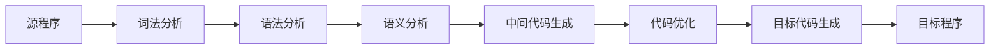
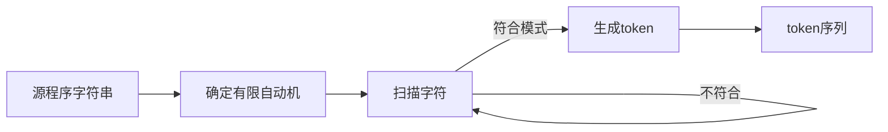
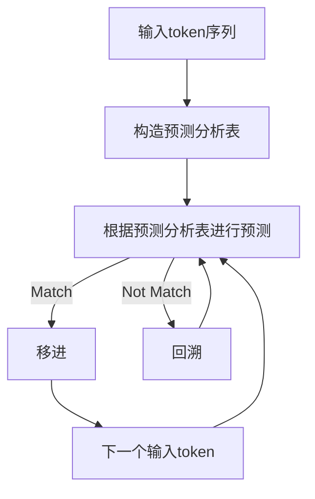
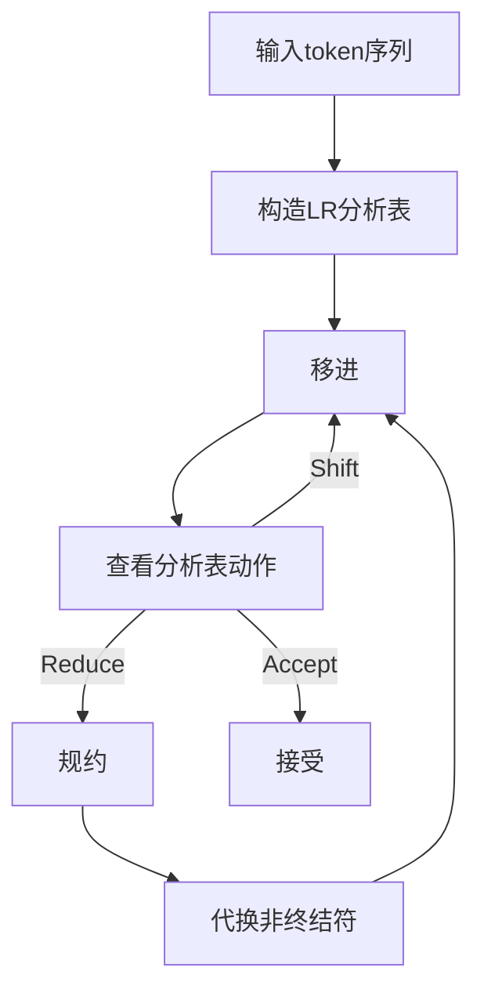
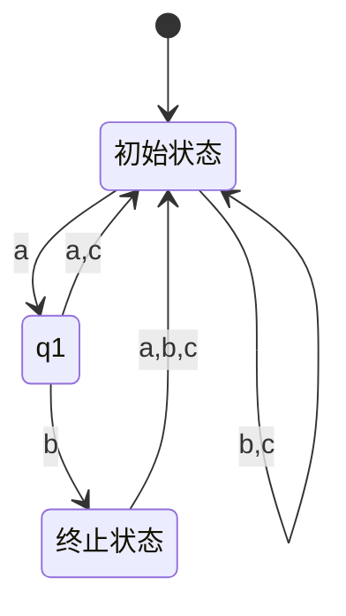

# 编译原理在线考试系统详细设计与具体代码实现

## 1.背景介绍

### 1.1 编译原理的重要性

编译原理是计算机科学中一个基础且重要的课题,是计算机软件工程师必须掌握的核心知识之一。它研究如何将高级语言源程序翻译成等价的目标程序,是构建编程语言和相关工具的理论基础。编译原理贯穿了整个软件开发过程,对于提高程序员的编程能力、优化程序性能、设计新语言等方面都有着重要意义。

### 1.2 在线考试系统的需求

传统的编译原理教学往往采用课堂讲授和上机实践的方式,存在一些不足之处:

- 课堂时间有限,学生难以充分掌握知识点
- 实践环境配置复杂,给学生和教师带来额外负担
- 缺乏及时有效的反馈机制,学习效果难以评估

为此,开发一个编译原理在线考试系统可以很好地解决上述问题,提供一个统一的学习和考核平台,极大地提高教学效率和质量。

### 1.3 系统目标

本系统的主要目标是:

- 提供覆盖编译原理核心知识点的在线测试
- 支持多种题型,如选择、填空、编程等
- 实时评分并给出详细解析反馈
- 管理员可方便地添加、修改试题
- 学生可查看历史成绩,了解自身掌握程度

## 2.核心概念与联系  

### 2.1 编译原理基本概念

1. **源程序(Source Program)**: 用高级语言编写的程序。
2. **目标程序(Object Program)**: 经过编译后生成的低级语言程序。
3. **编译器(Compiler)**: 将源程序翻译成目标程序的程序。
4. **汇编器(Assembler)**: 将汇编语言翻译成机器语言的程序。
5. **解释器(Interpreter)**: 直接执行源程序的程序。

编译器和解释器是两种不同的程序执行方式,各有优缺点。

### 2.2 编译器工作过程

编译器的工作过程一般可分为以下几个阶段:

1. **词法分析(Lexical Analysis)**: 将源程序字符串分割为一个个单词(token)。
2. **语法分析(Syntax Analysis)**: 根据语言的语法规则,分析单词序列是否合法。
3. **语义分析(Semantic Analysis)**: 进一步检查程序在执行时是否有语义错误。
4. **中间代码生成(Intermediate Code Generation)**: 将源程序翻译成机器无关的中间代码。
5. **代码优化(Code Optimization)**: 对中间代码进行若干等价变换,以提高性能。
6. **目标代码生成(Target Code Generation)**: 将优化后的中间代码翻译成目标程序。

### 2.3 语法分析中的核心概念

语法分析是编译器的核心部分,其中包含以下关键概念:

1. **文法(Grammar)**: 形式化描述语言语法规则的规范。
2. **终结符(Terminal)**: 语言中的基本单位,如关键字、标识符等。
3. **非终结符(Non-Terminal)**: 语法规则中的语法变量。
4. **产生式(Production)**: 描述非终结符如何推导出一个字符串的规则。
5. **推导(Derivation)**: 通过应用产生式序列从起始符号推导出一个句子的过程。
6. **语法树(Syntax Tree)**: 描述一个句子的分层结构的树形图。
7. **语法分析算法**: 如LL、LR等常用算法,用于自动构造语法分析器。

语法分析器根据语法规则对源程序进行分析,构造语法树,为后续的语义分析做准备。

## 3.核心算法原理具体操作步骤

### 3.1 词法分析

词法分析的主要任务是将源程序字符串划分为一个个单词符号(token),并过滤注释和空白字符。其基本工作原理是使用有限自动机对源程序进行扫描。

1. 根据语言的词法规则,构建确定有限自动机(DFA)
2. 使用DFA从左到右扫描源程序字符串
3. 当遇到与DFA中某个模式匹配的字符序列时,生成对应的token
4. 过滤注释和空白字符,继续扫描
5. 最终生成一个token序列,作为语法分析的输入

### 3.2 自顶向下语法分析

自顶向下语法分析(LL分析)是一种从语法的最左推导开始进行语法分析的方法。其基本思想是:

1. 从语法的开始符号出发,尝试去匹配输入token序列
2. 当遇到非终结符时,根据该非终结符的产生式进行选择
3. 如果选择正确,则继续向下分析
4. 如果选择错误,则回溯并尝试另一个选择
5. 直到完全推导出输入token序列为止

LL分析算法的关键步骤:

1. 根据文法构造预测分析表
2. 使用预测分析表对输入token序列进行预测分析
3. 如果预测成功,则移进(shift)对应产生式
4. 如果预测失败,则回溯(backtrack)尝试另一条路径
5. 重复上述步骤,直到完全推导出输入序列

### 3.3 自底向上语法分析

自底向上语法分析(LR分析)是从输入的最右推导开始进行语法分析的方法。它的基本思路是:

1. 从输入token序列的最右端开始,尝试减去(规约)一个候选式
2. 若减去成功,则用候选式的左部符号代替右部
3. 重复上述过程,直到推导出语法的开始符号

LR分析算法的核心步骤:

1. 根据文法构造LR分析表
2. 从输入token序列开始,移进(shift)
3. 查看LR分析表的动作:
   - 若为移进,则继续移进
   - 若为规约,则规约对应产生式,并代换非终结符
   - 若为接受,则语法分析成功
4. 重复上述步骤,直到接受或出错

LR分析可处理更广泛的文法,是编译器中最常用的语法分析技术。

## 4.数学模型和公式详细讲解举例说明

### 4.1 有限自动机模型

有限自动机(FA)是一种用于模拟计算的数学模型,常用于词法分析。一个确定的有限自动机(DFA)可以形式化定义为一个5元组:

$$
M = (Q, \Sigma, \delta, q_0, F)
$$

- $Q$是一个有限的状态集合
- $\Sigma$是一个有限的输入字母表
- $\delta: Q \times \Sigma \rightarrow Q$是一个转移函数
- $q_0 \in Q$是初始状态
- $F \subseteq Q$是一个终止状态集合

DFA的工作过程是:对于任意输入字符串$w = a_1a_2...a_n$,其中$a_i \in \Sigma$,从初始状态$q_0$开始,依次应用转移函数$\delta(q_i, a_{i+1})$得到下一个状态$q_{i+1}$。如果最终到达某个终止状态$q_f \in F$,则接受该字符串,否则拒绝。

例如,构造一个能识别所有以"ab"开头的字符串的DFA:

$$
\begin{aligned}
Q &= \{q_0, q_1, q_2\} \\
\Sigma &= \{a, b, c\} \\
\delta(q_0, a) &= q_1 \\
\delta(q_1, b) &= q_2 \\
\delta(q_0, b) &= q_0 \\
\delta(q_0, c) &= q_0 \\
\delta(q_1, a) &= q_0 \\
\delta(q_1, c) &= q_0 \\
\delta(q_2, a) &= q_0 \\
\delta(q_2, b) &= q_0 \\
\delta(q_2, c) &= q_0 \\
q_0 &= \text{初始状态} \\
F &= \{q_2\}
\end{aligned}
$$

该DFA可表示为状态转移图:

可以看出,只有当输入字符串以"ab"开头时,DFA才会进入终止状态$q_2$,从而接受该字符串。

### 4.2 语法文法模型

上下文无关文法(CFG)是一种描述形式语言语法规则的常用数学模型。一个CFG可以形式化定义为一个4元组:

$$
G = (N, \Sigma, P, S)
$$

- $N$是一个有限的非终结符集合
- $\Sigma$是一个有限的终结符集合
- $P$是一个有限的产生式集合,每个产生式形如$A \rightarrow \alpha$,其中$A \in N, \alpha \in (N \cup \Sigma)^*$
- $S \in N$是文法的开始符号

我们定义一个推导关系$\Rightarrow$,表示可以通过应用产生式序列从一个符号串推导出另一个符号串。若$\alpha \Rightarrow^* \beta$,则称$\beta$是$\alpha$的一个句型。文法$G$定义的语言$L(G)$就是由开始符号$S$推导出的所有句型构成的集合:

$$
L(G) = \{\omega \in \Sigma^* | S \Rightarrow^* \omega\}
$$

例如,一个描述算术表达式的文法可以定义为:

$$
\begin{aligned}
N &= \{E, T, F\} \\
\Sigma &= \{+, *, (, ), id\} \\
P &= \{E \rightarrow E+T | T, \\
   &\quad T \rightarrow T*F | F, \\
   &\quad F \rightarrow (E) | id\} \\
S &= E
\end{aligned}
$$

其中,$E$表示表达式,$T$表示项,$F$表示因子。这个文法可以生成语言$L(G)$,其中包含所有形如$id$、$id*id$、$(id+id)*id$这样的合法算术表达式。

### 4.3 语法分析表模型

为了高效地进行语法分析,我们需要构造语法分析表。对于LL(1)文法,我们可以构造预测分析表$M$:

$$
M[A, a] = \begin{cases}
A \rightarrow X_1X_2...X_n, & \text{如果} \exists A \rightarrow X_1X_2...X_n \in P, X_1 \in N, \\
                              & \text{且} \text{FIRST}(X_1X_2...X_n) \ni a \\
error, & \text{otherwise}
\end{cases}
$$

其中,$\text{FIRST}(\alpha)$表示$\alpha$的首符集,即$\alpha$推导出的所有句型的第一个终结符构成的集合。

对于LR(0)文法,我们可以构造LR(0)项目集规范族$C$:

$$
C = \{I_0, I_1, ..., I_n\}
$$

其中每个$I_i$是一个项目