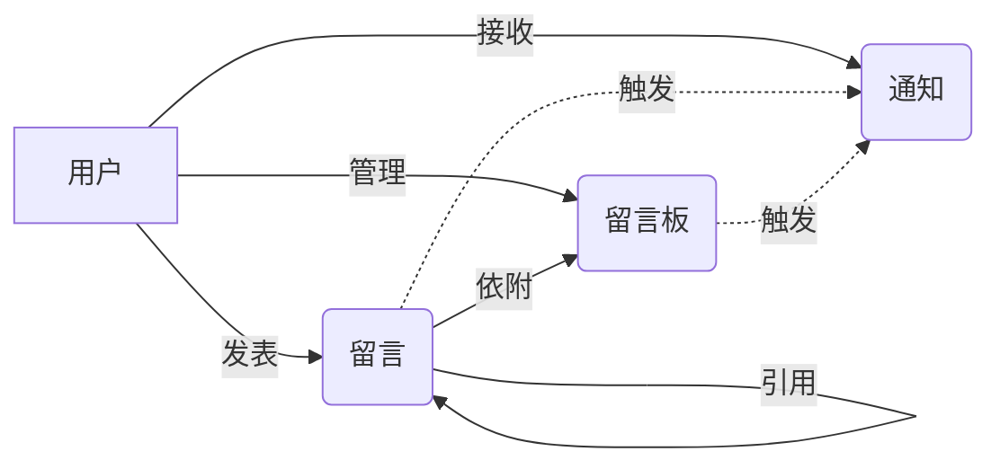

# 网络留言薄管理系统设计与实现

作者：禅与计算机程序设计艺术

## 1. 背景介绍

在当今互联网时代,网络留言已成为人们交流沟通、表达观点的重要方式。无论是个人博客、论坛,还是各类网站,留言功能都是不可或缺的组成部分。然而,如何有效管理海量的网络留言,确保留言内容的质量和合法性,同时为用户提供良好的交互体验,是一个值得深入探讨的话题。

本文将从技术角度出发,详细阐述网络留言薄管理系统的设计与实现。通过分析需求,梳理业务逻辑,设计系统架构,并给出具体的实现方案和代码示例,为开发高质量的网络留言薄管理系统提供参考。

### 1.1 网络留言的重要性
#### 1.1.1 用户互动的桥梁
#### 1.1.2 舆情监测的窗口  
#### 1.1.3 网站活跃度的体现

### 1.2 留言管理面临的挑战
#### 1.2.1 海量数据的存储与检索
#### 1.2.2 实时性要求高
#### 1.2.3 内容审核不易
#### 1.2.4 恶意灌水与广告
#### 1.2.5 数据安全与隐私保护

## 2. 核心概念与关联

要设计一个优秀的网络留言薄管理系统,首先需要理清其中涉及的核心概念,以及它们之间的关联关系。

### 2.1 用户
#### 2.1.1 注册用户
#### 2.1.2 匿名用户
#### 2.1.3 管理员

### 2.2 留言
#### 2.2.1 留言内容 
#### 2.2.2 留言者信息
#### 2.2.3 留言时间
#### 2.2.4 引用关系

### 2.3 留言板
#### 2.3.1 层级结构
#### 2.3.2 留言排序
#### 2.3.3 留言审核

### 2.4 通知
#### 2.4.1 回复通知
#### 2.4.2 审核通知
#### 2.4.3 举报通知

下图展示了上述核心概念之间的关联关系:



## 3. 核心算法原理与操作步骤

网络留言薄管理系统的核心在于对留言数据进行高效的存储、检索和处理。以下是几个关键算法的原理与实现步骤。

### 3.1 留言树的构建
#### 3.1.1 数据结构选择
#### 3.1.2 新增留言的插入
#### 3.1.3 留言树的展开
#### 3.1.4 留言的移动与删除

### 3.2 内容过滤
#### 3.2.1 关键词匹配
#### 3.2.2 正则表达式匹配
#### 3.2.3 文本分类算法
#### 3.2.4 人工审核与校正

### 3.3 用户行为分析  
#### 3.3.1 留言频率控制
#### 3.3.2 异常行为检测
#### 3.3.3 用户画像

## 4. 数学模型与公式

为了更精确地刻画留言系统的特性,我们引入以下数学模型与公式。

### 4.1 留言相关度计算

假设留言 $m_1$ 和 $m_2$ 的特征向量分别为 $\vec{v_1}$ 和 $\vec{v_2}$,则它们的相关度可用余弦相似度表示:

$$\operatorname{sim}\left(m_{1}, m_{2}\right)=\frac{\vec{v}_{1} \cdot \vec{v}_{2}}{\left|\vec{v}_{1}\right| \times\left|\vec{v}_{2}\right|}$$

### 4.2 用户影响力评估

用户 $u$ 的影响力 $I(u)$ 可综合考虑其留言数量 $N_u$、平均点赞数 $\bar{L}_u$、平均回复数 $\bar{C}_u$ 等因素,构建如下模型:

$$I(u)=\alpha \cdot N_{u}+\beta \cdot \bar{L}_{u}+\gamma \cdot \bar{C}_{u}$$

其中 $\alpha$、$\beta$、$\gamma$ 为权重参数。

### 4.3 留言板活跃度预测

利用时间序列分析方法,可以对留言板的活跃度进行预测。例如,使用指数平滑模型:

$$\hat{y}_{t+1}=\alpha y_{t}+(1-\alpha) \hat{y}_{t}$$

其中 $y_t$ 为 $t$ 时刻的实际活跃度,$\hat{y}_{t}$ 为预测值,$\alpha$ 为平滑系数。

## 5. 项目实践

下面我们使用Java语言,基于Spring Boot框架,实现一个简单的留言薄管理系统。

### 5.1 数据库设计

```sql
CREATE TABLE `user` (
  `id` int(11) NOT NULL AUTO_INCREMENT,
  `username` varchar(50) NOT NULL,
  `password` varchar(100) NOT NULL,
  `email` varchar(100) DEFAULT NULL,
  `role` varchar(20) NOT NULL,
  PRIMARY KEY (`id`),
  UNIQUE KEY `username` (`username`)
) ENGINE=InnoDB DEFAULT CHARSET=utf8;

CREATE TABLE `message` (
  `id` int(11) NOT NULL AUTO_INCREMENT,
  `user_id` int(11) NOT NULL,
  `content` text NOT NULL,
  `create_time` datetime NOT NULL,
  `parent_id` int(11) DEFAULT NULL,
  `status` varchar(20) NOT NULL,
  PRIMARY KEY (`id`),
  KEY `user_id` (`user_id`),
  KEY `parent_id` (`parent_id`)
) ENGINE=InnoDB DEFAULT CHARSET=utf8;
```

### 5.2 核心代码实现

#### 5.2.1 留言树的构建

```java
@Service
public class MessageService {
    @Autowired
    private MessageDao messageDao;

    public List<Message> getMessageTree(int rootId) {
        List<Message> messages = messageDao.findByParentId(rootId);
        for (Message message : messages) {
            message.setChildren(getMessageTree(message.getId()));
        }
        return messages;
    }
}
```

#### 5.2.2 内容过滤

```java
@Component
public class ContentFilter {
    private static final Pattern KEYWORD_PATTERN = Pattern.compile("敏感词1|敏感词2");

    public String filter(String content) {
        Matcher matcher = KEYWORD_PATTERN.matcher(content);
        return matcher.replaceAll("***");
    }
}
```

#### 5.2.3 用户行为分析

```java
@Service
public class UserBehaviorService {
    @Autowired
    private RedisTemplate<String, Object> redisTemplate;

    private static final String MESSAGE_COUNT_KEY = "message_count_";

    public void recordMessageCount(int userId) {
        String key = MESSAGE_COUNT_KEY + userId;
        redisTemplate.opsForValue().increment(key);
    }

    public boolean isMessageFrequencyExceeded(int userId, int maxCount, int seconds) {
        String key = MESSAGE_COUNT_KEY + userId;
        Integer count = (Integer) redisTemplate.opsForValue().get(key);
        if (count != null && count > maxCount) {
            return true;
        }
        redisTemplate.expire(key, seconds, TimeUnit.SECONDS);
        return false;
    }
}
```

## 6. 实际应用场景

网络留言薄管理系统可应用于多种实际场景,例如:

### 6.1 在线客服系统
### 6.2 网络论坛社区
### 6.3 电子商务评价
### 6.4 在线教育问答
### 6.5 弹幕互动系统

不同场景下,需要根据具体业务需求,对系统进行定制化设计与优化。

## 7. 工具与资源推荐

开发网络留言薄管理系统可以借助以下工具与资源:

### 7.1 后端框架
- Spring Boot 
- Express.js
- Laravel

### 7.2 前端框架
- React
- Vue.js  
- Angular

### 7.3 数据库
- MySQL
- MongoDB
- Redis

### 7.4 内容审核服务
- 阿里云内容安全
- 腾讯云文本内容安全
- 百度云内容审核

### 7.5 参考资料
- 《Web安全深度剖析》
- 《高性能MySQL》
- 《数据结构与算法之美》

## 8. 总结与展望

本文从技术角度全面阐述了网络留言薄管理系统的设计与实现要点。通过合理运用数据结构、算法与数学模型,并借助成熟的开发框架与工具,可以搭建一个高效、健壮的留言管理系统。

展望未来,随着人工智能、大数据等技术的发展,网络留言管理还将面临新的机遇与挑战:

### 8.1 智能化内容生成与推荐
### 8.2 个性化用户交互体验
### 8.3 多模态留言数据处理
### 8.4 隐私保护与数据安全

因此,在系统设计过程中,既要立足当前需求,也要放眼未来发展,为新技术的应用预留接口与空间。

## 9. 附录:常见问题解答

### 9.1 如何防止留言板被刷屏?
可以采取以下措施:
- 限制单个用户的留言频率
- 对留言内容进行实时过滤
- 建立用户信用评级机制
- 设置验证码或人机验证环节

### 9.2 如何处理恶意留言?
- 完善内容审核规则,及时拦截恶意留言
- 建立用户举报机制,鼓励社区自治
- 对恶意用户进行警告、禁言直至封禁
- 保存证据,必要时配合执法部门调查

### 9.3 留言板的性能优化策略?
- 合理设计数据库表结构,建立索引
- 使用缓存技术,减轻数据库压力
- 分表分库,实现水平扩展
- 优化前端页面加载速度,提升用户体验

### 9.4 如何保证留言数据的可靠性?
- 定期备份留言数据
- 使用分布式存储,提高数据可用性
- 对敏感数据进行脱敏处理
- 制定数据恢复预案,及时应对故障

一个优秀的网络留言薄管理系统,需要在功能、性能、安全、体验等多个维度进行精心设计。技术人员应该与产品、运营等部门密切配合,深入了解用户需求,持续打磨产品。相信经过不断优化与迭代,定能开发出一个满足用户期待、经得起时间考验的精品留言管理系统。