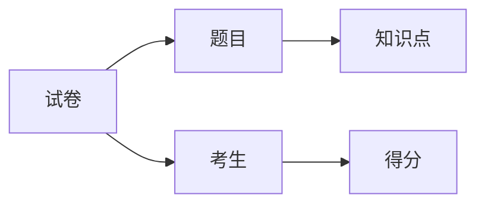

# 考试分析评价系统详细设计与具体代码实现

作者：禅与计算机程序设计艺术

## 1. 背景介绍

### 1.1 考试分析评价系统的重要性

在现代教育领域,考试是评估学生学习效果和教学质量的重要手段。然而,传统的考试分析和评价方法往往耗时耗力,难以全面、客观地反映考试的真实情况。因此,开发一个高效、智能的考试分析评价系统显得尤为重要和迫切。

### 1.2 考试分析评价系统的主要功能

一个完善的考试分析评价系统应该具备以下主要功能:

1. 试题质量分析:对试题的难度、区分度、信度等指标进行科学评估,为命题提供参考依据。
2. 学生成绩分析:全面分析学生的得分情况,包括总分分布、单题得分率等,帮助教师掌握学生的学习情况。
3. 知识点掌握度分析:根据试题与知识点的对应关系,分析学生对各知识点的掌握程度,diagnose学习中的薄弱环节。
4. 试卷质量评估:从整体上评估试卷的信度、效度、难度等指标,为日后改进试卷质量提供数据支撑。

### 1.3 考试分析评价系统的技术挑战

尽管考试分析评价系统有着广阔的应用前景,但在实际开发过程中仍面临诸多技术挑战:

1. 海量数据处理:考试数据量巨大,对系统的数据处理能力提出了很高要求。
2. 复杂算法设计:考试分析涉及统计学、心理测量学等多个学科,需要设计合理高效的算法。
3. 用户友好的界面:系统需要提供直观、易用的界面,便于教师快速上手操作。
4. 可扩展性:系统需要预留出足够的扩展空间,以适应未来的功能拓展需求。

## 2. 核心概念与联系

### 2.1 题目

题目是考试分析的基本单位。每个题目都有以下基本属性:

- 题干:题目的主干内容
- 选项:题目的备选答案(选择题)
- 参考答案:题目的标准答案
- 分值:该题目的分值
- 难度:题目的难易程度
- 区分度:题目区分考生能力的程度
- 知识点:题目所考察的知识点

### 2.2 试卷

试卷由一系列题目组成。试卷的基本属性包括:

- 题目列表:组成试卷的所有题目
- 总分:试卷的总分值
- 难度:试卷的整体难度
- 信度:试卷测量的一致性和稳定性
- 效度:试卷测量目标的准确性

### 2.3 考生

考生参加考试,完成试卷。考生的属性包括:

- 姓名:考生姓名
- 学号:考生的唯一标识
- 得分:考生的考试得分

### 2.4 知识点

知识点是试题考察的知识点。知识点的属性包括:

- 名称:知识点的名称
- 掌握度:考生对该知识点的掌握程度

### 2.5 核心概念之间的关系

以上核心概念之间的关系可以用下图表示:



## 3. 核心算法原理与具体步骤

### 3.1 题目难度计算

题目难度反映了题目的难易程度,通常用正答率(答对该题的考生比例)来衡量。设第i题的正答人数为$r_i$,考生总人数为n,则第i题的难度$P_i$为:

$$P_i=\frac{r_i}{n}$$

难度计算步骤如下:
1. 统计每个题目的正答人数$r_i$
2. 计算考生总人数n
3. 套用公式计算每个题目的难度$P_i$

### 3.2 题目区分度计算

题目区分度反映了题目区分不同水平考生的能力。常用的计算方法是"高低分组法",具体步骤如下:

1. 将考生按照总分从高到低排序
2. 取前27%的考生为高分组,后27%的考生为低分组
3. 计算高分组中答对该题的人数$R_H$和低分组答对人数$R_L$
4. 套用公式计算区分度$D$:

$$D=\frac{R_H-R_L}{0.27n}$$

其中n为考生总人数。

### 3.3 试卷信度计算

试卷信度反映了考试结果的一致性和稳定性,常用Cronbach α系数来衡量。设试卷包含k个题目,第i个题目的方差为$s_i^2$,总分方差为$s_T^2$,则Cronbach α系数的计算公式为:

$$\alpha=\frac{k}{k-1}(1-\frac{\sum\limits_{i=1}^ks_i^2}{s_T^2})$$

计算步骤如下:
1. 计算每个题目的方差$s_i^2$
2. 计算总分方差$s_T^2$
3. 套用公式计算Cronbach α系数

### 3.4 知识点掌握度计算

知识点掌握度反映了考生对某个知识点的掌握情况。设某知识点对应m个题目,第j题的得分为$s_j$,满分为$S_j$,则该知识点的掌握度$M$为:

$$M=\frac{\sum\limits_{j=1}^ms_j}{\sum\limits_{j=1}^mS_j}$$

计算步骤如下:
1. 找出与该知识点对应的所有题目
2. 统计每个题目的得分$s_j$和满分$S_j$
3. 套用公式计算知识点掌握度$M$

## 4. 数学模型与公式详解

### 4.1 正态分布模型

考生成绩通常服从正态分布,概率密度函数为:

$$f(x)=\frac{1}{\sqrt{2\pi}\sigma}\exp(-\frac{(x-\mu)^2}{2\sigma^2})$$

其中$\mu$为均值,$\sigma$为标准差。

根据正态分布的性质,我们可以计算出任意分数段的考生比例。例如,设均值为80,标准差为10,则分数在70~90分的考生比例为:

$$P(70<x<90)=\int_{70}^{90}\frac{1}{10\sqrt{2\pi}}\exp(-\frac{(x-80)^2}{200})dx\approx 0.683$$

### 4.2 试卷难度与区分度的关系

一张理想的试卷,既不能太难也不能太易,难度系数$P$应该接近0.6~0.7。同时,试卷的区分度$D$要尽量高,一般认为区分度在0.3以上比较理想。

我们可以建立如下数学模型来描述难度和区分度的关系:

$$D=4P(1-P)$$

该模型反映了难度和区分度之间"倒U型"的关系,当难度系数$P$为0.5时,区分度$D$达到最大值1。

### 4.3 信度与效度的关系

信度和效度是评价试卷质量的两个核心指标。一般而言,信度是效度的基础和前提,只有信度高的试卷才可能具有高效度。两者之间存在如下不等式关系:

$$r_{xy}\leq\sqrt{r_{xx}r_{yy}}$$

其中$r_{xy}$为效度系数,$r_{xx}$和$r_{yy}$分别为两个测验的信度系数。该不等式表明,效度系数的上限由两个测验的信度系数决定。

## 5. 项目实践:代码实例与解析

下面我们使用Python语言,实现考试分析评价系统的部分核心功能。

### 5.1 题目难度计算

```python
def difficulty(scores):
    """
    计算题目难度
    :param scores: 该题所有考生的得分情况,1表示答对,0表示答错
    :return: 题目难度系数
    """
    r = sum(scores)  # 答对人数
    n = len(scores)  # 总人数
    p = r / n  # 难度系数
    return p
```

### 5.2 题目区分度计算

```python
def discrimination(scores, total_scores):
    """
    计算题目区分度
    :param scores: 该题所有考生的得分情况
    :param total_scores: 所有考生的总分
    :return: 题目区分度
    """
    n = len(scores)
    sorted_indexes = sorted(range(n), key=lambda i: total_scores[i], reverse=True)
    high_group = sorted_indexes[:int(0.27 * n)]
    low_group = sorted_indexes[-int(0.27 * n):]
    r_h = sum(scores[i] for i in high_group)
    r_l = sum(scores[i] for i in low_group)
    d = (r_h - r_l) / (0.27 * n)
    return d
```

### 5.3 试卷信度计算

```python
import numpy as np

def reliability(item_scores):
    """
    计算试卷信度
    :param item_scores: n*k的numpy数组,n为考生人数,k为题目数,每一行为一个考生的得分情况
    :return: 试卷的Cronbach α信度系数
    """
    n, k = item_scores.shape
    item_vars = np.var(item_scores, axis=0)  # 计算每个题目的方差
    total_vars = np.var(np.sum(item_scores, axis=1))  # 计算总分方差
    alpha = k / (k - 1) * (1 - np.sum(item_vars) / total_vars)
    return alpha
```

### 5.4 知识点掌握度计算

```python
from collections import defaultdict

def knowledge_mastery(item_scores, item_knowledge):
    """
    计算知识点掌握度
    :param item_scores: n*k的numpy数组,n为考生人数,k为题目数,每一行为一个考生的得分情况
    :param item_knowledge: 题目与知识点的对应关系,为一个字典,键为题目编号,值为知识点列表
    :return: 各个知识点的掌握度,为一个字典,键为知识点,值为掌握度
    """
    n, k = item_scores.shape
    knowledge_scores = defaultdict(list)
    knowledge_totals = defaultdict(list)
    for i in range(k):
        for kp in item_knowledge[i]:
            knowledge_scores[kp].append(item_scores[:, i])
            knowledge_totals[kp].append(np.full(n, 1))  # 每个题目的满分默认为1分
    knowledge_mastery = {}
    for kp, scores in knowledge_scores.items():
        totals = knowledge_totals[kp]
        mastery = np.sum(scores) / np.sum(totals)
        knowledge_mastery[kp] = mastery
    return knowledge_mastery
```

## 6. 实际应用场景

考试分析评价系统可以应用于以下实际场景:

### 6.1 学校考试质量评估

学校可以使用该系统分析重要考试(如期中、期末考)的试卷质量和考生表现,及时发现教学中的问题,改进教学方法和考试命题。

### 6.2 考试机构试题库管理

像教育考试院这样的考试机构,通常维护着海量的试题库。使用考试分析评价系统,可以自动计算试题的各项指标,筛选出优质试题,不断优化和完善试题库。

### 6.3 在线教育平台学情分析

很多在线教育平台都有配套的练习和考试系统。通过考试分析评价,平台可以实时跟踪学生的学习进度和薄弱知识点,从而提供个性化的学习建议和针对性的学习资源。

### 6.4 教育研究与政策制定

考试分析的统计数据可以为教育研究提供真实的第一手材料。教育主管部门也可以根据考试质量分析结果,制定相应的教育政策和考试改革措施。

## 7. 工具与资源推荐

### 7.1 Python数据分析工具

- NumPy:高性能科学计算和数据分析库
- SciPy:科学计算库,包含统计、优化、整合、线性代数等众多模块
- Pandas:提供高性能、易用的数据结构和数据分析工具
- Matplotlib:高质量的 2D 绘图库

### 7.2 数据可视化工具

- Tableau:商业智能和数据可视化工具
- PowerBI:微软出品的商业分析服务
- ECharts:百度开发的开源可视化库

### 7.3 开源考试系统

- Exam Plus:基于PHP+MySQL的开源考试系统