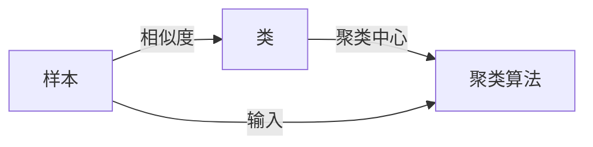

## 1.背景介绍

聚类算法是无监督学习的一种重要方法，它的目标是将数据集中的样本划分为若干个通常是不相交的子集，每个子集称为一个类（Cluster）。这种划分的依据是样本之间的相似度。相似的样本被分到同一类中，不相似的样本被分到不同的类中。这种基于相似度的划分方法使得聚类算法在数据挖掘，图像处理，市场研究，Web搜索等多个领域都有着广泛的应用。

## 2.核心概念与联系

聚类算法的核心概念包括以下几个方面：

- **样本**：在聚类算法中，我们通常将待处理的数据称为样本。每个样本是一个多维空间中的点，每一维代表一个特征。

- **相似度**：样本之间的相似度是聚类的基础。相似度可以通过多种方式来度量，常用的有欧氏距离、余弦相似度等。

- **类**：类是一个包含相似样本的集合。在聚类算法中，我们的目标就是找到这些类。

- **聚类中心**：在一些聚类算法中，例如K-means，我们会使用聚类中心来代表一个类。聚类中心是类中所有样本的均值。

这些概念之间的关系可以用以下的Mermaid流程图来表示：



## 3.核心算法原理具体操作步骤

聚类算法有很多种，这里我们以最常用的K-means算法为例，介绍其具体的操作步骤：

1. 初始化：选择K个样本作为初始的聚类中心。

2. 对每个样本，计算其到每个聚类中心的距离，将其划分到距离最近的聚类中心所在的类。

3. 对每个类，计算类中所有样本的均值，更新聚类中心。

4. 重复步骤2和步骤3，直到聚类中心不再变化或者达到预设的最大迭代次数。

## 4.数学模型和公式详细讲解举例说明

K-means算法的数学模型可以用以下的优化问题来表示：

$$
\min_{C} \sum_{i=1}^{K} \sum_{x \in C_i} ||x - \mu_i||^2
$$

其中，$C=\{C_1, C_2, ..., C_K\}$是划分的类，$\mu_i$是类$C_i$的聚类中心，$||\cdot||$是欧氏距离。

这个优化问题的求解过程就对应了K-means算法的操作步骤。在每次迭代中，我们先固定聚类中心，通过最小化样本到聚类中心的距离来更新类的划分，然后再固定类的划分，通过最小化类中样本到聚类中心的距离来更新聚类中心。

## 4.项目实践：代码实例和详细解释说明

下面我们用Python的sklearn库来实现K-means算法。首先，我们生成一些随机数据：

```python
from sklearn.datasets import make_blobs

X, y = make_blobs(n_samples=300, centers=4, random_state=0, cluster_std=0.60)
```

然后，我们使用KMeans类来进行聚类：

```python
from sklearn.cluster import KMeans

kmeans = KMeans(n_clusters=4)
kmeans.fit(X)
```

最后，我们可以用以下代码来可视化聚类结果：

```python
import matplotlib.pyplot as plt

plt.scatter(X[:, 0], X[:, 1], c=kmeans.labels_)
plt.scatter(kmeans.cluster_centers_[:, 0], kmeans.cluster_centers_[:, 1], s=300, c='red')
plt.show()
```

## 5.实际应用场景

聚类算法在许多领域都有广泛的应用，例如：

- **数据挖掘**：聚类算法可以用来发现数据中的模式和规律，例如通过聚类用户的购买记录，可以发现用户的购买习惯，从而进行个性化的推荐。

- **图像处理**：聚类算法可以用来进行图像分割，将图像划分为若干个具有相似颜色或纹理的区域。

- **市场研究**：通过聚类消费者的行为和偏好，可以帮助企业更好地理解市场，制定有效的营销策略。

## 6.工具和资源推荐

对于聚类算法的学习和实践，我推荐以下的工具和资源：

- **Python**：Python是最适合进行数据分析和机器学习的编程语言，它有许多强大的库，如numpy, pandas, sklearn等。

- **sklearn**：sklearn是Python的一个机器学习库，它包含了各种机器学习算法，包括聚类。

- **Coursera的机器学习课程**：这是一个由Stanford大学提供的在线课程，课程的讲师是机器学习领域的知名专家Andrew Ng，课程内容深入浅出，非常适合初学者。

## 7.总结：未来发展趋势与挑战

聚类算法是机器学习中的一个重要研究方向，它在许多领域都有广泛的应用。但是，聚类算法也面临着一些挑战，例如如何选择合适的相似度度量，如何确定类的数量等。未来，我们期待有更多的研究能够解决这些问题，使聚类算法更加强大和易用。

## 8.附录：常见问题与解答

1. **聚类算法和分类算法有什么区别？**

聚类算法和分类算法都是用来对样本进行划分的，但是它们的目标是不同的。分类算法是有监督的学习方法，它的目标是根据已知的类别标签来学习一个分类模型，然后用这个模型来预测新样本的类别。而聚类算法是无监督的学习方法，它并不需要类别标签，而是直接根据样本之间的相似度来进行划分。

2. **如何选择聚类算法的参数？**

聚类算法的参数通常需要通过实验来选择。例如，在K-means算法中，类的数量K是一个重要的参数，我们可以通过尝试不同的K值，然后选择使得聚类结果最好的K值。聚类结果的好坏可以通过一些评价指标来度量，例如轮廓系数。

3. **聚类算法可以用于高维数据吗？**

聚类算法可以用于高维数据，但是高维数据会带来一些问题，例如维度灾难。一种解决方法是使用降维技术，如PCA，来减少数据的维数。