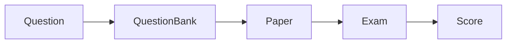

# 试卷管理系统详细设计与具体代码实现

作者：禅与计算机程序设计艺术

## 1.背景介绍

### 1.1 试卷管理系统的意义

在现代教育中,试卷是考核学生学习效果、评估教学质量的重要工具。传统的试卷管理方式存在诸多问题,如试卷的编辑、存储、组卷、阅卷等环节耗时耗力,难以实现信息化和智能化。因此,开发一套功能完善、易用高效的试卷管理系统十分必要。

### 1.2 试卷管理系统的目标

试卷管理系统旨在实现试卷全生命周期的信息化管理,具体目标包括:

- 试题录入与管理:提供试题编辑、审核、存储等功能,支持题型多样化。
- 自动组卷:根据预设规则自动从题库抽取试题形成试卷,提高组卷效率。
- 考试管理:支持考试的创建、发布、考生管理等。
- 在线阅卷:实现主观题在线批阅、客观题自动判分,提高阅卷效率和准确性。  
- 成绩统计与分析:自动生成成绩报表,支持成绩的多维度统计和分析。

### 1.3 同类系统综述

目前市面上存在多种试卷管理系统,代表性的有:

- 智慧校园试卷管理系统:功能较为全面,涵盖组卷、考试、阅卷、成绩分析等,但系统较重,部署和二次开发难度较大。
- 学易试卷管理系统:在自动组卷和智能阅卷方面有独到之处,但题型支持不够丰富。
- 卷库试卷管理系统:强调海量题库建设,但在考试管理和成绩分析方面略有欠缺。

本系统将吸收已有系统的优点,针对不足进行改进和创新,力求实现一个全面、灵活、实用的试卷管理系统。

## 2.核心概念与联系

### 2.1 题目(Question)

题目是组成试卷的基本单元,包含题干、选项、答案、解析等属性。常见题型有:

- 单选题:只有一个正确选项
- 多选题:有多个正确选项
- 判断题:判断题干陈述是否正确
- 填空题:在空白处填写答案
- 简答题:简要回答问题
- 编程题:编写代码解决问题

### 2.2 题库(Question Bank)

题库是题目的集合,用于存储和管理题目。题库支持按照学科、难度、题型等维度对题目进行分类,便于组卷时快速筛选题目。

### 2.3 试卷(Paper)

试卷由题目组成,用于考核学生。试卷包含卷头信息(如考试时间、总分等)和题目内容两部分。试卷生成方式有:

- 手动组卷:由教师自行从题库中选取题目形成试卷
- 自动组卷:根据预设的组卷规则(如题型、难度分布等),系统自动从题库中随机抽取题目形成试卷

### 2.4 考试(Exam)

考试是使用试卷对学生进行考核的过程,包含创建考试、发布试卷、考生作答、阅卷评分、成绩统计等环节。考试支持线上和线下两种方式。

### 2.5 成绩(Score)

成绩是学生考试的得分情况,一般由各题得分汇总而成。成绩可以导出为报表,并支持分班级、分学科等多种统计和分析功能。

以下是上述核心概念间的关系图:



## 3.核心算法原理具体操作步骤

### 3.1 自动组卷算法

自动组卷是试卷管理系统的核心功能之一,其目标是根据预设条件,自动从题库中抽取一定数量的题目形成试卷。影响试卷质量的因素主要有:

- 题型分布:试卷包含的题型种类和数量分布
- 难度分布:试卷包含的题目难度分布
- 知识点覆盖:试卷对知识点的覆盖程度
- 题目相似度:试卷内题目的相似程度,应避免重复

基于上述因素,自动组卷可抽象为一个约束优化问题。以下是一种基于遗传算法的自动组卷方法:

1. 染色体编码:一份试卷对应一条染色体,每个题目的编号为一个基因。
2. 初始化种群:随机生成一定数量的试卷。
3. 适应度评估:根据题型分布、难度分布、知识点覆盖、题目相似度等指标,计算每份试卷的适应度。
4. 选择操作:以适应度为概率选择一部分优质试卷。
5. 交叉操作:随机选择两份试卷,交换部分题目形成新的试卷。
6. 变异操作:以一定概率对试卷进行微调,如替换某个题目等。
7. 迭代优化:重复3~6步,直到满足终止条件(如达到迭代次数或适应度阈值等)。
8. 解码:将适应度最高的染色体解码为试卷返回。

以下是基于遗传算法的自动组卷流程图:

```mermaid
graph TB
    start(开始)-->init[初始化种群]
    init-->evaluate[适应度评估]
    evaluate--满足终止条件-->decode[解码为试卷]
    evaluate--不满足终止条件-->select[选择操作]
    select-->crossover[交叉操作]
    crossover-->mutate[变异操作]
    mutate-->evaluate
    decode-->end(结束)
```

### 3.2 智能阅卷算法

智能阅卷是指利用计算机自动批改试卷,可大幅提高阅卷效率和准确性。其中客观题(如选择题)的判分较为简单,而主观题(如简答题)的评分则较为复杂,需借助自然语言处理技术。以下是一种基于文本相似度的主观题智能阅卷方法:

1. 人工阅卷:教师为每道主观题给出参考答案和得分点。
2. 文本预处理:对学生答案和参考答案进行分词、去停用词、词干化等处理。
3. 特征提取:提取答案的关键词、词频、词向量等特征。
4. 相似度计算:计算学生答案与参考答案的相似度,常用方法有:
   - 基于词频的余弦相似度
   - 基于词向量的余弦相似度
   - 基于编辑距离的相似度
   - 基于语义的相似度(如Word2Vec、BERT等)
5. 得分判断:根据相似度和得分点,判断学生答案的得分。
6. 人工复核:对得分有异议的答案,教师可进行人工复核和调分。

以下是基于文本相似度的主观题智能阅卷流程图:

```mermaid
graph LR
    start(开始)-->preprocess[文本预处理]
    preprocess-->extract[特征提取]
    extract-->calculate[相似度计算]
    calculate-->judge[得分判断]
    judge-->review{人工复核}
    review--是-->manual[人工阅卷]
    manual-->end(结束)
    review--否-->end
```

## 4.数学模型和公式详细讲解举例说明

### 4.1 自动组卷的数学模型

设题库中共有$n$道题目,每道题目属于某一题型、难度和知识点。自动组卷可建模为一个多目标优化问题:

$$
\begin{aligned}
\min \quad & f_1(x) = \sum_{i=1}^n \sum_{j=1}^n x_i x_j \text{sim}(q_i, q_j) \\
\min \quad & f_2(x) = \sum_{i=1}^n x_i (d_i - \bar{d})^2 \\
\max \quad & f_3(x) = \sum_{k=1}^K \text{sgn}(\sum_{i=1}^n x_i \text{belongs}(q_i, k)) \\
\text{s.t.} \quad & \sum_{i=1}^n x_i = M \\
& \sum_{i=1}^n x_i \text{type}(q_i, t) = M_t, \forall t \in T \\
& x_i \in \{0, 1\}, i = 1,2,\dots,n
\end{aligned}
$$

其中:

- $x_i$为0-1变量,表示第$i$题是否被选入试卷
- $\text{sim}(q_i, q_j)$表示题目$q_i$和$q_j$的相似度
- $d_i$表示题目$q_i$的难度,$\bar{d}$为目标难度
- $\text{belongs}(q_i, k)$表示题目$q_i$是否属于知识点$k$
- $M$为试卷总题数
- $T$为题型集合,$M_t$为题型$t$的题数要求

目标函数$f_1$表示最小化试卷内题目相似度,$f_2$表示最小化试卷难度与目标难度的差异,$f_3$表示最大化知识点覆盖数。约束条件确保选题数量和题型分布符合要求。

### 4.2 主观题阅卷的文本相似度计算

设学生答案为$A$,参考答案为$B$,两者经分词、去停用词等预处理后得到关键词序列$\{a_1, a_2, \dots, a_m\}$和$\{b_1, b_2, \dots, b_n\}$。则基于词频的余弦相似度为:

$$
\text{sim}(A, B) = \frac{\sum_{i=1}^m \sum_{j=1}^n \text{tf}(a_i) \text{tf}(b_j) \mathbf{1}(a_i = b_j)}{\sqrt{\sum_{i=1}^m \text{tf}(a_i)^2} \sqrt{\sum_{j=1}^n \text{tf}(b_j)^2}}
$$

其中$\text{tf}(x)$为词$x$的词频,$\mathbf{1}(x)$为示性函数。

若考虑词语语义,可将关键词映射为词向量,则基于词向量的余弦相似度为:

$$
\text{sim}(A, B) = \frac{\sum_{i=1}^m \sum_{j=1}^n \mathbf{v}(a_i)^\top \mathbf{v}(b_j)}{\sqrt{\sum_{i=1}^m \Vert \mathbf{v}(a_i) \Vert^2} \sqrt{\sum_{j=1}^n \Vert \mathbf{v}(b_j) \Vert^2}}
$$

其中$\mathbf{v}(x)$为词$x$的词向量。

得到相似度后,可根据预设的得分点和阈值判断学生答案的得分,例如:

$$
\text{score}(A) = 
\begin{cases}
0, & \text{sim}(A, B) < 0.6 \\
5, & 0.6 \leq \text{sim}(A, B) < 0.8 \\
10, & \text{sim}(A, B) \geq 0.8
\end{cases}
$$

表示相似度小于0.6得0分,大于等于0.8得满分,介于二者之间得一半分数。

## 4.项目实践：代码实例和详细解释说明

下面给出试卷管理系统的部分核心代码实现。系统采用前后端分离架构,后端使用Python的Flask框架,前端使用Vue.js。

### 4.1 题目管理模块

题目管理模块主要包含题目的CRUD(增删改查)功能。以下是题目模型类的定义:

```python
class Question(db.Model):
    id = db.Column(db.Integer, primary_key=True)
    type = db.Column(db.String(20), nullable=False)  # 题型
    stem = db.Column(db.Text, nullable=False)  # 题干
    options = db.Column(db.Text)  # 选项,JSON格式
    answer = db.Column(db.Text, nullable=False)  # 答案
    difficulty = db.Column(db.Integer, nullable=False)  # 难度
    points = db.Column(db.Integer, nullable=False)  # 分值
    knowledge_points = db.Column(db.Text)  # 知识点,JSON格式
```

使用Flask-SQLAlchemy定义题目模型类,每个字段对应数据库中的一列。选项和知识点等复杂字段采用JSON格式存储。

题目的CRUD接口示例如下:

```python
@app.route('/questions', methods=['POST'])
def create_question():
    data = request.get_json()
    question = Question(
        type=data['type'],
        stem=data['stem'],
        options=json.dumps(data['options']),