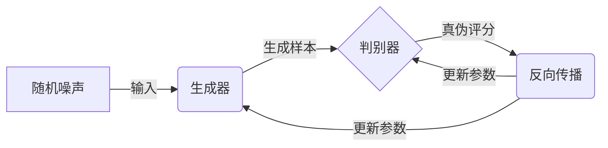
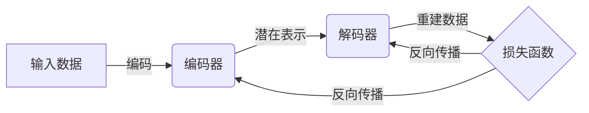

# AIGC从入门到实战：落霞与孤鹜齐飞：AIGC汹涌而来

## 1. 背景介绍

### 1.1 人工智能的崛起

人工智能(Artificial Intelligence, AI)已经成为当今科技领域最炙手可热的话题之一。自20世纪50年代AI概念被正式提出以来,这一领域经历了起起伏伏的发展历程。近年来,benefiting from大数据、强大计算能力和先进算法的共同推动,AI技术取得了突破性进展,并在各行各业得到广泛应用,带来了前所未有的变革。

### 1.2 生成式AI的兴起

在AI的多个分支中,生成式人工智能(Generative AI)正迅速崛起。生成式AI旨在利用深度学习等技术,基于现有数据生成新的、原创性的内容,如文本、图像、音频等。代表性的生成式AI技术包括生成对抗网络(Generative Adversarial Networks, GANs)、变分自编码器(Variational Autoencoders, VAEs)和大型语言模型(Large Language Models, LLMs)等。

### 1.3 AIGC的定义与重要性

AIGC(AI Generated Content)是指利用AI技术生成的内容,包括文本、图像、音频、视频等多种形式。随着生成式AI技术的不断进步,AIGC已经渗透到了内容创作的方方面面,为各行业带来了巨大的机遇和挑战。AIGC不仅能够提高内容生产效率,还能创造出富有创意和多样性的作品,为人类开辟了全新的创作维度。

## 2. 核心概念与联系

### 2.1 生成式AI核心技术

#### 2.1.1 生成对抗网络(GANs)

GANs是一种基于深度学习的生成式模型,由两个神经网络组成:生成器(Generator)和判别器(Discriminator)。生成器负责从随机噪声中生成新的数据样本,而判别器则判断生成的样本是真实数据还是伪造数据。通过不断训练,生成器学会生成越来越逼真的数据,而判别器也变得越来越善于区分真伪。GANs已被广泛应用于图像生成、图像到图像翻译、超分辨率重建等领域。



#### 2.1.2 变分自编码器(VAEs)

VAEs是一种基于深度学习的生成模型,能够学习数据的潜在分布,并从中采样生成新的数据样本。VAEs由编码器(Encoder)和解码器(Decoder)两部分组成。编码器将输入数据压缩为潜在表示,而解码器则从潜在表示重建原始数据。通过最小化重建误差和最大化潜在空间的正则化,VAEs可以学习数据的紧凑表示,并生成新的、多样化的样本。



#### 2.1.3 大型语言模型(LLMs)

LLMs是一种基于深度学习的自然语言处理模型,通过在大量文本数据上进行预训练,学习语言的统计规律和语义信息。经过预训练后,LLMs可以在下游任务上进行微调,用于文本生成、机器翻译、问答系统等应用。代表性的LLMs包括GPT(Generative Pre-trained Transformer)、BERT(Bidirectional Encoder Representations from Transformers)等。


### 2.2 AIGC与传统内容创作的区别

相比传统的内容创作方式,AIGC具有以下独特优势:

1. **效率提升**: AIGC能够快速生成大量内容,极大提高了内容生产效率。
2. **创意无限**: AIGC可以基于现有数据生成全新的内容,打破创意的局限性。
3. **个性化定制**: AIGC可以根据特定需求和偏好生成个性化内容。
4. **降低门槛**: AIGC降低了内容创作的门槛,使更多人能够参与创作。

然而,AIGC也面临一些挑战,如版权问题、偏见风险、可解释性等,需要相关从业者和监管部门共同努力解决。

## 3. 核心算法原理具体操作步骤

### 3.1 生成对抗网络(GANs)训练流程

1. **初始化生成器和判别器**: 根据模型架构初始化生成器和判别器的参数。
2. **生成器生成样本**: 生成器从随机噪声中生成假样本。
3. **判别器判别真伪**: 判别器分别对真实数据和生成的假样本进行判别,输出真实概率。
4. **计算损失函数**: 计算生成器和判别器的损失函数,通常使用最小二乘损失或交叉熵损失。
5. **反向传播更新参数**: 根据损失函数,使用优化算法(如Adam)对生成器和判别器的参数进行反向传播更新。
6. **重复训练**: 重复执行步骤2-5,直到模型收敛或达到预设迭代次数。

### 3.2 变分自编码器(VAEs)训练流程

1. **初始化编码器和解码器**: 根据模型架构初始化编码器和解码器的参数。
2. **编码器编码输入**: 编码器将输入数据编码为潜在表示。
3. **解码器重建输入**: 解码器从潜在表示重建原始输入数据。
4. **计算重建损失**: 计算重建输入与原始输入之间的损失,通常使用均方误差或交叉熵损失。
5. **计算KL散度损失**: 计算潜在表示与标准正态分布之间的KL散度,用于正则化潜在空间。
6. **计算总损失**: 将重建损失和KL散度损失相加,得到总损失函数。
7. **反向传播更新参数**: 根据总损失函数,使用优化算法(如Adam)对编码器和解码器的参数进行反向传播更新。
8. **重复训练**: 重复执行步骤2-7,直到模型收敛或达到预设迭代次数。

### 3.3 大型语言模型(LLMs)预训练流程

1. **构建语料库**: 收集大量高质量的文本数据,如网页、书籍、论文等,构建语料库。
2. **数据预处理**: 对语料库进行标记化、填充、掩码等预处理,以适应模型输入格式。
3. **初始化模型**: 根据模型架构(如Transformer)初始化LLM的参数。
4. **设置预训练目标**: 设置预训练目标,如掩码语言模型(Masked Language Modeling)、下一句预测(Next Sentence Prediction)等。
5. **预训练模型**: 在语料库上进行预训练,使用优化算法(如Adam)不断更新模型参数,使其学习语言的统计规律和语义信息。
6. **模型评估**: 在保留的测试集上评估预训练模型的性能。
7. **微调或生成**: 可以直接使用预训练模型进行文本生成,或在下游任务上进行微调以获得更好的性能。

## 4. 数学模型和公式详细讲解举例说明

### 4.1 生成对抗网络(GANs)损失函数

GANs的目标是训练生成器生成逼真的样本,使判别器无法区分真伪。因此,生成器和判别器的损失函数是对立的。

判别器的损失函数旨在最大化真实样本的概率,最小化生成样本的概率:

$$J^{(D)}=-\mathbb{E}_{x\sim p_{\text{data}}(x)}[\log D(x)]-\mathbb{E}_{z\sim p_z(z)}[\log(1-D(G(z)))]$$

生成器的损失函数旨在最大化生成样本被判别器判定为真实的概率:

$$J^{(G)}=-\mathbb{E}_{z\sim p_z(z)}[\log D(G(z))]$$

在训练过程中,生成器和判别器相互对抗,最小化各自的损失函数,直到达到纳什均衡。

### 4.2 变分自编码器(VAEs)损失函数

VAEs的目标是最大化数据的边缘对数似然$\log p(x)$。由于直接优化$\log p(x)$很困难,VAEs引入了一个近似的下界,称为Evidence Lower Bound (ELBO):

$$\log p(x)\geq\mathbb{E}_{q_\phi(z|x)}[\log p_\theta(x|z)]-D_\text{KL}(q_\phi(z|x)||p(z))=\mathcal{L}(\theta,\phi;x)$$

其中:

- $p_\theta(x|z)$是解码器,用于从潜在表示$z$重建数据$x$。
- $q_\phi(z|x)$是编码器,用于将数据$x$编码为潜在表示$z$。
- $D_\text{KL}$是KL散度,用于约束潜在空间$q_\phi(z|x)$与标准正态分布$p(z)$之间的差异。

VAEs的训练目标是最大化ELBO,即最小化重建损失和KL散度损失的加权和:

$$\min_{\theta,\phi}-\mathcal{L}(\theta,\phi;x)=-\mathbb{E}_{q_\phi(z|x)}[\log p_\theta(x|z)]+D_\text{KL}(q_\phi(z|x)||p(z))$$

### 4.3 大型语言模型(LLMs)掩码语言模型

掩码语言模型(Masked Language Modeling, MLM)是LLMs预训练的一种常用目标。MLM的思想是在输入序列中随机掩码部分词元(tokens),然后让模型基于上下文预测被掩码的词元。

给定一个输入序列$X=(x_1,x_2,...,x_n)$,我们随机选择一些位置进行掩码,得到掩码后的序列$\tilde{X}=(\tilde{x}_1,\tilde{x}_2,...,\tilde{x}_n)$。LLM的目标是最大化被掩码词元的条件对数似然:

$$\max_\theta\sum_{i=1}^n\log P_\theta(\tilde{x}_i|X\setminus\tilde{x}_i)$$

其中$\theta$是LLM的参数,$X\setminus\tilde{x}_i$表示除去被掩码位置$\tilde{x}_i$的其他词元。通过最大化这个目标函数,LLM可以学习到语言的统计规律和语义信息,从而在下游任务上表现出色。

## 4. 项目实践:代码实例和详细解释说明

### 4.1 生成对抗网络(GANs)实现

以下是使用PyTorch实现一个简单的GANs模型,用于生成手写数字图像的代码示例:

```python
import torch
import torch.nn as nn
import torch.optim as optim
from torchvision import datasets, transforms

# 定义生成器
class Generator(nn.Module):
    def __init__(self, latent_dim):
        super(Generator, self).__init__()
        self.latent_dim = latent_dim
        self.main = nn.Sequential(
            nn.Linear(latent_dim, 256),
            nn.LeakyReLU(0.2),
            nn.Linear(256, 512),
            nn.LeakyReLU(0.2),
            nn.Linear(512, 1024),
            nn.LeakyReLU(0.2),
            nn.Linear(1024, 784),
            nn.Tanh()
        )

    def forward(self, z):
        return self.main(z).view(-1, 1, 28, 28)

# 定义判别器
class Discriminator(nn.Module):
    def __init__(self):
        super(Discriminator, self).__init__()
        self.main = nn.Sequential(
            nn.Linear(784, 512),
            nn.LeakyReLU(0.2),
            nn.Linear(512, 256),
            nn.LeakyReLU(0.2),
            nn.Linear(256, 1),
            nn.Sigmoid()
        )

    def forward(self, x):
        return self.main(x.view(-1, 784))

# 加载MNIST数据集
transform = transforms.Compose([
    transforms.ToTensor(),
    transforms.Normalize((0.5,), (0.5,))
])