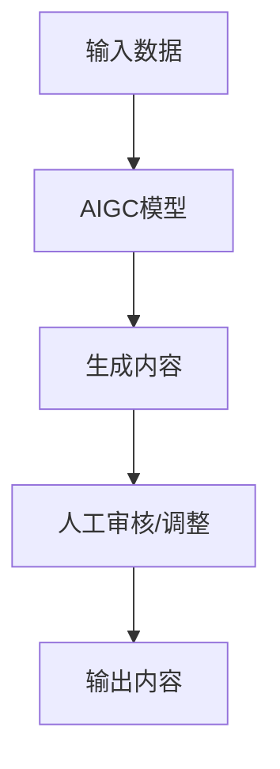
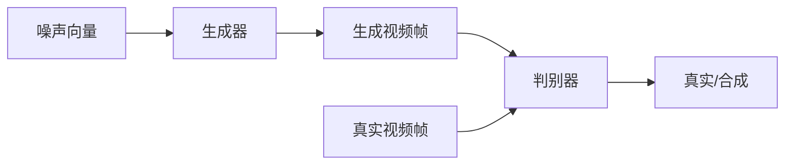
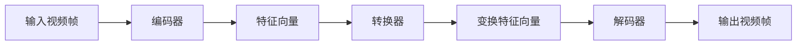
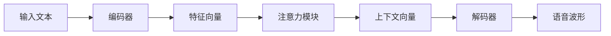
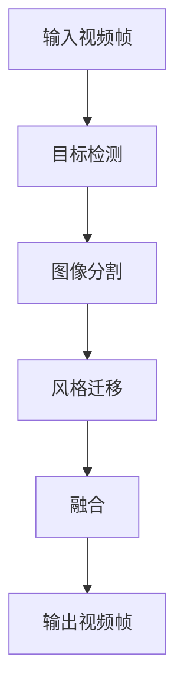

# AIGC从入门到实战：让AI辅助短视频创作，掌握了流量密码，再也不怕石沉大海

## 1. 背景介绍

### 1.1 短视频时代的到来

近年来，短视频平台如抖音、快手、火山小视频等风靡全球,成为人们获取信息和娱乐的主要渠道之一。据统计,2022年全球短视频用户数已超过27亿,预计到2025年将达到35亿。短视频内容形式多样,包括美食、旅游、音乐、舞蹈、科技等,满足了人们多元化的需求。

### 1.2 内容创作者面临的挑战

随着短视频平台的火爆,内容创作者面临着巨大的竞争压力。如何在海量内容中脱颖而出,吸引更多流量,成为创作者们亟待解决的问题。传统的内容创作方式,依赖人工拍摄、剪辑等,效率低下,难以满足快节奏更新的需求。

### 1.3 AIGC技术的兴起

人工智能生成内容(AIGC)技术的兴起,为短视频创作带来了全新的机遇。AIGC技术可以利用深度学习算法,根据文本、图像或音频输入,自动生成高质量的视频内容,大幅提高了创作效率。创作者只需提供简单的指令,AI就能生成符合预期的视频素材,极大降低了门槛。

## 2. 核心概念与联系

### 2.1 AIGC技术概述

AIGC是一种综合性技术,涵盖了计算机视觉、自然语言处理、生成对抗网络等多个领域的人工智能技术。它的核心思想是利用深度学习模型从大量数据中学习特征,然后根据输入生成新的内容。

### 2.2 视频生成技术

视频生成是AIGC技术的核心应用之一。常见的视频生成模型包括视频生成对抗网络(VideoGAN)、视频转换模型(Vid2Vid)等。这些模型可以根据文本描述或简单的草图,生成逼真的视频画面。

### 2.3 语音合成技术  

语音合成技术可以将文本转化为自然流畅的语音,为视频添加配音,提升内容的表现力。常见的语音合成模型有Tacotron、WaveNet等,它们可以生成质量接近真人的语音。

### 2.4 AI编辑技术

AI编辑技术可以自动剪辑、添加字幕、调色、添加特效等,将生成的视频素材进行优化加工,提升视频质量。常见的AI编辑工具有Adobe Sensei、AutoEditor等。

## 3. 核心算法原理具体操作步骤

### 3.1 生成对抗网络(GAN)

生成对抗网络是视频生成的核心算法之一,包括生成器(Generator)和判别器(Discriminator)两个神经网络模型。

1. **生成器**的目标是生成逼真的视频帧,使判别器无法识别出它们是人工合成的。
2. **判别器**的目标是正确识别出真实视频帧和合成视频帧。

生成器和判别器相互对抗,不断优化,最终达到生成器生成的视频帧无法被判别器识别的状态,即完成了视频生成的任务。

### 3.2 视频转换模型(Vid2Vid)

Vid2Vid模型可以将一段视频转换为另一种风格或场景,实现视频编辑和增强的功能。它通过对视频帧进行风格迁移,将原始视频转换为期望的风格。

1. **编码器**将输入视频帧编码为特征向量。
2. **转换器**根据目标风格对特征向量进行变换。
3. **解码器**将变换后的特征向量解码为目标风格的视频帧。

### 3.3 语音合成算法

常见的语音合成算法有Tacotron、WaveNet等,它们利用序列到序列(Seq2Seq)模型将文本转化为语音波形。

1. **编码器**将输入文本转换为序列特征向量。
2. **注意力模块**确定每个时间步的上下文关系。
3. **解码器**根据特征向量和上下文信息生成语音波形。

### 3.4 AI编辑算法

AI编辑算法通常采用基于深度学习的目标检测、图像分割、风格迁移等技术,实现视频剪辑、添加字幕、调色、特效等功能。

1. **目标检测**识别视频中的人物、物体等目标。
2. **图像分割**将目标与背景分离。
3. **风格迁移**将目标区域应用期望的风格或特效。
4. **融合**将处理后的目标与背景融合,形成最终视频帧。

## 4. 数学模型和公式详细讲解举例说明

### 4.1 生成对抗网络(GAN)损失函数

生成对抗网络的目标是最小化生成器和判别器之间的对抗损失。生成器希望欺骗判别器,而判别器希望正确识别真实和合成数据。

对于生成器G和判别器D,损失函数可以表示为:

$$\min\limits_G \max\limits_D V(D,G) = \mathbb{E}_{x\sim p_{data}(x)}[\log D(x)] + \mathbb{E}_{z\sim p_z(z)}[\log(1-D(G(z)))]$$

其中:

- $x$是真实数据样本,来自于真实数据分布$p_{data}(x)$
- $z$是噪声向量,来自于噪声先验分布$p_z(z)$
- $G(z)$是生成器根据噪声向量$z$生成的合成数据
- $D(x)$是判别器对真实数据$x$的判别概率
- $D(G(z))$是判别器对合成数据$G(z)$的判别概率

生成器G的目标是最小化$\log(1-D(G(z)))$,即让判别器无法识别出合成数据。判别器D的目标是最大化$\log D(x)$和$\log(1-D(G(z)))$,即正确识别真实数据和合成数据。

在训练过程中,生成器和判别器通过交替优化,不断减小损失函数,最终达到生成器生成的数据无法被判别器识别的状态。

### 4.2 视频转换模型(Vid2Vid)损失函数

Vid2Vid模型的目标是将输入视频帧转换为目标风格或场景,同时保持内容一致性。损失函数包括对抗损失、感知损失和视频重建损失三部分。

$$\mathcal{L}_{total} = \lambda_1\mathcal{L}_{adv} + \lambda_2\mathcal{L}_{per} + \lambda_3\mathcal{L}_{rec}$$

1. **对抗损失**($\mathcal{L}_{adv}$)确保生成的视频帧具有目标风格,与真实目标风格视频帧无法区分。它采用生成对抗网络的思想,包括生成器和判别器两部分。

2. **感知损失**($\mathcal{L}_{per}$)通过预训练的神经网络提取输入视频帧和生成视频帧的特征,计算特征之间的距离,确保生成视频帧保持与输入视频帧相似的内容和结构。

3. **视频重建损失**($\mathcal{L}_{rec}$)确保生成的视频帧在时间维度上连贯,避免视频帧之间出现不连续的情况。它计算相邻视频帧之间的像素差异。

$\lambda_1$、$\lambda_2$、$\lambda_3$是对应损失项的权重系数,用于平衡不同损失项的贡献。通过优化总损失函数,Vid2Vid模型可以生成具有目标风格且内容一致的视频帧序列。

### 4.3 语音合成模型(Tacotron)注意力机制

Tacotron模型采用序列到序列(Seq2Seq)架构,利用注意力机制确定每个时间步的上下文关系,从而生成高质量的语音波形。

注意力机制的计算过程如下:

1. 计算查询向量($q_t$)和键向量($k_i$)之间的相似性分数:

$$e_{t,i} = \text{score}(q_t, k_i)$$

2. 对相似性分数进行软最大值操作,得到注意力权重:

$$\alpha_{t,i} = \frac{\exp(e_{t,i})}{\sum_j \exp(e_{t,j})}$$

3. 根据注意力权重对值向量($v_i$)进行加权求和,得到上下文向量($c_t$):

$$c_t = \sum_i \alpha_{t,i}v_i$$

4. 将上下文向量$c_t$与解码器隐状态$s_t$合并,生成语音特征:

$$y_t = \text{DecoderRNN}(c_t, s_t)$$

5. 将语音特征$y_t$输入到后续的声学模型,生成最终的语音波形。

通过注意力机制,Tacotron模型可以自适应地关注输入序列的不同部分,捕获长期